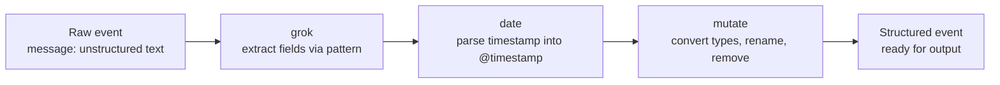

## Logstash Filter Plugins (grok, mutate, date)

Filter plugins sit between input and output in a Logstash pipeline, transforming raw event data into structured, well-typed fields. `grok`, `mutate`, and `date` are three of the most heavily used filters, frequently chained together in the same pipeline to parse unstructured text, clean up field types, and normalize timestamps.

### Role in the Pipeline



### `grok`

Matches unstructured text (typically the `message` field) against named regex patterns, extracting substrings into new fields.



```
filter {
  grok {
    match => { "message" => "%{IP:client_ip} - - \[%{HTTPDATE:timestamp}\] \"%{WORD:http_method} %{URIPATHPARAM:request_path} HTTP/%{NUMBER:http_version}\" %{NUMBER:response_code} %{NUMBER:bytes}" }
  }
}
```

- `match` — a hash of `field => pattern`. Required for the filter to do anything.
- Patterns like `%{IP:client_ip}` reference Grok's built-in pattern library (`IP`, `WORD`, `NUMBER`, `HTTPDATE`, and many more); the syntax is `%{PATTERN_NAME:target_field_name}`.
- A pre-built `%{COMBINEDAPACHELOG}` pattern exists specifically for standard Apache/Nginx combined log format, sparing the need to hand-write the pattern above.

**Custom patterns** can be defined inline or in a separate pattern file for reuse:



```
filter {
  grok {
    patterns_dir => ["/etc/logstash/patterns"]
    match => { "message" => "%{MY_CUSTOM_PATTERN:custom_field}" }
  }
}
```

**Handling multiple possible formats** — `match` accepts an array of patterns, tried in order until one succeeds:



```
filter {
  grok {
    match => { "message" => [
      "%{COMBINEDAPACHELOG}",
      "%{SYSLOGLINE}"
    ] }
  }
}
```

**On failure**, grok adds a `_grokparsefailure` tag to the event rather than dropping it, which allows downstream conditionals or the dead letter queue to catch and handle unmatched lines rather than losing them silently.

### `date`

Parses a string timestamp field (commonly one just extracted by `grok`) into Logstash's internal `@timestamp` field, replacing the default ingestion-time timestamp with the event's actual origin time.



```
filter {
  date {
    match => [ "timestamp", "dd/MMM/yyyy:HH:mm:ss Z" ]
    target => "@timestamp"
  }
}
```

- `match` — an array where the first element is the source field name, followed by one or more expected date format patterns to try in order.
- `target` — defaults to `@timestamp`; rarely needs overriding since that's the field Elasticsearch and Kibana expect for time-based visualization.
- Multiple format strings can be supplied to handle sources with inconsistent timestamp formatting across entries.

Without a `date` filter, `@timestamp` defaults to the moment Logstash processed the event — which, for buffered or delayed log delivery, can meaningfully diverge from when the event actually occurred. [Inference]

### `mutate`

A general-purpose filter for field-level transformations: renaming, type conversion, removal, case changes, string splitting/joining, and more. Multiple operations can be combined in a single `mutate` block.



```
filter {
  mutate {
    convert => {
      "response_code" => "integer"
      "bytes" => "integer"
    }
    rename => { "http_method" => "method" }
    remove_field => [ "message", "timestamp" ]
    lowercase => [ "method" ]
  }
}
```

Common `mutate` operations:

| Option | Purpose |
| --- | --- |
| `convert` | Changes a field's data type (`integer`, `float`, `string`, `boolean`) |
| `rename` | Renames a field |
| `remove_field` | Deletes fields entirely (commonly used to drop the raw `message` once parsed) |
| `add_field` | Adds a new static or interpolated field |
| `lowercase` / `uppercase` | Case-normalizes string values |
| `split` | Splits a string field into an array by delimiter |
| `gsub` | Regex-based find/replace within string fields |
| `strip` | Trims leading/trailing whitespace |

`grok` extracts every field as a string by default, so `convert` is frequently required immediately afterward for any field that should be indexed as a numeric or boolean type rather than text. [Inference]

### Combined Example



```
filter {
  grok {
    match => { "message" => "%{COMBINEDAPACHELOG}" }
  }

  date {
    match => [ "timestamp", "dd/MMM/yyyy:HH:mm:ss Z" ]
    remove_field => [ "timestamp" ]
  }

  mutate {
    convert => {
      "response" => "integer"
      "bytes" => "integer"
    }
    remove_field => [ "message" ]
  }
}
```

This is a typical three-filter chain: `grok` structures the raw line, `date` fixes the event's true timestamp, `mutate` finalizes types and drops now-redundant fields.

### Conditional Filtering

Filters are frequently scoped with `if` so they only apply to matching event types, especially in pipelines handling multiple log formats through shared input stages:



```
filter {
  if [type] == "apache_access" {
    grok {
      match => { "message" => "%{COMBINEDAPACHELOG}" }
    }
  } else if [type] == "json_app_log" {
    json {
      source => "message"
    }
  }

  mutate {
    remove_field => [ "@version" ]
  }
}
```

### Handling Grok Failures Gracefully



```
filter {
  grok {
    match => { "message" => "%{COMBINEDAPACHELOG}" }
    tag_on_failure => ["_grokparsefailure_apache"]
  }

  if "_grokparsefailure_apache" in [tags] {
    mutate {
      add_field => { "parse_status" => "failed" }
    }
  }
}
```

Custom `tag_on_failure` values (instead of the default `_grokparsefailure`) help distinguish which specific grok block failed when multiple are chained in one pipeline.

### `dissect` as a Faster Alternative

For fixed-format, delimiter-based text (not requiring regex flexibility), `dissect` performs the split without regex evaluation, which is typically lower CPU cost than an equivalent `grok` pattern:



```
filter {
  dissect {
    mapping => {
      "message" => "%{client_ip} - - [%{timestamp}] \"%{http_method} %{request_path} HTTP/%{http_version}\" %{response_code} %{bytes}"
    }
  }
}
```

`dissect` requires the delimiters between fields to be consistent and present in every line; it fails (rather than partially matching) if the actual text structure deviates. `grok`'s regex basis makes it more tolerant of format variation at higher CPU cost. [Inference]

### Performance Notes

- `grok`'s regex-based matching is the most CPU-intensive of the three filters discussed here, especially with poorly written or overly greedy patterns; testing patterns against the Grok Debugger (or the `_simulate`-equivalent tooling) before production deployment is common practice.
- Chaining unnecessary `mutate` blocks (rather than consolidating operations into fewer blocks) adds per-event overhead; consolidating multiple `convert`/`rename`/`remove_field` operations into a single `mutate` block is generally preferred over splitting them across several. [Inference]
- `date` filter parsing cost is comparatively low relative to `grok`, since it's matching against a small set of known format strings rather than evaluating open-ended regex.

### Diagram: Grok Pattern Extraction (svg_diagram)

<svg xmlns="http://www.w3.org/2000/svg" viewBox="0 0 760 220">
<text x="380" y="24" text-anchor="middle" font-family="sans-serif" font-size="16" font-weight="bold" fill="#1a1a1a">Grok Pattern Extraction (svg_diagram)</text>
<rect x="20" y="50" width="720" height="40" rx="6" fill="#e8f0fe" stroke="#4285f4" stroke-width="1.5" />
<text x="380" y="75" text-anchor="middle" font-family="monospace" font-size="12" fill="#1a1a1a">203.0.113.5 - - [24/Aug/2026:10:15:32 +0000] "GET /index.html HTTP/1.1" 200 512</text>
<line x1="380" y1="90" x2="380" y2="115" stroke="#666" stroke-width="1.5" marker-end="url(#arrow5)" />
<text x="400" y="107" font-family="sans-serif" font-size="11" fill="#555">grok match</text>
<rect x="20" y="120" width="150" height="35" rx="6" fill="#fef7e0" stroke="#f9a825" stroke-width="1.5" />
<text x="95" y="142" text-anchor="middle" font-family="monospace" font-size="10" fill="#1a1a1a">client_ip: 203.0.113.5</text>
<rect x="185" y="120" width="180" height="35" rx="6" fill="#fef7e0" stroke="#f9a825" stroke-width="1.5" />
<text x="275" y="142" text-anchor="middle" font-family="monospace" font-size="10" fill="#1a1a1a">timestamp: 24/Aug/2026...</text>
<rect x="380" y="120" width="150" height="35" rx="6" fill="#fef7e0" stroke="#f9a825" stroke-width="1.5" />
<text x="455" y="142" text-anchor="middle" font-family="monospace" font-size="10" fill="#1a1a1a">http_method: GET</text>
<rect x="545" y="120" width="190" height="35" rx="6" fill="#fef7e0" stroke="#f9a825" stroke-width="1.5" />
<text x="640" y="142" text-anchor="middle" font-family="monospace" font-size="10" fill="#1a1a1a">response_code: 200</text>
</svg>

### Common Pitfalls

- **Forgetting `convert` after `grok`** — every grok-extracted field is a string; leaving numeric fields as strings causes them to be mapped as `text`/`keyword` in Elasticsearch rather than `long`/`float`, breaking range queries and aggregations.
- **Not removing the raw `message` field** — retaining the original unparsed line alongside all the extracted fields doubles storage for no analytical benefit once parsing succeeds.
- **Skipping the `date` filter** — leaving `@timestamp` as ingestion time silently misrepresents when events actually occurred, which matters significantly for time-series analysis and alerting.
- **Overly greedy or backtracking-heavy grok patterns** — poorly constrained patterns (e.g. excessive use of `%{GREEDYDATA}`) can cause severe performance degradation under load. [Inference]
- **Using `grok` where `dissect` would work** — reaching for regex-based parsing on fixed-delimiter text costs more CPU than necessary. [Inference]

**Related Topics**

- Logstash — `dissect` filter in depth
- Logstash — Custom grok pattern files and the Grok Debugger
- Logstash — `json` and `kv` filters for structured input
- Logstash — Output plugins and the Elasticsearch output
- Logstash — Conditional processing and event tagging
- Ingest Pipelines — `grok` processor (Elasticsearch-native equivalent)