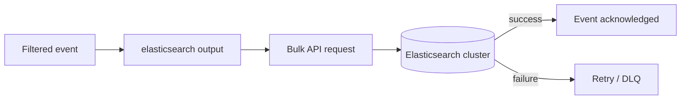

## Logstash Output Plugin for Elasticsearch

The `elasticsearch` output plugin is the final stage of most Logstash pipelines feeding the Elastic Stack — it takes processed events and indexes them into an Elasticsearch cluster, handling connection management, authentication, bulk batching, retries, and index routing.

### Role in the Pipeline



### Basic Syntax



```
output {
  elasticsearch {
    hosts => ["https://es-node1:9200", "https://es-node2:9200"]
    index => "weblogs-%{+YYYY.MM.dd}"
    user => "logstash_writer"
    password => "${LOGSTASH_ES_PASSWORD}"
  }
}
```

- `hosts` — one or more Elasticsearch node URLs; multiple hosts provide client-side load balancing and failover if a node is unreachable.
- `index` — target index name; the `%{+FORMAT}` syntax interpolates the event's `@timestamp` using Joda/Java time format patterns, commonly used to create daily or monthly time-based indices.
- `user` / `password` — basic authentication credentials, typically sourced from the Logstash keystore or environment variables rather than hardcoded.

### TLS and Authentication



```
output {
  elasticsearch {
    hosts => ["https://es-node1:9200"]
    ssl_certificate_authorities => ["/etc/logstash/certs/ca.crt"]
    api_key => "${ES_API_KEY}"
  }
}
```

- `ssl_certificate_authorities` — CA certificate(s) for verifying the Elasticsearch cluster's TLS certificate.
- `api_key` — an alternative to username/password authentication using an Elasticsearch API key, generally preferred for finer-grained, revocable access control.
- `cacert` (older/alternate naming) may appear in some plugin versions for the same CA-verification purpose. [Unverified] — parameter naming has shifted across plugin versions; confirm against the installed plugin's documentation.

### Indexing into Data Streams vs. Time-Based Indices

Two common patterns exist for time-series data:

**Traditional time-based index pattern:**



```
output {
  elasticsearch {
    hosts => ["https://localhost:9200"]
    index => "logs-app-%{+YYYY.MM.dd}"
  }
}
```

**Data stream pattern** (recommended for most log/metric use cases in current Elastic Stack versions):



```
output {
  elasticsearch {
    hosts => ["https://localhost:9200"]
    data_stream => "true"
    data_stream_type => "logs"
    data_stream_dataset => "myapp"
    data_stream_namespace => "production"
  }
}
```

Data streams internally manage backing indices, rollover, and lifecycle policies, whereas manually named daily indices require separate index lifecycle management (ILM) configuration to achieve equivalent rollover and retention behavior. [Unverified] — exact default behaviors and required companion settings (e.g. index templates) are version-dependent.

### Using an Ingest Pipeline from the Output

The Elasticsearch output can invoke an ingest pipeline on arrival, combining Logstash-side filtering with Elasticsearch-side processors (like `geoip` or `inference`) in the same flow:



```
output {
  elasticsearch {
    hosts => ["https://localhost:9200"]
    index => "weblogs-%{+YYYY.MM.dd}"
    pipeline => "geoip_enrich"
  }
}
```

- `pipeline` — name of an existing ingest pipeline to run against each document as it's indexed.

### Document ID and Action Control

By default, Elasticsearch assigns an auto-generated `_id` to each indexed document. Explicit control is available when idempotent re-indexing (avoiding duplicates on pipeline re-runs) matters:



```
output {
  elasticsearch {
    hosts => ["https://localhost:9200"]
    index => "orders-%{+YYYY.MM.dd}"
    document_id => "%{order_id}"
    action => "index"
  }
}
```

- `document_id` — sets an explicit `_id`, commonly interpolated from a unique source field; re-running the pipeline then overwrites rather than duplicates documents.
- `action` — the bulk API action to perform (`index`, `create`, `update`, `delete`); `create` fails if the document ID already exists, useful for strictly append-only ingestion where duplicates should be rejected rather than overwritten.

### Routing to Different Indices per Event

Conditional or field-interpolated index names allow a single output block to route heterogeneous events appropriately:



```
output {
  elasticsearch {
    hosts => ["https://localhost:9200"]
    index => "%{type}-%{+YYYY.MM.dd}"
  }
}
```

Since `type` was likely set at the input or filter stage, this pattern automatically separates, for example, `apache-2026.08.24` from `syslog-2026.08.24` without needing multiple explicit output blocks.

### Retry and Failure Handling

The plugin retries transient failures (e.g. temporary cluster unavailability, rejected bulk requests due to queue saturation) automatically using an internal backoff mechanism. Non-retryable failures (e.g. mapping conflicts causing a document to be permanently rejected) are, when the dead letter queue is enabled cluster-wide in `logstash.yml`, routed there rather than dropped or endlessly retried.

```yaml
# logstash.yml
dead_letter_queue.enable: true
```

Without the DLQ enabled, permanently rejected documents are logged and dropped, which can silently cause data loss for a subset of malformed events even while the overall pipeline appears healthy. [Inference]

### Multiple Elasticsearch Outputs

A pipeline can route to more than one output, including sending the same events to Elasticsearch and elsewhere simultaneously (e.g. a file for audit/backup):



```
output {
  elasticsearch {
    hosts => ["https://localhost:9200"]
    index => "app-logs-%{+YYYY.MM.dd}"
  }
  file {
    path => "/var/log/logstash/backup-%{+YYYY-MM-dd}.log"
  }
}
```

### Performance Tuning

| Setting | Purpose |
| --- | --- |
| `hosts` (multiple entries) | Client-side load balancing across cluster nodes |
| Bulk sizing (pipeline-level `pipeline.batch.size`) | Controls how many events are batched per bulk request |
| `hosts` connection pooling | Handled internally by the plugin's HTTP client |
| ILM / data stream rollover | Prevents unbounded single-index growth, spreading write load over time |

Bulk batch size is generally controlled at the pipeline level (`pipeline.batch.size` in `logstash.yml` or per-pipeline settings) rather than as an `elasticsearch` output parameter directly, since batching applies to the whole pipeline's worker behavior, not the output plugin in isolation. [Unverified] — exact interaction between pipeline batching settings and output-level bulk requests may vary by plugin version.

### Diagram: Elasticsearch Output Routing (svg_diagram)

<svg xmlns="http://www.w3.org/2000/svg" viewBox="0 0 760 240">
<text x="380" y="24" text-anchor="middle" font-family="sans-serif" font-size="16" font-weight="bold" fill="#1a1a1a">Elasticsearch Output Routing (svg_diagram)</text>
<rect x="20" y="80" width="160" height="60" rx="8" fill="#e8f0fe" stroke="#4285f4" stroke-width="1.5" />
<text x="100" y="105" text-anchor="middle" font-family="sans-serif" font-size="12" fill="#1a1a1a">Filtered event</text>
<text x="100" y="123" text-anchor="middle" font-family="monospace" font-size="10" fill="#555">type: apache</text>
<line x1="180" y1="110" x2="250" y2="110" stroke="#666" stroke-width="1.5" marker-end="url(#arrow6)" />
<rect x="250" y="60" width="200" height="100" rx="8" fill="#fef7e0" stroke="#f9a825" stroke-width="1.5" />
<text x="350" y="85" text-anchor="middle" font-family="sans-serif" font-size="12" font-weight="bold" fill="#1a1a1a">elasticsearch output</text>
<text x="350" y="103" text-anchor="middle" font-family="monospace" font-size="10" fill="#333">index: %{type}-%{+YYYY.MM.dd}</text>
<text x="350" y="120" text-anchor="middle" font-family="monospace" font-size="10" fill="#333">pipeline: geoip_enrich</text>
<text x="350" y="137" text-anchor="middle" font-family="sans-serif" font-size="10" fill="#555">bulk API request</text>
<line x1="450" y1="110" x2="520" y2="110" stroke="#666" stroke-width="1.5" marker-end="url(#arrow6)" />
<rect x="520" y="80" width="200" height="60" rx="8" fill="#e6f4ea" stroke="#34a853" stroke-width="1.5" />
<text x="620" y="105" text-anchor="middle" font-family="sans-serif" font-size="12" fill="#1a1a1a">apache-2026.08.24</text>
<text x="620" y="123" text-anchor="middle" font-family="sans-serif" font-size="10" fill="#555">indexed document</text>
</svg>

### Common Pitfalls

- **Hardcoding credentials directly in `.conf` files** — plaintext passwords committed alongside pipeline configuration are a recurring security misstep; use the keystore or environment variables instead.
- **Relying on auto-generated `_id` when idempotency matters** — pipeline re-runs (e.g. after a crash and DLQ replay) will duplicate documents unless `document_id` is explicitly set from a stable source field.
- **Skipping the dead letter queue** — permanently rejected documents (mapping conflicts, malformed data) are silently dropped without it, masking partial data loss.
- **Mixing manual daily indices with ILM policies inconsistently** — applying ILM to indices not matching the expected naming/alias pattern can cause rollover to silently fail to apply. [Inference]
- **Single `hosts` entry in production** — removes the client-side failover benefit multiple hosts provide if one node becomes unreachable.

**Related Topics**

- Logstash — Persistent queue and dead letter queue configuration
- Ingest Pipelines — invoking pipelines from the Logstash output
- Elasticsearch — Index Lifecycle Management (ILM) and data streams
- Elasticsearch — API keys and role-based access control
- Logstash — Keystore and secrets management
- Logstash — `pipeline.batch.size` and worker tuning