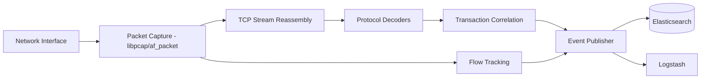
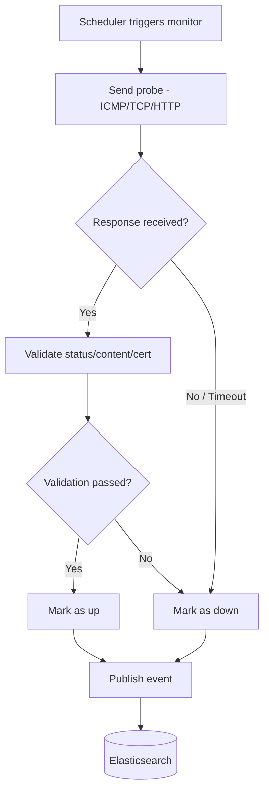

## Packetbeat and Heartbeat

### Overview

Packetbeat and Heartbeat are two purpose-built Beats within the Elastic Beats family, a set of lightweight, single-purpose data shippers built on the libbeat framework. Packetbeat performs real-time network packet analysis, decoding application-layer protocols to produce structured transaction data. Heartbeat performs active uptime and availability monitoring by probing endpoints at scheduled intervals. Both ship data to Elasticsearch or Logstash and are commonly paired with Kibana's Observability apps for visualization.

### Packetbeat

#### Purpose and Architecture

Packetbeat is a network packet analyzer that sniffs traffic on specified network interfaces, decodes protocols it understands, correlates request/response pairs, and publishes structured events describing each transaction. Unlike a full packet-capture tool, it does not store raw packets — it extracts metadata and application-layer fields, discarding payload data by default.

Packetbeat operates by:

- Capturing packets via libpcap (or af_packet on Linux, or Npcap on Windows)
- Reassembling TCP streams
- Parsing supported application-layer protocols
- Correlating requests to responses to compute metrics like response time
- Publishing transaction documents to the configured output

#### Supported Protocols

Packetbeat decodes a defined set of application-layer protocols out of the box, including:

- HTTP and HTTPS (limited to unencrypted traffic or where TLS is terminated before capture)
- DNS
- MySQL, PostgreSQL, and other SQL databases
- Redis
- MongoDB
- Cassandra
- Thrift-RPC
- AMQP
- TLS (handshake metadata only, not decrypted payloads)

[Inference] The exact protocol list and parsing depth vary by Packetbeat version, so the specific supported protocol set for a given deployment should be checked against that version's documentation.

#### Configuration Basics

A minimal `packetbeat.yml` defines the interface to sniff and which protocols to decode:

```yaml
packetbeat.interfaces.device: any

packetbeat.protocols:
- type: http
  ports: [80, 8080, 8000, 5000, 8002]

- type: dns
  ports: [53]

output.elasticsearch:
  hosts: ["localhost:9200"]
```

**Key Points**

- `packetbeat.interfaces.device` specifies which network interface to monitor; `any` captures on all interfaces where supported.
- Each protocol block under `packetbeat.protocols` specifies which ports to watch for that protocol.
- Packetbeat requires elevated privileges (root, or `CAP_NET_RAW`/`CAP_NET_ADMIN` on Linux) to capture packets.

#### Flow Data

In addition to protocol transactions, Packetbeat can capture network flow data — periodic summaries of connections (source/destination IP, ports, protocol, bytes/packets transferred) independent of whether the payload protocol is understood. This is enabled via the `flows` section and produces `flow` events distinct from protocol-specific transaction events.

```yaml
packetbeat.flows:
  timeout: 30s
  period: 10s
```

#### Data Flow



#### Use Cases

- Application performance monitoring at the network layer, without instrumenting application code
- Detecting slow database queries by observing MySQL/PostgreSQL/Redis wire traffic
- Security monitoring and network forensics as a complement to IDS tools
- Diagnosing latency between microservices by observing raw HTTP transaction times

#### Limitations

- Cannot decode encrypted payloads (TLS-encrypted HTTP, database connections over TLS) beyond handshake metadata
- Packet capture is resource-intensive on high-throughput interfaces; sampling or interface-level filtering may be needed
- Requires network-level visibility (deployed on hosts that see the actual traffic, or given a mirrored/SPAN port)
- [Inference] Performance overhead scales with traffic volume and the number of protocols actively decoded, so sizing should be validated against actual production traffic patterns rather than assumed.

### Heartbeat

#### Purpose and Architecture

Heartbeat is an active-probing uptime monitor. Rather than passively observing traffic like Packetbeat, Heartbeat proactively sends requests to configured endpoints (URLs, hosts, or ports) on a defined schedule and records whether the endpoint responded successfully, along with round-trip timing and optional certificate/DNS details.

#### Supported Monitor Types

- **ICMP** — ping-style reachability checks
- **TCP** — connects to a host/port, optionally sends/receives a handshake payload to validate response content
- **HTTP** — issues HTTP(S) requests, validates status codes, response bodies, headers, and TLS certificate validity/expiration

#### Configuration Basics

```yaml
heartbeat.monitors:
- type: http
  id: my-service-health
  name: My Service Health Check
  urls: ["https://my-service.example.com/health"]
  schedule: '@every 10s'
  check.response.status: [200]

- type: tcp
  id: db-reachability
  hosts: ["db.internal.example.com:5432"]
  schedule: '@every 30s'

- type: icmp
  id: gateway-ping
  hosts: ["10.0.0.1"]
  schedule: '@every 15s'

output.elasticsearch:
  hosts: ["localhost:9200"]
```

**Key Points**

- `schedule` uses a cron-like or `@every` interval syntax to control probe frequency.
- Each monitor requires a unique `id`, used to track uptime history for that specific check over time.
- HTTP monitors can validate response status codes, body content (via regex or JSON field matching), and headers.
- TLS certificate expiration monitoring is built into HTTP and TCP-over-TLS monitors, useful for alerting before certificates expire.

#### Monitor Lifecycle



#### Kibana Uptime and Synthetics Integration

Heartbeat data powers Kibana's Uptime and Synthetics apps within the Observability solution, which surface:

- Uptime percentage over time per monitor
- Response duration trends
- Geographic/location-based monitor grouping (when multiple Heartbeat instances run from different regions)
- Certificate expiration alerts

[Unverified] The precise feature set and naming of the Uptime/Synthetics UI has changed across Elastic Stack versions, so the current app name and capabilities should be confirmed against the target Kibana version's documentation.

#### Monitors-as-Code (Lightweight Checks vs. Project Monitors)

Heartbeat supports defining monitors either directly in `heartbeat.yml` (lightweight monitors) or, in newer Elastic Stack versions, via a Synthetics project structure managed with the `@elastic/synthetics` CLI, which allows browser-based (scripted, Playwright-driven) monitors in addition to lightweight ICMP/TCP/HTTP checks. [Inference] Whether browser-based synthetic monitoring is available depends on the specific Elastic Stack edition/license and deployment type, so this should be verified for the target environment.

#### Use Cases

- External and internal service availability monitoring
- SSL/TLS certificate expiration alerting
- Multi-region latency and reachability comparison
- Synthetic transaction monitoring for critical user journeys (login, checkout, etc.), when using scripted browser monitors

#### Limitations

- Active probing only reflects reachability/response validity at probe time; it does not capture organic user traffic patterns the way Packetbeat does
- Overly frequent scheduling across many monitors can itself generate meaningful load on both the monitored endpoints and the Heartbeat host
- ICMP monitors may require elevated privileges or specific capabilities depending on the OS

### Packetbeat vs. Heartbeat

| Aspect | Packetbeat | Heartbeat |
| --- | --- | --- |
| Monitoring style | Passive (observes existing traffic) | Active (initiates probes) |
| Data captured | Application-layer transaction metadata | Up/down status, response time, cert validity |
| Network placement | Must see actual traffic (host or mirrored port) | Can run from anywhere with network access to target |
| Typical use | APM-style network insight, protocol-level debugging | Availability/uptime monitoring, SLA tracking |
| Privilege requirements | Packet capture privileges (root/CAP_NET_RAW) | Varies by monitor type (ICMP often needs elevated privileges) |

### Deployment Considerations

- Both Beats are typically deployed as system services or in containers alongside the workloads/network paths they monitor.
- In Kubernetes environments, Packetbeat is often deployed as a DaemonSet to observe pod-to-pod traffic on each node, while Heartbeat is often deployed as a single Deployment issuing external/internal health checks.
- Both support the standard Beats output options: Elasticsearch (direct), Logstash (for additional processing), and Kafka (as a buffering layer).
- Both support `processors` in their configuration for event enrichment or filtering (e.g., `add_host_metadata`, `drop_event` conditionals) before publishing.

**Next Steps**

- Metricbeat and system/service metric collection
- Filebeat and log file harvesting
- The Elastic Common Schema (ECS) as it applies to Beats-generated events
- Ingest pipelines for parsing/enriching Beats data in Elasticsearch
- Elastic Agent and Fleet as the unified successor to standalone Beats deployment
- Kibana Observability: Uptime/Synthetics and APM correlation with Packetbeat data