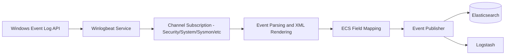
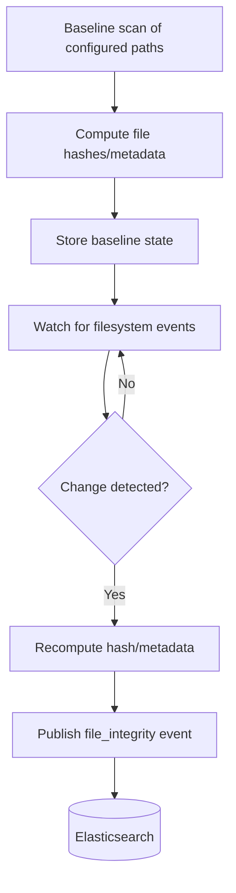

## Winlogbeat and Auditbeat

### Overview

Winlogbeat and Auditbeat are security- and audit-focused members of the Elastic Beats family. Winlogbeat ships Windows Event Log data, while Auditbeat collects audit-related data on Linux (and limited macOS/Windows support) covering file integrity, process execution, and kernel-level audit events. Both are commonly used as core data sources for SIEM, security monitoring, and compliance use cases within the Elastic Stack.

### Winlogbeat

#### Purpose and Architecture

Winlogbeat reads events from the Windows Event Log subsystem (using the Windows Event Log API) and ships them to Elasticsearch or Logstash as structured JSON documents. It runs as a native Windows service and is the primary Beat for Windows-based security and operational log collection.

Winlogbeat subscribes to specified event log channels, reads new events as they are generated, and can optionally apply XML-based event rendering to extract structured fields beyond the raw event message.

#### Event Log Channels

Winlogbeat can read from any registered Windows Event Log channel, including:

- **Application** — application-level events
- **Security** — authentication, authorization, and audit-policy events (login/logoff, privilege use, object access)
- **System** — OS and driver/service events
- **Setup** — installation-related events
- Custom/application-specific channels, such as `Microsoft-Windows-Sysmon/Operational` when Sysmon is installed, or PowerShell operational logs

#### Configuration Basics

```yaml
winlogbeat.event_logs:
  - name: Application
    ignore_older: 72h

  - name: Security

  - name: System

  - name: Microsoft-Windows-Sysmon/Operational

output.elasticsearch:
  hosts: ["localhost:9200"]
```

**Key Points**

- Each entry under `event_logs` names a channel to subscribe to.
- `ignore_older` prevents backfilling excessively old events on first run.
- The Security channel typically requires the Winlogbeat service account to have appropriate read permissions, and on some configurations, membership in the "Event Log Readers" group.
- Winlogbeat can apply event-specific XML processing to enrich or normalize the raw Windows event into ECS-aligned fields.

#### Sysmon Integration

Sysmon (System Monitor), a Sysinternals tool, is frequently paired with Winlogbeat to capture detailed process creation, network connection, and file-modification telemetry that standard Windows event logging does not natively provide. Winlogbeat reads Sysmon's dedicated operational log channel like any other channel, and Elastic ships prebuilt ingest pipelines/dashboards tailored to Sysmon event IDs for common SIEM use cases.

#### Data Flow



#### Use Cases

- Centralized collection of Windows authentication and privilege-use events for SIEM correlation
- Detecting lateral movement and privilege escalation via Security and Sysmon channels
- Compliance auditing (tracking object access, policy changes)
- Endpoint telemetry feeding Elastic Security detection rules

#### Limitations

- Windows-only; has no equivalent function on Linux/macOS hosts
- High-verbosity channels (especially Security with detailed audit policies enabled, or Sysmon) can generate substantial event volume, requiring capacity planning
- Requires appropriate account permissions to read certain channels, particularly Security
- [Inference] The specific set of ECS fields populated per event type can vary by Windows version and event source, so field-level mapping should be validated against the actual event data in a given environment.

### Auditbeat

#### Purpose and Architecture

Auditbeat collects audit-related data primarily on Linux systems, though some modules have limited cross-platform support. It replaces or complements the standalone Linux `auditd` daemon's reporting path and adds additional modules beyond raw audit rule output, including file integrity monitoring and system-level inventory data.

#### Modules

- **auditd module** — consumes Linux kernel audit framework events (the same subsystem the `auditd` daemon interfaces with), reporting on process execution, system calls matching configured audit rules, and user-space audit events
- **file_integrity module** — monitors specified files and directories for creation, modification, deletion, and permission/ownership changes, computing file hashes to detect content changes
- **system module** — collects point-in-time and change-based data on:
  - Host inventory
  - Running processes
  - User/group information (logins, logouts)
  - Listening network sockets
  - Installed packages

[Inference] Exact module availability and platform support (Linux vs. macOS vs. Windows) differ by Auditbeat version, so the current module-to-platform support matrix should be checked against target-version documentation.

#### Configuration Basics

```yaml
auditbeat.modules:

- module: auditd
  audit_rules: |
    -w /etc/passwd -p wa -k identity
    -a always,exit -F arch=b64 -S execve -k exec

- module: file_integrity
  paths:
    - /bin
    - /usr/bin
    - /etc

- module: system
  datasets:
    - process
    - user
    - login
    - socket
  period: 10s
  state.period: 12h

output.elasticsearch:
  hosts: ["localhost:9200"]
```

**Key Points**

- `audit_rules` uses standard Linux audit rule syntax (`-w` for watches, `-a` for syscall rules), the same syntax accepted by `auditctl`.
- `file_integrity.paths` lists directories/files to monitor; Auditbeat establishes a baseline and reports deviations.
- `system` module `datasets` define which system-level data types to collect; `period` controls polling interval for point-in-time datasets, while `state.period` controls how often full-state snapshots are emitted versus incremental changes.
- Running Auditbeat's `auditd` module typically requires the kernel audit framework to be available and not already claimed by a conflicting `auditd` daemon instance.

#### File Integrity Monitoring Flow



#### Use Cases

- Detecting unauthorized modification of critical system binaries or configuration files
- Auditing privileged command execution (via `execve` syscall rules)
- Meeting compliance requirements (e.g., PCI-DSS, CIS Benchmarks) that mandate file integrity monitoring
- Building a process-execution and user-session timeline for incident investigation

#### Limitations

- The `auditd` module competes with the system's native `auditd` daemon for kernel audit socket access; typically only one consumer can hold this at a time, so the OS-level `auditd` service is usually disabled when using Auditbeat's module
- Aggressive `file_integrity` paths (e.g., watching large or frequently-changing directories) can generate high event volume and I/O overhead
- Kernel audit rule syntax has a learning curve and misconfigured rules can either miss critical events or overwhelm the pipeline with noise
- [Inference] Performance impact of the `file_integrity` module scales with the number of watched files and the frequency of legitimate changes in those paths, so scope should be tuned per environment rather than assumed safe by default.

### Winlogbeat vs. Auditbeat

| Aspect | Winlogbeat | Auditbeat |
| --- | --- | --- |
| Primary platform | Windows | Linux (primary), limited macOS/Windows module support |
| Data source | Windows Event Log API | Linux kernel audit framework, filesystem, system state |
| Core focus | Event log shipping | Audit trail, file integrity, system inventory |
| Extensibility | Channel subscription (including third-party like Sysmon) | Modular (auditd, file_integrity, system) |
| Typical pairing | Sysmon for enhanced telemetry | Native `auditd` rules for syscall-level detail |

### Deployment Considerations

- Both Beats are commonly deployed as endpoint agents across fleets of servers/workstations, often managed centrally via Fleet and Elastic Agent policies rather than standalone configuration files at scale.
- Both integrate with Elastic Security's prebuilt detection rules, many of which are written against ECS fields populated by these Beats.
- Resource and storage planning should account for high-cardinality, high-volume channels/modules (Windows Security log, `execve` audit rules, broad `file_integrity` paths).
- Both support the standard Beats `processors` pipeline for local-side filtering/enrichment prior to shipping, which can reduce ingest volume and cost by dropping irrelevant events at the source.

**Next Steps**

- Filebeat and log file harvesting
- Metricbeat and system/service metric collection
- Elastic Agent and Fleet as the unified successor to standalone Beats deployment
- Elastic Common Schema (ECS) field mapping for security data sources
- Elastic Security detection rules and SIEM use cases built on Beats data
- Ingest pipelines for enriching Winlogbeat/Auditbeat events in Elasticsearch