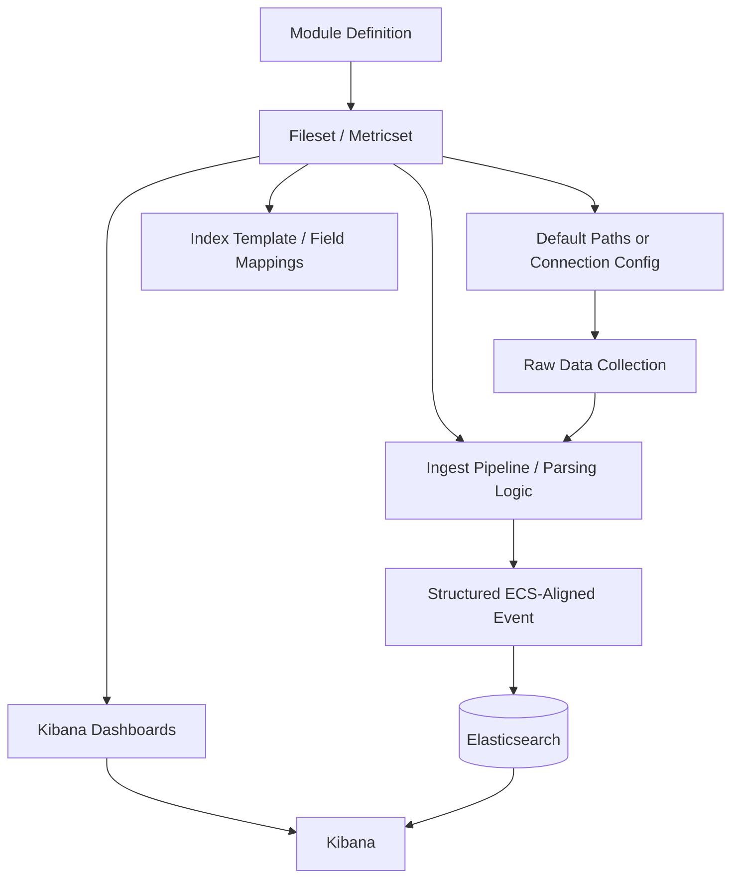

## Beats Modules

### Overview

Beats modules are preconfigured, packaged bundles of configuration, parsing logic, and Kibana assets that simplify collecting and structuring data from a specific service or data source. Rather than manually writing input paths, Grok/dissect patterns, and field mappings, a module provides these as a ready-to-enable unit, typically covering log collection, ingest-time parsing, index templates, and prebuilt Kibana dashboards for a given technology (e.g., Nginx, MySQL, AWS).

Modules exist across several Beats — most notably Filebeat and Metricbeat — and are the primary mechanism through which Beats achieve "batteries-included" support for common third-party systems.

### Purpose and Motivation

Without modules, using a Beat to monitor a specific application requires manually:

- Defining input paths or connection details
- Writing parsing rules (Grok patterns, dissect, or a custom ingest pipeline) to structure raw log lines or metric payloads
- Creating an index template with correct field mappings
- Building Kibana visualizations/dashboards from scratch

A module packages all of this so that enabling it is largely a matter of pointing it at the right data source and adjusting a small set of variables (paths, credentials, hosts).

### Filebeat Modules

#### Structure

A Filebeat module targets a specific log-producing application (e.g., `nginx`, `mysql`, `system`, `apache`, `aws`, `cisco`) and is composed of one or more **filesets**, where each fileset handles a distinct log type from that application (for example, the `nginx` module has separate `access` and `error` filesets).

Each fileset bundles:

- Default log file path(s) for that log type
- An ingest pipeline (Grok/dissect-based) to parse raw log lines into structured, ECS-aligned fields
- Field definitions used to build the index template
- Sample Kibana dashboards specific to that data (where available)

#### Enabling a Module

```bash
filebeat modules enable nginx
filebeat modules enable mysql
```

This activates the module's configuration file (typically located under `modules.d/`), which can then be customized:

```yaml
- module: nginx
  access:
    enabled: true
    var.paths: ["/var/log/nginx/access.log*"]
  error:
    enabled: true
    var.paths: ["/var/log/nginx/error.log*"]
```

**Key Points**

- `var.paths` overrides the default log path assumptions to match the actual deployment.
- Individual filesets within a module can be independently enabled/disabled.
- Module configuration files live under `modules.d/`, separate from the main `filebeat.yml`, and only files without a `.disabled` suffix are active.

#### Setting Up Dependent Assets

Modules often require companion setup on the Elasticsearch/Kibana side — namely, loading the ingest pipeline and index template, and importing dashboards:

```bash
filebeat setup --pipelines --index-management
filebeat setup --dashboards
```

[Inference] The exact setup commands and flags have shifted across Filebeat versions, so current syntax should be checked against the target version's documentation before relying on the commands above verbatim.

### Metricbeat Modules

#### Structure

A Metricbeat module targets a specific service to collect metrics from (e.g., `system`, `docker`, `kubernetes`, `mysql`, `redis`, `elasticsearch`, `nginx`) and is composed of **metricsets**, where each metricset represents a distinct category of metrics collected from that service (for example, the `system` module includes metricsets like `cpu`, `memory`, `network`, `filesystem`, `process`).

#### Enabling and Configuring

```yaml
metricbeat.modules:
- module: mysql
  metricsets: ["status"]
  hosts: ["tcp(127.0.0.1:3306)/"]
  username: metricbeat_user
  password: "${MYSQL_PASSWORD}"
  period: 10s
```

**Key Points**

- `period` controls how frequently that module polls for metrics.
- Modules requiring authentication (databases, message brokers, cloud APIs) typically expose `username`/`password` or API key fields.
- Environment variable substitution (as with `${MYSQL_PASSWORD}` above) is commonly used to avoid hardcoding credentials in plaintext.

#### Common Modules

- **system** — CPU, memory, disk, network, and process-level host metrics
- **docker** — container-level resource usage and lifecycle events
- **kubernetes** — pod, node, and cluster-level metrics (often paired with `kube-state-metrics`)
- **elasticsearch**, **kibana**, **logstash** — stack monitoring metricsets used to self-monitor the Elastic Stack
- **aws**, **azure**, **gcp** — cloud-provider service metrics via each provider's monitoring API

### Module Architecture



### Module vs. Manual Configuration

| Aspect | Module-Based | Manual Configuration |
| --- | --- | --- |
| Setup effort | Low — enable and adjust variables | High — define inputs, pipelines, mappings manually |
| Parsing logic | Prebuilt, maintained by Elastic | Custom-written by the user |
| Field naming | ECS-aligned by default | Depends on user implementation |
| Flexibility | Limited to module's variable options unless pipeline is overridden | Fully flexible |
| Dashboards | Often included out of the box | Must be built manually |
| Best suited for | Common, well-known technologies | Custom or proprietary log/metric formats |

### Customizing Module Behavior

Modules expose a constrained set of variables (`var.*`) by design, but their underlying ingest pipelines can be overridden or extended for cases requiring behavior beyond what variables expose — for example, adding a custom Grok pattern for a non-standard log line format within an otherwise-standard application log. This typically involves copying and modifying the module's default ingest pipeline definition rather than editing it in place, so that future module updates do not silently overwrite custom changes.

### Use Cases

- Rapid onboarding of common infrastructure (web servers, databases, message queues) into the Elastic Stack with minimal parsing work
- Standardized field naming across an organization by relying on ECS-aligned module output rather than ad hoc parsing per team
- Self-monitoring the Elastic Stack itself via the `elasticsearch`, `kibana`, and `logstash` Metricbeat modules
- Cloud infrastructure visibility via provider-specific modules (`aws`, `azure`, `gcp`) without writing custom API integration code

### Limitations

- Modules assume relatively standard installations and log formats; heavily customized application logging may not parse cleanly without pipeline modification
- Not every third-party technology has an official module; unsupported systems still require manual configuration or a custom ingest pipeline
- Module-provided dashboards may lag behind an organization's actual monitoring needs and often require customization in practice
- [Inference] The specific list of available modules, their metricsets/filesets, and default field mappings change across Beats versions, so the current module catalog should be checked against target-version documentation rather than assumed static.

### Relationship to Elastic Agent Integrations

In deployments using Elastic Agent and Fleet rather than standalone Beats, the module concept is superseded by **integrations** — a similarly packaged but centrally managed equivalent, configured and deployed through Fleet policies rather than local YAML files. [Inference] The degree of feature parity between legacy Beats modules and their corresponding Fleet integrations can vary by technology and version, so this should be confirmed for any specific migration.

**Next Steps**

- Elastic Agent and Fleet as the unified successor to standalone Beats and modules
- Ingest pipelines: writing and customizing Grok/dissect-based parsing
- Elastic Common Schema (ECS) and its role in module field standardization
- Index templates and field mapping management
- Metricbeat and system/service metric collection (module deep dive)
- Filebeat and log file harvesting (module deep dive)