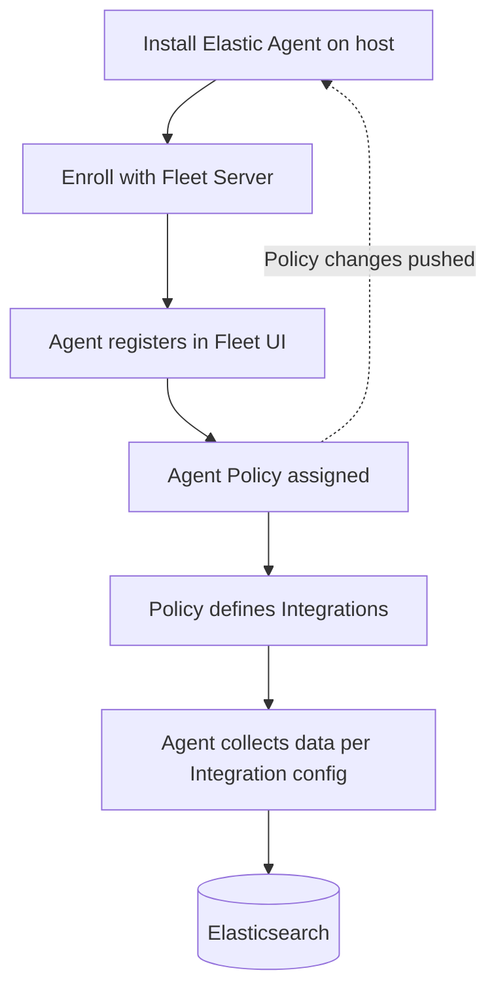
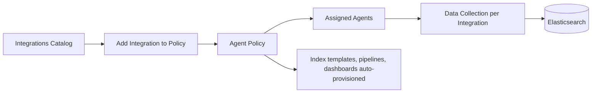

## Fleet and Elastic Agent

### Overview

Elastic Agent is a single, unified agent that consolidates the functionality of standalone Beats (Filebeat, Metricbeat, Packetbeat, Winlogbeat, Auditbeat, Heartbeat) and Endpoint Security into one deployable binary. Fleet is the centralized management plane within Kibana used to configure, monitor, and control fleets of Elastic Agents at scale, removing the need to manually edit and distribute YAML configuration files across individual hosts.

Together, Elastic Agent and Fleet represent Elastic's move toward a single-agent, centrally-managed model, superseding the pattern of deploying multiple standalone Beats per host.

### Elastic Agent

#### Purpose and Architecture

Elastic Agent runs as a single process per host and internally manages multiple data collection components, historically implemented as embedded Beats-derived binaries orchestrated by the agent process. Rather than installing and configuring Filebeat, Metricbeat, and other Beats separately, a single Elastic Agent installation can perform log collection, metric collection, network analysis, and endpoint security functions simultaneously, based on the policy assigned to it.

Elastic Agent can run in two modes:

- **Fleet-managed** — the agent enrolls with a Fleet Server and receives its configuration (policy) centrally; configuration changes are pushed from Kibana without touching the host
- **Standalone** — the agent runs from a local YAML configuration file, similar to how individual Beats are traditionally configured, without central management

#### Fleet-Managed Setup Flow



#### Installation (Fleet-Managed)

```bash
sudo ./elastic-agent install \
  --url=https://fleet-server.example.com:8220 \
  --enrollment-token=<token>
```

**Key Points**

- The enrollment token is generated per Agent Policy in the Fleet UI and ties a newly installed agent to that policy on first connection.
- Once enrolled, further configuration changes happen entirely through Fleet in Kibana; the agent periodically checks in for policy updates.
- [Inference] Exact CLI flags and installation steps vary across Elastic Agent versions and operating systems, so current installation syntax should be verified against target-version documentation.

### Fleet Server

#### Role

Fleet Server is itself a specialized instance of Elastic Agent that acts as the coordination point between Kibana/Fleet and all other managed agents. It handles agent enrollment, policy distribution, and check-in/status reporting, effectively acting as a scalable control-plane layer so that Kibana is not directly managing thousands of individual agent connections.

**Key Points**

- Fleet Server must be deployed and running before other agents can enroll in Fleet-managed mode.
- Multiple Fleet Server instances can be deployed behind a load balancer for high availability and horizontal scaling.
- Fleet Server communicates with Elasticsearch to store agent and policy state.

### Agent Policies and Integrations

#### Agent Policies

An **Agent Policy** is a named configuration bundle in Fleet that defines what an enrolled agent should do — which integrations are active, output destinations, and agent-level settings (logging level, monitoring options). Multiple agents can share the same policy, so updating a policy propagates the change to every agent assigned to it.

#### Integrations

**Integrations** are the Fleet-managed equivalent of standalone Beats modules — packaged, technology-specific configurations (e.g., Nginx, MySQL, AWS, System) that define what data to collect and how to parse it, managed through the Integrations catalog in Kibana rather than local module files.



**Key Points**

- Adding an integration to a policy automatically provisions the associated ingest pipelines, index templates, and Kibana dashboards, similar to running `setup` for a standalone Beats module.
- A single agent policy can contain multiple integrations (e.g., System, Nginx, and Endpoint Security all assigned to the same policy).
- Integration settings (paths, credentials, hosts) are configured through the Fleet UI rather than editing YAML files on the host.

### Fleet-Managed vs. Standalone Beats

| Aspect | Fleet-Managed Elastic Agent | Standalone Beats |
| --- | --- | --- |
| Configuration location | Centralized in Kibana (Fleet) | Local YAML per host |
| Number of processes per host | One (Elastic Agent) | One per Beat type deployed |
| Update mechanism | Pushed centrally via policy | Manual file edit/redeploy per host |
| Visibility into agent health | Centralized in Fleet UI | Per-host, no built-in fleet-wide view |
| Setup of pipelines/templates/dashboards | Automatic on integration add | Manual `setup` commands per Beat |
| Best suited for | Large or dynamic fleets of hosts | Small deployments, highly custom configs, air-gapped/no-Fleet environments |

### Standalone Mode

Elastic Agent can also run without Fleet, using a local configuration file analogous to a Beats YAML file:

```yaml
outputs:
  default:
    type: elasticsearch
    hosts: ["https://localhost:9200"]

inputs:
  - type: filestream
    id: nginx-logs
    paths:
      - /var/log/nginx/access.log
```

[Inference] Standalone Elastic Agent configuration syntax differs from both classic Beats YAML and Fleet policy JSON, and has evolved across versions, so exact syntax should be checked against the target version's documentation rather than assumed identical to Filebeat's configuration format.

### Fleet UI Capabilities

- **Agent list and health status** — enrollment status, last check-in time, agent version, upgrade availability
- **Agent Policies** — creation, editing, and assignment of integrations
- **Integrations catalog** — browsing and adding available integrations (a large, growing catalog spanning cloud providers, databases, security tools, and OS-level monitoring)
- **Agent upgrades** — triggering remote upgrades of enrolled agents to newer versions directly from Fleet
- **Data streams** — visibility into the data streams created by active integrations

### Data Streams

Data collected via Elastic Agent integrations is typically routed into **data streams** rather than traditional single indices — a storage construct built for time-series and append-only data (logs, metrics) that manages backing indices, rollover, and index lifecycle behind a single named abstraction. [Inference] The exact naming convention and structure of data streams (commonly following a `type-dataset-namespace` pattern) can vary by integration and version, so current naming behavior should be verified against target-version documentation.

### Use Cases

- Large-scale, dynamic infrastructure (autoscaling cloud instances, container fleets) where manually managing per-host Beats configuration is impractical
- Organizations wanting a single agent footprint per host instead of multiple Beats processes
- Centralized security monitoring, combining Endpoint Security with log/metric collection under one managed agent
- Environments requiring auditable, centrally-controlled configuration changes across many hosts

### Limitations

- Requires a running Fleet Server (and the operational overhead of managing it) to use centralized management; standalone mode forgoes this benefit
- [Inference] Feature parity between what a given standalone Beat can do and what its equivalent Elastic Agent integration exposes is not guaranteed to be complete in every version, so migrations from standalone Beats should be validated feature-by-feature against the target release
- Adds an additional architectural component (Fleet Server) that itself needs to be deployed, scaled, and secured
- Some highly customized standalone Beats configurations (complex custom processors, non-standard pipeline chains) may be harder to replicate through the Fleet UI's integration settings compared to direct YAML editing

**Next Steps**

- Elastic Endpoint Security and its integration with Elastic Agent
- Index Lifecycle Management (ILM) and data stream rollover behavior
- Kibana Integrations catalog: building or customizing a custom integration
- Ingest pipelines underlying Fleet integrations
- Elastic Common Schema (ECS) as the shared field standard across Agent and Beats data
- Fleet Server scaling and high-availability architecture