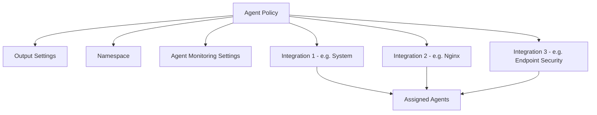
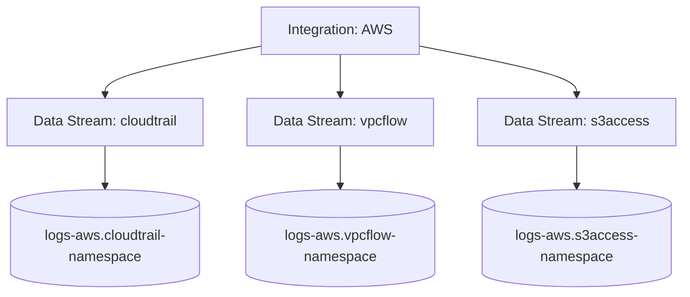

## Agent Policies and Integrations

### Overview

Agent policies and integrations are the two core configuration constructs within Fleet that determine what an Elastic Agent does once deployed. An **Agent Policy** defines the overall configuration assigned to one or more agents, while an **Integration** is a modular, technology-specific unit added to a policy to collect a particular kind of data. Understanding how these two layers interact is central to operating Elastic Agent at scale.

### Agent Policies

#### Definition

An Agent Policy is a named, versioned configuration object stored in Fleet that specifies:

- Which integrations are enabled and how each is configured
- Output settings (which Elasticsearch cluster or Logstash instance receives the data)
- Agent-level settings, such as logging verbosity and monitoring options
- Namespace assignment, used to segment data streams by environment or tenant

Any agent enrolled under a given policy receives all configuration defined within it. Multiple agents commonly share a single policy — for example, all web servers in a fleet might be assigned the same "Web Servers" policy.

#### Policy Structure



#### Creating and Managing Policies

Policies are typically created and edited through the Fleet UI in Kibana, though they can also be managed via the Fleet API for automation purposes:

```bash
curl -X POST "https://kibana.example.com/api/fleet/agent_policies" \
  -H "kbn-xsrf: true" \
  -H "Content-Type: application/json" \
  -d '{
    "name": "Web Servers",
    "namespace": "production",
    "monitoring_enabled": ["logs", "metrics"]
  }'
```

**Key Points**

- `namespace` segments data streams created under this policy, useful for separating environments (production, staging) or business units within the same cluster.
- `monitoring_enabled` controls whether the agent ships its own logs and/or metrics for self-monitoring purposes.
- Policy changes are versioned; Fleet tracks revisions and pushes the latest revision to assigned agents on their next check-in.
- [Inference] Exact Fleet API request/response schemas differ across Elastic Stack versions, so the payload structure above should be verified against target-version API documentation before use in automation.

#### Policy Propagation


### Integrations

#### Definition

An Integration is a packaged configuration unit — maintained by Elastic or third parties — that defines how to collect, parse, and structure data from a specific technology (e.g., Nginx, MySQL, AWS CloudTrail, Windows). Integrations are added to an Agent Policy, and their settings are configured per-addition, meaning the same integration type can be added multiple times to the same or different policies with different settings (e.g., two separate MySQL integration instances pointing at two different database hosts).

#### Integration Package Contents

Each integration package typically bundles:

- **Data collection configuration** — equivalent to a Beats module's fileset/metricset definitions (log paths, API endpoints, polling intervals)
- **Ingest pipelines** — parsing logic to structure raw data into ECS-aligned fields
- **Index templates and mappings** — define how fields are stored and typed in Elasticsearch
- **Kibana assets** — prebuilt dashboards, visualizations, and (for security integrations) detection rules

#### Adding an Integration to a Policy

Through the Fleet UI, adding an integration typically involves:

1. Browsing the Integrations catalog and selecting a technology
2. Configuring integration-specific settings (paths, hosts, credentials, collection interval)
3. Assigning the configured integration to one or more existing policies, or creating a new policy during the process
4. Confirming deployment, after which assigned agents receive the update on next check-in

**Key Points**

- Some integrations include multiple **data streams** internally (analogous to a Beats module having multiple filesets/metricsets) — for example, an AWS integration might include separate data streams for CloudTrail, VPC Flow Logs, and S3 access logs, each independently toggleable.
- Credential fields (API keys, passwords) are stored within Fleet's configuration; secret management practices should be applied consistent with organizational security policy.
- Integrations can be version-pinned; upgrading an integration to a newer package version is a distinct action from upgrading the Elastic Agent binary itself.

### Integration-to-Data-Stream Relationship



[Inference] The specific data stream naming pattern shown (`type-dataset-namespace`) reflects a commonly documented convention, but exact naming can vary by integration and Elastic Stack version, so it should be confirmed against the actual data streams created in a given deployment.

### Policies vs. Integrations

| Aspect | Agent Policy | Integration |
| --- | --- | --- |
| Scope | Whole-agent configuration | Single technology/data source |
| Cardinality | One policy can be assigned to many agents | One policy can contain many integrations |
| Reusability | Shared across similar hosts | Reusable package, added per-policy with distinct settings |
| Managed via | Fleet UI / Fleet API, policy object | Integrations catalog, added into a policy |
| Analogous standalone concept | The overall `elastic-agent.yml` / combined Beats deployment on a host | A single Beats module |

### Common Policy Design Patterns

- **Role-based policies** — grouping agents by function (Web Servers, Database Servers, Domain Controllers), each with integrations relevant to that role
- **Environment-based namespaces** — using policy namespace to separate production/staging/development data within the same cluster without needing separate clusters
- **Security-focused policies** — combining Endpoint Security with OS-level System and Auditd/Winlogbeat-equivalent integrations for comprehensive host telemetry
- **Minimal baseline policy** — a default policy applied broadly (e.g., System integration only) with additional specialized policies layered for hosts requiring more

### Integration Settings and Variables

Similar to standalone Beats module `var.*` options, integrations expose a defined set of configurable variables in the Fleet UI — paths, ports, credentials, polling frequency — rather than arbitrary free-form YAML editing. For requirements beyond what the exposed variables support, some integrations allow supplying custom YAML snippets that get merged into the underlying configuration, though the extent of this capability varies by integration.

### Use Cases

- Standardizing configuration across large, homogeneous fleets (e.g., thousands of identical web server instances sharing one policy)
- Rapid onboarding of new data sources through the Integrations catalog without hand-writing ingest pipelines
- Segmenting multi-tenant or multi-environment data using namespaces at the policy level
- Auditable, centrally-controlled rollout of configuration changes, since policy edits are tracked as revisions

### Limitations

- Policies apply uniformly to all assigned agents; host-specific overrides generally require splitting hosts into separate, more granular policies rather than exceptions within a single policy
- Integration variable exposure is intentionally constrained compared to full YAML flexibility, which can limit highly customized use cases
- [Inference] The number of integrations that can be practically combined within a single policy before performance or complexity concerns arise is not a fixed, documented limit and likely depends on host resources and per-integration collection frequency, so this should be evaluated empirically for demanding deployments
- Updating an integration package version can change its underlying ingest pipeline or field mappings, which may require corresponding updates to downstream dashboards, detection rules, or queries built against the previous field set

**Next Steps**

- Fleet Server architecture and high-availability deployment
- Elastic Endpoint Security integration in depth
- Ingest pipelines: customizing integration-provided parsing logic
- Data stream lifecycle and Index Lifecycle Management (ILM)
- Elastic Common Schema (ECS) field standardization across integrations
- Fleet API automation for policy and integration management at scale