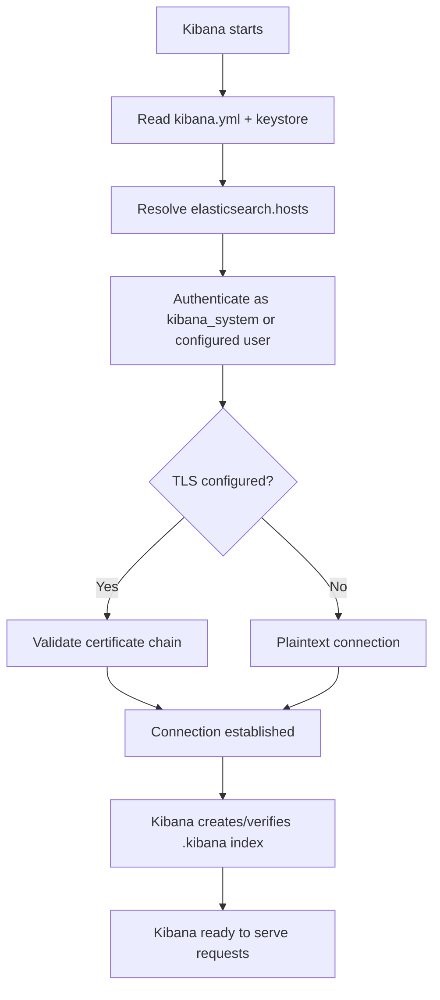

## Connecting Kibana to Elasticsearch

### Overview

Kibana is the visualization and management layer of the Elastic Stack, and it requires a configured connection to one or more Elasticsearch clusters to function. This connection is established through Kibana's configuration file, environment variables, or (in containerized/orchestrated deployments) secrets and enrollment tokens. The connection governs not only data queries but also Kibana's own internal state storage, since Kibana persists saved objects (dashboards, index patterns, visualizations) in a dedicated Elasticsearch index.

### Core Configuration

#### kibana.yml Basics

The primary connection settings live in `kibana.yml`:

```yaml
server.host: "0.0.0.0"
server.port: 5601

elasticsearch.hosts: ["https://localhost:9200"]
elasticsearch.username: "kibana_system"
elasticsearch.password: "${KIBANA_SYSTEM_PASSWORD}"

elasticsearch.ssl.certificateAuthorities: ["/etc/kibana/certs/ca.crt"]
elasticsearch.ssl.verificationMode: certificate
```

**Key Points**

- `elasticsearch.hosts` accepts a list of URLs; Kibana can be pointed at multiple nodes for basic failover, though it does not perform full cluster-aware load balancing the way an Elasticsearch client library might.
- The `kibana_system` built-in user is the reserved account intended for Kibana's own operational access; it is not meant for end-user login.
- `elasticsearch.ssl.certificateAuthorities` is required when the Elasticsearch cluster uses TLS with a certificate not trusted by the system's default CA store.
- Credentials should be supplied via environment variables, the Kibana keystore, or a secrets manager rather than committed in plaintext to `kibana.yml`.

#### The Kibana Keystore

Rather than storing sensitive values directly in `kibana.yml`, Kibana supports a keystore for secret management:

```bash
kibana-keystore create
kibana-keystore add elasticsearch.password
```

**Key Points**

- Keystore values override or supply settings that would otherwise appear in plaintext in `kibana.yml`.
- The keystore file itself is stored on disk alongside the Kibana installation and should be protected with appropriate filesystem permissions.

### Connection Flow



### Enrollment Tokens (Security-Enabled Clusters)

When Elasticsearch is deployed with security features enabled by default (as is standard since Elastic Stack 8.x), connecting a fresh Kibana instance typically uses an **enrollment token** generated on the Elasticsearch side rather than manually configuring TLS and credentials by hand:

```bash
# On the Elasticsearch node
bin/elasticsearch-create-enrollment-token --scope kibana
```

The resulting token is supplied to Kibana on first startup (via the terminal setup wizard or the `kibana.yml` `elasticsearch.serviceAccountToken`/enrollment flow), which automatically configures TLS trust and authentication.

[Inference] The precise enrollment token workflow, including which prompts appear and which files are auto-generated, has evolved across Elastic Stack 8.x minor versions, so the current step-by-step flow should be verified against the target version's documentation.

### Authentication Methods

| Method | Description | Typical Use Case |
| --- | --- | --- |
| Username/password | `elasticsearch.username` / `elasticsearch.password` in config or keystore | Traditional deployments, on-prem clusters |
| Service account token | A long-lived token tied to a service account, avoiding password rotation concerns | Automated/scripted deployments |
| API key | Scoped, revocable key generated in Elasticsearch | Fine-grained, auditable access |
| Enrollment token | One-time-use token for initial secure setup | First-time connection on security-enabled clusters |

### TLS/SSL Considerations

#### Verification Modes

`elasticsearch.ssl.verificationMode` controls how strictly Kibana validates the Elasticsearch server's certificate:

- **full** — validates the certificate chain and hostname match
- **certificate** — validates the certificate chain but not hostname
- **none** — no validation (not recommended outside of isolated development/testing)

**Key Points**

- Production deployments should use `full` verification wherever certificate/hostname alignment can be properly maintained.
- Self-signed certificates require the corresponding CA certificate to be supplied via `elasticsearch.ssl.certificateAuthorities` for Kibana to trust the connection.

### Multiple Elasticsearch Clusters

By default, a single Kibana instance connects to and serves data from one Elasticsearch cluster (referenced by `elasticsearch.hosts`). Querying multiple, separate clusters from a single Kibana UI generally requires either:

- **Cross-Cluster Search (CCS)** — configured at the Elasticsearch level, allowing one cluster to query remote clusters, with Kibana then querying the "local" cluster which fans out the request
- Deploying separate Kibana instances, each pointed at its own cluster

[Inference] Whether a given Kibana feature (certain apps, saved object types) fully supports Cross-Cluster Search versus only supporting it for basic search/visualization use cases can vary, so CCS compatibility should be verified per feature and version before relying on it for a specific workflow.

### Verifying the Connection

#### Status Page

Kibana exposes a status endpoint and UI page confirming connectivity:



```
GET http://localhost:5601/api/status
```

A healthy response includes Elasticsearch connection status among its reported service checks.

#### Common Connection Issues

- **Certificate trust failures** — missing or incorrect `elasticsearch.ssl.certificateAuthorities`, common right after enabling security or rotating certificates
- **Authentication failures** — incorrect or expired `kibana_system` password, or a service account token that has been invalidated
- **Network/firewall blocking** — Kibana host unable to reach the Elasticsearch port (default `9200`) due to network policy
- **Version mismatch** — Kibana and Elasticsearch versions that are incompatible with each other, which Kibana will typically report explicitly at startup

[Unverified] The exact supported version-skew policy between Kibana and Elasticsearch (e.g., whether patch-level or minor-level mismatches are tolerated) should be checked against Elastic's official compatibility documentation for the specific versions involved, as this policy has been refined across releases.

### Containerized/Orchestrated Deployments

In Docker Compose or Kubernetes deployments, the connection is commonly established via:

- Environment variables (`ELASTICSEARCH_HOSTS`, `ELASTICSEARCH_USERNAME`, `ELASTICSEARCH_PASSWORD`) injected into the Kibana container
- Mounted secrets (Kubernetes Secrets, Docker secrets) for credentials and certificates rather than baked-in config files
- Service discovery via internal DNS names (e.g., `elasticsearch:9200` within a Docker network) rather than hardcoded IPs

```yaml
# docker-compose.yml excerpt
kibana:
  image: docker.elastic.co/kibana/kibana:8.15.0
  environment:
    ELASTICSEARCH_HOSTS: '["https://elasticsearch:9200"]'
    ELASTICSEARCH_USERNAME: kibana_system
    ELASTICSEARCH_PASSWORD: ${KIBANA_SYSTEM_PASSWORD}
  volumes:
    - ./certs/ca.crt:/usr/share/kibana/config/certs/ca.crt
```

[Inference] The specific Docker image tag/version referenced above is illustrative; the actual version used should match the target deployment's intended Elastic Stack version rather than being copied as-is.

### Use Cases

- Initial Elastic Stack setup, connecting a fresh Kibana instance to a fresh Elasticsearch cluster
- Reconnecting Kibana after Elasticsearch credential rotation or certificate renewal
- Migrating Kibana to point at a different Elasticsearch cluster (e.g., during a cluster migration or disaster recovery failover)
- Diagnosing "Kibana server is not ready yet" or connection-related startup failures

### Limitations

- A single Kibana instance is architecturally tied to one primary Elasticsearch connection for its own operational data (saved objects); it is not designed as a multi-cluster management console by default
- Enrollment tokens are time-limited and single-use, meaning a failed or interrupted enrollment typically requires generating a fresh token rather than reusing an expired one
- TLS misconfiguration is a common source of setup friction, particularly with self-signed certificates in development environments
- [Inference] Behavior around automatic reconnection/retry when Elasticsearch becomes temporarily unavailable after Kibana has already started may vary by version and deployment method, so this should be tested against the specific target environment rather than assumed.

**Next Steps**

- Elasticsearch security fundamentals: users, roles, and built-in accounts
- Role-Based Access Control (RBAC) and Kibana Spaces
- Cross-Cluster Search (CCS) and Cross-Cluster Replication (CCR)
- Kibana saved objects and the `.kibana` system index
- TLS certificate management across the Elastic Stack
- Elastic Stack version compatibility and upgrade paths