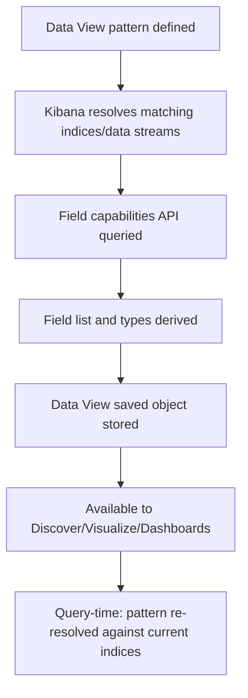

## Index Patterns and Data Views

### Overview

Data Views (formerly known as Index Patterns) are the Kibana abstraction that defines which Elasticsearch indices, data streams, or aliases a given exploration, visualization, or dashboard queries against. A Data View does not store or duplicate data — it is a saved object pointing at a set of matching index names, along with field metadata (types, scripted fields, formatting) that Kibana uses to render and query that data correctly.

The term "index pattern" is still commonly used and refers to the same underlying concept; Elastic renamed the feature "Data Views" starting in Kibana 8.0 to better reflect that they can represent indices, data streams, and aliases uniformly.

### Purpose

Nearly every data-consuming feature in Kibana — Discover, Visualize, Lens, dashboards, Maps — requires a Data View to know which indices to query and how to interpret their fields. Without a Data View, Kibana has no way to resolve a human-friendly data source name into the underlying Elasticsearch indices and their field mappings.

### Creating a Data View

#### Via Kibana UI

Data Views are typically created under **Stack Management > Data Views**, specifying:

- An index pattern string (e.g., `logs-nginx.access-*`, `metrics-*`, `filebeat-*`)
- A time field, if the data view represents time-series data (used for time-range filtering across Discover and dashboards)
- Optionally, a custom name distinct from the pattern string itself

#### Via API

```bash
curl -X POST "https://kibana.example.com/api/data_views/data_view" \
  -H "kbn-xsrf: true" \
  -H "Content-Type: application/json" \
  -d '{
    "data_view": {
      "title": "logs-nginx.access-*",
      "timeFieldName": "@timestamp"
    }
  }'
```

**Key Points**

- The pattern string supports wildcards (`*`) to match multiple indices or data streams sharing a naming convention.
- `timeFieldName` should correspond to a `date`-typed field present across the matched indices, most commonly `@timestamp` in ECS-aligned data.
- A Data View can match a single index, multiple indices, an index alias, or a data stream — Kibana treats all three uniformly once resolved.

### Resolution Flow



**Key Points**

- Field lists are derived dynamically via Elasticsearch's field capabilities API, meaning a Data View automatically reflects new fields appearing in newly matched indices (e.g., after a rollover creates a new backing index with an added field).
- Because the pattern is re-resolved at query time, newly created indices/data streams matching an existing wildcard pattern are automatically included without needing to edit the Data View.

### Data Views vs. Data Streams vs. Indices

| Concept | Layer | Purpose |
| --- | --- | --- |
| Index | Elasticsearch | Physical storage unit holding documents |
| Data stream | Elasticsearch | Abstraction over a sequence of backing indices for time-series/append-only data |
| Index alias | Elasticsearch | Named pointer to one or more indices |
| Data View | Kibana | Kibana-side saved object mapping a name/pattern to indices/streams/aliases, with field metadata |

**Key Points**

- Data Views are a Kibana-only construct; they have no meaning or existence within Elasticsearch itself.
- A single Data View can span a data stream's entire backing index history transparently, since data streams are queried through their single stable name regardless of how many backing indices exist underneath.

### Field Management

#### Field Formatting

Within a Data View, individual fields can have display formatting applied without altering the underlying stored data — for example:

- Formatting a `bytes` field to display as human-readable file sizes (KB/MB/GB)
- Formatting a `date` field with a specific display pattern
- Applying a URL template to render a field's value as a clickable link
- Color-coding numeric ranges

#### Scripted Fields (Legacy) and Runtime Fields

Older Kibana versions supported **scripted fields** defined at the Data View level for computing derived values at query time. This has been superseded by Elasticsearch **runtime fields**, which can be defined either directly in an index mapping or within the Data View itself, evaluated using Painless scripting at query time rather than being precomputed and stored.

```json
{
  "runtimeFieldMap": {
    "response_time_seconds": {
      "type": "double",
      "script": {
        "source": "emit(doc['response_time_ms'].value / 1000.0)"
      }
    }
  }
}
```

[Inference] Scripted fields are widely documented as deprecated in favor of runtime fields, but the exact version at which scripted field creation was removed from the UI (versus merely discouraged) should be confirmed against target-version release notes if relying on either capability.

### Multiple Data Views and Naming Conventions

It's common to define several Data Views targeting different slices of data, for example:

- `logs-*` — broad view across all log-type data streams
- `logs-nginx.access-*` — narrowly scoped to a specific integration's data
- `metrics-system.*-*` — system metrics across all metricsets

**Key Points**

- Narrower Data Views can improve query performance and reduce irrelevant fields cluttering the field list in Discover, at the cost of needing to switch between views for different investigations.
- Kibana Spaces (if in use) can scope which Data Views are visible/available within a given space, supporting multi-team or multi-project separation.

### Managing Data Views Programmatically

The Data Views API supports full CRUD operations, useful for automating Kibana setup as part of infrastructure-as-code workflows:

```bash
# List all data views
curl -X GET "https://kibana.example.com/api/data_views" -H "kbn-xsrf: true"

# Delete a data view
curl -X DELETE "https://kibana.example.com/api/data_views/data_view/<id>" -H "kbn-xsrf: true"
```

[Inference] Exact endpoint paths and required headers for the Data Views API can differ across Kibana versions (the API was previously named the Index Patterns API), so current documentation should be checked before automating against it.

### Use Cases

- Defining the queryable scope for Discover investigations across specific log sources
- Powering time-based filtering on dashboards via a designated time field
- Supporting Lens and Visualize by supplying the field list and types used to build aggregations
- Enabling cross-index-pattern queries in Discover (e.g., `logs-*`) when investigating incidents that may span multiple data sources

### Limitations

- A Data View matching zero indices at creation time (e.g., a pattern for data not yet ingested) will show an empty field list until matching data exists
- Very broad wildcard patterns spanning many heterogeneous indices can produce large, unwieldy field lists with inconsistent field types across the matched indices (mapping conflicts)
- Runtime fields computed via Painless scripts carry a performance cost at query time compared to precomputed, mapped fields, particularly at large result-set scale
- [Inference] The specific performance impact of runtime fields versus indexed fields depends heavily on query patterns, data volume, and script complexity, so this should be benchmarked for demanding use cases rather than assumed negligible.

**Next Steps**

- Discover: exploring and filtering data
- Kibana Lens and visualization building
- Runtime fields and Painless scripting fundamentals
- Kibana Spaces and multi-tenancy
- Index aliases and their role in reindexing workflows
- Data stream backing index rollover and Index Lifecycle Management (ILM)