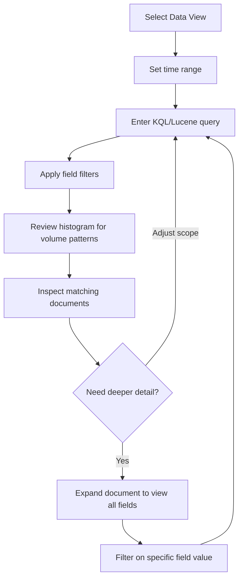

## Discover for Ad Hoc Exploration

### Overview

Discover is Kibana's primary interface for interactively exploring raw and semi-structured data without building a formal visualization or dashboard first. It provides a searchable, filterable, paginated view of documents matching a Data View, making it the typical starting point for investigating logs, debugging an issue, or getting a first look at unfamiliar data before deciding how to visualize it.

### Core Interface Elements

#### Document Table

Discover displays matching documents as an expandable table, with each row representing a single Elasticsearch document. By default, documents are sorted by the Data View's configured time field in descending order (most recent first), though sort order and sort fields are user-adjustable.

#### Search Bar

The search bar accepts queries in either:

- **KQL (Kibana Query Language)** — the default, more approachable syntax
- **Lucene query syntax** — the legacy alternative, selectable via the query language toggle

```plaintext
# KQL examples
response.status_code >= 500
host.name: "web-01" and event.category: "authentication"
message: *timeout*
```

**Key Points**

- KQL supports field-based filtering, boolean operators (`and`, `or`, `not`), range queries, and wildcard matching within a simplified syntax that autocompletes field names.
- Lucene syntax remains available for users needing capabilities not exposed in KQL, or coming from prior Elastic Stack experience predating KQL's introduction.
- Free-text queries without a field prefix search across default/full-text fields as defined by the underlying index mapping.

#### Time Range Picker

For time-based Data Views, a time range picker constrains the document table to a selected window (last 15 minutes, last 24 hours, a custom absolute range, etc.), directly affecting both the displayed documents and the accompanying histogram.

#### Document Count Histogram

Above the document table, Discover renders a histogram showing document volume over the selected time range, bucketed automatically based on the range's granularity. This provides an immediate visual sense of volume spikes, drops, or patterns before inspecting individual documents.

### Exploration Flow



### Filtering

#### Field Filters

Beyond the search bar, Discover supports structured filters added via the filter bar, each composed of a field, operator, and value (`is`, `is not`, `is one of`, `exists`, `does not exist`, range operators). Filters are combined with the main query and with each other using implicit AND logic, and can be individually toggled, negated, pinned (persisted across Data View or app navigation), or disabled without deletion.

#### Filtering from Document Values

Within the document table, hovering over a field value typically surfaces quick actions to filter for or filter out that specific value, which is often faster than manually constructing the equivalent KQL clause for common ad hoc narrowing during an investigation.

### Field List and Field Statistics

The sidebar field list shows all fields present in the current Data View (or in the currently matched documents, depending on Kibana version behavior), and typically supports:

- Clicking a field to preview its top values and their frequency within the current result set
- Adding/removing fields as columns in the document table
- Distinguishing indexed fields from runtime fields

[Inference] The exact field statistics preview behavior (e.g., whether it samples the full result set or a subset) can differ by Kibana version and result set size, so this should be treated as an approximate exploratory aid rather than a precise aggregation.

### Document Table Customization

- **Adding/removing columns** — selecting specific fields to display as columns instead of the default single-column document summary
- **Column reordering** — dragging columns to a preferred order
- **Sorting** — clicking a column header to sort ascending/descending on that field, in addition to the default time-based sort
- **Row height** — adjustable to show single-line or expanded multi-line content per row

### Saved Searches

A configured Discover state — query, filters, selected Data View, columns, and sort order — can be saved as a **saved search**, which can then be:

- Reopened later to resume the same exploration state
- Embedded directly into a dashboard as a panel showing the live, filtered document list
- Used as the basis for a new visualization, inheriting the same query/filter context

**Key Points**

- Saved searches update dynamically with new matching data on each load; they are not a static snapshot of results at save time.
- Embedding a saved search in a dashboard allows raw document inspection alongside aggregated visualizations in the same view.

### Context View

When investigating a specific log line or event, Discover's **document context** feature (accessible from an expanded document) shows the surrounding documents chronologically before and after the selected one, filtered to the same Data View — useful for reconstructing the sequence of events immediately surrounding an anomaly without manually adjusting the time range and re-searching.

### Discover in Multi-Data-View Investigations

Because a single Discover session is bound to one Data View at a time, investigating an incident that spans multiple data sources (e.g., correlating application logs with network data from Packetbeat) typically requires either:

- Switching between Data Views sequentially within Discover
- Using a broader Data View pattern that spans multiple underlying data streams, if their field schemas are sufficiently compatible
- Cross-referencing via a shared identifier field (e.g., `trace.id`, `host.name`) manually across separate Discover sessions

### Use Cases

- Initial investigation of an alert or anomaly before building formal visualizations
- Ad hoc log searching during incident response or debugging
- Validating that data is being ingested and parsed as expected after configuring a new Beat, module, or integration
- Spot-checking field values and data quality before building dashboards dependent on those fields

### Limitations

- Discover is optimized for document-level inspection, not heavy aggregation; large-scale statistical analysis is better suited to Lens, Visualize, or direct aggregation queries
- Very high-volume queries over wide time ranges can be slow to render in the histogram and document table, particularly against unoptimized field types or expensive runtime fields
- The default result window and pagination behavior means Discover is not intended for exporting or processing very large result sets; bulk data extraction is better handled via the Elasticsearch API directly or the CSV export feature within its documented limits
- [Inference] The maximum document count and CSV export size limits are configurable and have changed across versions, so current limits should be checked against target-version documentation before relying on Discover for large-scale export tasks.

**Next Steps**

- KQL (Kibana Query Language) syntax reference and advanced usage
- Kibana Lens for visual, drag-and-drop visualization building
- Building and embedding dashboards
- Alerting rules based on Discover-style queries
- Elasticsearch's underlying Query DSL, for queries beyond KQL/Lucene's expressive scope
- CSV/reporting export options from Discover and dashboards