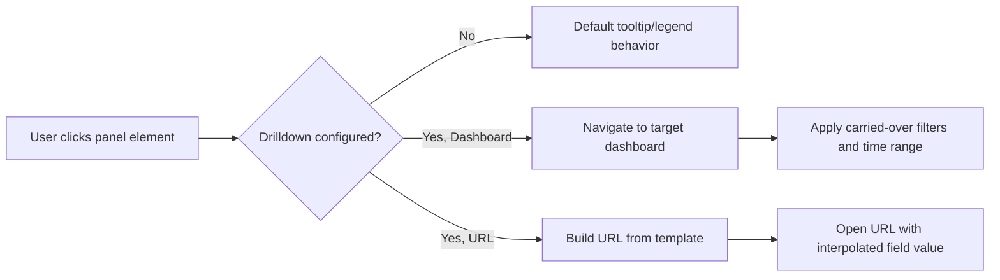

## Kibana Essentials — Dashboards

### Overview

A dashboard in Kibana is a collection of panels — visualizations, saved searches, maps, Lens charts, Markdown notes, and other embeddable objects — arranged on a single canvas with shared filters, a shared time range, and interactive drilldowns. Dashboards are the primary consumption layer for Elasticsearch data in Kibana, letting users combine multiple perspectives on the same or related data into one interactive view.

### Core Building Blocks

**Key Points**

- **Panels** — individual visual elements (Lens charts, TSVB panels, Maps, saved searches/Discover sessions, Markdown text, Canvas embeds).
- **Global filters and search bar** — a KQL/Lucene query and pinned filters applied across all panels on the dashboard, unless a panel overrides them.
- **Time picker** — a shared time range (absolute or relative, e.g., "Last 15 minutes," "Last 7 days") that drives all time-based panels simultaneously.
- **Controls** — interactive input elements (dropdowns, sliders, time sliders) that let viewers filter the dashboard without editing the underlying query.

### Creating a Dashboard

**Example**

1. Navigate to Analytics → Dashboard → Create dashboard.
2. Click "Add panel" and choose "Create visualization" (opens Lens inline) or "Add from library" to embed an existing saved visualization.
3. Set the global time range using the time picker in the top-right.
4. Optionally add a KQL query in the search bar, e.g. `service.name : "checkout" and status_code >= 500`.
5. Save the dashboard with a title and optionally add it to a tag or space.

### Panel Placement and Layout

**Key Points**

- Dashboards use a grid-based layout; panels can be resized by dragging corners and repositioned by dragging the panel header.
- Panels can be duplicated, individually customized (per-panel time range override, per-panel filters), or removed without affecting the underlying saved visualization if added "by reference."
- Panel titles can be renamed at the dashboard level independently of the saved visualization's original title.

### By Reference vs. By Value Panels

This distinction, introduced in Lens/Visualize, directly affects dashboard maintenance.

| Aspect | By Reference | By Value |
| --- | --- | --- |
| Storage | Saved as separate object in Visualize Library | Saved inline within the dashboard's saved object |
| Reusability | Same visualization usable across multiple dashboards | Local to this dashboard only |
| Edits | Propagate to every dashboard using it | Affect only this dashboard |
| Discoverability | Appears in Visualize Library | Does not appear in Visualize Library |

[Inference] Whether newly created panels default to by-value or by-reference has shifted across Kibana versions, so the current default should be checked against the deployed version rather than assumed.

### Controls

Controls are interactive filtering widgets placed directly on the dashboard.

**Key Points**

- **Options list control** — a dropdown of unique field values (terms aggregation-backed), letting viewers filter by selecting one or more values.
- **Range slider control** — filters a numeric field between a min/max range selected by the viewer.
- **Time slider control** — lets viewers scrub through time within the dashboard's overall time range, useful for animated or step-through time analysis.
- Controls can be chained, where selecting a value in one control narrows the available options in another.

### Drilldowns

Drilldowns define what happens when a viewer interacts with a panel element (clicks a bar, a pie slice, a table row).

**Key Points**

- **Dashboard-to-dashboard drilldown** — clicking an element navigates to another dashboard, carrying over relevant filters (e.g., clicking a "service" bar navigates to a service-specific dashboard filtered to that service).
- **URL drilldown** — clicking an element navigates to an external URL, with the clicked value interpolated into the URL template.
- Drilldowns are configured per-panel via the panel context menu → "Create drilldown."

**Example**

A URL drilldown template like:



```
https://internal-wiki.example.com/services/{{event.value}}
```

substitutes the clicked field value into `{{event.value}}` when a user clicks a data point.

### Dashboard Drilldown Flow



### Saved Search / Discover Session Panels

**Key Points**

- A saved search from Discover can be added as a dashboard panel, rendering as a data table of raw or formatted documents.
- Column selection, sort order, and the base KQL query from Discover are preserved when embedded.
- Useful for surfacing raw log lines or document-level detail alongside aggregated visualizations on the same dashboard.

### Dashboard-Level Filtering vs. Panel-Level Filtering

**Key Points**

- Global filters (search bar, pinned filters) apply to every panel by default.
- Individual panels can have "panel filters" or a "custom time range" applied via the panel's context menu, overriding the dashboard-wide settings for that panel only.
- Pinned filters persist across navigation to other apps (e.g., moving from a dashboard to Discover), while unpinned filters do not.

### Sharing and Exporting

**Key Points**

- Dashboards can be shared via a direct Kibana link, a shortened URL, an embeddable iframe snippet, or a PDF/PNG report (report generation typically requires Kibana Reporting, part of certain license tiers).
- [Unverified] Whether PDF/PNG reporting is available depends on the specific Elasticsearch/Kibana license tier in use, and this should be confirmed against the current licensing terms rather than assumed available by default.
- Dashboards can be exported/imported as saved objects (NDJSON format) via Stack Management → Saved Objects, useful for moving dashboards between environments (dev → staging → production).

### Dashboard-Only Mode and Permissions

**Key Points**

- Kibana supports role-based access control where users can be granted "read-only" access to specific dashboards without edit or Discover access, common for stakeholder-facing views.
- Spaces can be used to segment dashboards and other saved objects by team or business unit, with separate access controls per space.

### Performance Considerations

**Key Points**

- Dashboards with many panels each running separate aggregation queries can generate significant load on Elasticsearch, particularly with short auto-refresh intervals.
- Auto-refresh (configurable per dashboard) re-runs all panel queries on each interval; setting this too aggressively on data-heavy dashboards can degrade cluster performance under concurrent viewers. [Inference] The actual load impact depends heavily on cluster sizing, panel count, and query complexity, so this is a general caution rather than a fixed threshold.
- Using a coarser date histogram interval or limiting the number of panels per dashboard are common mitigations, though the ideal balance depends on the specific cluster and dataset.

### Dashboard Layout Diagram

<svg xmlns="http://www.w3.org/2000/svg" viewBox="0 0 760 400">
\<style\>
.box { fill: #ffffff; stroke: #4a4a4a; stroke-width: 1.5; }
.label { font-family: sans-serif; font-size: 13px; fill: #1a1a1a; }
.title { font-family: sans-serif; font-size: 15px; fill: #1a1a1a; font-weight: bold; }
.sub { font-family: sans-serif; font-size: 11px; fill: #555555; }
.bar { fill: #e6e6e6; stroke: #4a4a4a; stroke-width: 1.5; }
\</style\>
<text x="20" y="25" class="title">Dashboard Layout Anatomy (svg_diagram)</text>
<rect x="20" y="45" width="720" height="40" class="bar" rx="4" />
<text x="30" y="70" class="label">Search bar (KQL) + Time picker + Controls</text>
<rect x="20" y="100" width="230" height="120" class="box" rx="4" />
<text x="35" y="125" class="label">Panel: Line Chart</text>
<text x="35" y="143" class="sub">requests over time</text>
<rect x="265" y="100" width="230" height="120" class="box" rx="4" />
<text x="280" y="125" class="label">Panel: Metric</text>
<text x="280" y="143" class="sub">error rate KPI</text>
<rect x="510" y="100" width="230" height="120" class="box" rx="4" />
<text x="525" y="125" class="label">Panel: Pie Chart</text>
<text x="525" y="143" class="sub">traffic by service</text>
<rect x="20" y="240" width="475" height="130" class="box" rx="4" />
<text x="35" y="265" class="label">Panel: Data Table (Saved Search)</text>
<text x="35" y="283" class="sub">raw log documents</text>
<rect x="510" y="240" width="230" height="130" class="box" rx="4" />
<text x="525" y="265" class="label">Panel: Map</text>
<text x="525" y="283" class="sub">geo distribution</text>
</svg>

### Common Pitfalls

**Key Points**

- Relying entirely on global filters and forgetting a panel has a per-panel time range override, leading to confusing inconsistencies when the dashboard time picker is changed but one panel doesn't update.
- Overloading a single dashboard with too many heavy aggregation panels, causing slow load times and repeated load on Elasticsearch during auto-refresh.
- Using by-value panels when reuse across dashboards was actually intended, resulting in duplicated, divergent copies of what should be a single shared visualization.
- Forgetting that pinned filters persist across app navigation, leading to unexpected filtered results when a user later views Discover or another dashboard.

### Conclusion

Dashboards tie together Lens visualizations, saved searches, maps, and other panels into a single, interactively filterable view backed by Elasticsearch queries, with shared time ranges, controls, and drilldowns enabling exploration without manual query editing. Understanding by-reference versus by-value panel storage, filter scope, and auto-refresh performance implications is key to building dashboards that remain maintainable and performant as usage grows.

### Related Topics

- Kibana Maps — geospatial panels and layers
- Kibana Reporting — scheduled PDF/PNG/CSV exports
- Saved Objects Management — import/export and space migration
- Kibana Spaces and Role-Based Access Control
- Canvas — pixel-perfect presentation-style reporting
- Alerting on Dashboard-Backed Data
- Elasticsearch Query DSL and KQL Fundamentals