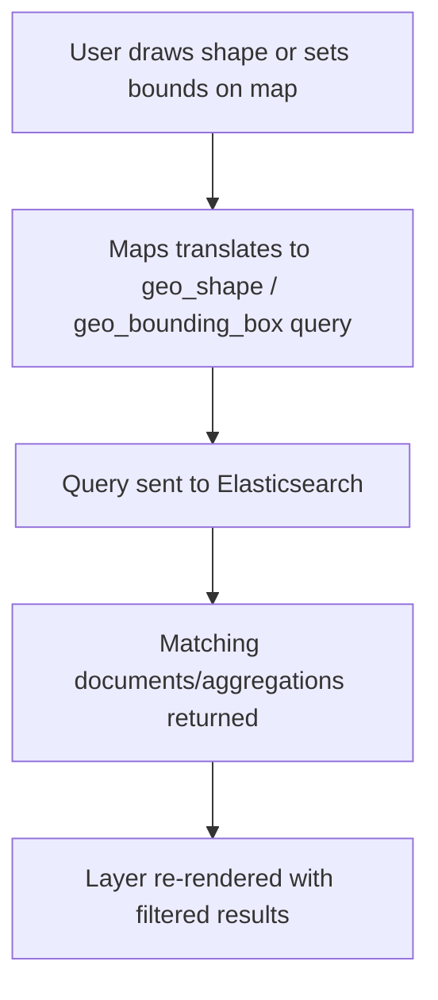

## Kibana Essentials — Maps Application

### Overview

The Maps application in Kibana is a dedicated tool for building geospatial visualizations from Elasticsearch data containing `geo_point`, `geo_shape`, or similar spatial fields. Unlike a simple map chart type within Lens, Maps supports multiple simultaneous data layers, custom styling per layer, spatial filtering, and integration with vector tile services, making it suited for anything from a single scatter-of-points view to complex multi-layer geospatial analysis.

### Core Concepts

**Key Points**

- Maps are built from one or more **layers**, each backed by its own data source (an Elasticsearch index, a static file, or an external vector tile service).
- The base map itself (the underlying world map tiles) is typically provided by Elastic Maps Service (EMS) by default, though self-hosted tile servers can be configured for air-gapped or restricted environments.
- Layers stack visually, with drawing order (z-index) configurable in the layer list.

### Layer Types

**Key Points**

- **Documents layer** — plots individual documents as points based on a `geo_point` field, one marker per document (or per top hit if aggregated).
- **Grid aggregation layer** — clusters points into a geohash/geotile grid, showing aggregated metrics (count, average, sum) per grid cell as heat maps or colored grid squares, more scalable for large datasets than plotting every document.
- **Vector layer (shapes)** — renders `geo_shape` fields (polygons, lines) such as administrative boundaries, delivery zones, or custom regions.
- **Blended/clustered layer** — automatically switches between raw document points and clustered aggregation based on zoom level, avoiding overplotting at low zoom while showing individual points at high zoom.
- **EMS boundaries layer** — pre-packaged administrative boundary data (countries, regions) available directly from Elastic Maps Service without needing a custom index.

### Adding a Layer

**Example**

1. Open Analytics → Maps → Create map.
2. Click "Add layer" → "Documents."
3. Select a data view containing a `geo_point` field (e.g., `logs-*` with a `client.geo.location` field).
4. Configure the layer's styling: marker color by a categorical field (e.g., `service.name`), marker size by a metric (e.g., `bytes`).
5. Add a second layer, "Grid aggregation," on the same data view to show request density as a heat map at low zoom levels.
6. Set the map's initial view (center coordinates and zoom level) and save.

### Styling Layers

**Key Points**

- Marker color, size, symbol, and label can each be bound to a field, either as a fixed value or dynamically scaled/categorized (e.g., color by terms, size by a quantile scale on a numeric field).
- Vector layers support fill color, border color/width, and label placement, independently stylable from point layers.
- Style bindings can use the same aggregation types available elsewhere in Kibana (average, sum, max, terms) when the layer is aggregation-based rather than document-based.

### Spatial Queries and Filtering

**Key Points**

- Maps supports drawing a shape (polygon, bounding box) directly on the map to create a spatial filter, translated into an Elasticsearch `geo_shape` or `geo_bounding_box` query.
- The "Filter by map bounds" option restricts a layer's data to only what's currently visible in the viewport, useful for large datasets where loading all points globally would be impractical.
- Global dashboard filters and the KQL search bar apply to map layers the same way they apply to other panel types when a map is embedded in a dashboard.

### Geospatial Query Flow

### Term Joins

**Key Points**

- Vector layers (e.g., country or region boundaries) can be **joined** to an Elasticsearch aggregation by a shared term, coloring each shape by a metric computed from a different index than the shape data itself.
- Example: coloring a country-boundaries layer by average response time, where response time comes from a `logs-*` index and country boundaries come from an EMS boundaries layer, joined on a country code field.
- This is functionally similar to a SQL join but implemented via a terms aggregation matched against the shape layer's join field, not a true Elasticsearch-level join.

### Embedding Maps in Dashboards

**Key Points**

- Saved maps can be added to dashboards as a panel type, inheriting the dashboard's global time range and filters (when the map's layers are configured to respect them).
- Maps panels support the same by-reference/by-value distinction as Lens visualizations.
- Clicking a point or shape on an embedded map can trigger drilldowns, similar to other dashboard panel types.

### Performance Considerations for Large Datasets

**Key Points**

- Plotting large volumes of individual documents as raw points (Documents layer) can be slow and visually cluttered; grid aggregation or clustered layers scale better for large datasets.
- "Filter by map bounds" combined with a reasonable zoom-dependent layer strategy reduces the amount of data fetched per pan/zoom interaction.
- [Inference] Exact performance characteristics depend on index size, shard count, and cluster resources, so specific dataset sizes that require switching from document layers to aggregation layers should be validated empirically rather than assumed from general guidance.

### Time-Aware Maps

**Key Points**

- When a layer's data view includes a date field, the map can be made time-aware, filtering displayed features to the dashboard or map's selected time range.
- This allows building animated or time-sliced views (e.g., using a time slider control) to observe how geospatial data changes over a period, such as tracking the geographic spread of events over hours or days.

### Maps vs. Lens Geo Visualization

| Aspect | Maps Application | Lens (basic geo) |
| --- | --- | --- |
| Layer support | Multiple layers, mixed types | Effectively single-layer |
| Term joins | Supported | Not supported |
| Vector/boundary layers | Full support (EMS, custom shapes) | Not supported |
| Spatial drawing filters | Supported | Not supported |
| Use case | Dedicated geospatial analysis | Quick single-metric geo overview |

### Common Pitfalls

**Key Points**

- Using a Documents layer for very large indices without a filter, leading to slow rendering and an unreadable, overplotted map.
- Forgetting to bind a layer to the dashboard's global time range, resulting in a map that appears static regardless of the selected time period.
- Misconfiguring a term join's join field (e.g., mismatched casing or format between the boundary layer's country code and the metric index's country code field), silently resulting in unjoined, unstyled shapes.
- Relying on default EMS tiles in environments without internet access, which requires configuring a self-hosted tile server or offline EMS setup instead.

### Conclusion

The Maps application extends Kibana's visualization capabilities into full geospatial analysis, supporting multiple simultaneous layers, term joins across indices, spatial filtering, and time-aware rendering that a simple geo chart type cannot match. It's the appropriate tool whenever analysis needs to go beyond plotting a single set of points, such as combining boundary shading with document-level detail or filtering data by drawn regions.

### Related Topics

- Elasticsearch Geospatial Data Types — geo_point vs. geo_shape mapping
- Kibana Dashboards — embedding and time-range inheritance for map panels
- Elastic Maps Service (EMS) and Self-Hosted Tile Servers
- Geospatial Aggregations in Elasticsearch — geohash_grid, geotile_grid, geo_distance
- Time Sliders and Controls for Time-Aware Panels
- Kibana Alerting on Geospatial Conditions