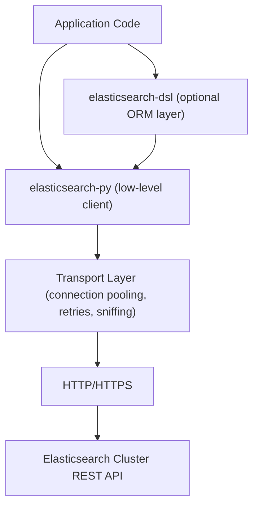

## Elasticsearch Client Libraries — Python Client

### Overview

The official Python client, `elasticsearch-py`, provides a thin wrapper over Elasticsearch's REST API, exposing both a low-level client that mirrors HTTP endpoints directly and higher-level helpers for common patterns like bulk indexing and scrolling. It ships as the `elasticsearch` package on PyPI and is maintained by Elastic alongside the server itself, with major client versions tracking major server versions.

### Installation and Versioning

```bash
pip install elasticsearch
```

The client is versioned to match the Elasticsearch server major version (8.x client for 8.x server, 9.x client for 9.x server). Installing a client version mismatched from the server's major version can produce serialization or API-compatibility errors, since request/response shapes can change between majors. Pinning the client to the server's major version is standard practice:

```bash
pip install "elasticsearch>=8.0,<9.0"
```

For async workloads, the same package includes an async-compatible client built on `asyncio` and `aiohttp`, imported from `elasticsearch` as `AsyncElasticsearch` rather than requiring a separate install.

### Connecting to a Cluster

The `Elasticsearch` class constructor accepts connection parameters directly. The two most common patterns are connecting to a single node/URL, or connecting to Elastic Cloud via a Cloud ID.

```python
from elasticsearch import Elasticsearch

# Basic connection with API key authentication
client = Elasticsearch(
    "https://localhost:9200",
    api_key="your_api_key_here"
)

# Elastic Cloud connection
client = Elasticsearch(
    cloud_id="my-deployment:dXMtY2VudHJhbDEuZ2NwLmNsb3VkLmVzLmlvJGFiYzEyMw==",
    api_key="your_api_key_here"
)

# Basic auth (development only; API keys are recommended for production)
client = Elasticsearch(
    "https://localhost:9200",
    basic_auth=("elastic", "changeme")
)
```

When connecting over HTTPS with a self-signed or cluster-internal CA (the default for a fresh Elasticsearch installation), the client needs the CA certificate to verify the connection:

```python
client = Elasticsearch(
    "https://localhost:9200",
    ca_certs="/path/to/http_ca.crt",
    basic_auth=("elastic", "changeme")
)
```

Disabling certificate verification with `verify_certs=False` is possible but removes protection against man-in-the-middle attacks, so it is only appropriate for local, throwaway development environments.

**Key Points**

- API key authentication is the recommended approach for production; it can be scoped to specific indices and privileges, unlike account-wide basic auth credentials.
- The client validates the connection lazily — the constructor does not itself make a network call, so connection errors surface on the first actual request.
- A single `Elasticsearch` client instance is thread-safe and internally pools connections, so applications should generally instantiate one client and reuse it rather than creating a new client per request.

### Core CRUD Operations

The low-level client exposes methods that map closely to REST endpoints. Index, document ID, and body are passed as keyword arguments.

```python
# Index a document
response = client.index(
    index="products",
    id="1",
    document={"name": "Wireless Mouse", "price": 29.99, "in_stock": True}
)

# Retrieve a document
response = client.get(index="products", id="1")
print(response["_source"])

# Update a document (partial update via "doc")
client.update(
    index="products",
    id="1",
    doc={"price": 24.99}
)

# Delete a document
client.delete(index="products", id="1")
```

Omitting the `id` parameter on `index()` causes Elasticsearch to auto-generate one, and the operation is then always a create rather than an update-or-create.

Responses are dictionary-like `ObjectApiResponse` objects; they support both key access (`response["_source"]`) and behave like the underlying dict for most purposes, though they also carry metadata such as the HTTP status code accessible via `response.meta.status`.

### Searching

The `search()` method accepts a `query` parameter structured as the same DSL used in raw REST requests.

```python
response = client.search(
    index="products",
    query={
        "bool": {
            "must": [{"match": {"name": "mouse"}}],
            "filter": [{"range": {"price": {"lte": 50}}}]
        }
    },
    size=10
)

hits = response["hits"]["hits"]
for hit in hits:
    print(hit["_source"], hit["_score"])
```

Because the client accepts raw dictionaries for `query`, `aggs`, `sort`, and similar parameters, any DSL construct valid in the REST API is valid here without additional client-side abstraction. This keeps the client thin but means DSL correctness is the caller's responsibility — the client does not validate query shape before sending.

### Bulk Operations

Individual `index()`/`update()`/`delete()` calls incur one HTTP round trip each, which does not scale for large datasets. The `elasticsearch.helpers` module provides `bulk()` and `streaming_bulk()` to batch operations into fewer, larger requests using the `_bulk` API under the hood.

```python
from elasticsearch import helpers

def generate_docs():
    for i in range(10000):
        yield {
            "_index": "products",
            "_id": str(i),
            "_source": {"name": f"Product {i}", "price": i * 1.5}
        }

success, errors = helpers.bulk(client, generate_docs())
print(f"Indexed: {success}, Errors: {len(errors)}")
```

`helpers.bulk()` consumes the entire generator, batching internally, and raises an exception on the first batch that contains failures unless `raise_on_error=False` is set. `helpers.streaming_bulk()` instead yields a result per document as they complete, which suits scenarios needing per-document success/failure tracking without buffering the whole result set in memory.

```python
for ok, result in helpers.streaming_bulk(client, generate_docs()):
    if not ok:
        print(f"Failed: {result}")
```

**Key Points**

- `chunk_size` (default 500) controls how many actions are grouped per `_bulk` request; tuning it trades off request count against per-request payload size and memory.
- `helpers.bulk()` is the common choice for batch/ETL-style loads where an all-or-nothing failure signal is acceptable; `streaming_bulk()` suits pipelines needing fine-grained error handling per item.
- [Inference] For very large datasets, `raise_on_error=False` combined with manually collecting the returned error list is generally preferable to letting an exception abort a long-running load partway through, though the right error-handling strategy depends on whether partial completion is acceptable for the specific use case.

### Scrolling and the search_after Pattern

Retrieving result sets larger than what a single `search()` call returns (bounded by `size`, and by the `index.max_result_window` setting, default 10,000) requires either the scroll API or `search_after` pagination. The helpers module wraps the scroll pattern:

```python
from elasticsearch import helpers

for doc in helpers.scan(
    client,
    index="products",
    query={"query": {"match_all": {}}},
    size=1000
):
    print(doc["_source"])
```

`helpers.scan()` handles opening a scroll context, iterating through batches, and clearing the scroll when exhausted. Scroll contexts hold resources on the cluster for their configured duration (`scroll` parameter, default `5m` in the helper), so scroll-based retrieval is generally recommended for one-off, non-real-time exports rather than as a general-purpose deep-pagination mechanism, since `search_after` avoids holding server-side context and is the documented approach for live, deep pagination use cases. `search_after` requires no dedicated helper — it is used directly through `search()` with a `sort` tiebreaker and the prior page's sort values passed as `search_after`.

### Error Handling

The client raises specific exception subclasses corresponding to HTTP status code ranges, all inheriting from `elasticsearch.ApiError`.

```python
from elasticsearch import NotFoundError, ConflictError, ConnectionError, ApiError

try:
    client.get(index="products", id="nonexistent")
except NotFoundError:
    print("Document not found")
except ConflictError:
    print("Version conflict")
except ConnectionError:
    print("Could not reach the cluster")
except ApiError as e:
    print(f"API error: {e.status_code} - {e.info}")
```

`NotFoundError` corresponds to HTTP 404, `ConflictError` to 409 (typically from optimistic concurrency control failures using `if_seq_no`/`if_primary_term`), and `ConnectionError` to network-level failures rather than API-level ones. Catching the narrowest applicable exception type before falling back to the general `ApiError` allows differentiated handling of expected conditions (like a missing document) versus unexpected cluster failures.

### Retries and Timeouts

The client has built-in retry logic for transient failures, configurable at construction time.

```python
client = Elasticsearch(
    "https://localhost:9200",
    api_key="your_api_key_here",
    request_timeout=30,
    max_retries=3,
    retry_on_timeout=True
)
```

`max_retries` governs retries on connection-level failures and on a configurable set of retryable status codes (429 and 502/503/504 by default); it does not retry on 4xx client errors like 400 or 404, since those indicate the request itself was invalid rather than a transient condition. `request_timeout` bounds how long the client waits for a response before treating the request as failed. [Unverified] Exact default values for `max_retries` and `request_timeout` differ across client minor versions, so consulting the installed version's documentation is advisable rather than assuming values carry across releases.

### Async Client

`AsyncElasticsearch` mirrors the synchronous client's API surface but requires `await` on I/O-bound calls and an event loop to run in.

```python
import asyncio
from elasticsearch import AsyncElasticsearch

async def main():
    client = AsyncElasticsearch(
        "https://localhost:9200",
        api_key="your_api_key_here"
    )
    response = await client.search(
        index="products",
        query={"match_all": {}}
    )
    print(response["hits"]["total"])
    await client.close()

asyncio.run(main())
```

The `helpers` module has async counterparts (`async_bulk`, `async_scan`) importable from `elasticsearch.helpers`, used with `await` inside an async function. Failing to call `close()` on an `AsyncElasticsearch` instance can leave the underlying `aiohttp` session's connections open, so wrapping client lifecycle in an `async with` block or an equivalent try/finally is standard practice:

```python
async def main():
    async with AsyncElasticsearch("https://localhost:9200", api_key="key") as client:
        response = await client.search(index="products", query={"match_all": {}})
```

### Elasticsearch DSL (High-Level Abstraction)

Beyond the low-level client, Elastic also maintains `elasticsearch-dsl`, a higher-level, ORM-like abstraction built on top of `elasticsearch-py`. It models documents as Python classes and queries as composable Python objects rather than raw dictionaries.

```python
from elasticsearch_dsl import Document, Text, Float, Boolean, connections

connections.create_connection(hosts=["https://localhost:9200"], api_key="key")

class Product(Document):
    name = Text()
    price = Float()
    in_stock = Boolean()

    class Index:
        name = "products"

Product.init()
product = Product(name="Wireless Mouse", price=29.99, in_stock=True)
product.save()

search = Product.search().filter("term", in_stock=True).query("match", name="mouse")
response = search.execute()
for hit in response:
    print(hit.name, hit.price)
```

This layer trades some of the low-level client's directness for schema definition, type coercion, and a chainable query-building API, which can reduce boilerplate in applications with well-defined, stable document schemas. [Inference] For applications with highly dynamic or frequently changing query structures, the low-level client's raw-dictionary approach is often more direct, since it avoids translating between DSL objects and the underlying JSON the cluster actually consumes.

### Client Architecture

The following diagram illustrates how the layers relate, from application code down to the cluster.



### Connection Pooling and Node Discovery

Internally, the client's transport layer manages a pool of connections and can be configured to periodically discover cluster nodes ("sniffing") rather than relying solely on the initially configured hosts.

```python
client = Elasticsearch(
    ["https://node1:9200", "https://node2:9200"],
    api_key="your_api_key_here"
)
```

Passing multiple hosts allows the client to round-robin requests and fail over if one node is unreachable. [Unverified] Automatic sniffing behavior and its default enablement have changed across client major versions, so relying on a specific sniffing default without checking the installed version's release notes is not advisable; explicitly listing known-good hosts is a more predictable approach in most production deployments regardless of sniffing configuration.

### Common Pitfalls

- Passing a Python `dict` directly as a positional `body` argument is deprecated in 8.x clients in favor of named parameters (`query=`, `document=`, `doc=`); code migrated from 7.x often needs updating to avoid deprecation warnings or outright breakage in 8.x.
- Reusing the client instance across threads is supported and expected, but instantiating a new client per request (rather than per application) discards connection pooling benefits and can exhaust file descriptors under load.
- Mixing sync and async client usage within the same process without care for event loop boundaries — for instance, calling a sync client's blocking methods from within an async function — blocks the event loop and defeats the purpose of using `AsyncElasticsearch`.
- Relying on default `request_timeout` for bulk or scroll operations against large datasets can cause premature timeouts; these long-running operations often warrant explicit, larger timeout values.

**Related Topics**

- Elasticsearch Client Libraries — Java client (High-Level REST Client and Java API Client)
- Elasticsearch Client Libraries — JavaScript/Node.js client
- Bulk API deep dive: chunking strategy, backpressure, and error recovery patterns
- Point-in-Time (PIT) API combined with `search_after` for consistent deep pagination
- API key management and security privilege scoping for client authentication
- Index templates and mappings as consumed programmatically via client libraries
- Async Python patterns for high-throughput Elasticsearch ingestion pipelines