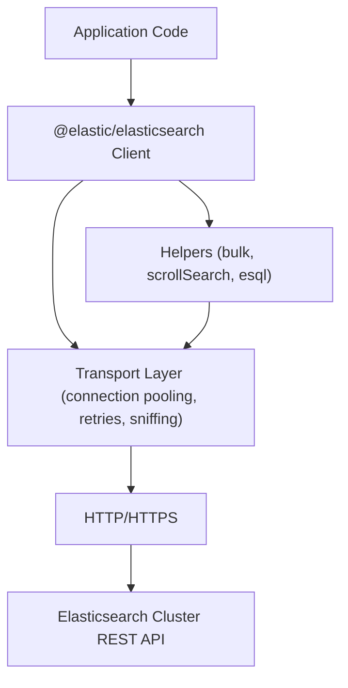

## Elasticsearch Client Libraries — JavaScript/Node.js Client

### Overview

The official `@elastic/elasticsearch` package provides Node.js access to Elasticsearch's REST API. Like its Python counterpart, it is a thin client — request bodies for queries, aggregations, and mappings are passed as plain JavaScript objects matching the REST API's JSON shape, with the client handling connection management, serialization, retries, and error mapping rather than abstracting away the DSL itself.

### Installation and Versioning

```bash
npm install @elastic/elasticsearch
```

The client major version is matched to the Elasticsearch server major version (8.x client for 8.x server, 9.x client for 9.x server), since request/response formats and available endpoints can shift between majors. Installing a version range scoped to the server's major version avoids drift:

```bash
npm install "@elastic/elasticsearch@^8.0.0"
```

TypeScript typings are bundled with the package itself, so no separate `@types` package is needed; the client's request and response shapes are typed against the Elasticsearch API specification.

### Connecting to a Cluster

The `Client` class is instantiated with connection options, mirroring the same node/Cloud ID/authentication patterns available in other official clients.

```javascript
const { Client } = require('@elastic/elasticsearch')

// Basic connection with API key authentication
const client = new Client({
  node: 'https://localhost:9200',
  auth: {
    apiKey: 'your_api_key_here'
  }
})

// Elastic Cloud connection
const client = new Client({
  cloud: {
    id: 'my-deployment:dXMtY2VudHJhbDEuZ2NwLmNsb3VkLmVzLmlvJGFiYzEyMw=='
  },
  auth: {
    apiKey: 'your_api_key_here'
  }
})

// Basic auth (development only; API keys recommended for production)
const client = new Client({
  node: 'https://localhost:9200',
  auth: {
    username: 'elastic',
    password: 'changeme'
  }
})
```

ESM import syntax works identically for projects configured with `"type": "module"`:

```javascript
import { Client } from '@elastic/elasticsearch'
```

For self-signed or cluster-internal CA certificates (the default on a fresh Elasticsearch install), the client needs the CA to verify the TLS connection:

```javascript
const fs = require('fs')

const client = new Client({
  node: 'https://localhost:9200',
  auth: { username: 'elastic', password: 'changeme' },
  tls: {
    ca: fs.readFileSync('/path/to/http_ca.crt')
  }
})
```

Setting `tls: { rejectUnauthorized: false }` bypasses certificate verification entirely and removes protection against man-in-the-middle attacks, making it appropriate only for local, disposable development environments.

**Key Points**

- API key authentication is the recommended production approach since keys can be scoped to specific indices and privileges, unlike account-wide basic auth.
- The `Client` constructor does not perform network I/O itself; connection failures surface on the first actual API call.
- A single `Client` instance manages its own internal connection pool and is intended to be instantiated once per application and reused, not recreated per request.

### Core CRUD Operations

The client exposes methods corresponding to REST endpoints, all returning Promises, used with either `async/await` or `.then()` chains.

```javascript
// Index a document
const response = await client.index({
  index: 'products',
  id: '1',
  document: { name: 'Wireless Mouse', price: 29.99, in_stock: true }
})

// Retrieve a document
const { _source } = await client.get({ index: 'products', id: '1' })
console.log(_source)

// Update a document (partial update via "doc")
await client.update({
  index: 'products',
  id: '1',
  doc: { price: 24.99 }
})

// Delete a document
await client.delete({ index: 'products', id: '1' })
```

Omitting `id` on `index()` causes Elasticsearch to auto-generate one, and the operation is always a create in that case rather than an upsert. Response objects are plain JavaScript objects (not wrapped in a custom class), so destructuring fields directly, as shown with `_source` above, works without additional unwrapping.

### Searching

`search()` accepts `query`, `aggs`, `sort`, and other DSL constructs as nested plain objects, matching the raw REST request body shape exactly.

```javascript
const response = await client.search({
  index: 'products',
  query: {
    bool: {
      must: [{ match: { name: 'mouse' } }],
      filter: [{ range: { price: { lte: 50 } } }]
    }
  },
  size: 10
})

const hits = response.hits.hits
for (const hit of hits) {
  console.log(hit._source, hit._score)
}
```

Because the client passes DSL objects through largely unmodified, any query construct valid in the REST API works here without a client-side abstraction layer translating it — but this also means the client does not validate query shape before sending, so malformed DSL surfaces as a server-side error rather than a client-side one.

### Bulk Operations

The client includes a `client.helpers.bulk()` helper (distinct from manually constructing `_bulk` request bodies) that batches documents from an iterable or async iterable into fewer, larger requests.

```javascript
async function* generateDocs() {
  for (let i = 0; i < 10000; i++) {
    yield { name: `Product ${i}`, price: i * 1.5 }
  }
}

const result = await client.helpers.bulk({
  datasource: generateDocs(),
  onDocument(doc) {
    return { index: { _index: 'products' } }
  },
  onDrop(doc) {
    console.log('Failed document:', doc)
  }
})

console.log(`Indexed: ${result.successful}, Failed: ${result.failed}`)
```

`onDocument` maps each source item to its bulk action metadata (`index`, `create`, `update`, or `delete`); `onDrop` is called for documents that fail after retries are exhausted, allowing per-document failure handling without aborting the whole batch. This helper also supports plain arrays as the `datasource`, not only generators, for cases where the full document set already fits in memory.

**Key Points**

- `flushBytes` and `flushInterval` control batching thresholds — the helper flushes a batch when either the accumulated payload size or the elapsed time since the last flush is reached, whichever comes first.
- `retries` and `wait` control retry behavior for individual failed items within a bulk response (as opposed to `maxRetries` at the client level, which governs whole-request-level retries).
- [Inference] The generator-based `datasource` pattern is generally preferable for large or streaming datasets since it avoids materializing the full document set in memory, while a plain array is simpler when the dataset is already fully loaded.

### Scrolling and search_after

For result sets exceeding a single `search()` page (bounded by `size` and by `index.max_result_window`, default 10,000), the client provides a `scrollSearch()` async iterator helper wrapping the scroll API.

```javascript
const scrollSearch = client.helpers.scrollSearch({
  index: 'products',
  query: { match_all: {} },
  size: 1000
})

for await (const result of scrollSearch) {
  for (const hit of result.documents) {
    console.log(hit)
  }
}
```

The helper manages opening the scroll context, fetching subsequent batches, and clearing the scroll on completion or early loop termination (via `break`). Because scroll contexts hold cluster-side resources for their configured duration, this pattern is generally recommended for one-off exports rather than as a general deep-pagination mechanism for live traffic; `search_after` with a `sort` tiebreaker is the documented approach for real-time deep pagination, used directly through `search()` without a dedicated helper.

### Error Handling

Errors are exposed as subclasses of a common base, importable from the package root.

```javascript
const { errors } = require('@elastic/elasticsearch')

try {
  await client.get({ index: 'products', id: 'nonexistent' })
} catch (err) {
  if (err instanceof errors.ResponseError) {
    console.log('Status:', err.meta.statusCode)
    console.log('Body:', err.meta.body)
  } else if (err instanceof errors.ConnectionError) {
    console.log('Could not reach the cluster')
  } else if (err instanceof errors.TimeoutError) {
    console.log('Request timed out')
  } else {
    throw err
  }
}
```

`ResponseError` covers any non-2xx API response, with the specific status code and error body available on `err.meta`; `ConnectionError` and `TimeoutError` correspond to transport-level failures rather than API-level ones. Checking `err.meta.statusCode` (e.g., 404 vs 409) within a `ResponseError` catch block is the standard way to differentiate specific API error conditions, since the client does not expose one exception subclass per HTTP status code the way some other language clients do.

### Retries and Timeouts

Retry and timeout behavior is configured at client construction.

```javascript
const client = new Client({
  node: 'https://localhost:9200',
  auth: { apiKey: 'your_api_key_here' },
  requestTimeout: 30000,
  maxRetries: 3
})
```

`maxRetries` applies to connection-level failures and to a configurable set of retryable status codes (429 and 502/503/504 by default); 4xx client errors like 400 or 404 are not retried, since they indicate the request itself was malformed rather than a transient failure. `requestTimeout` is specified in milliseconds and bounds how long the client waits for a response. [Unverified] Exact default values for `maxRetries` and `requestTimeout` have varied across client minor versions, so checking the installed version's documentation rather than assuming a value carries across releases is advisable.

### TypeScript Usage

Because typings ship with the package, request and response shapes are checked at compile time when using TypeScript, including for nested DSL structures like `query` and `aggs`.

```typescript
import { Client } from '@elastic/elasticsearch'
import type { SearchResponse } from '@elastic/elasticsearch/lib/api/types'

interface Product {
  name: string
  price: number
  in_stock: boolean
}

const client = new Client({ node: 'https://localhost:9200' })

const response: SearchResponse<Product> = await client.search<Product>({
  index: 'products',
  query: { match: { name: 'mouse' } }
})

response.hits.hits.forEach(hit => {
  console.log(hit._source?.name)
})
```

Passing a type parameter to `search<Product>()` types `hit._source` as `Product | undefined` (undefined because `_source` can be excluded from a response via `_source: false` or similar options), which the compiler then enforces at each access site.

### Client Architecture



### Connection Pooling and Node Discovery

Multiple nodes can be passed to distribute requests and provide failover if one node becomes unreachable.

```javascript
const client = new Client({
  nodes: ['https://node1:9200', 'https://node2:9200'],
  auth: { apiKey: 'your_api_key_here' }
})
```

The client's internal `ConnectionPool` selects among configured nodes and can be set to periodically discover additional cluster nodes via sniffing (`sniffOnStart`, `sniffInterval`, `sniffOnConnectionFault` options). [Unverified] Default sniffing behavior has varied across major client versions, so explicitly configuring known-good nodes rather than relying on an assumed sniffing default is the more predictable approach for production deployments.

### Common Pitfalls

- In 8.x, request bodies must be passed as top-level named properties (`query:`, `document:`, `doc:`) rather than nested under a single `body:` key; code migrated from 7.x that still nests everything under `body` triggers deprecation warnings or breaks outright depending on the exact client minor version.
- Forgetting `await` on client method calls silently produces an unresolved Promise rather than a runtime error in permissive contexts, which is a common source of confusing "undefined" results when a response is logged before the request has actually completed.
- Instantiating a new `Client` per request rather than per application discards connection pooling and can exhaust available sockets under concurrent load.
- Relying on the default `requestTimeout` for bulk or scroll/PIT-based operations over large datasets can cause premature timeouts on genuinely long-running operations, which typically warrant an explicitly larger timeout value.
- Using `client.helpers.bulk()`'s default retry/wait settings for very large datasets without monitoring `onDrop` callbacks can silently lose documents that exhaust retries, since a failed-after-retries document does not throw by default.

**Related Topics**

- Elasticsearch Client Libraries — Java client (High-Level REST Client and Java API Client)
- Elasticsearch Client Libraries — Go client and Ruby client
- The `client.helpers.esql` helper for ES|QL query execution from Node.js
- Point-in-Time (PIT) API combined with `search_after` for consistent deep pagination
- API key management and security privilege scoping for client authentication
- TypeScript type generation and narrowing patterns for complex aggregation responses
- Connecting the Node.js client through a proxy or load balancer in containerized deployments