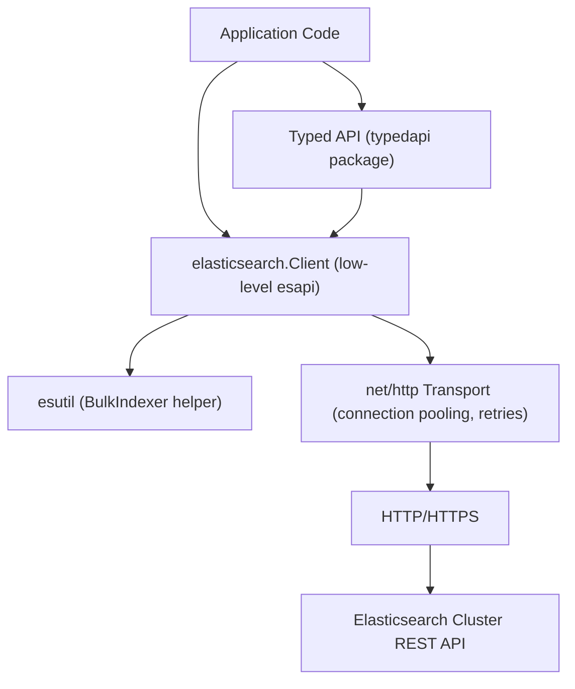

## Elasticsearch Client Libraries — Go Client

### Overview

Elastic maintains two Go clients that coexist in the ecosystem: `go-elasticsearch` (the original official client, `github.com/elastic/go-elasticsearch`), which exposes both a low-level API mirroring REST endpoints with `interface{}`/`io.Reader` bodies and a newer typed API layer, and `elasticsearch-serverless-go` for Elastic's serverless offering specifically. For self-managed and Elastic Cloud deployments, `go-elasticsearch` is the client discussed here. Its low-level API requires callers to construct JSON request bodies manually (e.g., via `encoding/json` or raw byte slices), while its typed API (added in later 8.x versions) provides Go struct-based builders closer in spirit to the Java API Client.

### Installation and Versioning

```bash
go get github.com/elastic/go-elasticsearch/v8@latest
```

The module path itself is versioned (`/v8`, `/v9`), consistent with Go's convention for major-version modules, and this major version is matched to the Elasticsearch server major version being targeted. Switching server major versions generally requires updating the import path's version segment, not just a `go.mod` version bump.

```go
import (
    "github.com/elastic/go-elasticsearch/v8"
)
```

### Connecting to a Cluster

The low-level client is constructed via `elasticsearch.NewClient()` with a `Config` struct specifying addresses and credentials.

```go
package main

import (
    "log"
    "github.com/elastic/go-elasticsearch/v8"
)

func main() {
    cfg := elasticsearch.Config{
        Addresses: []string{"https://localhost:9200"},
        APIKey:    "your_api_key_here",
    }

    client, err := elasticsearch.NewClient(cfg)
    if err != nil {
        log.Fatalf("Error creating client: %s", err)
    }
}
```

Basic auth, generally reserved for development given that API keys can be scoped to specific indices and privileges, is set via `Username`/`Password` fields on the same `Config` struct:

```go
cfg := elasticsearch.Config{
    Addresses: []string{"https://localhost:9200"},
    Username:  "elastic",
    Password:  "changeme",
}
```

For TLS with a self-signed or cluster-internal CA (the default on a fresh install), the CA certificate bytes are supplied via `Config.CACert`:

```go
cert, err := os.ReadFile("/path/to/http_ca.crt")
if err != nil {
    log.Fatal(err)
}

cfg := elasticsearch.Config{
    Addresses: []string{"https://localhost:9200"},
    Username:  "elastic",
    Password:  "changeme",
    CACert:    cert,
}
```

**Key Points**

- `elasticsearch.NewClient()` does not perform network I/O itself; connection errors surface on the first actual request, consistent with the Python and JavaScript clients' lazy-connection behavior.
- The returned `*elasticsearch.Client` wraps an internal HTTP transport with connection pooling and is intended to be constructed once and reused across the application via a shared reference, not recreated per request.
- Unlike Python's or JavaScript's constructors, Go's `NewClient()` returns an explicit `error` value following Go convention, requiring the caller to check it rather than catching a constructor-time exception.

### Core CRUD Operations (Low-Level API)

The low-level API's methods return an `*esapi.Response` wrapping the raw HTTP response; the response body must be explicitly decoded (typically via `encoding/json`) and explicitly closed.

```go
import (
    "bytes"
    "encoding/json"
    "strings"
)

type Product struct {
    Name    string  `json:"name"`
    Price   float64 `json:"price"`
    InStock bool    `json:"in_stock"`
}

// Index a document
product := Product{Name: "Wireless Mouse", Price: 29.99, InStock: true}
data, _ := json.Marshal(product)

res, err := client.Index(
    "products",
    bytes.NewReader(data),
    client.Index.WithDocumentID("1"),
)
if err != nil {
    log.Fatalf("Error indexing document: %s", err)
}
defer res.Body.Close()

if res.IsError() {
    log.Printf("Error response: %s", res.String())
}

// Retrieve a document
getRes, err := client.Get("products", "1")
if err != nil {
    log.Fatalf("Error getting document: %s", err)
}
defer getRes.Body.Close()

var result map[string]interface{}
json.NewDecoder(getRes.Body).Decode(&result)
fmt.Println(result["_source"])
```

`defer res.Body.Close()` is required after every call returning an `*esapi.Response`, since the response body is an open `io.ReadCloser` backed by the underlying HTTP connection; omitting the close leaks connections from the pool over time. `res.IsError()` checks the HTTP status code range to determine success without needing to fully decode the body first, which is useful for cheaply branching on failure before committing to a full JSON decode.

### Core CRUD Operations (Typed API)

The newer typed API (`client.Search`, `client.Index` methods available via `esapi.` request option builders, or the fully typed `typedapi` package in later versions) reduces manual JSON marshaling for common cases:

```go
resp, err := client.Index("products").
    Id("1").
    Request(product).
    Do(context.Background())
if err != nil {
    log.Fatalf("Error indexing document: %s", err)
}
fmt.Println(resp.Result)
```

[Unverified] The typed API's method chaining surface and package location have shifted across 8.x minor releases as the feature has matured, so exact call signatures should be checked against the installed version's documentation rather than assumed stable across the 8.x line. The low-level `esapi`-based approach shown in the CRUD section above remains the more universally documented and stable entry point across versions.

### Searching

Search request bodies are constructed as Go structs marshaled to JSON, or as raw JSON strings/readers, then passed to `client.Search()` with functional options.

```go
query := map[string]interface{}{
    "query": map[string]interface{}{
        "bool": map[string]interface{}{
            "must": []map[string]interface{}{
                {"match": map[string]interface{}{"name": "mouse"}},
            },
            "filter": []map[string]interface{}{
                {"range": map[string]interface{}{"price": map[string]interface{}{"lte": 50}}},
            },
        },
    },
}

var buf bytes.Buffer
json.NewEncoder(&buf).Encode(query)

res, err := client.Search(
    client.Search.WithIndex("products"),
    client.Search.WithBody(&buf),
    client.Search.WithSize(10),
)
if err != nil {
    log.Fatalf("Search error: %s", err)
}
defer res.Body.Close()

var searchResult map[string]interface{}
json.NewDecoder(res.Body).Decode(&searchResult)
hits := searchResult["hits"].(map[string]interface{})["hits"].([]interface{})
```

Building deeply nested `map[string]interface{}` structures for DSL bodies is verbose and loses compile-time field checking (subsequent `.(map[string]interface{})` type assertions are needed to navigate the decoded response), which is the low-level API's main ergonomic tradeoff versus the typed API or versus dictionary-passing clients like Python's and JavaScript's, where the language's own dynamic-object literals are less verbose than Go's `map[string]interface{}` construction.

### Bulk Operations

The `esutil` package provides a `BulkIndexer` helper that batches operations and manages flush timing, roughly analogous to Python's `helpers.bulk()`/`streaming_bulk()` or the JavaScript client's `client.helpers.bulk()`.

```go
import "github.com/elastic/go-elasticsearch/v8/esutil"

indexer, err := esutil.NewBulkIndexer(esutil.BulkIndexerConfig{
    Index:         "products",
    Client:        client,
    NumWorkers:    4,
    FlushBytes:    5e+6,
    FlushInterval: 30 * time.Second,
})
if err != nil {
    log.Fatalf("Error creating bulk indexer: %s", err)
}

for i := 0; i < 10000; i++ {
    product := Product{Name: fmt.Sprintf("Product %d", i), Price: float64(i) * 1.5}
    data, _ := json.Marshal(product)

    err := indexer.Add(context.Background(), esutil.BulkIndexerItem{
        Action:     "index",
        DocumentID: strconv.Itoa(i),
        Body:       bytes.NewReader(data),
        OnFailure: func(ctx context.Context, item esutil.BulkIndexerItem, res esutil.BulkIndexerResponseItem, err error) {
            log.Printf("Failed to index document %s: %s", item.DocumentID, err)
        },
    })
    if err != nil {
        log.Fatalf("Unexpected error: %s", err)
    }
}

if err := indexer.Close(context.Background()); err != nil {
    log.Fatalf("Unexpected error: %s", err)
}

stats := indexer.Stats()
log.Printf("Indexed: %d, Failed: %d", stats.NumIndexed, stats.NumFailed)
```

**Key Points**

- `NumWorkers` controls how many goroutines concurrently send bulk requests, allowing parallel flushing rather than the single-threaded sequential batching implicit in Python's `helpers.bulk()`.
- `FlushBytes` and `FlushInterval` mirror the JavaScript client's `flushBytes`/`flushInterval` helper options — a batch flushes when either threshold is reached first.
- Calling `indexer.Close()` is required to flush any remaining buffered documents that haven't hit a flush threshold; omitting it, analogous to the Java client's manual-batching pitfall, silently drops the final partial batch.

### Scrolling and search_after

`go-elasticsearch` does not provide a dedicated scroll-iterator helper comparable to Python's `helpers.scan()` or Node's `scrollSearch()`; scroll usage requires manually managing the scroll ID and looping, similar to the Java API Client's explicit approach.

```go
res, err := client.Search(
    client.Search.WithIndex("products"),
    client.Search.WithBody(strings.NewReader(`{"query":{"match_all":{}}}`)),
    client.Search.WithScroll(time.Minute),
    client.Search.WithSize(1000),
)
defer res.Body.Close()

var result map[string]interface{}
json.NewDecoder(res.Body).Decode(&result)
scrollID := result["_scroll_id"].(string)

for {
    hits := result["hits"].(map[string]interface{})["hits"].([]interface{})
    if len(hits) == 0 {
        break
    }
    for _, hit := range hits {
        fmt.Println(hit)
    }

    scrollRes, err := client.Scroll(
        client.Scroll.WithScrollID(scrollID),
        client.Scroll.WithScroll(time.Minute),
    )
    defer scrollRes.Body.Close()
    json.NewDecoder(scrollRes.Body).Decode(&result)
    scrollID = result["_scroll_id"].(string)
}

client.ClearScroll(client.ClearScroll.WithScrollID(scrollID))
```

As with the other clients, scroll contexts hold cluster-side resources for their configured duration and are generally recommended for one-off exports rather than for general deep pagination under live traffic; `search_after` with a `sort` tiebreaker, passed through the same `client.Search()` call with `WithSearchAfter()`-style body content, is the documented approach for real-time deep pagination.

### Error Handling

The low-level API does not raise language-level exceptions for API errors (Go has no exceptions); instead, `res.IsError()` must be checked explicitly, with the error body decoded from `res.Body` for details. Only transport-level failures (connection refused, DNS failure, timeout) populate the `error` return value from methods like `client.Search()` itself.

```go
res, err := client.Get("products", "nonexistent")
if err != nil {
    log.Fatalf("Transport-level error: %s", err)
}
defer res.Body.Close()

if res.IsError() {
    var errorBody map[string]interface{}
    json.NewDecoder(res.Body).Decode(&errorBody)
    if res.StatusCode == 404 {
        fmt.Println("Document not found")
    } else {
        fmt.Printf("API error: %d - %v\n", res.StatusCode, errorBody)
    }
}
```

This two-tier pattern — `error` for transport failures, `res.IsError()`/`res.StatusCode` for API-level failures — is a structural consequence of Go's `error`-value convention rather than exception hierarchies, and differs from Python's per-status-code exception subclasses, JavaScript's `ResponseError`/`ConnectionError` split, and Java's single `ElasticsearchException` type; in Go, both transport and API failure modes must be checked explicitly at each call site since neither is implicit.

### Retries and Timeouts

Retry and timeout configuration is set on the `Config` struct, along with an optional custom `http.Transport` for finer control.

```go
cfg := elasticsearch.Config{
    Addresses:     []string{"https://localhost:9200"},
    APIKey:        "your_api_key_here",
    RetryOnStatus: []int{502, 503, 504},
    MaxRetries:    3,
    Transport: &http.Transport{
        ResponseHeaderTimeout: 30 * time.Second,
    },
}
```

`MaxRetries` and `RetryOnStatus` mirror Python's `max_retries`/JavaScript's `maxRetries` in intent, defaulting to retrying a similar set of transient status codes (429 and 5xx-range codes); 4xx client errors are not retried by default since they indicate a malformed request rather than a transient condition. Because Go's standard `net/http` package underlies the transport, fine-grained timeout behavior (connect timeout vs. response header timeout vs. overall request timeout) is configured through the standard `http.Transport`/`http.Client` fields rather than through a single client-level timeout option, giving more granular control at the cost of needing familiarity with Go's HTTP stack specifics.

### Context and Cancellation

Idiomatic Go request cancellation via `context.Context` is supported throughout the low-level API via `WithContext()` functional options, and is the primary (required) parameter on the typed API's `.Do()` calls shown earlier.

```go
ctx, cancel := context.WithTimeout(context.Background(), 10*time.Second)
defer cancel()

res, err := client.Search(
    client.Search.WithContext(ctx),
    client.Search.WithIndex("products"),
)
```

This `context.Context`-based cancellation pattern has no direct equivalent in the Python, JavaScript, or Java clients discussed elsewhere in this series — it is idiomatic to Go's standard library conventions specifically, allowing a single deadline or cancellation signal to propagate through an entire call chain rather than being configured per-client-instance.

### Client Architecture



### Connection Pooling and Node Discovery

Multiple addresses distribute requests and provide failover.

```go
cfg := elasticsearch.Config{
    Addresses: []string{"https://node1:9200", "https://node2:9200"},
}
```

[Unverified] Sniffing/node-discovery support and its configuration surface in `go-elasticsearch` have differed from the more explicit sniffing options exposed in the Python and JavaScript clients' constructors; the exact mechanism and defaults should be checked against the installed version's documentation before relying on automatic node discovery behavior in production, and explicitly listing known-good addresses is the more predictable baseline regardless.

### Common Pitfalls

- Omitting `defer res.Body.Close()` after any low-level API call leaks HTTP connections from the pool over the lifetime of a long-running process, a mistake with no equivalent in the Python or JavaScript clients since they manage response bodies internally.
- Ignoring `res.IsError()` and only checking the `error` return value misses all API-level failures (like 404s or 400s), since those do not populate Go's `error` value — only transport failures do.
- Type-asserting decoded JSON (`result["hits"].(map[string]interface{})`) without a comma-ok check panics on unexpected response shapes; using the two-value form (`val, ok := result["hits"].(map[string]interface{})`) is safer for production code handling variable API responses.
- Forgetting `indexer.Close()` after using `esutil.BulkIndexer` silently drops the final buffered batch, analogous to the manual-batching pitfall in the Java client.
- Mixing the low-level `esapi` calling convention with the newer typed API inconsistently across a codebase increases cognitive overhead, since the two have different error-handling and body-construction idioms.

**Related Topics**

- Elasticsearch Client Libraries — Ruby client and .NET client
- The typed API (`typedapi` package) in depth: builder patterns and struct-based DSL construction
- `esutil.BulkIndexer` tuning: `NumWorkers`, `FlushBytes`, and backpressure under high-throughput ingestion
- Point-in-Time (PIT) API combined with `search_after` for consistent deep pagination in Go
- API key management and security privilege scoping for client authentication
- Idiomatic `context.Context` propagation patterns for request cancellation and deadlines across services
- Comparing `go-elasticsearch` against `elasticsearch-serverless-go` for serverless deployments