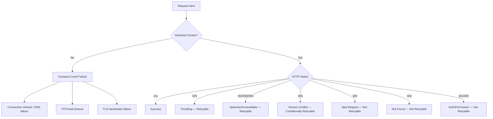
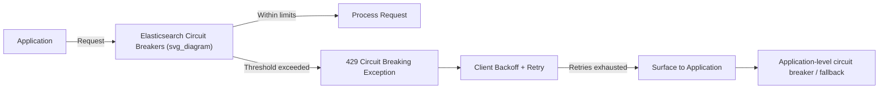

## Retry and Error Handling Patterns

### Overview

Across all official Elasticsearch clients, requests can fail at two structurally distinct layers: the transport layer (connection refused, DNS failure, TCP timeout — the request never reached the cluster or never got a response) and the API layer (the cluster received the request and returned a non-2xx status). Robust retry and error handling treats these differently, since transport failures are frequently transient and safe to retry automatically, while API-level failures range from safely retryable (429 throttling, 503 unavailable) to fundamentally non-retryable (400 malformed request, 404 not found) regardless of how many times they're repeated.

### Failure Taxonomy



**Key Points**

- Transport-level failures are generally safe to retry blindly for idempotent operations (reads, and writes with explicit IDs), since the request plausibly never reached the cluster at all.
- 429 (throttling, typically from bulk queue saturation) and 502/503/504 (gateway/unavailable, typically from node unavailability during shard relocation or cluster instability) are the standard retryable status codes across all official clients' default retry configuration.
- 409 (version conflict, from optimistic concurrency control) is retryable only after re-reading the current document state, since blindly resending the same `if_seq_no`/`if_primary_term` values will conflict again; a naive retry loop without re-fetching will not converge.
- 400 and 404 indicate the request itself was invalid or targeted a nonexistent resource — no amount of retrying changes this outcome, so none of the official clients retry these by default.

### Default Client Retry Behavior

| Client | Retry Config | Default Retryable Statuses | Retry Scope |
| --- | --- | --- | --- |
| Python | `max_retries`, `retry_on_timeout` | 429, 502, 503, 504 | Whole request |
| JavaScript/Node.js | `maxRetries` | 429, 502, 503, 504 | Whole request |
| Java API Client | Configured via low-level `RestClient` node failover | Connection-level failures across nodes | Node selection, not per-status retry |
| Go (`go-elasticsearch`) | `MaxRetries`, `RetryOnStatus` | 429, 502, 503, 504 (configurable) | Whole request |

[Unverified] Exact default retry counts and backoff timing differ across client versions and are not guaranteed stable across minor releases; the table above reflects commonly documented behavior, but the installed version's documentation should be the source of truth before depending on specific retry counts or delays in production.

### Exponential Backoff

All official clients apply some form of backoff between retry attempts rather than retrying immediately, to avoid compounding load on an already-struggling cluster. The general form is:

$$\text{delay}_n = \min(\text{base} \times 2^n + \text{jitter}, \text{max\_delay})$$

where $n$ is the retry attempt number (starting at 0), `base` is an initial delay, and `jitter` is randomized to avoid synchronized retry storms from multiple client instances backing off in lockstep. [Inference] The precise backoff formula and jitter strategy are internal to each client's transport implementation and are not typically exposed as tunable parameters beyond the retry count and overall timeout, so applications needing custom backoff curves generally implement their own retry wrapper around the client rather than modifying the client's built-in backoff.

### Bulk Operation Error Handling

Bulk requests return HTTP 200 (or the request-level status) even when individual items within the batch fail — a single `_bulk` call can partially succeed. Item-level failures must be inspected in the response body rather than inferred from the overall request status.

```python
# Python
success, errors = helpers.bulk(client, actions, raise_on_error=False)
for error in errors:
    op_type = list(error.keys())[0]
    print(f"Failed {op_type}: {error[op_type]['error']}")
```

```javascript
// JavaScript
const result = await client.helpers.bulk({
  datasource: docs,
  onDocument(doc) { return { index: { _index: 'products' } } },
  onDrop(doc) {
    console.log('Dropped after retries exhausted:', doc.document)
  }
})
```

```java
// Java
BulkResponse result = client.bulk(br.build());
if (result.errors()) {
    for (var item : result.items()) {
        if (item.error() != null) {
            System.out.println(item.error().type() + ": " + item.error().reason());
        }
    }
}
```

Item-level bulk failures commonly stem from mapping conflicts (a field's inferred type mismatching an existing mapping), version conflicts on concurrent updates, or document-level validation errors — none of which are resolved by simply resending the same failed item, distinguishing them from request-level transient failures that whole-request retry logic addresses.

### Version Conflict Handling (409)

Optimistic concurrency control via `if_seq_no`/`if_primary_term` (or the legacy `version`/`version_type=external`) produces a 409 when the document has changed since it was read. The correct retry pattern re-fetches the current state before reapplying the change, rather than blindly resubmitting.

```python
from elasticsearch import ConflictError

def update_with_retry(client, index, doc_id, update_fn, max_attempts=5):
    for attempt in range(max_attempts):
        doc = client.get(index=index, id=doc_id)
        new_source = update_fn(doc["_source"])
        try:
            return client.index(
                index=index,
                id=doc_id,
                document=new_source,
                if_seq_no=doc["_seq_no"],
                if_primary_term=doc["_primary_term"]
            )
        except ConflictError:
            if attempt == max_attempts - 1:
                raise
            continue
```

This read-modify-write-retry loop is the standard pattern for safely applying concurrent updates without external locking; the number of retries needed under contention scales with how many concurrent writers target the same document, so [Inference] high-contention single-document update patterns generally benefit more from redesigning around a script-based update (using `_update` with a Painless script executed atomically on the shard) than from increasing the client-side retry count, since scripted updates avoid the read-modify-write round trip entirely.

### Circuit Breaker Patterns at the Application Level

Elasticsearch itself enforces server-side circuit breakers (field data, request, in-flight requests) that reject requests with a 429 when memory thresholds are exceeded, distinct from client-side retry logic. Repeatedly retrying into a server-side circuit breaker trip without backing off can prevent the cluster from recovering, since retried requests continue consuming the same constrained resource.



[Inference] For applications making high-volume requests against a cluster prone to periodic memory pressure, wrapping the official client in an application-level circuit breaker (tracking recent failure rates and short-circuiting new requests once a threshold is crossed, independent of the client's own per-request retry count) is a common resilience pattern, though it is not something any of the official clients provide out of the box — it is typically implemented via a general-purpose circuit-breaker library appropriate to the application's language.

### Timeout Configuration Layers

Requests can time out at multiple independent layers, and a retry strategy needs to account for which layer actually triggered:

- **Connect timeout** — time to establish the TCP/TLS connection.
- **Request/socket timeout** — time waiting for a response after the request is sent.
- **Elasticsearch-side `timeout` parameter** — a query-string or body parameter (e.g., `?timeout=30s` on search, or `timeout` within a bulk request) telling Elasticsearch itself how long to wait for shard operations before returning a partial result, distinct from the client's own timeout.

A client-side request timeout shorter than the server-side `timeout` parameter can cause the client to abandon a request the cluster is still legitimately processing, leading to a retry that stacks additional load onto an already-slow operation. [Inference] Setting the client-side timeout comfortably longer than any server-side `timeout` parameter passed in the request body is generally advisable to avoid this stacking effect, particularly for expensive aggregations or large bulk operations.

### Retry-Safety and Idempotency

Not all operations are equally safe to retry blindly:

| Operation | Idempotent? | Retry Safety |
| --- | --- | --- |
| `GET` (read) | Yes | Safe to retry freely |
| `index` with explicit `id` | Yes | Safe — same ID overwrites |
| `index` without `id` (auto-generated) | No | Unsafe — retry after a transport failure of unknown outcome can create duplicate documents |
| `delete` | Yes (in effect) | Safe — deleting an already-deleted document returns 404, not an error state requiring special handling |
| `update` (partial doc) | Conditionally | Safe if idempotent field values; unsafe for increment-style scripted updates without version checking |
| `bulk` | Mixed | Depends on the mix of operation types within the batch |

The auto-generated-ID case is the most common source of accidental duplicate documents in retry logic: if a transport-level failure occurs after the server processed the index request but before the client received the response, a blind retry with no explicit ID creates a second document. [Inference] Generating IDs client-side (e.g., a UUID assigned before the request rather than relying on Elasticsearch's auto-generation) is a common mitigation, since it makes the operation naturally idempotent under retry regardless of where in the request/response cycle the failure occurred.

### Structured Error Inspection Example

Regardless of client, the underlying Elasticsearch error response body has a consistent shape worth inspecting directly for edge cases the client's exception hierarchy doesn't distinguish:

```json
{
  "error": {
    "root_cause": [
      {
        "type": "mapper_parsing_exception",
        "reason": "failed to parse field [price] of type [double]"
      }
    ],
    "type": "mapper_parsing_exception",
    "reason": "failed to parse field [price] of type [double]",
    "caused_by": {
      "type": "number_format_exception",
      "reason": "For input string: \"N/A\""
    }
  },
  "status": 400
}
```

The `error.type` field (a stable, machine-readable string like `mapper_parsing_exception`, `version_conflict_engine_exception`, or `circuit_breaking_exception`) is generally more reliable for programmatic branching than parsing `error.reason`'s free-text message, since `reason` strings can vary in wording across versions while `type` values are more stable identifiers.

### Common Pitfalls

- Retrying 400-class errors under the assumption that "retrying usually helps" — malformed requests fail identically on every attempt, and retrying only delays surfacing a bug that needs a code fix.
- Treating all bulk item failures as request-level failures and retrying the entire batch, which resends already-succeeded items unnecessarily; only the failed items (identified via the response's `items` array) should be retried.
- Retrying 409 version conflicts without re-fetching the current document state, causing the retry to fail identically since it resubmits the same now-stale `if_seq_no`.
- Setting client-side timeouts shorter than a corresponding server-side `timeout` parameter, causing the client to time out and retry an operation the cluster is still legitimately completing.
- Relying solely on auto-generated document IDs in write paths that also have retry logic, risking duplicate documents when a transport failure occurs after the server-side write succeeds but before the client receives confirmation.
- Ignoring `error.type` in favor of string-matching on `error.reason`, producing branching logic that breaks silently when the wording of a reason message changes between versions.

**Related Topics**

- Circuit breaker settings (`indices.breaker.*`) and diagnosing `circuit_breaking_exception` at the cluster level
- Optimistic concurrency control in depth: `_seq_no`, `_primary_term`, and scripted updates as alternatives
- Bulk API deep dive: chunking strategy, backpressure, and error recovery patterns
- Cluster health and node-level monitoring to distinguish transient from systemic failure patterns
- Designing idempotent ingestion pipelines with client-generated document IDs
- Elasticsearch Client Libraries — comparative overview across Python, JavaScript, Java, and Go