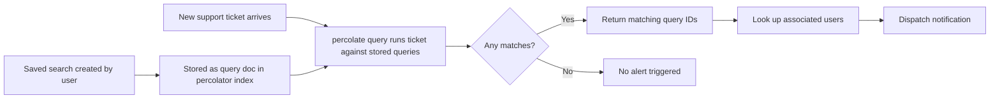

## Percolator and Reverse Search

### Overview

The percolator is a query registered in an index that runs incoming documents against stored queries, rather than running a query against stored documents. This inverts the normal search model: instead of "which documents match this query," it answers "which queries match this document." It is implemented in Elasticsearch through the `percolator` field type and the `percolate` query.

### Core Concept

In standard search, documents are indexed and queries are run at search time. In percolation:

- Queries are indexed as documents (stored as JSON in a `percolator`-typed field)
- A document is submitted at search time
- Elasticsearch evaluates all stored queries against that single document
- The queries that match are returned as hits

This is commonly called "reverse search" or "search inverted."

### When to Use It

Percolation is suited to scenarios where a fixed set of interests (queries) needs to be checked against a stream of incoming content:

- **Alerting systems** — notify users when new content matches saved search criteria
- **Content classification/tagging** — route or tag incoming documents based on predefined rules
- **News/feed filtering** — match articles against subscriber interest profiles
- **Monitoring** — flag documents (logs, transactions) that match suspicious patterns

### Setting Up a Percolator Index

**Mapping**

A field of type `percolator` must be defined to hold the query. It's common to also define the fields the target documents will contain, so the stored queries can reference them correctly.

```json
PUT /my-percolator-index
{
  "mappings": {
    "properties": {
      "query": {
        "type": "percolator"
      },
      "message": {
        "type": "text"
      },
      "category": {
        "type": "keyword"
      }
    }
  }
}
```

**Storing a Query**

A query is indexed like a normal document, but its `query` field contains a full query DSL clause.

```json
PUT /my-percolator-index/_doc/1
{
  "query": {
    "match": {
      "message": "elasticsearch outage"
    }
  }
}
```

Multiple such documents, each with a different stored query, can be indexed. Each represents one "interest" to check incoming documents against.

### Running a Percolation

The `percolate` query is used to submit one or more documents and have Elasticsearch return the stored queries that match them.

```json
GET /my-percolator-index/_search
{
  "query": {
    "percolate": {
      "field": "query",
      "document": {
        "message": "Users are reporting an elasticsearch outage in us-east-1"
      }
    }
  }
}
```

The response returns the percolator documents (i.e., the stored query definitions) whose `query` clause matches the submitted `message` field — not the submitted document itself.

### Percolating Multiple Documents

The `documents` array (plural) allows checking several documents in a single request, which is more efficient than issuing one `percolate` query per document.

```json
GET /my-percolator-index/_search
{
  "query": {
    "percolate": {
      "field": "query",
      "documents": [
        { "message": "elasticsearch outage detected" },
        { "message": "unrelated status update" },
        { "message": "planned maintenance window" }
      ]
    }
  }
}
```

Each hit in the response includes a `_percolator_document_slot` field indicating which of the submitted documents (by array index) triggered the match. When a stored query matches more than one submitted document, `_percolator_document_slot` becomes an array listing all matching slots.

### Percolating an Already-Indexed Document

Instead of supplying the document inline, an existing document can be referenced by index, ID, and optionally routing/preference, avoiding the need to re-serialize it client-side.

```json
GET /my-percolator-index/_search
{
  "query": {
    "percolate": {
      "field": "query",
      "index": "incoming-messages",
      "id": "1001",
      "version": 1
    }
  }
}
```

### Combining Percolate with Other Queries

Because `percolate` is a standard query clause, it can be composed inside `bool` queries alongside filters — for example, to only check queries belonging to a specific category or tenant.

```json
GET /my-percolator-index/_search
{
  "query": {
    "bool": {
      "must": [
        {
          "percolate": {
            "field": "query",
            "document": {
              "message": "elasticsearch outage in us-east-1"
            }
          }
        }
      ],
      "filter": [
        { "term": { "category": "infrastructure" } }
      ]
    }
  }
}
```

### Highlighting Matches

Standard `highlight` clauses work with percolate queries, showing which parts of the submitted document caused a match — useful for surfacing why an alert fired.

```json
GET /my-percolator-index/_search
{
  "query": {
    "percolate": {
      "field": "query",
      "document": {
        "message": "elasticsearch outage in us-east-1"
      }
    }
  },
  "highlight": {
    "fields": {
      "message": {}
    }
  }
}
```

### Supported Query Types and Limitations

Most standard query DSL clauses can be stored and percolated, including `match`, `term`, `range`, `bool`, and `match_phrase`. Certain query types have restrictions:

- Queries relying on index-time global statistics (such as `more_like_this` in some configurations) may behave differently since only one document is being evaluated at percolation time rather than a full index
- Geo and script queries are supported but should be tested for the specific version in use, since edge-case behavior around percolation can vary [Unverified]
- The percolator does not support the `has_child`/`has_parent` queries [Unverified — this restriction has existed in past versions but should be confirmed against the specific version deployed]

### Performance Considerations

- Percolation cost scales with the number of stored queries, since (naively) each stored query must be evaluated against the submitted document
- Elasticsearch optimizes this internally using a mechanism that extracts terms from stored queries to pre-filter which queries are candidates for a given document, rather than evaluating every stored query in full [Unverified — exact internal optimization strategy may differ by version]
- Very large or highly complex stored queries (e.g., large `terms` queries, deeply nested `bool` clauses) increase per-query evaluation cost and should be monitored under production-like load
- Percolator indices benefit from being sized and sharded according to query volume and complexity, not document volume, since the "documents" being stored are queries

### Reindexing Considerations

Because percolator queries reference field mappings in the same index, changes to the underlying document field mappings (e.g., changing a field from `text` to `keyword`) can invalidate previously stored queries or change their matching behavior. Percolator queries should be reviewed after any mapping change to the index.

### Example: Alerting Workflow

A minimal alerting pipeline using percolation:

1. Users submit saved searches (e.g., `"message contains 'refund'"`), each stored as a document in a percolator index
2. New support tickets arrive as a stream
3. Each ticket is percolated against the stored searches
4. Matching stored queries indicate which users/alerts should be notified
5. Notification dispatch is handled by application logic reading the `_id` of matched percolator documents (mapped back to user/alert records)



### Diagram: Standard Search vs. Percolation

<svg xmlns="http://www.w3.org/2000/svg" viewBox="0 0 760 340">
\<style\>
.title { font: bold 14px sans-serif; fill: #1a1a1a; }
.label { font: 12px sans-serif; fill: #1a1a1a; }
.sub { font: 11px sans-serif; fill: #555; }
.box { fill: #eef3fb; stroke: #4a6fa5; stroke-width: 1.5; }
.box2 { fill: #fbeeee; stroke: #a54a4a; stroke-width: 1.5; }
.arrow { stroke: #333; stroke-width: 1.5; marker-end: url(#arrow); }
\</style\>
<text x="20" y="25" class="title">Standard Search vs. Percolation (svg_diagram)</text>


<text x="40" y="60" class="label" font-weight="bold">Standard Search</text>

<rect x="40" y="75" width="150" height="45" rx="4" class="box" />

<text x="115" y="102" class="label" text-anchor="middle">Query</text>

<rect x="40" y="150" width="150" height="45" rx="4" class="box" />

<text x="115" y="165" class="sub" text-anchor="middle">Indexed Docs</text>

<text x="115" y="180" class="sub" text-anchor="middle">(many)</text>

<line x1="115" y1="120" x2="115" y2="150" class="arrow" />

<rect x="40" y="225" width="150" height="45" rx="4" class="box" />

<text x="115" y="252" class="label" text-anchor="middle">Matching Docs</text>

<line x1="115" y1="195" x2="115" y2="225" class="arrow" />


<line x1="380" y1="50" x2="380" y2="300" stroke="#ccc" stroke-width="1" stroke-dasharray="4,4" />


<text x="420" y="60" class="label" font-weight="bold">Percolation (Reverse Search)</text>

<rect x="420" y="75" width="150" height="45" rx="4" class="box2" />

<text x="495" y="90" class="sub" text-anchor="middle">Stored Queries</text>

<text x="495" y="105" class="sub" text-anchor="middle">(many, indexed)</text>

<rect x="600" y="75" width="140" height="45" rx="4" class="box2" />

<text x="670" y="102" class="label" text-anchor="middle">1 Document</text>

<line x1="670" y1="120" x2="530" y2="150" class="arrow" />

<line x1="495" y1="120" x2="530" y2="150" class="arrow" />

<rect x="455" y="150" width="150" height="45" rx="4" class="box2" />

<text x="530" y="177" class="label" text-anchor="middle">Percolate Eval</text>

<line x1="530" y1="195" x2="530" y2="225" class="arrow" />

<rect x="455" y="225" width="150" height="45" rx="4" class="box2" />

<text x="530" y="245" class="label" text-anchor="middle">Matching Queries</text>

<text x="530" y="260" class="sub" text-anchor="middle">returned as hits</text>

</svg>

### Comparison: Standard Query vs. Percolate Query

| Aspect | Standard Search | Percolation |
| --- | --- | --- |
| Fixed side | Documents (indexed) | Queries (indexed) |
| Variable side | Query (submitted at search time) | Document (submitted at search time) |
| Field type used | Normal field types | `percolator` field type |
| Result | Matching documents | Matching stored queries |
| Typical use case | Ad hoc search | Alerting, classification, filtering |

### Common Pitfalls

- Forgetting to include the fields referenced by stored queries in the percolator index mapping, which can cause mapping errors or unexpected matching behavior
- Assuming percolation scales identically to normal search — the query set size, not the document count, is the primary cost driver
- Using highly dynamic mappings, which can cause a stored query's referenced field to be interpreted with a different type than intended after mapping changes
- Not versioning or auditing stored queries, since a stale or malformed query can silently stop matching without raising an obvious error

**Related Topics**

- Query DSL fundamentals (`bool`, `match`, `term`, `range`)
- Alerting frameworks built on percolation (e.g., Watcher/Kibana Alerting)
- Index mapping design and dynamic mapping pitfalls
- Search performance tuning and shard sizing
- `more_like_this` query and its constraints under percolation
- Ingest pipelines as a complementary preprocessing step before percolation