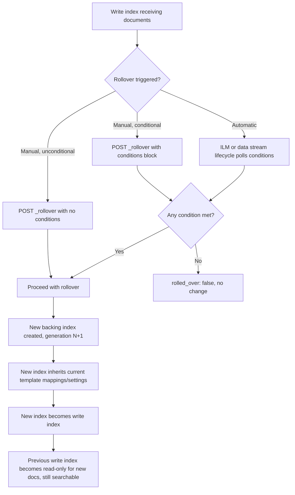

## Rollover with Data Streams

### Overview

Rollover is the mechanism by which a data stream transitions to a new backing index, incrementing the generation and designating the new index as the current write target. It is the core operation that keeps individual backing indices from growing unbounded, and it underpins most time-based retention and tiering strategies built on data streams.

### What Happens During Rollover

When rollover is executed against a data stream:

1. A new backing index is created, following the standard naming pattern with the next generation number (e.g., `000003` → `000004`)
2. The new backing index inherits mappings and settings from the current matching index template at the moment of rollover
3. The new backing index becomes the write index
4. The previously current write index becomes a non-write, read-only-for-new-documents backing index, but remains fully searchable
5. The data stream's metadata (visible via `GET /_data_stream/<name>`) is updated to reflect the new generation count and write index

This all happens atomically from the perspective of the data stream abstraction — indexing requests are not lost or rejected during the transition.

### Manual Rollover

Rollover can be triggered explicitly at any time, with no conditions required:

```json
POST /logs-app-prod/_rollover/
```

This unconditionally creates a new generation. It's useful when:

- A mapping change was just applied to the index template and needs to take effect immediately, rather than waiting for a scheduled condition
- An operational issue (e.g., a problematic write index) needs to be worked around by forcing a fresh index
- Testing or demonstrating rollover behavior in a non-production environment

### Conditional Rollover

Rollover can be issued with conditions; the new index is only created if at least one specified condition is currently met by the existing write index.

```json
POST /logs-app-prod/_rollover/
{
  "conditions": {
    "max_age": "7d",
    "max_docs": 50000000,
    "max_primary_shard_size": "50gb",
    "max_size": "100gb"
  }
}
```

| Condition | Meaning |
| --- | --- |
| `max_age` | Time elapsed since the write index was created |
| `max_docs` | Number of documents indexed into the write index (not counting deletes) |
| `max_size` | Total size of the write index (primaries + replicas) |
| `max_primary_shard_size` | Size of the largest primary shard in the write index |
| `max_primary_shard_docs` | Document count of the largest primary shard [Unverified — availability may depend on version] |

If **any** specified condition is satisfied, rollover proceeds. If none are met, the response returns `"rolled_over": false` and no new index is created — this makes conditional rollover safe to call repeatedly (e.g., on a schedule) without unwanted side effects.

```json
{
  "acknowledged": true,
  "shards_acknowledged": true,
  "old_index": ".ds-logs-app-prod-000003",
  "new_index": ".ds-logs-app-prod-000004",
  "rolled_over": true,
  "dry_run": false,
  "conditions": {
    "[max_age: 7d]": true,
    "[max_docs: 50000000]": false
  }
}
```

### Automatic Rollover via ILM

In production, rollover is most commonly automated through an ILM policy attached to the index template's settings, rather than invoked manually or via external scheduling.

```json
PUT /_ilm/policy/logs-ilm-policy
{
  "policy": {
    "phases": {
      "hot": {
        "actions": {
          "rollover": {
            "max_age": "7d",
            "max_primary_shard_size": "50gb"
          }
        }
      },
      "delete": {
        "min_age": "30d",
        "actions": {
          "delete": {}
        }
      }
    }
  }
}
```

The policy is then referenced in the index settings (typically via a component template):

```json
PUT /_component_template/logs-settings
{
  "template": {
    "settings": {
      "index.lifecycle.name": "logs-ilm-policy"
    }
  }
}
```

ILM periodically evaluates the rollover conditions in the background (on a poll interval, default typically every 10 minutes, configurable via `indices.lifecycle.poll_interval` [Unverified — default value should be confirmed against the deployed version]) and triggers rollover automatically once a condition is satisfied.

### Automatic Rollover via Data Stream Lifecycle

The newer, simplified data stream lifecycle also supports automatic rollover behavior as part of its retention model, without requiring a full ILM policy to be authored. Its rollover behavior is more opinionated and less configurable than ILM's, trading flexibility for simpler setup [Unverified — exact default thresholds and configurability vary by version; consult current documentation for the deployed version].

### Rollover and Alias-Style Targeting Considerations

Because the data stream name remains constant across rollovers, applications and dashboards referencing `logs-app-prod` require no changes when rollover occurs — this is the primary operational benefit over manually managed index-per-period patterns, where alias repointing had to be scripted separately.

### Dry Run

Rollover conditions can be checked without actually performing the rollover, useful for monitoring/alerting on "rollover is about to happen" without triggering it.

```json
POST /logs-app-prod/_rollover/?dry_run
{
  "conditions": {
    "max_age": "7d"
  }
}
```

### Lazy Rollover

A **lazy rollover** marks a data stream to roll over on the *next* indexing request, rather than immediately, which avoids creating an empty backing index generation in low/no-traffic periods. This is used internally by some automated mapping-update workflows, and can be requested explicitly:

```json
POST /logs-app-prod/_rollover/?lazy
```

[Unverified — exact trigger semantics and availability should be confirmed against the deployed version, as this is a more recently introduced feature.]

### Common Pitfalls

- Assuming conditional rollover fails or errors when no condition is met — it does not error, it simply reports `"rolled_over": false"`
- Forgetting that a new backing index only picks up mapping/setting changes made to the template **before** rollover — updating a template after rollover has no retroactive effect on already-created generations
- Relying solely on `max_size`/`max_age` without `max_primary_shard_size`, which can lead to oversized individual shards even when total index size conditions seem reasonable
- Setting an ILM poll interval too long for the desired rollover precision, causing rollover to lag behind the configured `max_age`/`max_docs` thresholds by up to one poll cycle

### Diagram: Rollover Decision Flow



**Related Topics**

- Index Lifecycle Management (ILM) phases and the `delete` phase
- Backing indices — naming, hidden behavior, direct operations
- Data stream lifecycle (built-in) vs. full ILM policies
- Index templates and component template priority
- Monitoring rollover cadence via data stream stats/health APIs
- Time series data streams (TSDS) and shard sizing best practices