## Anomaly Detection Jobs

### Overview

Anomaly detection is a machine learning feature that automatically models the normal behavior of time series data and flags statistically unusual deviations from that learned baseline. Rather than requiring hand-written threshold rules, an anomaly detection job continuously learns what "normal" looks like for a given metric or set of metrics and scores incoming data by how much it deviates from the expected pattern.

### Core Concepts

- **Job** — the configured unit of work that defines what data to analyze, how to analyze it, and where results are stored
- **Datafeed** — the component that continuously (or on a schedule) pulls data from a source index/data stream into the job for analysis
- **Bucket** — a fixed time interval (the `bucket_span`) over which the job aggregates and evaluates data for anomalies
- **Detector** — a single analytical function (e.g., `mean`, `count`, `sum`, `rare`) applied to a field, defining what specifically is being modeled
- **Influencer** — a field whose values help attribute *why* an anomaly occurred or *who/what* is most associated with it (e.g., `host.name`, `user.id`)
- **Anomaly score** — a normalized score (0–100) indicating how unusual a given bucket or record is, with higher scores indicating greater statistical rarity

### When to Use Anomaly Detection

- **Infrastructure monitoring** — detecting unusual CPU, memory, latency, or error-rate patterns without manually tuned static thresholds
- **Security use cases** — detecting rare or unusual user/process/network behavior (e.g., unusual login times, rare process execution, atypical data transfer volumes)
- **Business metrics** — detecting unexpected drops or spikes in transaction volume, revenue, or user activity
- **Capacity planning signals** — surfacing gradually developing trends that static thresholds would miss because they shift slowly over time

Anomaly detection is particularly useful where "normal" varies by time of day, day of week, or seasonal pattern, since the models learn these cyclical baselines automatically rather than requiring separate rules per time window.

### Job Types

| Type | Description |
| --- | --- |
| Single metric job | Analyzes one metric with one detector, simplest configuration, typically created via a guided UI wizard |
| Multi-metric job | Analyzes multiple metrics/detectors within one job, can also split analysis by a field (e.g., per host) |
| Population job | Compares the behavior of individual entities against the behavior of the overall population, useful for finding "the one host/user behaving differently from all its peers" |
| Advanced job | Full manual configuration of detectors, influencers, and analysis config, for scenarios not well-served by the guided wizards |

### Creating a Job (API)

```json
PUT /_ml/anomaly_detectors/high-cpu-detector
{
  "analysis_config": {
    "bucket_span": "15m",
    "detectors": [
      {
        "function": "mean",
        "field_name": "cpu.usage",
        "by_field_name": "host.name"
      }
    ],
    "influencers": ["host.name"]
  },
  "data_description": {
    "time_field": "@timestamp"
  }
}
```

- `bucket_span` controls the granularity of analysis — shorter spans detect faster but are noisier; longer spans smooth noise but detect more slowly
- `by_field_name` splits the analysis so a separate model is maintained per distinct value (e.g., one baseline per host, rather than one global baseline across all hosts)

### Creating and Starting a Datafeed

```json
PUT /_ml/datafeeds/datafeed-high-cpu-detector
{
  "job_id": "high-cpu-detector",
  "indices": ["metrics-cpu-*"],
  "query": {
    "match_all": {}
  }
}
```

```json
POST /_ml/datafeeds/datafeed-high-cpu-detector/_start
```

The datafeed can be started with a specific `start` time to begin analyzing historical data immediately, and left running continuously to analyze new data as it arrives.

### Detector Functions

Common detector functions include:

| Function | Detects |
| --- | --- |
| `mean` / `avg` | Unusual average values within a bucket |
| `sum` | Unusual total values within a bucket |
| `count` | Unusual number of events within a bucket |
| `rare` | Values that occur rarely relative to their historical frequency |
| `freq_rare` | Rare combinations of two fields occurring together |
| `min` / `max` | Unusual extreme values |
| `distinct_count` | Unusual cardinality of a field within a bucket |

[Unverified — the full function list and exact naming may have additions/changes across versions; consult current documentation for the deployed version's complete detector function reference.]

### Population Analysis Example

```json
PUT /_ml/anomaly_detectors/unusual-user-activity
{
  "analysis_config": {
    "bucket_span": "1h",
    "detectors": [
      {
        "function": "count",
        "over_field_name": "user.id"
      }
    ]
  },
  "data_description": {
    "time_field": "@timestamp"
  }
}
```

`over_field_name` (as opposed to `by_field_name`) triggers population analysis — each entity's behavior is compared against the distribution of all entities' behavior in the same bucket, rather than against only its own history.

### Retrieving Results

Once a job has processed data, results (buckets, records, influencers) can be queried through dedicated results APIs.

```json
GET /_ml/anomaly_detectors/high-cpu-detector/results/records
{
  "sort": "record_score",
  "desc": true,
  "size": 10
}
```

```json
GET /_ml/anomaly_detectors/high-cpu-detector/results/buckets
{
  "anomaly_score": {
    "min": 75
  }
}
```

Results include `record_score` and `anomaly_score`, which differ in scope — `anomaly_score` is bucket-level (overall unusualness of the time bucket), while `record_score` is specific to an individual anomalous record within that bucket [Unverified — precise scoring relationship/normalization details may vary by version; consult current documentation].

### Forecasting

Anomaly detection jobs can also produce forecasts, projecting the learned model forward in time to predict expected future values and bounds.

```json
POST /_ml/anomaly_detectors/high-cpu-detector/_forecast
{
  "duration": "24h"
}
```

### Job Lifecycle

```json
POST /_ml/anomaly_detectors/high-cpu-detector/_open
POST /_ml/datafeeds/datafeed-high-cpu-detector/_start
POST /_ml/datafeeds/datafeed-high-cpu-detector/_stop
POST /_ml/anomaly_detectors/high-cpu-detector/_close
DELETE /_ml/anomaly_detectors/high-cpu-detector
```

A job must generally be **open** before its datafeed can be started, and a datafeed should be **stopped** before the job is **closed**; closing a job releases its allocated resources while preserving its model state and configuration for later reopening [Unverified — exact required ordering/error behavior should be confirmed against the deployed version].

### Model Memory and Resource Considerations

Each running job consumes memory proportional to the cardinality of its `by_field_name`/`over_field_name`/`partition_field_name` values, since a separate model is maintained per distinct entity. High-cardinality split fields (e.g., a unique session ID per user) can cause excessive memory consumption and are generally discouraged as split fields; lower-cardinality, meaningful grouping fields (host, service, user) are more appropriate.

```json
PUT /_ml/anomaly_detectors/high-cpu-detector
{
  "analysis_limits": {
    "model_memory_limit": "256mb"
  },
  "analysis_config": { "...": "..." }
}
```

### Common Pitfalls

- Choosing a `bucket_span` too short for the natural noise level of the metric, producing excessive false positives
- Splitting on a high-cardinality field (`by_field_name`/`over_field_name`), causing runaway model memory usage
- Starting a datafeed against a data stream/index with insufficient historical data for the model to establish a meaningful baseline, leading to unreliable early results
- Confusing `by_field_name` (per-entity independent modeling) with `over_field_name` (population comparison across entities) — they produce fundamentally different analyses
- Not accounting for known seasonal/cyclical patterns (e.g., weekday vs. weekend traffic) when interpreting early anomaly scores, before the model has observed a full cycle

### Diagram: Anomaly Detection Pipeline

```mermaid
flowchart TD
    A[Source index / data stream] --> B[Datafeed pulls data on interval]
    B --> C[Job analysis_config: detectors, bucket_span, influencers]
    C --> D[Model learns baseline behavior per bucket]
    D --> E{New data deviates from baseline?}
    E -->|Significantly| F[Anomaly record created with anomaly_score / record_score]
    E -->|Within normal range| G[No anomaly recorded]
    F --> H[Results queryable via results/records and results/buckets APIs]
    F --> I[Influencers identify likely contributing entities]
    D --> J[Optional: _forecast projects model forward]
```



**Related Topics**

- Elastic Security use cases for anomaly detection (prebuilt security jobs)
- Alerting on anomaly detection results (Kibana Alerting rules)
- Model memory limits and job resource planning
- Data feeds against data streams vs. standard indices
- Forecasting API and confidence intervals
- Categorization jobs (log message pattern analysis, a related ML feature)