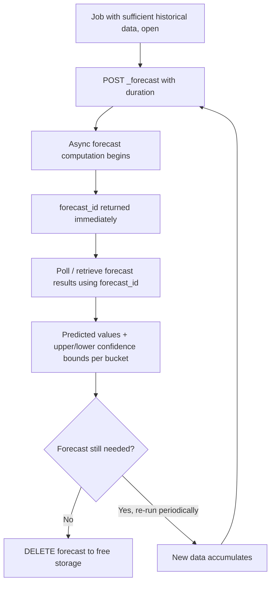

## Forecast API

### Overview

The forecast API projects an anomaly detection job's learned model forward in time, producing predicted future values along with confidence bounds. It builds directly on a job's existing trained model — a job must have already processed a meaningful amount of historical data before a forecast can be considered reliable, since the forecast is only as good as the patterns the model has learned so far.

### Prerequisites

- The job must exist and have processed data (via its datafeed) covering enough history to establish a meaningful baseline, including any relevant seasonal/cyclical patterns (e.g., daily or weekly cycles)
- The job does not need to be actively running a datafeed at the moment the forecast is requested, but it must be **open**
- Forecasting works on the same underlying time series model used for anomaly detection — it is not a separate model type requiring separate configuration

### Running a Forecast

```json
POST /_ml/anomaly_detectors/high-cpu-detector/_forecast
{
  "duration": "24h"
}
```

The response returns a `forecast_id`, which is used to retrieve results once the forecast has finished computing (forecasting is an asynchronous background operation).

```json
{
  "acknowledged": true,
  "forecast_id": "wkdyz7-p2GmA6Ojmr-Jd8w"
}
```

### Forecast Parameters

| Parameter | Purpose |
| --- | --- |
| `duration` | How far into the future to project (e.g., `"24h"`, `"7d"`) |
| `expires_in` | How long the forecast results are retained before being automatically deleted (default typically `"14d"`) [Unverified — exact default should be confirmed against the deployed version] |
| `max_model_memory` | Caps the memory the forecast computation may use, guarding against runaway resource consumption on very long-duration forecasts [Unverified — parameter name/availability may vary by version] |

```json
POST /_ml/anomaly_detectors/high-cpu-detector/_forecast
{
  "duration": "7d",
  "expires_in": "30d"
}
```

### Retrieving Forecast Results

Forecast results are queried through the standard results API, filtered by `forecast_id` and the special result type marking forecast records.

```json
GET /_ml/anomaly_detectors/high-cpu-detector/results/overall_buckets
```

For forecast-specific data specifically (predicted values and bounds), results are typically retrieved via a dedicated forecast results query pattern referencing the `forecast_id` [Unverified — exact API path/parameters for retrieving forecast prediction/bound values specifically should be confirmed against current documentation for the deployed version, as this differs from the general anomaly results endpoints].

### What a Forecast Result Contains

Each forecasted time bucket typically includes:

- A **predicted value** — the model's best estimate for that future point, based on learned trend and seasonal patterns
- **Upper and lower confidence bounds** — the range within which the actual value is expected to fall, with the interval typically widening further into the future as prediction uncertainty increases

This structure mirrors typical time series forecasting output: a central prediction line flanked by a widening confidence interval, useful for capacity planning ("when will disk usage likely exceed capacity") or setting forward-looking expectations.

### Use Cases

- **Capacity planning** — projecting resource usage (disk, memory, request volume) forward to anticipate when thresholds will be reached
- **Setting dynamic future thresholds** — using the forecasted range as a more informed basis for alerting than a static threshold
- **Validating model quality** — comparing a forecast against subsequently observed actual data as a sanity check on how well the model has learned the underlying pattern
- **Communicating expected trends** — providing stakeholders with a projected trajectory rather than only historical anomaly scores

### Forecast Accuracy Considerations

Forecast reliability depends heavily on:

- **Amount of historical data observed** — a model that has only seen a few days of data cannot reliably project weekly seasonality it hasn't yet observed a full cycle of
- **Stability of the underlying pattern** — forecasts assume the future will resemble learned historical patterns; a genuine regime change (e.g., a service migration, a marketing campaign driving new traffic patterns) will not be anticipated by the model
- **Forecast horizon length** — shorter-duration forecasts are generally more reliable than long-duration ones, since uncertainty compounds further into the future
- **Bucket span granularity** — the same considerations that affect anomaly detection sensitivity (via `bucket_span`) also affect the granularity and stability of forecasted values

Forecasts should not be treated as guarantees, since they are statistical projections based on historical pattern continuation rather than predictions accounting for external events the model has no visibility into.

### Deleting Forecasts

Since forecasts consume storage and are typically only relevant for a limited window, they can be deleted explicitly, in addition to the automatic expiration governed by `expires_in`.

```json
DELETE /_ml/anomaly_detectors/high-cpu-detector/_forecast/wkdyz7-p2GmA6Ojmr-Jd8w
```

A specific forecast ID can be targeted, or `_all` can be used to remove every forecast associated with a job.

```json
DELETE /_ml/anomaly_detectors/high-cpu-detector/_forecast/_all
```

### Example: Capacity Planning Workflow

1. An anomaly detection job has been running against disk usage metrics for several weeks, with a `by_field_name` split on `host.name`
2. A forecast is requested with `duration: "30d"` for a specific host of interest
3. The forecasted upper bound is compared against the host's known disk capacity
4. If the forecasted upper bound crosses capacity within the forecast window, this signals a need for capacity intervention before the projected date
5. The forecast is periodically re-run as more actual data accumulates, refining the projection over time



### Common Pitfalls

- Requesting a forecast from a job that hasn't yet observed enough history to capture relevant seasonal patterns, producing an unreliable projection
- Treating forecast bounds as hard guarantees rather than statistical confidence intervals based on historical pattern continuation
- Requesting excessively long forecast durations, where compounding uncertainty makes the far end of the projection of limited practical use
- Forgetting forecasts consume storage and not relying on `expires_in`/manual deletion, allowing stale forecasts to accumulate
- Not accounting for known future changes (planned migrations, seasonal business events) that the model has no way to anticipate from historical data alone

### Diagram: Forecast Confidence Interval

<svg xmlns="http://www.w3.org/2000/svg" viewBox="0 0 740 300">
\<style\>
.title { font: bold 14px sans-serif; fill: #1a1a1a; }
.label { font: 12px sans-serif; fill: #1a1a1a; }
.sub { font: 11px sans-serif; fill: #555; }
.histLine { stroke: #4a6fa5; stroke-width: 2; fill: none; }
.predLine { stroke: #a54a4a; stroke-width: 2; stroke-dasharray: 5,3; fill: none; }
.boundArea { fill: #fbeeee; opacity: 0.6; }
\</style\>

<text x="20" y="25" class="title">Forecast: Prediction with Widening Confidence Bounds (svg_diagram)</text>

<line x1="50" y1="250" x2="700" y2="250" stroke="#999" stroke-width="1" />
<line x1="50" y1="50" x2="50" y2="250" stroke="#999" stroke-width="1" />
<line x1="380" y1="50" x2="380" y2="250" stroke="#888" stroke-width="1" stroke-dasharray="3,3" />
<text x="385" y="45" class="sub">now</text>
<path d="M 50 200 L 120 190 L 190 195 L 260 175 L 330 180 L 380 170" class="histLine" />
<text x="60" y="215" class="sub">historical actuals</text>
<path d="M 380 170 L 450 160 L 520 150 L 590 140 L 660 130" class="predLine" />

<polygon points="380,170 450,140 520,115 590,90 660,65 660,195 590,190 520,185 450,175 380,170" class="boundArea" />

<text x="500" y="55" class="sub">upper bound</text>

<text x="500" y="235" class="sub">lower bound</text>

<text x="470" y="130" class="label" fill="`#a54a4a`">predicted value</text>

<text x="30" y="280" class="sub">Confidence interval widens further into the forecast horizon as uncertainty compounds</text>

</svg>

**Related Topics**

- Anomaly detection jobs — model training and bucket_span fundamentals
- Population analysis and single/multi-metric jobs as forecast sources
- Alerting on capacity-planning thresholds derived from forecast bounds
- Datafeed configuration for ensuring sufficient historical data coverage
- Model memory limits affecting long-duration forecast computation
- Overall buckets API for aggregate job health monitoring