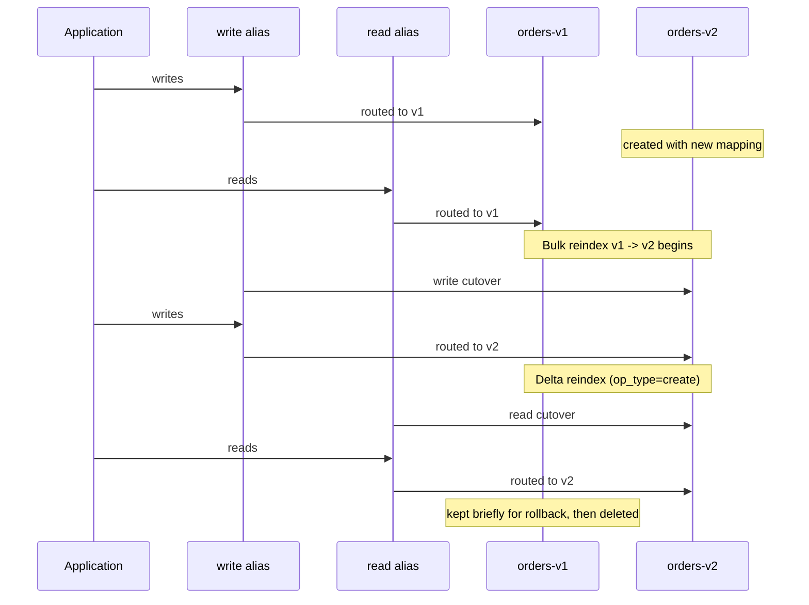

## Zero-Downtime Reindexing

### Overview

Zero-downtime reindexing is the practice of restructuring an Elasticsearch index — changing mappings, settings, shard counts, or analyzers — without interrupting application reads or writes. Since most structural changes to an index (field type changes, analyzer changes, shard count) cannot be applied in place to an existing index, the standard approach is to create a new index with the desired structure, copy data into it, and redirect traffic using aliases, all while the old index continues serving requests until the new one is ready.

This topic builds directly on the write/read alias pattern and the Reindex API, combining them into a complete operational workflow.

### Why In-Place Changes Are Not Possible

Elasticsearch intentionally disallows certain changes to an existing index because Lucene segments are immutable once written:

- **Field type changes**: Changing a field from `text` to `keyword`, or `integer` to `long`, is rejected by the mapping update API once the field exists with conflicting data
- **Shard count changes**: The number of primary shards is fixed at index creation time (`_split` and `_shrink` exist but only support specific multiplication/division factors, and are not general-purpose remapping tools)
- **Analyzer changes**: Changing an analyzer does not retroactively reanalyze already-indexed text; existing inverted indices remain built with the old analysis chain

Any of these requires a new index with the corrected settings/mappings, plus reindexing existing documents into it.

### The Core Workflow

**Step 1 — Create the new index with corrected structure**

```json
PUT /orders-v2
{
  "settings": {
    "number_of_shards": 3
  },
  "mappings": {
    "properties": {
      "order_id": { "type": "keyword" },
      "amount": { "type": "scaled_float", "scaling_factor": 100 }
    }
  }
}
```

**Step 2 — Bulk reindex existing data**

```json
POST /_reindex
{
  "source": { "index": "orders-v1" },
  "dest": { "index": "orders-v2" }
}
```

For large indices, this should run with slicing to parallelize and reduce total duration:

```json
POST /_reindex?slices=5&wait_for_completion=false
{
  "source": { "index": "orders-v1" },
  "dest": { "index": "orders-v2" }
}
```

Setting `wait_for_completion=false` returns a task ID immediately; progress is polled via:

```json
GET /_tasks/<task_id>
```

**Step 3 — Capture the delta**

Because the bulk reindex takes time, documents written to `orders-v1` after the reindex started are not included in the initial copy. A second, narrower reindex captures this gap, filtered by a timestamp captured just before Step 2 began:

```json
POST /_reindex
{
  "source": {
    "index": "orders-v1",
    "query": {
      "range": {
        "updated_at": { "gte": "2026-08-25T10:00:00Z" }
      }
    }
  },
  "dest": { "index": "orders-v2" }
}
```

This delta step may need to run more than once if writes continue to trickle in during the delta reindex itself, converging as the window narrows.

**Step 4 — Atomically switch aliases**

```json
POST /_aliases
{
  "actions": [
    { "remove": { "index": "orders-v1", "alias": "orders" } },
    { "add": { "index": "orders-v2", "alias": "orders", "is_write_index": true } }
  ]
}
```

If application traffic already targets an alias (as it should, per standard practice) rather than the concrete index name, this switch is instantaneous and invisible to clients.

**Step 5 — Verify and decommission**

Only after confirming the new index serves correct results should `orders-v1` be deleted or archived. Keeping it briefly provides a rollback path.

**Key Points**

- This entire workflow depends on applications never hardcoding a concrete index name — if they do, zero-downtime reindexing is not achievable without an application deployment alongside the index change
- The delta-reindex step is the most commonly skipped step, and its omission is the most common source of silent data loss during migrations
- `_reindex` runs as a server-side operation; it does not require pulling documents to the client and pushing them back

### Handling the Write-Cutover Race Condition

A more precise approach avoids relying purely on timestamp-based deltas, which can miss documents if clock skew or update timing is imprecise. This tightens the gap to near-zero:

1. Point the **write alias only** to `orders-v2` first (writes now go to the new index)
2. Run the bulk reindex from `orders-v1` into `orders-v2`, filtered to exclude anything already newer in `orders-v2` (using `op_type: create` semantics or a version-based conflict policy so newer documents in the destination are not overwritten by older source documents)
3. Once reindex completes, point the **read alias** to `orders-v2`

```json
POST /_reindex
{
  "conflicts": "proceed",
  "source": { "index": "orders-v1" },
  "dest": {
    "index": "orders-v2",
    "op_type": "create"
  }
}
```

With `op_type: create`, any document ID already present in `orders-v2` (because it was written there post-cutover) is skipped rather than overwritten, and `conflicts: proceed` ensures the overall reindex job continues past those version conflicts instead of aborting.

**Key Points**

- This ordering (write cutover before read cutover) trades a brief period of read staleness (queries against the old alias miss the newest writes) for avoiding overwrite conflicts, which is usually the safer tradeoff for most applications
- Document IDs must be deterministic/preserved (not auto-generated per reindex run) for the `op_type: create` conflict-skipping to work correctly

### Using the Reindex API with a Script

Reindexing is also the standard mechanism for transforming data during migration, not just copying it structurally unchanged:

```json
POST /_reindex
{
  "source": { "index": "orders-v1" },
  "dest": { "index": "orders-v2" },
  "script": {
    "source": "ctx._source.amount_cents = (int)(ctx._source.amount * 100); ctx._source.remove('amount')",
    "lang": "painless"
  }
}
```

This is commonly used alongside field renames, unit conversions, or restructuring nested objects to match a new mapping.

### Throttling Reindex Load

Large reindex operations can saturate cluster resources and degrade concurrent query/indexing performance. The `requests_per_second` parameter throttles the operation:

```json
POST /_reindex?requests_per_second=1000
{
  "source": { "index": "orders-v1" },
  "dest": { "index": "orders-v2" }
}
```

This caps throughput rather than running at full speed, trading migration duration for reduced cluster impact during business hours [Inference — the specific throughput number appropriate for a given cluster depends on hardware, concurrent load, and shard count, and generally needs tuning per environment rather than reused as a fixed value].

### Reindex Timeline



### Common Pitfalls

- **Reindexing without slicing on large indices**: A single-threaded `_reindex` on a multi-hundred-million-document index can take hours; `slices` (or `slices: "auto"`) parallelizes based on shard count
- **Not monitoring task progress**: With `wait_for_completion=false`, forgetting to poll `_tasks` means failures or stalls go unnoticed until something else surfaces the problem
- **Mismatched refresh behavior**: The destination index's `refresh_interval` should typically be disabled (`-1`) during bulk reindex and restored afterward, since frequent refreshes during heavy bulk indexing add unnecessary overhead
- **Ignoring version conflicts silently**: Default reindex behavior aborts on version conflicts; `conflicts: proceed` must be an intentional choice, not a blanket habit, since it can mask genuine data integrity problems in some conflict scenarios
- **Reusing auto-generated IDs**: If source documents rely on auto-generated `_id` values, reindexing will assign new IDs unless the original ID is explicitly preserved, breaking the `op_type: create` conflict-detection trick above and any external references to the old document ID

### Conclusion

Zero-downtime reindexing combines the Reindex API, careful ordering of write/read alias cutovers, and delta capture to move data into a newly structured index without application-visible interruption. The technique is foundational to evolving mappings, changing shard counts, and correcting analyzer choices in a running Elasticsearch cluster, and it depends entirely on applications addressing data through aliases rather than concrete index names.

**Related Topics**

- Reindex API scripting for data transformation during migration
- Task Management API for monitoring long-running operations
- `_split` and `_shrink` APIs as alternatives for shard-count-only changes
- Ingest pipelines as an alternative transformation point during reindex
- Refresh interval tuning during bulk indexing operations
- Version conflict resolution strategies (`proceed` vs `abort`)