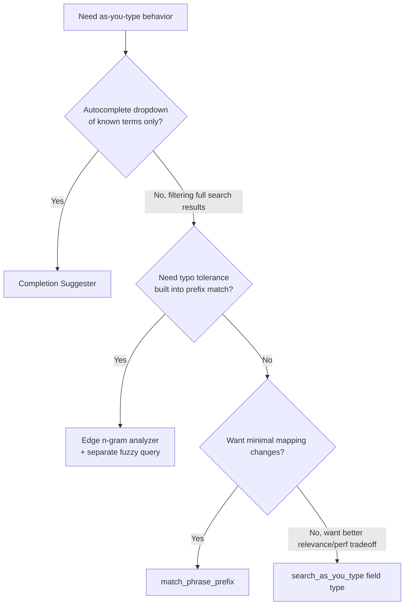

## Search-As-You-Type Pattern

### Overview

Search-as-you-type is a UX pattern where query results update as a user types, before they finish entering a full search term. Elasticsearch supports several distinct implementation strategies for this — each with different tradeoffs in latency, relevance, index size, and typo tolerance — rather than a single canonical approach. Choosing among them depends on whether the priority is prefix matching, fuzzy/typo-tolerant matching, or completion-style suggestion dropdowns.

### The Four Main Approaches

1. **`search_as_you_type` field type** — purpose-built field type generating edge n-gram subfields automatically
2. **`match_phrase_prefix` query** — prefix matching on the last term of a phrase, no special mapping required
3. **Completion suggester** — a dedicated, extremely fast in-memory structure for autocomplete dropdowns
4. **Edge n-gram custom analyzer** — manual, fully customizable n-gram tokenization for prefix matching

Each is covered in turn.

### Approach 1: `search_as_you_type` Field Type

This field type is designed specifically for this use case. It automatically creates several subfields at different n-gram granularities behind the scenes.

**Mapping**

```json
PUT /products
{
  "mappings": {
    "properties": {
      "name": {
        "type": "search_as_you_type"
      }
    }
  }
}
```

This single field declaration implicitly creates:

- `name` — the root field, indexed with standard analysis
- `name._2gram` — shingled at 2-word groupings
- `name._3gram` — shingled at 3-word groupings
- `name._index_prefix` — edge n-gram indexed for prefix matching

**Query**

```json
GET /products/_search
{
  "query": {
    "multi_match": {
      "query": "wireless keyb",
      "type": "bool_prefix",
      "fields": [
        "name",
        "name._2gram",
        "name._3gram"
      ]
    }
  }
}
```

The `bool_prefix` query type treats all terms except the last as exact matches and the last term as a prefix match, which is exactly the behavior needed for as-you-type: the user has finished typing earlier words but is still mid-word on the most recent one.

**Key Points**

- No custom analyzer configuration is required; the field type handles n-gram generation internally
- Matching across `name`, `name._2gram`, and `name._3gram` together improves relevance scoring by rewarding documents that match longer contiguous spans, not just the prefix alone
- Storage overhead is higher than a plain `text` field, since multiple subfield representations of the same content are indexed

### Approach 2: `match_phrase_prefix` Query

For cases where a dedicated field type is unnecessary or the field is already a standard `text` field, `match_phrase_prefix` performs prefix matching on the last term without special mapping:

```json
GET /products/_search
{
  "query": {
    "match_phrase_prefix": {
      "name": "wireless keyb"
    }
  }
}
```

**Key Points**

- Works against any existing `text` field with no mapping changes
- Less performant at scale than `search_as_you_type`, since prefix expansion happens at query time against the term dictionary rather than being pre-computed at index time
- The `max_expansions` parameter caps how many term variations are considered, bounding worst-case query cost:

```json
GET /products/_search
{
  "query": {
    "match_phrase_prefix": {
      "name": {
        "query": "wireless keyb",
        "max_expansions": 50
      }
    }
  }
}
```

### Approach 3: Completion Suggester

The completion suggester is a distinct mechanism entirely, optimized for the classic "autocomplete dropdown" UX rather than full search-result filtering. It uses an in-memory finite state transducer (FST) structure, making it extremely fast but limited in flexibility.

**Mapping**

```json
PUT /products
{
  "mappings": {
    "properties": {
      "suggest": {
        "type": "completion"
      }
    }
  }
}
```

**Indexing**

```json
POST /products/_doc
{
  "name": "Wireless Keyboard",
  "suggest": {
    "input": ["Wireless Keyboard", "Bluetooth Keyboard", "Keyboard Wireless"]
  }
}
```

Multiple `input` variants can be supplied per document to support different phrasings a user might type.

**Query**

```json
POST /products/_search
{
  "suggest": {
    "product-suggest": {
      "prefix": "wireless keyb",
      "completion": {
        "field": "suggest",
        "size": 5
      }
    }
  }
}
```

**Key Points**

- Matches only from the beginning of the input string by default — this is a prefix-anchored structure, not general substring or fuzzy search
- Fuzzy matching is supported as an option (`"fuzzy": { "fuzziness": "AUTO" }`), tolerating minor typos while remaining fast
- Because it is FST-based and held largely in memory, it is significantly faster than `search_as_you_type` or `match_phrase_prefix` for pure autocomplete-dropdown latency, at the cost of relevance flexibility (no standard scoring/boosting the way a normal query supports)
- Best suited for suggesting complete terms (product names, place names, tags) rather than filtering a full result set

### Approach 4: Custom Edge N-Gram Analyzer

For maximum control — e.g., matching mid-word rather than only from the start of a term, or tuning n-gram size precisely — a custom analyzer can be built manually.

```json
PUT /products
{
  "settings": {
    "analysis": {
      "analyzer": {
        "autocomplete_analyzer": {
          "type": "custom",
          "tokenizer": "autocomplete_tokenizer",
          "filter": ["lowercase"]
        },
        "autocomplete_search_analyzer": {
          "type": "custom",
          "tokenizer": "lowercase"
        }
      },
      "tokenizer": {
        "autocomplete_tokenizer": {
          "type": "edge_ngram",
          "min_gram": 2,
          "max_gram": 15,
          "token_chars": ["letter", "digit"]
        }
      }
    }
  },
  "mappings": {
    "properties": {
      "name": {
        "type": "text",
        "analyzer": "autocomplete_analyzer",
        "search_analyzer": "autocomplete_search_analyzer"
      }
    }
  }
}
```

The critical detail here is using **different analyzers at index time and search time**. At index time, `wireless` is broken into `wi`, `wir`, `wire`, `wirel`, and so on (up to `max_gram`). At search time, the query itself should not be n-grammed the same way — it should be analyzed as a whole term (via the plain `lowercase` tokenizer) and matched against the pre-computed index-time n-grams:

```json
GET /products/_search
{
  "query": {
    "match": {
      "name": "wirel"
    }
  }
}
```

**Key Points**

- Using the same analyzer for both index and search would n-gram the search query too, causing it to match against fragments of unrelated words and severely hurting precision — this is the single most common misconfiguration of this approach
- `max_gram` should be tuned to the realistic maximum prefix length users are expected to search with; setting it too high inflates index size for marginal benefit
- This approach indexes far more terms per document than a standard field, meaningfully increasing index size, since every prefix length between `min_gram` and `max_gram` becomes a separate indexed token

### Choosing an Approach

$$\text{Relevance flexibility: } \text{search\_as\_you\_type} \approx \text{edge n-gram} > \text{match\_phrase\_prefix} > \text{completion suggester}$$


$$\text{Query latency at scale: } \text{completion suggester} > \text{search\_as\_you\_type} \approx \text{edge n-gram} > \text{match\_phrase\_prefix}$$

| Approach | Best for | Typo tolerance | Setup complexity |
| --- | --- | --- | --- |
| `search_as_you_type` | General as-you-type search over text fields | No (unless combined with fuzzy query separately) | Low |
| `match_phrase_prefix` | Ad hoc, no mapping changes desired | No | Lowest |
| Completion suggester | Fast autocomplete dropdown of known terms | Yes (optional fuzzy mode) | Medium |
| Edge n-gram analyzer | Fine-grained control, mid-word matching | No | High |

### Combining Completion Suggester with Fuzzy Matching

```json
POST /products/_search
{
  "suggest": {
    "product-suggest": {
      "prefix": "wireles keyb",
      "completion": {
        "field": "suggest",
        "fuzzy": {
          "fuzziness": "AUTO"
        },
        "size": 5
      }
    }
  }
}
```

This tolerates the missing "s" in "wireles," matching "Wireless Keyboard" despite the typo — something `search_as_you_type` and edge n-gram approaches do not handle natively without pairing with a separate fuzzy query.

### Search-As-You-Type Decision Flow



### Common Pitfalls

- **Using the same analyzer for index and search with edge n-grams**: causes fragment-to-fragment matching and destroys precision, as noted above
- **Expecting completion suggester to do general full-text search**: it is prefix-anchored and FST-based, not a general relevance-scored query mechanism; using it for anything beyond autocomplete dropdowns produces poor results
- **Not bounding `max_expansions` on `match_phrase_prefix`**: on large term dictionaries, unbounded prefix expansion can become a meaningful latency cost under load
- **Ignoring index size growth**: both `search_as_you_type` and edge n-gram approaches multiply the number of indexed tokens significantly compared to standard text fields; this should be accounted for in capacity planning, particularly on large text corpora

### Conclusion

Search-as-you-type is not a single feature in Elasticsearch but a family of techniques, each suited to a different point in the tradeoff space between relevance quality, typo tolerance, query latency, and index size. The `search_as_you_type` field type is the most broadly applicable default for filtering full result sets as users type, while the completion suggester remains the standard choice for classic autocomplete dropdowns where raw speed matters most.

**Related Topics**

- Fuzzy query and edit-distance-based typo tolerance
- N-gram vs edge n-gram tokenizer differences
- Custom analyzers and analysis chain design
- Relevance tuning with `multi_match` types (`best_fields`, `bool_prefix`, `phrase`)
- Context suggester for category-scoped autocomplete
- Index size and storage optimization strategies