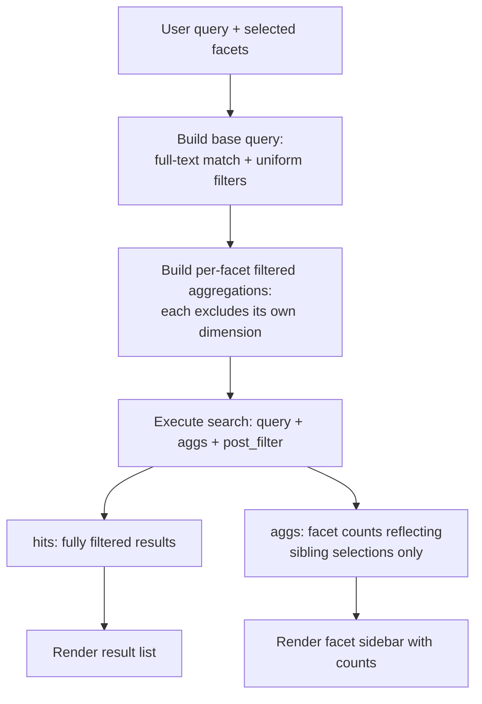

## Faceted Search Design

### Overview

Faceted search is a UI/UX and query pattern where users refine a result set by selecting values from category breakdowns — price ranges, brands, tags, ratings — displayed alongside search results, with counts showing how many matching documents fall into each facet value. In Elasticsearch, facets are implemented through the aggregations framework, typically combined with `post_filter` to allow facet counts to reflect selections independently of one another.

This pattern is foundational to e-commerce, content catalogs, and any interface presenting a filterable, browsable result set.

### Core Building Blocks

Faceted search combines three Elasticsearch mechanisms:

1. **Aggregations** — compute counts/statistics per facet value
2. **`post_filter`** — apply user-selected filters to results without affecting sibling facet counts
3. **Filter context queries** — apply filters that should affect both results and all facet counts uniformly

Understanding when to use each is the core design decision in faceted search.

### Basic Facet Aggregation

```json
GET /products/_search
{
  "size": 20,
  "query": {
    "match": { "name": "laptop" }
  },
  "aggs": {
    "brands": {
      "terms": { "field": "brand.keyword", "size": 10 }
    },
    "price_ranges": {
      "range": {
        "field": "price",
        "ranges": [
          { "to": 500 },
          { "from": 500, "to": 1000 },
          { "from": 1000 }
        ]
      }
    },
    "avg_rating": {
      "terms": { "field": "rating", "size": 5 }
    }
  }
}
```

This returns both matching documents (`hits`) and, in `aggregations`, counts of how many results fall into each brand, price range, and rating bucket — the raw data that populates a faceted sidebar.

### The Core Problem: Facet Counts Must Not Collapse When a Facet Is Selected

If a user selects "Brand: Acme" as a filter, naively adding that filter into the main `query` clause causes the brand facet's *own* aggregation to only show "Acme" (with all other brands at zero), since the aggregation only ever sees documents that already passed the query. This defeats the purpose of faceted search, where a user should still see "Brand: Globex (12)" as a selectable *other* option even after filtering to Acme.

The standard solution is `post_filter`.

### Using `post_filter` for Independent Facets

```json
GET /products/_search
{
  "query": {
    "match": { "name": "laptop" }
  },
  "post_filter": {
    "term": { "brand.keyword": "Acme" }
  },
  "aggs": {
    "brands": {
      "terms": { "field": "brand.keyword", "size": 10 }
    }
  }
}
```

`post_filter` is applied **after** aggregations are computed but **before** the final `hits` are returned. This means:

- `hits` only contains Acme products (post_filter applied)
- The `brands` aggregation still reflects counts across *all* brands matching "laptop," unaffected by the Acme selection

This is the single most important mechanism in faceted search design, and its absence is the most common structural mistake in naive implementations.

### Multi-Facet Selection: The Filtered Aggregation Pattern

The single `post_filter` above works for one active facet. Once a user selects multiple facets simultaneously (Brand: Acme AND Price: $500–1000), each facet's aggregation needs to reflect the *other* selected facets but exclude its *own* selection — otherwise selecting a price range would zero out all price range counts except the selected one.

This requires wrapping each aggregation in a `filter` aggregation that applies every selected filter **except** the one matching that facet's own dimension:

```json
GET /products/_search
{
  "query": {
    "bool": {
      "must": [{ "match": { "name": "laptop" } }],
      "filter": [
        { "term": { "brand.keyword": "Acme" } },
        { "range": { "price": { "gte": 500, "lte": 1000 } } }
      ]
    }
  },
  "post_filter": {
    "bool": {
      "filter": [
        { "term": { "brand.keyword": "Acme" } },
        { "range": { "price": { "gte": 500, "lte": 1000 } } }
      ]
    }
  },
  "aggs": {
    "brands_filtered": {
      "filter": {
        "bool": {
          "filter": [
            { "range": { "price": { "gte": 500, "lte": 1000 } } }
          ]
        }
      },
      "aggs": {
        "brands": {
          "terms": { "field": "brand.keyword", "size": 10 }
        }
      }
    },
    "price_filtered": {
      "filter": {
        "bool": {
          "filter": [
            { "term": { "brand.keyword": "Acme" } }
          ]
        }
      },
      "aggs": {
        "price_ranges": {
          "range": {
            "field": "price",
            "ranges": [
              { "to": 500 },
              { "from": 500, "to": 1000 },
              { "from": 1000 }
            ]
          }
        }
      }
    }
  }
}
```

Here, `brands_filtered` applies the price filter (but not the brand filter) before computing brand counts, so selecting Acme doesn't hide other brands, while still respecting the active price constraint. `price_filtered` mirrors this in reverse.

**Key Points**

- This pattern generalizes: for $n$ active facets, each facet's aggregation is filtered by the other $n-1$ selections, not by its own
- The top-level `query`/`post_filter` still applies all $n$ selections, so returned `hits` reflect every active constraint
- This adds meaningful query complexity as the number of facets grows, and is the primary reason faceted search backends are often built with a dedicated query-construction layer rather than hand-written per request

### `post_filter` vs Filtering in `query`

| Use `query` (filter context) when... | Use `post_filter` when... |
| --- | --- |
| The filter should affect facet counts too | The filter is a user's facet *selection* and sibling counts must stay independent |
| It's a baseline constraint (e.g., `in_stock: true`) applied uniformly | It's one of potentially several simultaneously toggled facet values |

A baseline constraint like "only show in-stock items" typically belongs in `query`/filter context, since it's not something users toggle per-facet — it should reduce both results and all facet counts uniformly.

### Handling Range and Histogram Facets

Numeric facets (price, ratings) often use `range` or `histogram` aggregations rather than `terms`:

```json
"aggs": {
  "price_histogram": {
    "histogram": {
      "field": "price",
      "interval": 100
    }
  }
}
```

`histogram` produces evenly spaced buckets automatically, useful for exploratory price distribution UIs, while explicit `range` aggregations are better when the UI presents fixed, named buckets ("Under $500," "$500–$1000").

### Nested and Multi-Value Facets

When a facet field is multi-valued (e.g., a product with multiple `tags`), `terms` aggregations naturally handle this — each document contributes to every bucket matching any of its tag values. No special configuration is needed beyond ensuring the field is mapped as `keyword` (or a multi-field with a `.keyword` subfield) so aggregation works on exact values rather than analyzed tokens.

```json
{
  "mappings": {
    "properties": {
      "tags": { "type": "keyword" }
    }
  }
}
```

**Key Points**

- Running `terms` aggregations against an analyzed `text` field produces one bucket per token, not per original value — almost never the desired facet behavior
- `keyword` fields (or `.keyword` multi-fields on otherwise-`text` mappings) are the standard mapping choice for any field intended to power a facet

### Facet Ordering and `size` Considerations

The `terms` aggregation's `size` parameter caps how many buckets are returned, but on high-cardinality fields (e.g., thousands of distinct brands), this introduces a known accuracy tradeoff: `terms` aggregation counts are approximate across sharded data unless every shard's full term set is considered, since each shard independently returns its own top-N candidates before final merging [Unverified — this document-count-accuracy caveat is version- and configuration-dependent; the `shard_size` parameter mitigates it and should be tuned relative to `size` when facet counts must be exact on high-cardinality fields].

```json
"aggs": {
  "brands": {
    "terms": {
      "field": "brand.keyword",
      "size": 10,
      "shard_size": 100
    }
  }
}
```

Setting `shard_size` larger than `size` reduces (though does not always eliminate) the risk of undercounting, at some additional per-shard computational cost.

### Faceted Search Query Flow



### Common Pitfalls

- **Filtering facets in `query` instead of `post_filter`**: collapses sibling facet counts to zero once any facet is selected, breaking the core UX expectation of faceted search
- **Aggregating on analyzed `text` fields**: produces per-token buckets rather than per-value buckets, yielding nonsensical facet labels
- **Ignoring `shard_size` on high-cardinality terms aggregations**: can produce subtly inaccurate counts that are difficult to notice until data grows or shard count changes
- **Applying every filter uniformly via `query`**: works fine for single-facet UIs but breaks the "show me other options" expectation the moment a UI supports multiple simultaneous facet selections
- **Recomputing full filtered aggregations for every facet on every request without caching**: is computationally reasonable at moderate scale but can become a meaningful cost driver on very large indices with many facets and high query volume, worth monitoring as catalogs grow

### Conclusion

Faceted search in Elasticsearch is built from aggregations, but its correctness hinges on carefully separating which filters affect which counts — uniform baseline filters go in `query`, user-toggled facet selections go in `post_filter`, and multi-facet interfaces require per-facet filtered aggregations that exclude their own dimension. Getting this structure right is what makes a faceted UI behave the way users expect: narrowing results while still showing what other options remain available.

**Related Topics**

- `post_filter` mechanics and execution order relative to aggregations
- Sub-aggregations and nested bucket aggregations
- `terms` aggregation accuracy: `shard_size` and doc_count_error_upper_bound
- Multi-field mappings (`text` + `.keyword`) for dual-purpose search and faceting
- Aggregation performance and caching strategies at scale
- Range vs histogram aggregation selection for numeric facets