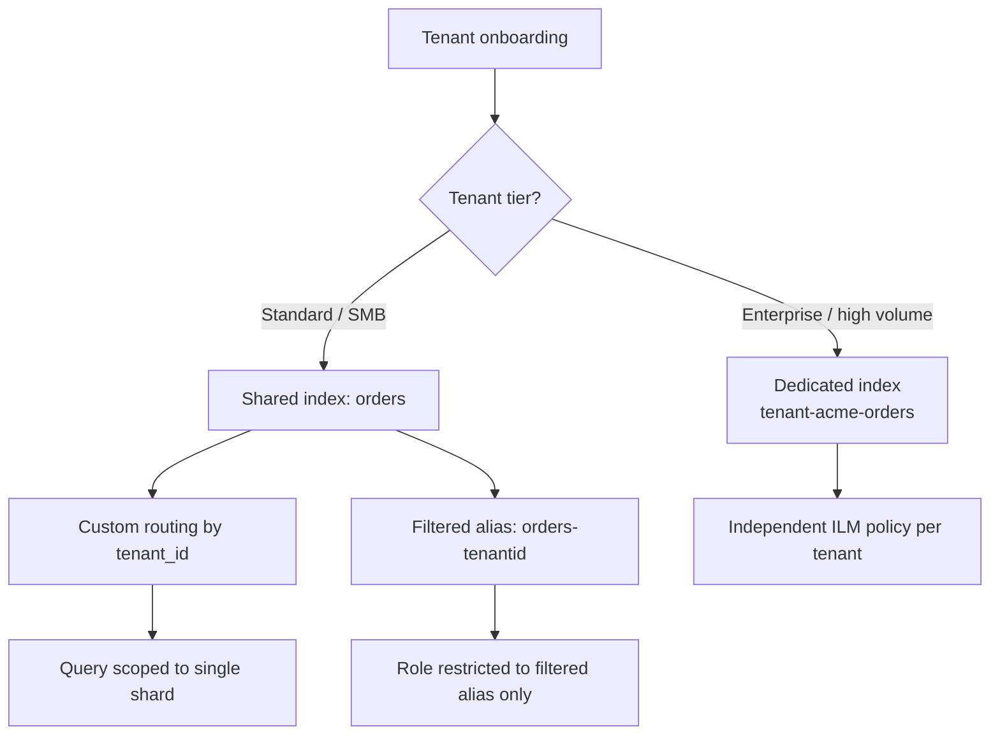

## Multi-Tenancy Patterns

### Overview

Multi-tenancy in Elasticsearch refers to strategies for isolating and serving multiple distinct customers, business units, or logical data partitions from a shared cluster infrastructure. The core design tension is between **isolation** (data separation, performance predictability, security boundaries) and **efficiency** (shared resource utilization, operational simplicity, avoiding per-tenant overhead at scale). Elasticsearch supports several distinct architectural patterns for this, each sitting at a different point on that spectrum.

### The Three Primary Patterns

1. **Index-per-tenant** — full physical isolation, one or more indices per tenant
2. **Shared index with tenant field** — logical isolation via a filtering field, physical sharing
3. **Shared index with routing** — logical isolation with physical co-location optimization

A fourth, less common approach — **cluster-per-tenant** — exists for extreme isolation requirements but is generally reserved for regulatory or contractual mandates rather than typical SaaS multi-tenancy.

### Pattern 1: Index-Per-Tenant

Each tenant gets one or more dedicated indices, typically following a naming convention:

```json
PUT /tenant-acme-orders
PUT /tenant-globex-orders
```

Applications route queries to the correct index based on the authenticated tenant context:

```json
GET /tenant-acme-orders/_search
{
  "query": { "match_all": {} }
}
```

**Key Points**

- Provides the strongest isolation: one tenant's mapping changes, reindexing, or query load cannot affect another tenant's index directly
- Per-tenant lifecycle management (ILM policies, retention, snapshots) can be tuned independently per tenant
- Scales poorly with tenant count due to per-shard overhead — each index carries fixed cluster-state and resource costs regardless of how little data a given tenant has, so this pattern degrades as tenant count grows into the thousands [Inference — the exact point at which shard-count overhead becomes problematic depends on cluster sizing, heap allocation, and Elasticsearch version, and is not a fixed universal threshold]
- Best suited for a moderate number of tenants with meaningfully different data volumes, retention needs, or compliance requirements per tenant

### Pattern 2: Shared Index with Tenant Field

All tenants' documents live in the same index(es), disambiguated by a `tenant_id` field present on every document:

```json
PUT /orders
{
  "mappings": {
    "properties": {
      "tenant_id": { "type": "keyword" },
      "order_total": { "type": "double" }
    }
  }
}
```

Every query must filter by `tenant_id`:

```json
GET /orders/_search
{
  "query": {
    "bool": {
      "filter": [
        { "term": { "tenant_id": "acme" } }
      ],
      "must": [
        { "match": { "product": "widget" } }
      ]
    }
  }
}
```

**Key Points**

- Shard count stays low and predictable regardless of tenant count, since all tenants share the same physical indices
- Every single query, aggregation, and write in application code must correctly scope to `tenant_id` — there is no structural enforcement at the index level, making this pattern entirely dependent on application-layer discipline
- A missing `tenant_id` filter is a data leak between tenants, not merely a bug — this is the primary risk of this pattern and warrants defense-in-depth (see filtered aliases below)
- Best suited for a large number of small-to-medium tenants where index-per-tenant shard overhead would be prohibitive

### Defense-in-Depth: Filtered Aliases Per Tenant

Rather than relying solely on application code to include `tenant_id` filters correctly on every request, a filtered alias can enforce the boundary at the Elasticsearch layer:

```json
POST /orders/_alias/orders-acme
{
  "filter": {
    "term": { "tenant_id": "acme" }
  }
}
```

If application code (or a specific service role) is restricted to querying `orders-acme` rather than `orders` directly — ideally enforced via role-based access control rather than convention alone — a forgotten `tenant_id` filter in a query still cannot leak Globex's data into an Acme-scoped response, since the alias's filter is applied regardless of what the query itself specifies.

```json
POST /_security/role/acme_role
{
  "indices": [
    {
      "names": ["orders-acme"],
      "privileges": ["read"]
    }
  ]
}
```

**Key Points**

- This is a meaningfully stronger isolation guarantee than relying on query-time filters alone, since it moves the enforcement point below the application layer
- Requires Elasticsearch security features (roles, index privileges) to be actively configured — a filtered alias alone, without corresponding role restrictions preventing direct access to the underlying index, does not enforce isolation

### Pattern 3: Shared Index with Custom Routing

For clusters with many tenants on a shared index, custom routing improves query performance by co-locating each tenant's documents on the same shard(s), avoiding a full scatter-gather across every shard for tenant-scoped queries:

```json
PUT /orders/_doc/1?routing=acme
{
  "tenant_id": "acme",
  "product": "widget"
}
```

Queries specify the same routing value to search only the relevant shard(s):

```json
GET /orders/_search?routing=acme
{
  "query": {
    "term": { "tenant_id": "acme" }
  }
}
```

**Key Points**

- Without custom routing, every query against a shared multi-tenant index scatters to all primary shards (or replicas) and gathers results, even though only a fraction of shards actually contain the relevant tenant's data — routing eliminates this waste
- Custom routing does not provide security isolation by itself — the `tenant_id` filter (or filtered alias) is still required; routing is a **performance** optimization, not an access-control mechanism
- Uneven tenant sizes can create **hot shards**: a very large tenant routed entirely to one shard can become a bottleneck, since routing pins all of that tenant's documents to a fixed subset of shards regardless of overall data volume
- Routing value choice matters: using `tenant_id` directly is simplest, but a composite or hashed routing key can help distribute exceptionally large tenants across more than one shard if needed

### Hybrid Approach: Tiered by Tenant Size

A common production pattern combines the above: large or premium tenants get dedicated indices (Pattern 1) for isolation and independent scaling, while the long tail of smaller tenants shares a routed, filtered-alias-protected index (Patterns 2+3) to avoid shard-count overhead.



**Key Points**

- This tiering decision is typically driven by data volume, query volume, SLA requirements, or contractual isolation guarantees rather than a fixed rule
- Migrating a tenant from the shared pattern to a dedicated index as they grow is itself a reindexing operation, following the zero-downtime reindex pattern

### Cluster-Per-Tenant (Extreme Isolation)

For regulatory environments (e.g., strict data residency, contractual non-co-mingling requirements), an entirely separate Elasticsearch cluster per tenant or per tenant group may be required rather than any shared-cluster pattern.

**Key Points**

- Provides complete physical and operational isolation, including independent cluster upgrades, independent failure domains, and no shared resource contention whatsoever
- Multiplies operational overhead linearly with tenant count — monitoring, upgrades, capacity planning, and cost all scale per cluster rather than being amortized
- Generally reserved for cases where isolation is a hard compliance requirement rather than a performance or convenience preference, since the operational cost is substantial

### Choosing a Pattern

| Factor | Index-per-tenant | Shared + field filter | Shared + routing |
| --- | --- | --- | --- |
| Isolation strength | High | Low (application-dependent) | Low (perf only, not security) |
| Shard overhead at scale | High | Low | Low |
| Query performance (single tenant) | High | Degrades with shard count | High (with correct routing) |
| Operational complexity | Per-tenant lifecycle mgmt | Simple, shared lifecycle | Simple, shared lifecycle |
| Best tenant count range | Tens to low hundreds | Hundreds to many thousands | Hundreds to many thousands |

### Common Pitfalls

- **Relying solely on application-layer `tenant_id` filtering with no defense-in-depth**: a single missed filter in one code path becomes a cross-tenant data leak; filtered aliases with role restrictions mitigate this structurally
- **Assuming custom routing provides security isolation**: it does not — it is purely a shard-targeting performance optimization, and omitting the `tenant_id` filter on a routed query still returns only that tenant's data by coincidence of routing, not by enforced boundary, and can break entirely if routing values are ever reused or misapplied
- **Choosing index-per-tenant without modeling shard count growth**: works well initially but can silently degrade cluster health as tenant count grows past what the cluster's heap and shard limits comfortably support
- **Uneven tenant size under routing-based sharing**: creates hot shards for large tenants; monitoring per-shard size and query load is necessary to catch this before it affects the whole cluster
- **Migrating tenants between patterns without a defined process**: growing a tenant out of the shared pattern into a dedicated index requires a reindex/migration plan, not an ad hoc one-off change

### Conclusion

Multi-tenancy in Elasticsearch is not a single feature but a spectrum of architectural choices trading isolation strength against shard-count efficiency. Index-per-tenant maximizes isolation at the cost of scaling poorly with tenant count; shared indices with tenant-field filtering and custom routing scale to many tenants but require careful, ideally structurally-enforced, boundary discipline. Most production systems at scale converge on a hybrid, tiering tenants by size or isolation requirement rather than committing to a single pattern universally.

**Related Topics**

- Filtered aliases and role-based access control for tenant isolation
- Custom routing and shard allocation mechanics
- Hot shard detection and mitigation strategies
- Index Lifecycle Management per-tenant policy design
- Reindexing workflows for tenant migration between patterns
- Cluster sizing and shard count limits at scale