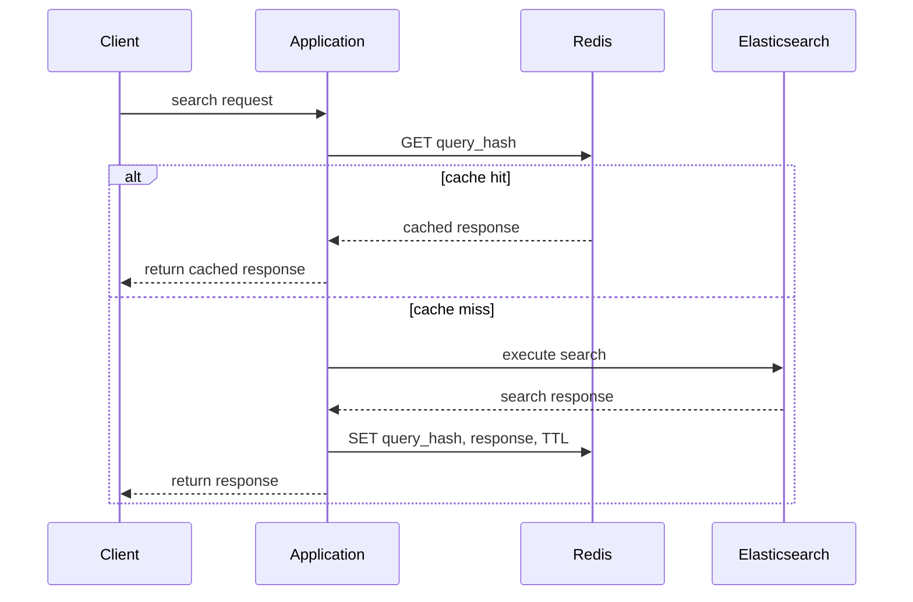
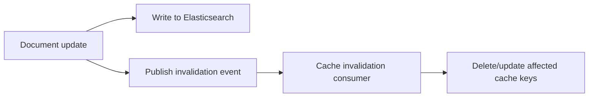

## Caching Layers In Front

### Overview

Caching layers placed in front of Elasticsearch reduce query load, lower latency for repeated or predictable requests, and protect the cluster from traffic spikes. Elasticsearch has its own internal caching (shard-level request cache, query cache, field data cache), but external caching — at the application, API gateway, or CDN layer — addresses different problems: reducing network round-trips, absorbing bursty traffic, and serving results even during cluster degradation. Designing an effective caching strategy requires understanding both Elasticsearch's built-in caches and where external caches complement rather than duplicate them.

### Elasticsearch's Built-In Caches

Before adding external caching, it's worth understanding what Elasticsearch already caches internally, since external layers should complement these rather than blindly duplicate them.

**Node query cache**: Caches the results of filter clauses (not full queries) at the segment level, specifically for frequently-used filters in `bool` `filter` context. Term, range, and other filter-context clauses become cache candidates automatically once used frequently enough.

**Shard request cache**: Caches the entire response of a search request at the shard level, keyed on the request body. Applies only to requests with `size: 0` (aggregation-only requests) by default, since caching full hit lists is riskier when results must reflect the very latest documents.

```json
GET /orders/_search?request_cache=true
{
  "size": 0,
  "aggs": {
    "revenue_by_month": {
      "date_histogram": { "field": "order_date", "interval": "month" }
    }
  }
}
```

**Key Points**

- Both caches are automatically invalidated when the underlying shard's data changes (on refresh), so they never serve stale data past the next refresh cycle — this differs meaningfully from most external caches, which require explicit invalidation logic
- The shard request cache is most valuable for dashboards and analytics-style aggregation queries that many users view simultaneously against largely-static data
- These caches operate per-shard, per-node — they do not reduce network round-trip time between the client and the cluster, which is precisely the gap external caching layers fill

### Why External Caching Is Still Needed

Even with internal caching well-utilized, external caching addresses problems Elasticsearch's own caches cannot:

- **Network round-trip elimination**: A cache hit at the application or edge layer avoids a network call to the cluster entirely, versus Elasticsearch's caches which still require a request to reach the node
- **Traffic absorption during spikes**: A CDN or reverse-proxy cache can serve a flash-crowd of identical requests without any of that load reaching the cluster
- **Degradation resilience**: If the cluster is under stress or partially unavailable, a cache layer can continue serving recent results rather than the request failing entirely
- **Cost reduction on managed/hosted Elasticsearch**: Where query volume directly affects hosting cost, offloading repeat queries to a cheaper cache tier reduces spend

### Pattern 1: Application-Layer Cache (Redis/Memcached)

The most common pattern: the application caches serialized search responses in an external key-value store, keyed by a hash of the query.



**Implementation considerations**

```python
import hashlib
import json

def cache_key(query_body, index):
    serialized = json.dumps(query_body, sort_keys=True)
    return f"es:{index}:{hashlib.sha256(serialized.encode()).hexdigest()}"

def search_with_cache(es_client, cache_client, index, query_body, ttl=60):
    key = cache_key(query_body, index)
    cached = cache_client.get(key)
    if cached:
        return json.loads(cached)

    response = es_client.search(index=index, body=query_body)
    cache_client.setex(key, ttl, json.dumps(response.body))
    return response.body
```

**Key Points**

- The cache key must be derived deterministically from the *entire* query body (sorted for consistent serialization), or semantically identical queries with differently-ordered JSON keys will miss the cache unnecessarily
- TTL choice is the central design decision: too short and the cache provides little benefit; too long and results become stale relative to newly indexed or updated documents
- This pattern works for any query shape, unlike Elasticsearch's own shard request cache, which is best suited to `size: 0` aggregation queries specifically
- Per-tenant or per-user query results should include the relevant scoping (tenant ID, user permissions) in the cache key, or this becomes a cross-tenant/cross-user data leak identical in nature to the multi-tenancy filtering risk

### Pattern 2: CDN / Edge Caching for Public, Non-Personalized Search

For public-facing search where results are not personalized per user (e.g., a public product catalog, documentation search), caching at the CDN or edge layer is viable when requests are idempotent GETs with cacheable query parameters.

**Key Points**

- Requires search requests to be expressed as cacheable GET requests with query parameters (rather than POST bodies, which most CDNs do not cache by default), which sometimes means restructuring how the application issues search requests
- Cache-Control headers and TTLs are set at the HTTP layer, following standard web caching semantics rather than anything Elasticsearch-specific
- Not suitable for personalized, authenticated, or tenant-scoped results, since edge caches are typically shared across all users hitting that edge node
- Well suited to low cardinality, high repeat-rate queries — e.g., popular search terms on a public site — where a large fraction of traffic maps to a small number of distinct query shapes

### Pattern 3: Cache Invalidation Strategies

Because Elasticsearch data changes over time, cached results eventually diverge from current data. Three general invalidation strategies apply:

**TTL-based (time expiry)**: Simplest approach — cached entries expire automatically after a fixed duration. Requires no coordination with the indexing pipeline but tolerates some staleness window by design.

**Event-based invalidation**: The indexing pipeline explicitly invalidates or updates relevant cache keys when documents change, typically by publishing an event (e.g., via a message queue) that the cache layer consumes.



**Versioned cache keys**: Rather than invalidating explicitly, incorporate a version marker (e.g., a global "last indexed at" timestamp, or an index alias generation number) into the cache key itself, so any data change naturally produces a new, distinct key rather than requiring deletion of the old one — old keys simply expire via TTL and are never read again once the version advances.

**Key Points**

- TTL-based invalidation is the simplest to implement and reason about, and is sufficient for most use cases where brief staleness (seconds to low minutes) is acceptable
- Event-based invalidation provides tighter consistency but adds architectural complexity — a message queue or change-data-capture mechanism must reliably fire on every relevant write
- Versioned keys avoid the need for explicit deletion entirely but require every cache-reading code path to consistently derive the current version, and stale entries linger in the cache store until TTL eviction even though they're logically unreachable

### Cache Key Design for Complex Queries

For faceted search or multi-parameter queries (see faceted search design), cache key granularity matters significantly:

- **Whole-response caching**: cache the entire rendered search+facets response per unique parameter combination — simplest, but cache hit rate drops as parameter combinations multiply
- **Component caching**: cache facet aggregation results separately from the main hit list, since facet counts often change less frequently or tolerate more staleness than the primary result list

$$\text{Cache hit rate} \approx \frac{\text{distinct cacheable requests observed}}{\text{total distinct possible parameter combinations}}$$

As the denominator grows (more facets, more filter combinations), whole-response cache hit rate degrades unless traffic is concentrated on a small number of popular combinations — which is common in practice (a long-tail distribution of query popularity), making whole-response caching often still worthwhile despite the combinatorial parameter space [Inference — actual hit-rate benefit depends entirely on the real traffic distribution of a given application and should be measured rather than assumed].

### Common Pitfalls

- **Caching personalized or permission-scoped results without scoping the cache key**: causes cross-user or cross-tenant data leakage identical in effect to the multi-tenancy filtering risk discussed elsewhere
- **Caching raw Elasticsearch responses including internal metadata** (`_shards`, `took`, scoring internals) unnecessarily inflates cache payload size; typically only the relevant `hits` and `aggregations` portions need caching
- **Using overly long TTLs on frequently-updated data**: serves stale results long after underlying documents change, undermining user trust in "live" search behavior
- **Ignoring cache stampede risk**: when a popular cache key expires, a burst of concurrent requests can simultaneously miss the cache and hit Elasticsearch at once; techniques like request coalescing or jittered TTLs mitigate this
- **Not accounting for Elasticsearch's own refresh interval**: caching at the application layer with a TTL shorter than the index's `refresh_interval` provides no real freshness benefit, since the underlying data isn't visible to new searches any sooner regardless of cache state

### Conclusion

External caching layers address problems Elasticsearch's internal query and shard request caches cannot — network round-trip elimination, traffic spike absorption, and resilience during cluster degradation. Effective design requires careful cache key construction (especially for scoped or faceted queries), a deliberate invalidation strategy matched to acceptable staleness tolerance, and awareness of how external caching interacts with, rather than duplicates, Elasticsearch's own internal caching behavior.

**Related Topics**

- Shard request cache and node query cache internals
- Cache stampede mitigation (request coalescing, jittered TTL)
- CDN caching semantics for search APIs
- Faceted search design and per-component cache granularity
- Multi-tenancy patterns and cache key scoping
- Change data capture for event-driven cache invalidation