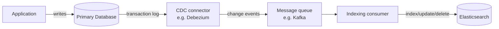
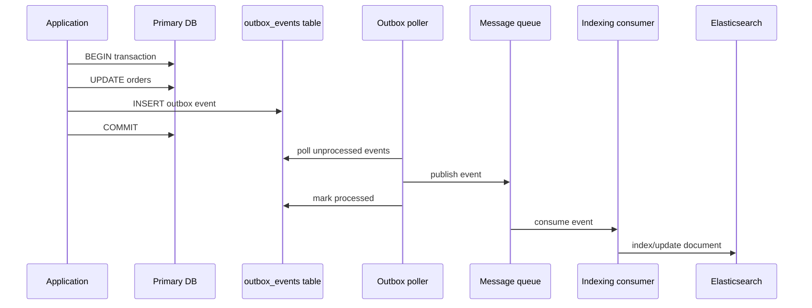
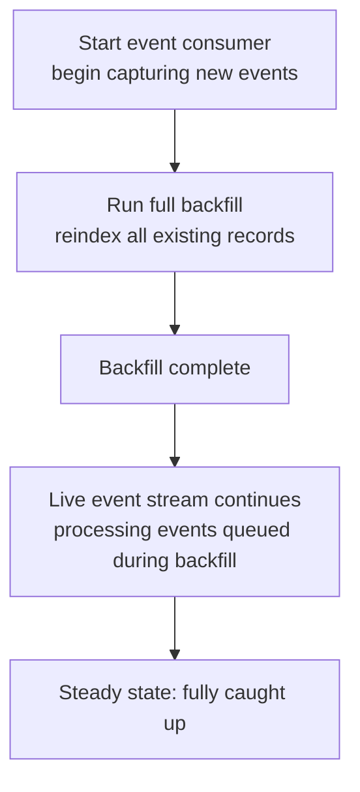

## Event-Driven Indexing Patterns

### Overview

Event-driven indexing keeps Elasticsearch in sync with a system of record by reacting to change events — inserts, updates, deletes — as they occur, rather than through periodic batch syncs. This approach reduces indexing latency (documents become searchable shortly after the source change) and decouples indexing from application request paths. Several architectural patterns exist for propagating events into Elasticsearch, differing primarily in how change events are captured and delivered.

### Why Event-Driven Over Batch/Polling

Periodic batch reindexing (e.g., a nightly job querying the source database and bulk-indexing results) is simple but has structural drawbacks:

- **Staleness window**: Data is only as fresh as the last batch run, which can mean hours of lag
- **Wasted work**: Re-processing unchanged records on every batch run, unless careful delta-tracking (e.g., `updated_at` watermarks) is layered on top
- **Load spikes**: Batch jobs concentrate indexing load into bursts rather than spreading it evenly

Event-driven indexing addresses all three by propagating only actual changes, as they happen, continuously.

### Pattern 1: Direct Dual-Write

The simplest pattern: application code writes to both the primary datastore and Elasticsearch synchronously, in the same request handler.

```python
def update_order(order_id, changes):
    db.orders.update(order_id, changes)
    es_client.index(index="orders", id=order_id, document=get_order(order_id))
```

**Key Points**

- Simplest to implement, requiring no additional infrastructure
- Fundamentally fragile: if the Elasticsearch write fails after the database write succeeds (or vice versa), the two systems diverge with no automatic reconciliation — this is the core weakness of dual-write and the primary reason more robust patterns exist
- Couples request latency to Elasticsearch's availability and response time; a slow or unavailable cluster directly degrades the primary write path
- Reasonable only for low-stakes, non-critical search indices where occasional drift is tolerable and easily corrected by a periodic reconciliation job

### Pattern 2: Change Data Capture (CDC)

CDC tools (Debezium is the most common in the Elasticsearch ecosystem) read a database's transaction log directly — the write-ahead log in PostgreSQL, binlog in MySQL — and emit a change event for every committed write, independent of application code.



**Key Points**

- Application code needs no awareness of Elasticsearch at all — it simply writes to the primary database as normal, and CDC captures every change automatically
- Captures every write, including those made by other services, scripts, or direct database access, that a dual-write pattern in a single application would otherwise miss entirely
- Introduces meaningful infrastructure complexity — a CDC connector, typically a message queue, and a dedicated indexing consumer service all need to be operated and monitored
- Provides a natural audit log of all changes via the message queue, which is useful independent of the indexing use case
- Transaction log-based capture reflects the database's actual committed write order, which helps avoid out-of-order update issues that can arise with less rigorous event sources [Inference — the degree of ordering guarantee depends on the specific CDC tool, message queue partitioning strategy, and consumer implementation, and is not automatic simply by using CDC]

### Pattern 3: Outbox Pattern

A middle ground between dual-write and full CDC: the application writes both the primary record and an "outbox" event record within the same database transaction, guaranteeing atomicity without requiring transaction-log-level CDC tooling.

```sql
BEGIN;
UPDATE orders SET status = 'shipped' WHERE id = 123;
INSERT INTO outbox_events (aggregate_id, event_type, payload)
  VALUES (123, 'order_updated', '{"id": 123, "status": "shipped"}');
COMMIT;
```

A separate poller or CDC-on-the-outbox-table-only process reads new outbox rows and publishes them for the indexing consumer to pick up, then marks them processed.



**Key Points**

- Guarantees atomicity between the primary write and the event record, since both happen in one transaction — eliminating the dual-write divergence risk without requiring full CDC infrastructure
- Simpler to reason about than transaction-log CDC, since the outbox table is application-defined and readable directly, rather than requiring understanding of the database's internal log format
- Still requires a poller/relay component and a message queue (or at minimum a reliable polling mechanism) to move events out of the outbox table
- The outbox table itself needs housekeeping (archiving or deleting processed rows) or it grows unboundedly

### Pattern 4: Application Event Bus

Rather than capturing changes at the database layer, the application explicitly publishes domain events (`OrderShipped`, `UserUpdated`) to a message bus as part of its normal business logic, and an indexing consumer subscribes to relevant events.

```python
def ship_order(order_id):
    db.orders.update(order_id, {"status": "shipped"})
    event_bus.publish("order.shipped", {"order_id": order_id, "status": "shipped"})
```

**Key Points**

- Events carry business meaning (`order.shipped`) rather than raw row-level changes, which can simplify downstream consumer logic when only certain event types matter for search indexing
- Reintroduces a version of the dual-write risk at the publish step — if the database write succeeds but the event publish fails, the two diverge, unless publish is made transactionally consistent (effectively converging back toward the outbox pattern)
- Well suited to systems already built around domain events / event sourcing, where this pattern is a natural extension rather than additional infrastructure
- Less suited to capturing changes from data sources the application doesn't control, unlike CDC

### Handling Deletes

Deletes require explicit handling distinct from updates in all of these patterns, since a deleted source record produces no natural "current state" to reindex.

```python
def handle_change_event(event):
    if event["op"] == "delete":
        es_client.delete(index="orders", id=event["id"], ignore=[404])
    else:
        es_client.index(index="orders", id=event["id"], document=event["after"])
```

**Key Points**

- `ignore=[404]` prevents the consumer from failing if the document was already removed or never indexed, which can happen during reprocessing or replay
- Soft-deletes at the source (a `deleted_at` column rather than an actual row deletion) require the indexing consumer to translate that into an actual Elasticsearch delete, or the document remains searchable despite being logically deleted

### Ensuring Delivery Reliability: At-Least-Once and Idempotency

Most message queue and CDC systems provide at-least-once delivery, meaning a given change event may be delivered and processed more than once. Indexing consumers should be designed idempotently so reprocessing the same event doesn't cause incorrect state.

```json
PUT /orders/_doc/123?version=45&version_type=external
{
  "status": "shipped"
}
```

Using `version_type=external` with a monotonically increasing source version (e.g., the database row's own version column, or a Kafka offset) causes Elasticsearch to reject the write if an equal or newer version has already been applied, making out-of-order or duplicate delivery safe.

**Key Points**

- Without external versioning, duplicate or out-of-order event delivery can cause an older state to overwrite a newer one if events arrive out of sequence
- `version_type=external` is the standard mechanism for making Elasticsearch indexing idempotent against a source system's own change ordering
- This concern is distinct from and complementary to message queue ordering guarantees — even a queue that preserves order per-partition can still redeliver a message after a consumer crash and restart

### Handling Backfill Alongside Live Events

New indices or newly onboarded data sources need an initial full load in addition to ongoing event-driven updates. The standard approach: start the event consumer first (buffering/queuing events from that point forward), then run a backfill of all existing data, then let the live event stream catch up on anything queued during the backfill.



**Key Points**

- Starting event capture *before* backfill (rather than after) ensures no changes made during the backfill window are lost
- Because the backfill and live stream may briefly index the same record, idempotent writes (external versioning) again matter here to avoid the backfill overwriting a newer live update with older data
- This ordering consideration mirrors the delta-reindex step in zero-downtime reindexing, applied to a continuous event stream rather than a one-time migration

### Choosing a Pattern

| Pattern | Consistency guarantee | Infrastructure needed | Best for |
| --- | --- | --- | --- |
| Dual-write | Weak (no atomicity) | None additional | Low-stakes, tolerant of drift |
| CDC (transaction log) | Strong (captures all commits) | CDC connector + queue | Systems with multiple writers, strict freshness needs |
| Outbox | Strong (transactional) | Poller + queue | Single-app writers wanting atomicity without full CDC |
| Application event bus | Depends on publish reliability | Message bus | Event-sourced systems, business-meaningful events |

### Common Pitfalls

- **Relying on dual-write for anything beyond low-stakes indices**: silent divergence accumulates over time with no built-in detection or correction mechanism
- **Not designing indexing consumers idempotently**: at-least-once delivery is the norm for most queue/CDC systems, and non-idempotent consumers will eventually process a duplicate or out-of-order event incorrectly
- **Forgetting explicit delete handling**: updates and deletes require different handling; treating every event as an upsert leaves deleted source records searchable indefinitely
- **Backfilling before starting event capture**: creates a gap where changes made during backfill are permanently lost, since no consumer was yet capturing them
- **Letting an outbox table grow unbounded**: without archiving or deletion of processed rows, the outbox table itself becomes an operational liability over time
- **Ignoring event ordering across partitions**: in partitioned message queues, ordering is typically only guaranteed within a partition; events for the same entity must be routed to the same partition (e.g., partitioned by entity ID) to preserve per-entity ordering

### Conclusion

Event-driven indexing keeps Elasticsearch synchronized with a source system through continuous, incremental propagation of changes rather than periodic batch syncs. The choice between dual-write, CDC, the outbox pattern, and an application event bus depends primarily on how strong a consistency guarantee is needed and how much infrastructure complexity is acceptable — with CDC and outbox patterns generally preferred over plain dual-write whenever search index correctness matters, due to their stronger consistency guarantees against write failures and multi-writer scenarios.

**Related Topics**

- Change Data Capture tooling (Debezium) and transaction log mechanics
- External versioning and idempotent write strategies
- Zero-downtime reindexing and its relationship to event-stream backfill
- Message queue partitioning and ordering guarantees
- Bulk API usage for efficient backfill indexing
- Monitoring and detecting index/source-of-truth drift