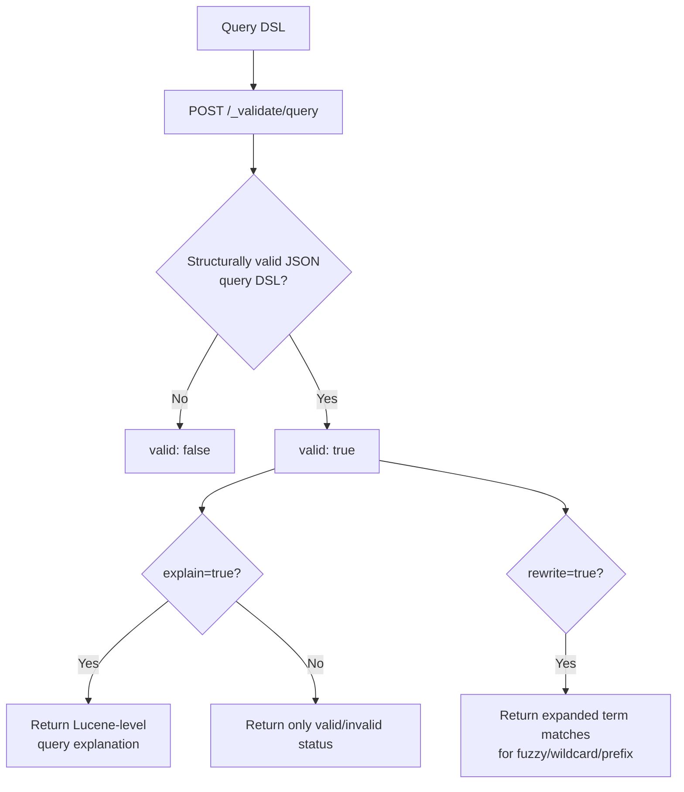

## Validate API

### Overview

The Validate API checks whether a query is syntactically and semantically valid without actually executing it against data. It exists primarily as a debugging and development tool — allowing a query to be checked for correctness, and optionally to have its execution explained, before it is run at scale or embedded into application code.

### Basic Usage

```json
GET /products/_validate/query
{
  "query": {
    "match": { "name": "laptop" }
  }
}
```

**Response**

```json
{
  "valid": true,
  "_shards": {
    "total": 1,
    "successful": 1,
    "failed": 0
  }
}
```

A `valid: true` response confirms the query is well-formed and can be executed against the target index's mapping without error. No documents are matched, scored, or returned — this endpoint answers only "is this query valid," not "what would this query return."

### Catching Invalid Queries

```json
GET /products/_validate/query
{
  "query": {
    "match": { "nonexistent_field": "laptop" }
  }
}
```

**Response**

```json
{
  "valid": true,
  "_shards": {
    "total": 1,
    "successful": 1,
    "failed": 0
  }
}
```

**Key Points**

- Querying a field that doesn't exist in the mapping is still considered *valid* by default, since Elasticsearch treats an unmapped field query as matching zero documents rather than as an error — this is a common point of confusion when using this API to catch typos in field names
- To catch structurally malformed queries (e.g., invalid JSON query DSL, wrong parameter types), the API does correctly report `valid: false`
- This distinction matters: the Validate API confirms a query *can execute*, not that it references the fields the author intended

### Explain Mode

Adding `explain=true` returns a human-readable Lucene query representation, useful for understanding how a query DSL structure translates into the underlying Lucene query:

```json
GET /products/_validate/query?explain=true
{
  "query": {
    "bool": {
      "must": [
        { "match": { "name": "laptop" } }
      ],
      "filter": [
        { "term": { "brand.keyword": "Acme" } }
      ]
    }
  }
}
```

**Response**

```json
{
  "valid": true,
  "_shards": { "total": 1, "successful": 1, "failed": 0 },
  "explanations": [
    {
      "index": "products",
      "valid": true,
      "explanation": "+name:laptop #brand.keyword:Acme"
    }
  ]
}
```

**Key Points**

- The `explanation` field shows the Lucene query syntax equivalent — `+` indicates a required (`must`) clause, `#` indicates a filter clause that doesn't contribute to scoring, useful for confirming that `bool` clause types translate to the expected Lucene semantics
- This is particularly useful when debugging why a complex nested `bool` query isn't behaving as expected, since it surfaces the flattened Lucene-level structure rather than the nested DSL as written

### Rewrite Mode

Adding `rewrite=true` shows how Elasticsearch rewrites certain query types internally before execution — most notably useful for queries involving wildcards, prefixes, or fuzziness, where the actual terms matched aren't obvious from the query DSL alone:

```json
GET /products/_validate/query?rewrite=true
{
  "query": {
    "fuzzy": {
      "name": {
        "value": "labtop",
        "fuzziness": "AUTO"
      }
    }
  }
}
```

**Response**

```json
{
  "valid": true,
  "_shards": { "total": 1, "successful": 1, "failed": 0 },
  "explanations": [
    {
      "index": "products",
      "valid": true,
      "explanation": "name:laptop^0.75 name:laptops^0.5"
    }
  ]
}
```

**Key Points**

- Fuzzy, wildcard, and prefix queries are rewritten internally into an expanded set of concrete term matches — `rewrite=true` reveals exactly which terms were matched from the index's term dictionary, which is otherwise opaque from the original query
- This is the most direct way to debug unexpected fuzzy-match results, since it shows precisely which real terms in the index the fuzzy expansion resolved to

### Validating Across Multiple Indices

```json
GET /products,archived-products/_validate/query
{
  "query": {
    "match": { "name": "laptop" }
  }
}
```

**Key Points**

- When indices have differing mappings, a query valid against one but not the other still returns `valid: true` overall by default unless `explain=true` is used, which then reports per-index validity in the `explanations` array — this makes `explain=true` important when validating across indices with heterogeneous mappings, not just for readability

### Practical Use Cases

- **Pre-deployment query validation**: CI/CD pipelines can validate that application-constructed queries remain valid against the current index mapping before deploying, catching mapping-drift issues before they reach production
- **Debugging unexpected zero-result queries**: distinguishing "the query is malformed" from "the query is valid but references an unmapped field" (a very common cause of silent zero-result queries)
- **Understanding fuzzy/wildcard expansion**: using `rewrite=true` to see exactly which terms a fuzzy or wildcard query actually matched against, rather than guessing
- **Verifying complex `bool` query structure**: using `explain=true` to confirm that nested `must`/`should`/`filter`/`must_not` clauses produce the intended Lucene-level query shape

### Validate API Flow



### Common Pitfalls

- **Assuming `valid: true` means the query will return meaningful results**: it only confirms the query can execute without error; an unmapped field, an empty index, or a query with no matching documents is still "valid"
- **Not using `explain=true` when debugging cross-index validation**: the top-level `valid` field can mask per-index validity differences in heterogeneous multi-index queries
- **Using this API as a substitute for actual testing**: it validates query structure and mapping compatibility, but says nothing about relevance, scoring behavior, or performance — a syntactically valid query can still be a poor or slow one
- **Forgetting this doesn't execute the query**: no documents are scanned or scored, so this API cannot be used to preview result counts or content — `_search` with `size: 0` or `_count` serves that purpose instead

### Conclusion

The Validate API is a lightweight diagnostic tool for confirming query correctness before execution, distinct from actually running a search. Its `explain` and `rewrite` modes are the more valuable modes in practice, surfacing the underlying Lucene query structure and term expansion respectively — both of which are otherwise difficult to inspect directly from the query DSL alone, making this API most useful as a debugging aid rather than a runtime safeguard.

**Related Topics**

- Explain API for understanding document-level relevance scoring
- Profile API for query performance analysis
- Lucene query syntax fundamentals
- Fuzzy query and term expansion mechanics
- `_count` API as a lightweight alternative for result-count checks without full search execution
- Mapping validation strategies in CI/CD pipelines