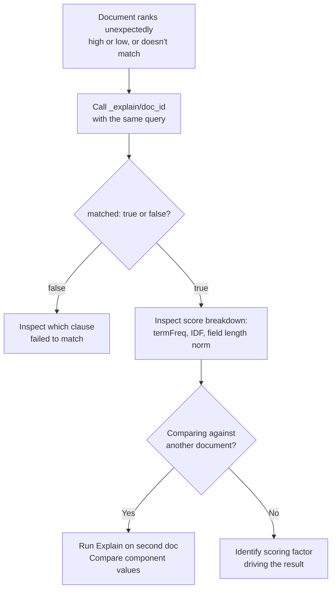

## Explain API For Scoring

### Overview

The Explain API shows exactly why a specific document did or did not match a query, and — when it does match — a full breakdown of how its relevance score was computed. Unlike the Validate API, which checks query correctness without touching data, the Explain API operates against one specific document and produces a detailed scoring trace. It is the primary tool for debugging relevance issues: why a document expected to rank highly doesn't, or why a document unexpectedly matches at all.

### Basic Usage

```json
GET /products/_explain/42
{
  "query": {
    "match": { "name": "wireless keyboard" }
  }
}
```

**Response (matching document)**

```json
{
  "_index": "products",
  "_id": "42",
  "matched": true,
  "explanation": {
    "value": 2.4536414,
    "description": "sum of:",
    "details": [
      {
        "value": 1.3862944,
        "description": "weight(name:wireless in 0) [PerFieldSimilarity], result of:",
        "details": [ /* term frequency, doc frequency, field length norm breakdown */ ]
      },
      {
        "value": 1.067347,
        "description": "weight(name:keyboard in 0) [PerFieldSimilarity], result of:",
        "details": [ /* ... */ ]
      }
    ]
  }
}
```

The top-level `value` is the final relevance score for this document against this query — identical to the `_score` that would appear in normal `_search` results. The nested `details` array recursively breaks down every component contributing to that score.

### Reading the Score Breakdown

For queries using BM25 (Elasticsearch's default similarity algorithm since version 5), the explanation details typically expose:

- **`termFreq`** — how many times the term appears in this document's field
- **`docFreq`** — how many documents in the index contain this term (used for inverse document frequency)
- **`avgFieldLength`** and **`fieldLength`** — used in length normalization, since BM25 penalizes matches in unusually long fields relative to the field's average length across the index

The underlying BM25 formula being decomposed is:

$$\text{score}(D, Q) = \sum_{t \in Q} \text{IDF}(t) \cdot \frac{f(t, D) \cdot (k_1 + 1)}{f(t, D) + k_1 \cdot \left(1 - b + b \cdot \frac{|D|}{\text{avgdl}}\right)}$$

where $f(t, D)$ is the term frequency in document $D$, $|D|$ is the field length, $\text{avgdl}$ is the average field length across the index, and $k_1$, $b$ are tunable parameters controlling term frequency saturation and length normalization respectively. The Explain API's nested breakdown corresponds directly to the components of this formula — each term's IDF weight, term frequency contribution, and length normalization factor are all individually visible in the response.

**Key Points**

- `k_1` (default 1.2) controls how quickly additional term occurrences stop contributing much additional score — BM25 deliberately saturates rather than scoring term frequency linearly
- `b` (default 0.75) controls how strongly field length normalization is applied; `b=0` disables length normalization entirely, treating all field lengths as equal
- These parameters can be tuned per field via a custom similarity, and the Explain API is the direct way to observe the practical effect of such tuning on real documents

### Explaining a Non-Match

```json
GET /products/_explain/43
{
  "query": {
    "term": { "brand.keyword": "Acme" }
  }
}
```

**Response (non-matching document)**

```json
{
  "_index": "products",
  "_id": "43",
  "matched": false,
  "explanation": {
    "value": 0.0,
    "description": "no matching term",
    "details": []
  }
}
```

**Key Points**

- `matched: false` with a description like `"no matching term"` is the direct way to confirm a document was excluded because the queried term genuinely doesn't exist in that field for that document, rather than some other structural query issue
- This is especially useful for `bool` queries with multiple clauses, where the explanation reveals precisely which clause(s) failed to match

### Explaining Complex `bool` Queries

```json
GET /products/_explain/42
{
  "query": {
    "bool": {
      "must": [
        { "match": { "name": "keyboard" } }
      ],
      "should": [
        { "term": { "brand.keyword": "Acme" } }
      ],
      "filter": [
        { "range": { "price": { "lte": 100 } } }
      ]
    }
  }
}
```

**Key Points**

- The explanation recursively mirrors the `bool` structure: `must` and `should` clauses contribute to the `sum of:` scoring breakdown, while `filter` clauses appear in the explanation as contributing to match eligibility but not to score, consistent with filter context's non-scoring nature
- This makes the Explain API the most direct way to confirm that a `filter` clause is genuinely not affecting score, versus a `must`/`should` clause that is — a common point of confusion when a query's actual relevance ranking doesn't match expectations

### Comparing Two Documents' Scores

A common relevance-debugging workflow is running Explain against two documents matching the same query, to understand why one outranks the other:

```json
GET /products/_explain/42
{
  "query": { "match": { "name": "wireless keyboard" } }
}
```

```json
GET /products/_explain/58
{
  "query": { "match": { "name": "wireless keyboard" } }
}
```

Comparing the `termFreq`, `fieldLength`, and per-term weight values side by side typically reveals the specific factor driving the score difference — most often field length normalization (a shorter field name containing the same terms scores higher under default BM25 settings) or term frequency saturation effects.

### Using `explain` Within `_search` Directly

Rather than calling the dedicated Explain API per document, `_search` itself supports an `explain` parameter that attaches the same breakdown to every hit in a single request:

```json
GET /products/_search
{
  "query": { "match": { "name": "wireless keyboard" } },
  "explain": true
}
```

**Key Points**

- This avoids needing a separate `_explain/<id>` call per document when the goal is comparing scoring across an entire result set at once
- Adds non-trivial overhead per hit, since the full scoring breakdown is computed for every returned document — this should generally be reserved for debugging sessions rather than left enabled in production query paths
- Functionally equivalent output structure to the dedicated Explain API, just embedded per-hit rather than requested per-document

### Explain API Workflow



### Common Pitfalls

- **Using Explain API in production request paths**: it is computationally more expensive than a normal query and is intended for offline debugging, not live traffic
- **Misreading `filter` clause contributions**: filter clauses correctly show as affecting match eligibility without contributing to the score sum; expecting them to influence ranking is a misunderstanding of filter context, not a bug
- **Ignoring field length normalization as a scoring factor**: a very common cause of "why does this less relevant document outrank a more relevant one" is field length normalization (the `b` parameter), which the Explain output makes directly visible but is easy to overlook when just reading final scores
- **Explaining against the wrong document ID**: since Explain operates on one document at a time, confirming the correct `_id` is being targeted (versus a typo or a stale ID from a previous query) is a common early debugging misstep
- **Not combining with the Profile API for full context**: Explain shows scoring breakdown per document but not overall query execution timing or shard-level performance; the Profile API complements it for performance-focused debugging rather than relevance-focused debugging

### Conclusion

The Explain API is the primary tool for relevance debugging in Elasticsearch, exposing the exact BM25 (or custom similarity) computation behind a document's score, or the exact reason a document failed to match at all. Its value is most apparent when comparing two documents' explanations side by side to identify which specific scoring component — term frequency, inverse document frequency, or field length normalization — is driving an unexpected ranking outcome.

**Related Topics**

- BM25 similarity algorithm and parameter tuning (`k1`, `b`)
- Profile API for query execution performance analysis
- Custom similarity configuration per field
- Function score queries for manually adjusting relevance
- `bool` query clause types and their scoring vs. filtering roles
- Validate API for query structure debugging (a complementary, pre-execution check)