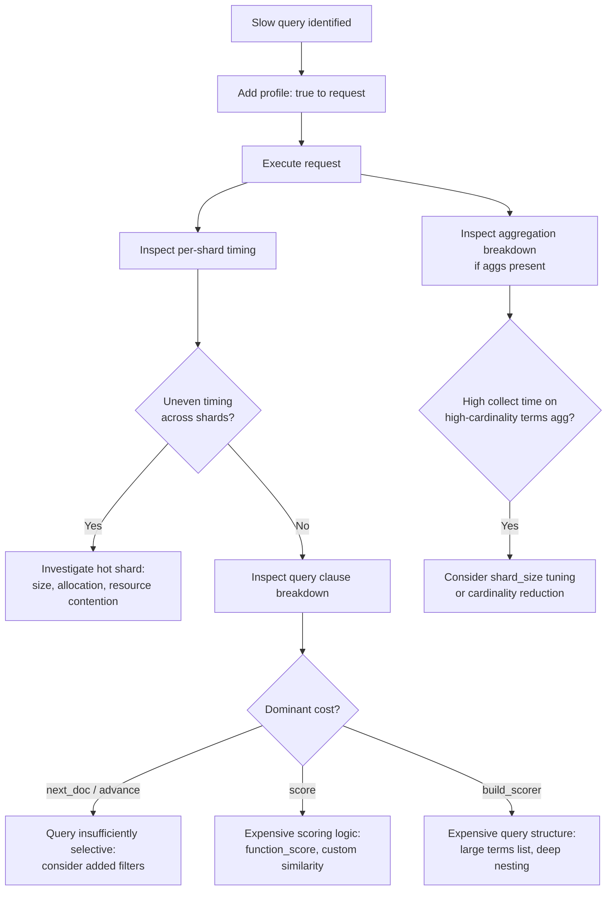

## Profile API For Performance

### Overview

The Profile API instruments query and aggregation execution to reveal exactly where time is spent within a single search request — down to individual Lucene-level operations per shard. Where the Explain API answers "why did this document score this way," the Profile API answers "why is this query slow, and specifically which part of it." It is the primary low-level performance debugging tool in Elasticsearch, distinct from higher-level cluster monitoring.

### Basic Usage

```json
GET /products/_search
{
  "profile": true,
  "query": {
    "bool": {
      "must": [{ "match": { "name": "wireless keyboard" } }],
      "filter": [{ "range": { "price": { "lte": 100 } } }]
    }
  }
}
```

Setting `"profile": true` at the top level of a `_search` request attaches a detailed `profile` section to the response, alongside the normal `hits`.

### Structure of the Profile Response

```json
{
  "profile": {
    "shards": [
      {
        "id": "[node_id][products][0]",
        "searches": [
          {
            "query": [
              {
                "type": "BooleanQuery",
                "description": "name:wireless name:keyboard #price:[* TO 100]",
                "time_in_nanos": 1250000,
                "breakdown": {
                  "score": 120000,
                  "build_scorer": 340000,
                  "match": 0,
                  "create_weight": 15000,
                  "next_doc": 610000,
                  "advance": 165000
                },
                "children": [ /* nested clause-level breakdowns */ ]
              }
            ],
            "rewrite_time": 4200,
            "collector": [ /* collector-level timing */ ]
          }
        ],
        "aggregations": []
      }
    ]
  }
}
```

**Key Points**

- Profiling data is reported **per shard**, since each shard executes the query independently — a slow overall query is often the result of one specific shard being disproportionately slow, which the per-shard breakdown makes visible
- `time_in_nanos` at each level of the query tree shows exactly how long that specific clause or sub-clause took, allowing identification of the single most expensive component in a complex nested query
- The `breakdown` object further decomposes time within a single query clause into Lucene-level operations (`next_doc`, `advance`, `build_scorer`, `score`, and others), which is useful for distinguishing whether time is spent iterating matching documents versus computing scores versus building the initial scorer structure

### Interpreting Breakdown Fields

| Field | Meaning |
| --- | --- |
| `create_weight` | Time spent preparing the query for execution against this shard |
| `build_scorer` | Time spent constructing the scoring/matching structure for the query clause |
| `next_doc` | Time spent advancing to the next matching document |
| `advance` | Time spent skipping ahead to a specific document (used in conjunction filters/queries) |
| `match` | Time spent in additional match verification, relevant for certain query types like phrase queries |
| `score` | Time spent computing the actual relevance score once a document is confirmed to match |

**Key Points**

- A query dominated by `next_doc`/`advance` time is typically bottlenecked on the sheer number of matching documents being iterated, suggesting the query is insufficiently selective
- A query dominated by `score` time suggests the scoring computation itself (e.g., complex function score calculations) is the bottleneck, not document matching
- `build_scorer` dominating can indicate an expensive query structure (e.g., very large `terms` queries, complex nested `bool` structures) where constructing the execution plan itself is costly

### Profiling Aggregations

```json
GET /products/_search
{
  "profile": true,
  "size": 0,
  "aggs": {
    "brands": {
      "terms": { "field": "brand.keyword", "size": 10 }
    },
    "price_stats": {
      "stats": { "field": "price" }
    }
  }
}
```

The `aggregations` section of the profile response mirrors the query section's structure, breaking down time spent per aggregation, including nested sub-aggregations:

```json
{
  "profile": {
    "shards": [
      {
        "aggregations": [
          {
            "type": "TermsAggregator",
            "description": "brands",
            "time_in_nanos": 890000,
            "breakdown": {
              "collect": 620000,
              "build_aggregation": 180000,
              "reduce": 0
            }
          }
        ]
      }
    ]
  }
}
```

**Key Points**

- `collect` time reflects the cost of processing each matching document into the aggregation's bucket structure — high `collect` time on a `terms` aggregation over a high-cardinality field is a common bottleneck signature
- Sub-aggregations nested within a parent (e.g., faceted search's per-facet filtered aggregations) each report their own timing independently, which is valuable for identifying which specific facet is the expensive one in a multi-facet request
- `reduce` time reflects the coordinating-node-side cost of merging per-shard aggregation results into the final response — this is typically small for simple aggregations but grows with high-cardinality `terms` aggregations across many shards

### Profiling Flow



### Combining Profile with Explain

The two APIs answer different questions and are often used together: Explain clarifies *why* a document scored the way it did; Profile clarifies *how long* that scoring (and the surrounding query execution) took. A query that is both slow and producing unexpected rankings typically warrants running both — Profile to isolate the expensive component, and Explain on specific returned documents to verify the scoring logic itself is behaving as intended within that component.

### Overhead and Production Use

**Key Points**

- Profiling adds measurable overhead to query execution — instrumentation itself has a cost, so profiled query timings are not perfectly representative of unprofiled production latency, though they remain useful for relative comparison between query variants
- This API is intended for **offline debugging and query optimization work**, not as an always-on production diagnostic; it should be enabled selectively when investigating a specific slow query, not left on for all traffic
- Because timing is reported in nanoseconds with fine granularity, profile output can be verbose for complex queries with many clauses and nested aggregations — extracting the dominant cost contributor from a large profile response is itself part of the skill of using this tool effectively

### Practical Workflow for Query Optimization

1. Identify a slow query via cluster-level monitoring (slow logs, APM, or user-reported latency)
2. Reproduce the query with `profile: true` in a non-production or low-impact context
3. Inspect per-shard timing for imbalance — a hot shard often points to a data distribution or allocation issue rather than a query structure issue
4. Inspect per-clause breakdown to identify the dominant cost (`next_doc`/`advance` vs `score` vs `build_scorer`)
5. Apply the corresponding fix: add more selective filters, simplify scoring logic, reduce `terms` list size, or restructure aggregations
6. Re-profile the modified query to confirm the specific bottleneck's time contribution decreased

### Common Pitfalls

- **Leaving `profile: true` enabled in production traffic**: adds unnecessary overhead to every request; this is a debugging tool, not a monitoring mechanism
- **Interpreting nanosecond-level noise as meaningful**: on fast queries, small absolute timing differences between runs can be measurement noise rather than a genuine performance signal; profiling is most useful for identifying orders-of-magnitude differences between components, not micro-optimizing single-digit-microsecond variance
- **Ignoring per-shard variance**: focusing only on aggregate/total timing can miss that one specific shard is disproportionately slow, which points to a data skew or allocation problem rather than a query design problem
- **Profiling in isolation without considering cluster-level context**: a query profiled as fast in isolation can still be slow in production if it's competing for resources with concurrent indexing or other query load — the Profile API measures this specific request's execution, not contention effects from other simultaneous cluster activity

### Conclusion

The Profile API provides granular, per-shard, per-clause execution timing for both queries and aggregations, making it the primary tool for diagnosing *why* a specific query is slow rather than merely observing *that* it is slow. Used alongside the Explain API for relevance debugging and cluster-level monitoring for broader performance context, it completes the standard Elasticsearch query-debugging toolkit.

**Related Topics**

- Explain API for relevance scoring debugging
- Slow logs and cluster-level performance monitoring
- Aggregation performance and `shard_size` tuning
- Shard sizing and data distribution best practices
- Query rewriting and structure optimization
- Caching layers as a complementary performance strategy to query-level optimization