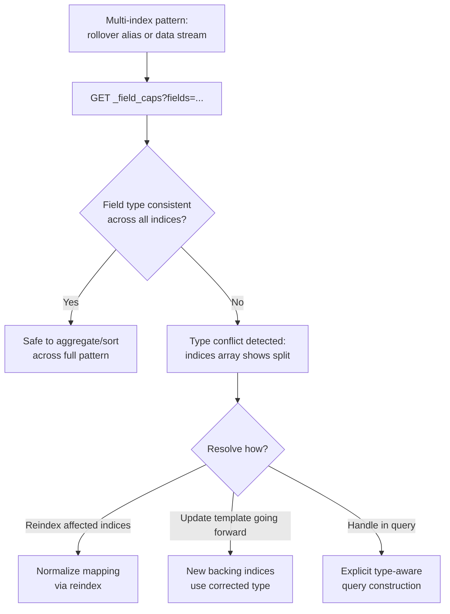

## Field Capabilities API

### Overview

The Field Capabilities API (`_field_caps`) reports the type and characteristics of fields across one or more indices, without requiring knowledge of any single index's exact mapping in advance. It is especially valuable in environments with many indices that may have evolved slightly different mappings over time — such as rollover-generated backing indices or data streams — where confirming that a field is consistently typed across all of them is otherwise tedious to verify by hand.

### Basic Usage

```json
GET /products/_field_caps?fields=price,brand,name
```

**Response**

```json
{
  "indices": ["products"],
  "fields": {
    "price": {
      "double": {
        "type": "double",
        "searchable": true,
        "aggregatable": true
      }
    },
    "brand": {
      "keyword": {
        "type": "keyword",
        "searchable": true,
        "aggregatable": true
      }
    },
    "name": {
      "text": {
        "type": "text",
        "searchable": true,
        "aggregatable": false
      }
    }
  }
}
```

This confirms, per field, its data type and whether it is usable in search queries (`searchable`) and aggregations (`aggregatable`) — notably, `name` here is `aggregatable: false`, consistent with `text` fields not supporting aggregation directly without a `.keyword` subfield.

### Wildcard Field Patterns

Rather than listing every field explicitly, wildcards retrieve capabilities for all matching fields:

```json
GET /products/_field_caps?fields=*
```

```json
GET /products/_field_caps?fields=price*,brand*
```

**Key Points**

- `fields=*` is useful for a full inventory of an unfamiliar index's field types, particularly when working with data from an unfamiliar source or inherited system
- Wildcard patterns can also scope to specific field name prefixes/suffixes, useful when a naming convention groups related fields (e.g., all fields prefixed `price_`)

### Querying Across Multiple Indices

The API's primary value emerges when querying across several indices at once — most commonly a rollover alias or a data stream spanning many backing generations:

```json
GET /logs-app-*/_field_caps?fields=status_code,response_time
```

**Response when types are consistent across all indices**

```json
{
  "indices": ["logs-app-000001", "logs-app-000002", "logs-app-000003"],
  "fields": {
    "status_code": {
      "long": {
        "type": "long",
        "searchable": true,
        "aggregatable": true
      }
    }
  }
}
```

**Response when a field's type diverges across indices**

```json
{
  "indices": ["logs-app-000001", "logs-app-000002", "logs-app-000003"],
  "fields": {
    "status_code": {
      "long": {
        "type": "long",
        "searchable": true,
        "aggregatable": true,
        "indices": ["logs-app-000001", "logs-app-000002"]
      },
      "keyword": {
        "type": "keyword",
        "searchable": true,
        "aggregatable": true,
        "indices": ["logs-app-000003"]
      }
    }
  }
}
```

**Key Points**

- When a field has the *same* type in every queried index, the response reports it once, with no per-index breakdown needed
- When a field's type *differs* across indices — for example, if a mapping change caused `status_code` to switch from `long` to `keyword` starting with a particular backing index — the response splits into multiple type entries, each listing exactly which indices use that type via the nested `indices` array
- This type-conflict detection is precisely the scenario that makes this API valuable for rollover/data stream architectures, where mapping drift across generations can otherwise cause confusing query or aggregation failures that are hard to trace back to their root cause

### Detecting Mapping Conflicts Before They Cause Query Failures

A `terms` aggregation or sort operation against a field with inconsistent types across indices in a multi-index search can fail or behave unexpectedly. Running `_field_caps` proactively — for instance, as part of a CI check or before deploying a query against a newly rolled-over index pattern — surfaces this risk before it manifests as a production query error.

```json
GET /logs-app-*/_field_caps?fields=status_code
```

If the response shows a single unified type entry, the field is safe to aggregate or sort on across the full index pattern. If it splits into multiple type entries, application code needs to either normalize the field at the mapping level (via a reindex or updated template) or handle the type conflict explicitly in query construction.

**Key Points**

- This check is considerably cheaper than running a full aggregation and observing whether it fails, since `_field_caps` only inspects mapping metadata rather than executing against actual documents
- It's a natural fit for automated pre-deployment checks in systems that rely on rollover or data streams, where new backing indices are created over time and could in principle diverge in mapping if index templates are modified without careful version control

### Filtering by Index Filter

The API supports narrowing which indices are inspected via an index filter, useful when a broad alias or wildcard pattern spans more indices than are relevant to a specific check:

```json
GET /logs-app-*/_field_caps?fields=status_code
{
  "index_filter": {
    "range": {
      "@timestamp": {
        "gte": "now-30d"
      }
    }
  }
}
```

**Key Points**

- `index_filter` restricts the operation to indices whose data could plausibly match the given filter, using each index's stored metadata rather than scanning documents — this is a metadata-level optimization, not a document-level filter
- Useful for excluding old backing indices from a mapping consistency check when only recent data's schema is currently relevant

### Field Capabilities Workflow



### Practical Use Cases

- **Pre-deployment schema validation**: confirming a field's type is uniform across all indices a query pattern will touch, before deploying that query
- **Discovering field structure in unfamiliar or third-party-populated indices**: when working with data whose exact mapping history isn't well documented, `_field_caps` with `fields=*` gives a quick structural overview
- **Diagnosing "field not aggregatable" errors**: confirming whether a field is genuinely non-aggregatable (e.g., an unmodified `text` field) versus inconsistently typed across a multi-index pattern
- **Auditing mapping drift over the lifetime of a rollover pattern or data stream**: periodically checking that index template changes haven't introduced unintended type divergence in newer generations

### Common Pitfalls

- **Assuming a single-index check is sufficient for multi-index query patterns**: a field can be perfectly well-typed in the most recent backing index while differing in an older one still included in the search pattern — always check across the actual pattern that queries will use, not just the current write index
- **Not using `explain`-equivalent detail when a type conflict is found**: the `indices` array within a conflicting field's response is essential for identifying *which* indices need remediation, not just that a conflict exists
- **Treating `_field_caps` as a substitute for actually testing the query**: it confirms type consistency, but does not guarantee that an aggregation or sort will perform well or produce sensible results — it is a structural check, not a functional or performance one
- **Forgetting that `index_filter` operates on index-level metadata, not document content**: it narrows which indices are considered based on what they could contain, not a per-document filter within the field capabilities check itself

### Conclusion

The Field Capabilities API provides a lightweight, metadata-only way to confirm field type consistency across one or many indices, making it particularly valuable for rollover-pattern and data-stream architectures where mapping drift across backing index generations is a real and otherwise hard-to-detect risk. Used proactively — before deploying aggregations, sorts, or queries against a multi-index pattern — it surfaces type conflicts as a cheap metadata check rather than as a confusing runtime query failure.

**Related Topics**

- Index alias rollover pattern and backing index mapping consistency
- Data streams and mapping template evolution over time
- Index templates and composable template precedence
- Multi-index search behavior and shard-level mapping resolution
- Reindexing strategies for resolving mapping conflicts
- Runtime fields as an alternative to reconciling divergent mappings