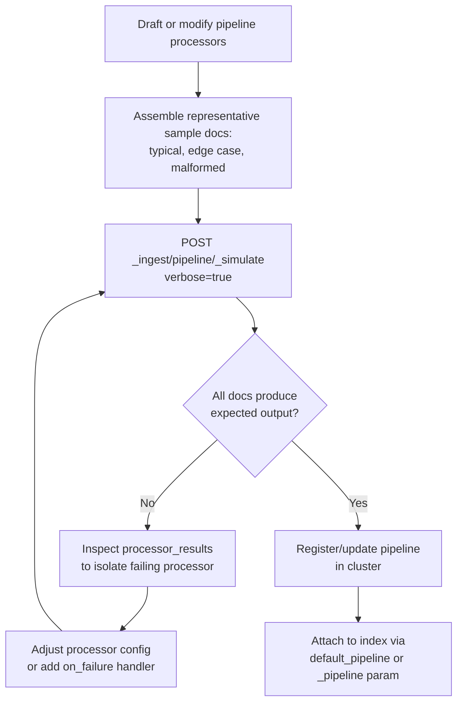

## Simulate Ingest Pipeline API

### Overview

The Simulate Pipeline API (`_ingest/pipeline/_simulate`) allows an ingest pipeline to be tested against sample documents without indexing anything. It executes every processor in the pipeline exactly as it would during real ingestion, returning the transformed document (or the error, if a processor fails) — making it the primary tool for developing and debugging ingest pipelines before attaching them to live indexing traffic.

### Basic Usage: Simulating an Inline Pipeline

```json
POST /_ingest/pipeline/_simulate
{
  "pipeline": {
    "processors": [
      {
        "set": {
          "field": "status",
          "value": "processed"
        }
      }
    ]
  },
  "docs": [
    {
      "_source": {
        "message": "hello world"
      }
    }
  ]
}
```

**Response**

```json
{
  "docs": [
    {
      "doc": {
        "_index": "_index",
        "_id": "_id",
        "_source": {
          "message": "hello world",
          "status": "processed"
        },
        "_ingest": {
          "timestamp": "2026-08-25T10:00:00.000Z"
        }
      }
    }
  ]
}
```

The pipeline is defined inline in the request body — no pipeline needs to be registered in the cluster first. This is the fastest iteration loop when actively developing a pipeline definition, since each edit-test cycle requires no cluster state changes.

### Simulating an Already-Registered Pipeline

Once a pipeline exists in the cluster, it can be simulated by name instead of inline definition:

```json
PUT /_ingest/pipeline/logs-pipeline
{
  "processors": [
    { "grok": { "field": "message", "patterns": ["%{IP:client_ip} %{WORD:method} %{URIPATH:path}"] } },
    { "geoip": { "field": "client_ip" } }
  ]
}
```

```json
POST /_ingest/pipeline/logs-pipeline/_simulate
{
  "docs": [
    {
      "_source": {
        "message": "203.0.113.5 GET /api/orders"
      }
    }
  ]
}
```

**Key Points**

- Simulating a registered pipeline by name is useful for regression-testing an existing pipeline against new sample documents after any change, without needing to re-paste the full processor definition into every test request
- Both inline and named simulation execute identically — the only difference is where the pipeline definition is sourced from

### Verbose Mode: Per-Processor Output

Adding `?verbose=true` reveals the document's state after **every individual processor**, not just the final result — essential for debugging which specific processor in a multi-step pipeline is responsible for an unexpected transformation:

```json
POST /_ingest/pipeline/logs-pipeline/_simulate?verbose=true
{
  "docs": [
    {
      "_source": {
        "message": "203.0.113.5 GET /api/orders"
      }
    }
  ]
}
```

**Response**

```json
{
  "docs": [
    {
      "processor_results": [
        {
          "processor_type": "grok",
          "status": "success",
          "doc": {
            "_source": {
              "message": "203.0.113.5 GET /api/orders",
              "client_ip": "203.0.113.5",
              "method": "GET",
              "path": "/api/orders"
            }
          }
        },
        {
          "processor_type": "geoip",
          "status": "success",
          "doc": {
            "_source": {
              "message": "203.0.113.5 GET /api/orders",
              "client_ip": "203.0.113.5",
              "method": "GET",
              "path": "/api/orders",
              "geoip": {
                "country_name": "United States",
                "location": { "lat": 37.751, "lon": -97.822 }
              }
            }
          }
        }
      ]
    }
  ]
}
```

**Key Points**

- Each entry in `processor_results` shows the document state immediately after that processor ran, allowing precise identification of exactly which step introduced, corrupted, or failed to produce an expected field
- This is the standard debugging approach for multi-processor pipelines, since without verbose mode a failure only reveals that *something* in the pipeline went wrong, not *which* processor

### Handling and Testing Processor Failures

Simulating documents that are expected to fail specific processors (e.g., a grok pattern that doesn't match) surfaces the exact error without affecting any real index:

```json
POST /_ingest/pipeline/logs-pipeline/_simulate?verbose=true
{
  "docs": [
    {
      "_source": {
        "message": "this does not match the grok pattern at all"
      }
    }
  ]
}
```

**Response excerpt**

```json
{
  "processor_type": "grok",
  "status": "error",
  "error": {
    "type": "exception",
    "reason": "Provided Grok expressions do not match field value"
  }
}
```

**Key Points**

- This confirms exactly how a pipeline behaves against malformed or unexpected input *before* that input can cause a failed or silently-mishandled document in production
- Testing edge cases and malformed inputs deliberately during pipeline development — not just the happy path — is what makes this API valuable beyond a basic functionality check

### Testing `on_failure` Handlers

Pipelines commonly define `on_failure` blocks to handle processor errors gracefully rather than rejecting the document outright. Simulation confirms this fallback behavior works as intended:

```json
POST /_ingest/pipeline/_simulate
{
  "pipeline": {
    "processors": [
      {
        "grok": {
          "field": "message",
          "patterns": ["%{IP:client_ip} %{WORD:method} %{URIPATH:path}"],
          "on_failure": [
            {
              "set": {
                "field": "grok_parse_failed",
                "value": true
              }
            }
          ]
        }
      }
    ]
  },
  "docs": [
    {
      "_source": {
        "message": "unparseable log line"
      }
    }
  ]
}
```

**Response**

```json
{
  "docs": [
    {
      "doc": {
        "_source": {
          "message": "unparseable log line",
          "grok_parse_failed": true
        }
      }
    }
  ]
}
```

This confirms the `on_failure` handler correctly sets `grok_parse_failed` rather than the document being rejected — precisely the behavior a well-designed pipeline should exhibit for malformed input.

### Testing Multiple Documents in One Request

The `docs` array accepts multiple documents, useful for testing a range of representative cases — typical input, edge cases, and malformed input — in a single simulation call:

```json
POST /_ingest/pipeline/logs-pipeline/_simulate
{
  "docs": [
    { "_source": { "message": "203.0.113.5 GET /api/orders" } },
    { "_source": { "message": "198.51.100.9 POST /api/checkout" } },
    { "_source": { "message": "malformed entry" } }
  ]
}
```

**Key Points**

- Each document in the response array corresponds positionally to its input, and each is evaluated independently — a failure on one document does not prevent the others from being simulated
- This makes it practical to build a small regression suite of representative sample documents that gets re-run against a pipeline any time its processors are modified

### Simulate Pipeline Testing Flow



### Relationship to Actual Ingestion

Simulation executes the exact same processor logic that runs during real document ingestion — it is not an approximation. The key difference is purely that simulated documents are never written to any index and never persist beyond the API response.

**Key Points**

- Because execution logic is identical, a pipeline that behaves correctly under simulation will behave identically when actually attached to indexing traffic via `?pipeline=<name>` or an index's `default_pipeline` setting
- This makes simulation a reliable pre-production verification step, not merely an approximate sanity check

### Common Pitfalls

- **Skipping verbose mode when debugging multi-processor pipelines**: without it, only the final document state is visible, making it far harder to isolate which processor introduced an issue
- **Only testing happy-path input**: pipelines that aren't tested against malformed, missing-field, or unexpected-format input can fail unpredictably in production when real-world data inevitably includes such cases
- **Forgetting to test `on_failure` handlers explicitly**: an `on_failure` block that itself contains a bug or typo will not be caught unless a simulation deliberately triggers the failure path it's meant to handle
- **Assuming simulation guarantees identical performance characteristics**: simulation confirms *correctness* of transformation logic, not throughput or latency under real production indexing load — performance testing of a pipeline attached to live ingestion is a separate concern
- **Not maintaining a reusable set of test documents**: ad hoc, one-off simulation calls during initial development are easy to lose track of; keeping a small, versioned set of representative sample documents makes pipeline changes easier to regression-test over time

### Conclusion

The Simulate Pipeline API provides an exact, side-effect-free way to test ingest pipeline logic against sample documents, using the identical processor execution path that live ingestion uses. Its verbose mode, multi-document support, and ability to test both inline and registered pipelines make it the standard tool for developing, debugging, and regression-testing ingest pipelines before they are attached to real indexing traffic.

**Related Topics**

- Ingest pipeline processors (grok, geoip, set, rename, and others)
- `on_failure` handlers and pipeline error handling design
- Default pipelines and per-request pipeline override (`?pipeline=`)
- Grok pattern debugging and custom pattern definitions
- Event-driven indexing patterns and where ingest pipelines fit in the flow
- Reroute processor for dynamic index routing during ingestion