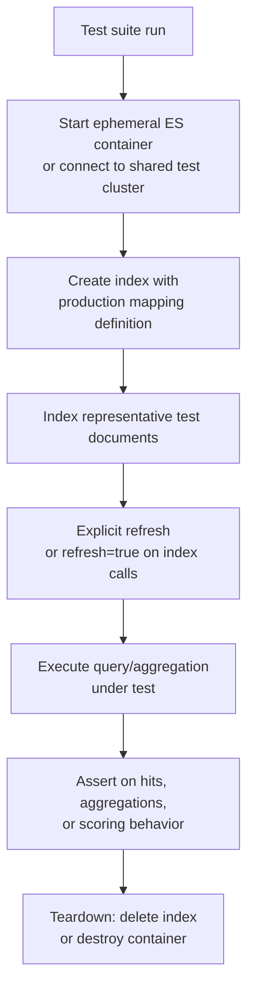

## Integration Testing Strategies

### Overview

Integration testing for Elasticsearch-backed applications verifies that queries, mappings, ingest pipelines, and indexing logic behave correctly against a real (or realistically simulated) Elasticsearch instance — as opposed to unit tests that mock the client entirely. Because so much of Elasticsearch's behavior (analyzer output, scoring, aggregation bucketing, mapping-driven type coercion) depends on the actual engine rather than application code, integration tests that exercise a real cluster catch an entire category of bugs that mocked unit tests structurally cannot.

### Why Mocking Elasticsearch Is Insufficient Alone

Unit tests that mock the Elasticsearch client (asserting the correct request body was constructed) are useful but fundamentally limited:

- They cannot verify that a query is actually valid against real mappings
- They cannot catch analyzer misconfiguration, since tokenization behavior only manifests when text actually passes through a real analysis chain
- They cannot verify aggregation bucketing or scoring behavior, both of which depend on the engine's actual implementation
- They provide false confidence that a query "works" when it may fail entirely once run against a live cluster

Integration tests close this gap by executing against a real Elasticsearch instance, even if that instance is ephemeral and test-scoped rather than a shared persistent environment.

### Test Environment Strategies

**Testcontainers (or equivalent ephemeral container orchestration)**

The most common modern approach: spin up a real, disposable Elasticsearch container for the duration of a test suite (or per test), using a library that manages container lifecycle automatically.

```python
from testcontainers.elasticsearch import ElasticsearchContainer

def test_product_search():
    with ElasticsearchContainer("docker.elastic.co/elasticsearch/elasticsearch:8.15.0") as es:
        client = es.get_client()
        client.indices.create(index="products", body={
            "mappings": {
                "properties": {
                    "name": {"type": "text"},
                    "price": {"type": "double"}
                }
            }
        })
        client.index(index="products", document={"name": "Wireless Keyboard", "price": 49.99})
        client.indices.refresh(index="products")

        response = client.search(index="products", query={"match": {"name": "keyboard"}})
        assert response["hits"]["total"]["value"] == 1
```

**Key Points**

- Each test (or test suite) gets a genuinely isolated, disposable cluster instance, eliminating cross-test data pollution without needing manual cleanup logic
- Pinning the exact Elasticsearch container version to match production is essential, since analyzer defaults, aggregation behavior, and API surface can shift between versions
- Container startup time adds latency to the test suite compared to mocked unit tests, which is a real tradeoff — this is typically mitigated by reusing a single container across multiple tests within a suite rather than starting a fresh container per individual test method

**Shared persistent test cluster**

An alternative to ephemeral containers: a long-lived Elasticsearch instance dedicated to a test/CI environment, with tests responsible for their own setup and teardown (creating and deleting test-specific indices per run).

**Key Points**

- Avoids per-test-run container startup latency, since the cluster is already running
- Requires more careful test isolation discipline — using uniquely-named indices per test run (e.g., with a timestamp or UUID suffix) to avoid collisions between concurrently-running test suites or leftover state from a previous failed run
- Introduces a shared-state risk that ephemeral containers avoid entirely: a poorly-cleaned-up previous test run can cause unrelated failures in a subsequent one

### The Refresh Problem in Tests

The single most common source of flaky Elasticsearch integration tests is failing to account for near-real-time search visibility. A newly indexed document is not immediately searchable — it becomes visible only after the next refresh cycle.

```python
client.index(index="products", document={"name": "Wireless Keyboard"})
response = client.search(index="products", query={"match_all": {}})
# response may show 0 hits here — the document hasn't been refreshed into a searchable segment yet
```

**Fix: explicit refresh after indexing, before asserting**

```python
client.index(index="products", document={"name": "Wireless Keyboard"})
client.indices.refresh(index="products")
response = client.search(index="products", query={"match_all": {}})
# now reliably shows the indexed document
```

**Alternative: `refresh=true` on the index request itself**

```python
client.index(index="products", document={"name": "Wireless Keyboard"}, refresh=True)
```

**Key Points**

- This is not a testing-specific quirk to work around cleverly — it reflects genuine near-real-time search behavior, and tests should exercise the real refresh semantics rather than assuming synchronous visibility
- `refresh=True` on individual index/bulk requests is convenient for tests but should generally be avoided in production indexing code, since forcing a refresh on every write defeats the batching efficiency the refresh interval is designed to provide
- Flaky tests that intermittently fail with unexpected zero-hit results are a strong signal of a missing refresh step, and should be the first thing checked before assuming a more complex bug

### Testing Mappings Explicitly

Rather than only testing query behavior against implicitly-created indices (which rely on dynamic mapping and can mask type-related bugs), integration tests should explicitly create indices with the exact production mapping definition, ideally sourced from the same file/template the application actually deploys:

```python
import json

def test_with_production_mapping():
    with open("mappings/products.json") as f:
        mapping = json.load(f)
    client.indices.create(index="products", body=mapping)
    # proceed with test using the real, deployed mapping
```

**Key Points**

- Testing against dynamically-mapped indices can pass even when the actual production mapping would reject or mistype the same data, since dynamic mapping infers types permissively
- Loading the mapping definition from the same source of truth used in deployment (rather than hand-writing a simplified test mapping) ensures the test suite catches mapping drift between what's tested and what's actually deployed

### Testing Ingest Pipelines Within Integration Tests

Combining the Simulate Pipeline API with integration tests provides fast, isolated pipeline verification without needing a full index round-trip for every test case:

```python
def test_log_pipeline():
    response = client.ingest.simulate(
        id="logs-pipeline",
        docs=[{"_source": {"message": "203.0.113.5 GET /api/orders"}}]
    )
    result = response["docs"][0]["doc"]["_source"]
    assert result["client_ip"] == "203.0.113.5"
    assert result["method"] == "GET"
```

**Key Points**

- Pipeline-specific tests using `_simulate` run faster and more predictably than a full index-and-query round trip, since no refresh timing is involved and no data persists
- These complement, rather than replace, end-to-end tests that verify a pipeline correctly applies when actually attached to a live index via `default_pipeline`

### Testing Aggregations and Faceted Search Logic

Aggregation-heavy features (faceted search, analytics dashboards) benefit particularly from integration testing, since bucket boundaries, `terms` cardinality behavior, and multi-facet filtered aggregation structure (see faceted search design) are exactly the kind of engine-dependent behavior that mocked tests cannot verify:

```python
def test_price_facet_counts():
    products = [
        {"name": "Item A", "price": 25},
        {"name": "Item B", "price": 75},
        {"name": "Item C", "price": 150},
    ]
    for p in products:
        client.index(index="products", document=p)
    client.indices.refresh(index="products")

    response = client.search(
        index="products", size=0,
        aggs={"price_ranges": {"range": {
            "field": "price",
            "ranges": [{"to": 50}, {"from": 50, "to": 100}, {"from": 100}]
        }}}
    )
    buckets = response["aggregations"]["price_ranges"]["buckets"]
    assert buckets[0]["doc_count"] == 1
    assert buckets[1]["doc_count"] == 1
    assert buckets[2]["doc_count"] == 1
```

### Integration Test Suite Structure



### CI/CD Integration Considerations

**Key Points**

- Pinning the exact Elasticsearch version in CI to match production avoids a class of bugs where tests pass against one version's behavior but fail against the deployed version's slightly different defaults
- Container-based approaches integrate naturally into most CI systems without requiring a persistent shared test cluster to be provisioned and maintained separately
- Test suite runtime grows with the number of tests requiring container startup; reusing a single container instance across many tests (with per-test index cleanup rather than per-test container restart) is the standard mitigation
- Combining `_validate/query` checks as a fast pre-check before full integration tests can catch obviously malformed queries early, reserving the more expensive full integration test run for genuine behavioral verification

### Common Pitfalls

- **Relying solely on mocked unit tests for query correctness**: catches request-construction bugs but not analyzer, mapping, scoring, or aggregation behavior — these require a real engine
- **Missing explicit refresh before assertions**: the single most common source of flaky, intermittently-failing Elasticsearch integration tests
- **Testing against dynamically-mapped indices instead of production mapping definitions**: masks type-related bugs that would only surface against the actual deployed mapping
- **Version mismatch between test and production Elasticsearch**: analyzer defaults, aggregation semantics, and API behavior can differ across versions, so pinning test infrastructure to the production version is important, not incidental
- **Insufficient test data isolation in shared persistent test clusters**: leftover state from a previous run or concurrent test execution can cause misleading failures unrelated to the code actually being tested
- **Not testing ingest pipelines and mapping together**: a pipeline tested only via `_simulate` in isolation can still fail once actually attached to an index if the resulting document doesn't conform to that index's mapping — full end-to-end coverage should include at least some tests that exercise the complete path

### Conclusion

Effective Elasticsearch integration testing requires exercising a real engine instance — via ephemeral containers or a dedicated shared cluster — rather than relying solely on mocked unit tests, since so much of Elasticsearch's behavior is engine-dependent rather than application-code-dependent. Explicit handling of refresh timing, use of production mapping definitions, and version-pinned test infrastructure are the details that most often separate a reliable integration test suite from a flaky one.

**Related Topics**

- Testcontainers and ephemeral test infrastructure patterns
- Near-real-time search and refresh interval semantics
- Simulate Pipeline API for isolated ingest logic testing
- Validate API as a fast pre-check before full integration tests
- CI/CD pipeline design for versioned infrastructure testing
- Mapping template management and drift detection between test and production