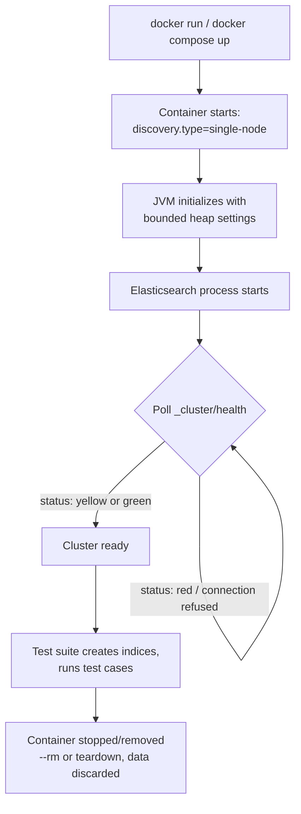

## Using Docker For Test Environments

### Overview

Running Elasticsearch in Docker for test environments provides a real, version-accurate engine instance without requiring a manually installed or shared cluster. This is the practical foundation underlying most modern integration testing approaches (including Testcontainers-based patterns), and understanding the Docker-level configuration directly is useful both for building custom test tooling and for diagnosing container-specific issues that higher-level test libraries can obscure.

### Minimal Single-Node Setup

Elasticsearch's Docker images default to expecting a multi-node production cluster configuration; for test environments, single-node discovery must be explicitly configured to avoid the container waiting indefinitely to discover cluster peers that don't exist.

```bash
docker run -d \
  --name es-test \
  -p 9200:9200 \
  -e "discovery.type=single-node" \
  -e "xpack.security.enabled=false" \
  docker.elastic.co/elasticsearch/elasticsearch:8.15.0
```

**Key Points**

- `discovery.type=single-node` is essential for test containers — without it, the node attempts standard cluster discovery and can fail to become healthy since no peer nodes exist to form a quorum with
- `xpack.security.enabled=false` disables authentication and TLS setup for the test instance, simplifying test client configuration considerably; this setting is appropriate for ephemeral, isolated test environments but should never be used for anything resembling a production or shared environment
- Pinning the exact version tag (`8.15.0` rather than `latest`) is important for reproducibility — an unpinned `latest` tag means test behavior can silently shift whenever the image is rebuilt or re-pulled

### Docker Compose for Multi-Service Test Environments

Most real applications need Elasticsearch alongside other services (a database, a message queue) for full integration testing. Docker Compose expresses this as a single, version-controlled definition:

```yaml
version: "3.8"
services:
  elasticsearch:
    image: docker.elastic.co/elasticsearch/elasticsearch:8.15.0
    environment:
      - discovery.type=single-node
      - xpack.security.enabled=false
      - "ES_JAVA_OPTS=-Xms512m -Xmx512m"
    ports:
      - "9200:9200"
    healthcheck:
      test: ["CMD-SHELL", "curl -sf http://localhost:9200/_cluster/health || exit 1"]
      interval: 5s
      timeout: 5s
      retries: 20

  app-tests:
    build: .
    depends_on:
      elasticsearch:
        condition: service_healthy
    environment:
      - ELASTICSEARCH_URL=http://elasticsearch:9200
```

**Key Points**

- `ES_JAVA_OPTS` bounding heap size is particularly important in CI environments with limited memory, since Elasticsearch's default heap sizing heuristics assume more available memory than many CI runners provide
- The `healthcheck` block, combined with `depends_on: condition: service_healthy`, ensures the test suite doesn't start attempting to connect before Elasticsearch has actually finished starting — without this, tests fail intermittently based on container startup race conditions rather than genuine bugs
- Using the internal Compose network hostname (`elasticsearch`, matching the service name) rather than `localhost` is necessary when the test runner itself is also containerized, since `localhost` inside a container refers to that container, not the host or sibling containers

### Waiting for Cluster Health Before Running Tests

Even with a healthcheck configured for orchestration purposes, test setup code should independently verify cluster readiness before proceeding, since "container started" and "Elasticsearch ready to serve requests" are not the same moment:

```python
import time
import requests

def wait_for_elasticsearch(url="http://localhost:9200", timeout=60):
    start = time.time()
    while time.time() - start < timeout:
        try:
            response = requests.get(f"{url}/_cluster/health")
            if response.json().get("status") in ("yellow", "green"):
                return True
        except requests.exceptions.ConnectionError:
            pass
        time.sleep(1)
    raise TimeoutError("Elasticsearch did not become healthy in time")
```

**Key Points**

- Polling `_cluster/health` and accepting `yellow` (not just `green`) is standard for single-node test clusters, since a single node cannot satisfy replica allocation and will report `yellow` status indefinitely by design, even when otherwise fully healthy and ready for testing
- Waiting specifically for `green` status on a single-node test cluster would hang indefinitely in most default configurations, since there are no additional nodes available to host replica shards

### Testcontainers as a Higher-Level Abstraction

The Docker configuration details above are exactly what libraries like Testcontainers automate — container startup, health-check polling, and port mapping — while providing a language-native API:

```python
from testcontainers.elasticsearch import ElasticsearchContainer

with ElasticsearchContainer("docker.elastic.co/elasticsearch/elasticsearch:8.15.0") as es:
    url = es.get_url()
    # container is already confirmed healthy by the time this line runs
```

**Key Points**

- Testcontainers-style libraries handle the wait-for-healthy logic, port allocation, and container lifecycle (including guaranteed cleanup even on test failure) that would otherwise need to be hand-rolled per the pattern above
- Understanding the underlying raw Docker configuration remains useful even when using such a library, since debugging an unhealthy or misbehaving test container often requires inspecting the same environment variables and health semantics directly

### Data Volume Considerations for Tests

By default, a container's filesystem (including indexed data) is ephemeral and destroyed when the container is removed — generally the desired behavior for test isolation, so this is usually left unconfigured rather than explicitly mounting a persistent volume.

```bash
docker run -d --rm \
  -e "discovery.type=single-node" \
  -e "xpack.security.enabled=false" \
  docker.elastic.co/elasticsearch/elasticsearch:8.15.0
```

**Key Points**

- The `--rm` flag ensures the container (and its ephemeral data) is removed automatically on stop, reinforcing clean test isolation without manual cleanup steps
- If a specific test scenario genuinely needs to verify data persistence behavior itself (e.g., testing snapshot/restore), an explicit named volume would be mounted deliberately for that scenario specifically, rather than as a general test environment default

### Resource Constraints in CI Environments

CI runners often have significantly less memory than local development machines, and Elasticsearch's JVM-based memory model requires explicit bounding to avoid startup failures or OOM kills:

```yaml
environment:
  - "ES_JAVA_OPTS=-Xms512m -Xmx512m"
  - "bootstrap.memory_lock=false"
```

**Key Points**

- Setting matching `-Xms` and `-Xmx` values avoids heap resizing overhead during startup, and keeping both modest (512MB is typically sufficient for small test datasets) prevents the container from being killed by CI resource limits
- `bootstrap.memory_lock=false` avoids a common CI failure mode where the container cannot lock memory pages due to CI runner restrictions, causing startup to fail entirely if left at its production-recommended `true` default

### Test Environment Bootstrap Flow



### Common Pitfalls

- **Omitting `discovery.type=single-node`**: causes the container to attempt production-style cluster discovery, which hangs or fails since no peer nodes exist for a standalone test instance
- **Using `latest` image tag instead of a pinned version**: introduces non-reproducible test behavior as the underlying image changes over time without an explicit, deliberate version bump
- **Waiting for `green` cluster status on a single-node setup**: hangs indefinitely by default, since a single node cannot satisfy replica shard allocation requirements; `yellow` is the correct target status for single-node test clusters
- **Not bounding JVM heap size in CI**: default heap sizing heuristics assume more available memory than many CI environments provide, leading to container startup failures or OOM kills that are easy to misdiagnose as unrelated test flakiness
- **Connecting via `localhost` from within another container**: fails silently or connects to the wrong service when the test runner itself is containerized; the Compose service name (or equivalent Docker network alias) must be used instead
- **Assuming container "started" means "ready to serve requests"**: the gap between process start and actual readiness is real and must be explicitly polled for, not assumed to be instantaneous

### Conclusion

Docker-based Elasticsearch test environments provide version-accurate, disposable engine instances essential for genuine integration testing, but require deliberate configuration — single-node discovery, disabled security for isolated environments, bounded JVM heap, and correct health-status polling — to run reliably, particularly in resource-constrained CI settings. Higher-level libraries like Testcontainers automate most of this, but understanding the underlying Docker mechanics remains valuable for debugging and for building custom test tooling beyond what such libraries directly support.

**Related Topics**

- Testcontainers and ephemeral test infrastructure patterns
- Integration testing strategies and refresh-timing considerations
- Elasticsearch cluster health states and single-node cluster behavior
- JVM heap sizing and memory configuration for Elasticsearch
- CI/CD pipeline design for containerized test dependencies
- Docker Compose service dependency and health check patterns