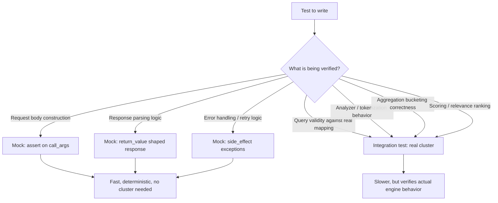

## Mocking In Unit Tests

### Overview

Mocking Elasticsearch in unit tests replaces the real client with a stand-in that returns predetermined responses, allowing application code that constructs queries, processes results, or handles errors to be tested in isolation — quickly, deterministically, and without any running cluster. This complements, rather than replaces, integration testing: mocks verify that application code behaves correctly *given* a certain Elasticsearch response, while integration tests verify that Elasticsearch actually *produces* that response for a given query.

### What Mocking Can and Cannot Verify

**Key Points**

- Mocking can verify: the correct request body is constructed for a given input, error responses are handled correctly, response parsing logic extracts the right fields, retry/backoff logic behaves as designed, and application-level business logic downstream of a search response is correct
- Mocking cannot verify: whether the constructed query is actually valid against real mappings, whether analyzer behavior produces the expected tokens, whether aggregation bucketing behaves as assumed, or whether scoring/ranking matches expectations — all of these require a real engine, as covered under integration testing strategies
- A test suite relying exclusively on mocks provides a false sense of coverage for exactly the class of bugs most specific to Elasticsearch's actual behavior; mocking is appropriately used for the portions of application logic that don't depend on engine internals

### Basic Client Mocking

```python
from unittest.mock import Mock, patch

def test_search_service_returns_parsed_results():
    mock_client = Mock()
    mock_client.search.return_value = {
        "hits": {
            "total": {"value": 1},
            "hits": [
                {"_id": "1", "_source": {"name": "Wireless Keyboard", "price": 49.99}}
            ]
        }
    }

    service = ProductSearchService(client=mock_client)
    results = service.search("keyboard")

    assert len(results) == 1
    assert results[0].name == "Wireless Keyboard"
    mock_client.search.assert_called_once()
```

**Key Points**

- This verifies that `ProductSearchService.search()` correctly parses a *given* Elasticsearch-shaped response into application domain objects — it says nothing about whether "keyboard" as a query would actually produce this response against real data
- Constructing the mock's `return_value` to match Elasticsearch's actual response shape accurately is important; a mock response with an unrealistic structure (missing fields real responses always include, or an oversimplified shape) can pass tests while the equivalent real-world code path would fail

### Asserting on Constructed Query Bodies

A common and valuable use of mocking is verifying that application code constructs the *intended* query, independent of whether that query is correct Elasticsearch DSL (which integration/validate-API testing covers separately):

```python
def test_search_applies_price_filter():
    mock_client = Mock()
    mock_client.search.return_value = {"hits": {"total": {"value": 0}, "hits": []}}

    service = ProductSearchService(client=mock_client)
    service.search("keyboard", max_price=100)

    call_args = mock_client.search.call_args
    query_body = call_args.kwargs["query"]
    assert query_body["bool"]["filter"] == [{"range": {"price": {"lte": 100}}}]
```

**Key Points**

- This isolates and directly tests the query-construction logic itself, which is ordinary application code and benefits from fast, deterministic unit testing like any other business logic
- This test would pass even if `price` were misspelled in the actual index mapping — that class of error is precisely what mocking cannot catch, reinforcing why this must be paired with integration or `_validate` checks

### Mocking Error Responses

Testing how application code handles Elasticsearch errors — connection failures, version conflicts, mapping errors — is often easier and more reliable via mocking than attempting to reproduce those exact failure conditions against a real cluster:

```python
from elasticsearch import ConnectionError, ConflictError

def test_search_handles_connection_error_gracefully():
    mock_client = Mock()
    mock_client.search.side_effect = ConnectionError("cluster unreachable")

    service = ProductSearchService(client=mock_client)
    result = service.search_with_fallback("keyboard")

    assert result == []  # graceful degradation, not an unhandled exception

def test_indexing_handles_version_conflict():
    mock_client = Mock()
    mock_client.index.side_effect = ConflictError("version conflict", meta=None, body=None)

    service = ProductIndexingService(client=mock_client)
    result = service.index_with_retry(document={"id": 1})

    assert result.retried is True
```

**Key Points**

- Deliberately simulating a real cluster outage, a specific version conflict, or a malformed-mapping error via a live integration test is often impractical or flaky; mocking these conditions directly is both easier and more reliable for testing error-handling code paths specifically
- This is one of the strongest justifications for mocking over pure integration testing — error-path testing benefits from deterministic, on-demand failure injection that a real cluster doesn't conveniently provide

### Mocking Bulk Operations

```python
def test_bulk_indexer_batches_correctly():
    mock_client = Mock()
    mock_client.bulk.return_value = {
        "errors": False,
        "items": [{"index": {"status": 201, "_id": "1"}}, {"index": {"status": 201, "_id": "2"}}]
    }

    indexer = BulkIndexer(client=mock_client, batch_size=2)
    indexer.index_documents([{"id": 1}, {"id": 2}])

    mock_client.bulk.assert_called_once()
    body = mock_client.bulk.call_args.kwargs["operations"]
    assert len(body) == 4  # 2 action lines + 2 document lines
```

**Key Points**

- Verifying the correct number of action/document line pairs in bulk request construction is a pure application-logic concern well suited to mocking
- Testing partial bulk failures (`errors: True` with some items failing) via mocked responses is a practical way to verify retry/error-collection logic without needing to engineer an actual partial failure against a real cluster

### Balancing Mocked and Integration Tests



**Key Points**

- The general principle: mock for testing application logic that sits *around* Elasticsearch calls (construction, parsing, error handling, retries), and use real integration tests for anything that depends on Elasticsearch's actual engine behavior
- A healthy test suite typically has many more mocked unit tests than integration tests, since unit tests are cheaper to run and more numerous by nature, with a smaller, focused set of integration tests covering the engine-dependent behaviors mocking cannot reach

### Fixture Libraries and Realistic Response Shapes

To reduce the risk of mocks drifting from real Elasticsearch response shapes over time, some teams maintain a small library of realistic fixture responses (captured from an actual cluster, or maintained alongside version upgrades) rather than hand-writing simplified mock responses ad hoc per test:

```python
import json

def load_fixture(name):
    with open(f"fixtures/es_responses/{name}.json") as f:
        return json.load(f)

def test_search_with_realistic_fixture():
    mock_client = Mock()
    mock_client.search.return_value = load_fixture("product_search_response")

    service = ProductSearchService(client=mock_client)
    results = service.search("keyboard")
    assert len(results) == 2
```

**Key Points**

- Fixtures periodically re-captured from a real integration test run (or a real cluster) reduce the risk of hand-written mock responses silently drifting from what Elasticsearch actually returns, particularly across version upgrades where response shape details can change
- This hybrid approach — real captured shapes, but replayed without a live cluster — offers a middle ground between pure hand-written mocks and full integration tests for response-parsing-focused test cases specifically

### Common Pitfalls

- **Testing only with mocks and no integration tests**: leaves an entire category of engine-dependent bugs (invalid queries, analyzer misbehavior, incorrect aggregation logic) completely uncovered
- **Hand-writing oversimplified mock responses**: a mock missing fields, metadata, or structure that real Elasticsearch responses always include can mask parsing bugs that would surface immediately against a real response
- **Not testing error/failure paths at all**: since error conditions are often harder to reproduce against a real cluster, they're sometimes skipped entirely rather than deliberately mocked — leaving retry logic, fallback behavior, and error handling untested
- **Asserting only on the final `assert_called_once()` without inspecting call arguments**: confirms a call happened but not that it was constructed correctly; meaningful mock-based tests typically need to inspect `call_args` to verify actual request content
- **Letting mock fixtures drift from real response shapes over time**: especially across Elasticsearch version upgrades, where response structure can change in ways a stale hand-maintained mock won't reflect

### Conclusion

Mocking Elasticsearch in unit tests is well suited to verifying application-level logic — query construction, response parsing, error handling, retry behavior — quickly and deterministically, but is structurally incapable of verifying anything dependent on Elasticsearch's actual engine behavior. A reliable test strategy uses mocking for the former and reserves real integration tests, as covered separately, for the latter; treating either as sufficient on its own leaves meaningful gaps in coverage.

**Related Topics**

- Integration testing strategies for engine-dependent behavior verification
- Using Docker for test environments as the integration-test counterpart
- Bulk API error handling and partial failure patterns
- Retry and backoff strategies for transient Elasticsearch errors
- Fixture and snapshot testing approaches for response shape stability
- Contract testing between application code and evolving Elasticsearch mappings