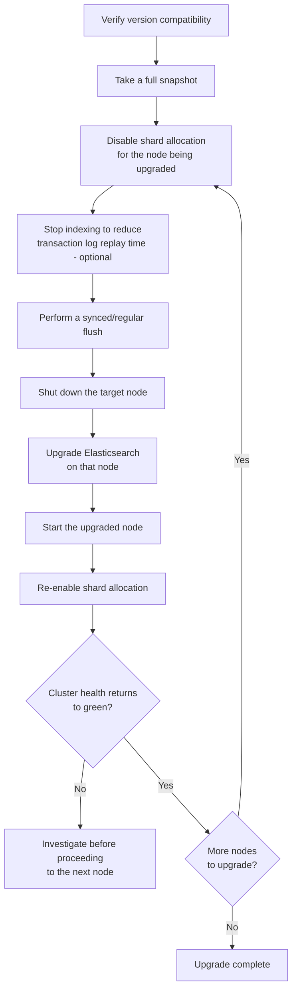

## Rolling Upgrade Process

### Overview

A rolling upgrade updates every node in an Elasticsearch cluster to a new version one at a time, keeping the cluster fully available and serving traffic throughout the process. This is the standard upgrade approach for production clusters, as opposed to a full-cluster restart upgrade (stopping every node, upgrading, then restarting all at once), which requires downtime. Rolling upgrades depend on maintaining data availability and cluster health at every intermediate step, which requires specific preparation and sequencing.

### Prerequisites and Version Compatibility

Not every version jump supports rolling upgrades. Elasticsearch's compatibility policy generally allows rolling upgrades between consecutive minor versions within a major version, and from the last minor version of one major version to the next major version, but not arbitrary multi-major-version jumps directly [Unverified — exact supported upgrade paths vary by specific version pair and should be confirmed against the official upgrade compatibility matrix for the versions actually involved before planning a real upgrade].

**Key Points**

- Attempting a rolling upgrade across an unsupported version gap can result in an unstable cluster or failed node join, since newer and older nodes may not be able to communicate cluster state correctly across incompatible version boundaries
- Checking the specific source and target version pair against official compatibility documentation is a mandatory first step, not an optional precaution, given how much this varies by version
- A full backup (snapshot) before beginning any upgrade is standard practice regardless of how well-supported the version path is, since it provides a recovery path if something goes wrong mid-upgrade

### High-Level Rolling Upgrade Flow



### Step-by-Step: Upgrading a Single Node

**Step 1 — Disable shard allocation**

Before stopping a node, shard allocation should be temporarily disabled to prevent Elasticsearch from immediately attempting to relocate that node's shards elsewhere the moment it goes offline — an expensive and unnecessary operation, since the node is coming back shortly.

```json
PUT /_cluster/settings
{
  "persistent": {
    "cluster.routing.allocation.enable": "primaries"
  }
}
```

Setting this to `"primaries"` rather than `"none"` still allows primary shard allocation if genuinely needed, while preventing unnecessary replica reallocation during the brief node restart window.

**Step 2 — Perform a flush**

```json
POST /_flush
```

A flush persists any in-memory transaction log operations to disk and clears the transaction log, which reduces the amount of work Elasticsearch needs to do to replay operations when the node restarts — directly shortening node startup time.

**Step 3 — Stop the node and upgrade**

The node is shut down using standard OS-level or service-manager mechanisms, the Elasticsearch software itself is upgraded (package manager, container image update, or binary replacement depending on deployment method), and the node is started again.

**Step 4 — Wait for the node to rejoin and shards to recover**

```json
GET /_cat/nodes?v
GET /_cluster/health?wait_for_status=yellow&timeout=60s
```

The restarted node needs to rejoin the cluster and its shards need to recover (replaying any transaction log entries, or recovering from peer nodes) before it's considered fully back.

**Step 5 — Re-enable shard allocation**

```json
PUT /_cluster/settings
{
  "persistent": {
    "cluster.routing.allocation.enable": "all"
  }
}
```

**Step 6 — Confirm cluster health before proceeding**

```json
GET /_cluster/health
```

Cluster status should return to `green` (or the expected steady-state status, `yellow` for single-replica setups without enough nodes to place every replica) before beginning the same process on the next node.

**Key Points**

- Proceeding to the next node before confirming the current node's shards have fully recovered risks compounding problems — if a second node goes down while the cluster is still mid-recovery from the first, data availability could be genuinely at risk depending on replica configuration
- This entire sequence is typically automated via orchestration tooling (Kubernetes operators, configuration management scripts, or cloud-provider-managed upgrade workflows) rather than performed as literal manual API calls in most production environments, but understanding the underlying sequence is important for both building such automation and for troubleshooting when it doesn't behave as expected

### Handling Master-Eligible Nodes

**Key Points**

- Clusters should always maintain a sufficient number of master-eligible nodes throughout the upgrade to preserve quorum — taking down too many master-eligible nodes simultaneously, even sequentially without adequate recovery time between them, risks losing the ability to elect a master
- If the currently-elected master node is the one being upgraded, a new master election occurs automatically as part of the node stopping; this is expected and normal cluster behavior, not a failure condition, provided sufficient other master-eligible nodes remain

### Mixed-Version Cluster Behavior During Upgrade

For the duration of a rolling upgrade, the cluster necessarily runs a mix of old- and new-version nodes simultaneously — this is the defining characteristic that makes rolling upgrades different from a full-cluster restart.

**Key Points**

- Elasticsearch is designed to tolerate this mixed-version state for the supported upgrade paths, but new features introduced in the newer version are generally not usable until every node has been upgraded, since older nodes cannot participate in newer-version-only functionality
- Mixed-version clusters should be treated as a transient state to move through as quickly as reasonably safe, rather than a configuration to remain in for an extended period, since it is tested and supported specifically as a transitional state rather than a long-term operating mode [Inference — the exact extent of tolerated mixed-version duration isn't a fixed universal number and depends on the specific version pair's compatibility guarantees]

### Verifying Upgrade Success

After all nodes have been upgraded, final verification confirms the cluster is genuinely healthy and running the expected version uniformly:

```json
GET /_cat/nodes?v&h=name,version
```

```json
GET /_cluster/health
```

**Key Points**

- Confirming every node reports the same, expected new version is a direct check that the rolling upgrade actually completed everywhere, rather than assuming success from the process having run without visible errors
- Re-enabling any application features that depend on the new version, or any index settings held back pending full-cluster upgrade completion, is typically the final step once version uniformity is confirmed

### Rollback Considerations

**Key Points**

- Rolling upgrades are generally easier to roll forward than backward — downgrading a node to an older version is not always a supported or safe operation, particularly once the newer version has written data in a format the older version cannot read
- This is precisely why a full snapshot before beginning the upgrade is standard practice: if something goes seriously wrong, restoring from snapshot is the reliable recovery path, rather than assuming individual nodes can simply be downgraded back to their prior version
- Testing the exact planned upgrade path against a non-production cluster with realistic data and configuration beforehand substantially reduces the risk of encountering an unexpected issue for the first time in production

### Common Pitfalls

- **Skipping the pre-upgrade snapshot**: leaves no reliable recovery path if the upgrade encounters serious problems partway through
- **Not disabling shard allocation before stopping a node**: causes unnecessary and potentially expensive shard relocation for what should be a brief, planned restart
- **Proceeding to the next node before cluster health returns to a stable state**: compounds risk if problems from the first node's upgrade haven't fully resolved before introducing a second node restart
- **Assuming rolling upgrades support arbitrary version jumps**: attempting an unsupported multi-version jump can result in node join failures or cluster instability; the supported path must be confirmed for the specific versions involved
- **Taking down too many master-eligible nodes without adequate recovery time between them**: risks quorum loss even if each individual node upgrade is performed correctly in isolation
- **Treating a mixed-version cluster state as a stable long-term configuration**: it is supported as a transitional state during upgrade, not as an indefinite operating mode
- **Not testing the upgrade path on a non-production cluster first**: increases the likelihood of encountering a version-specific issue for the first time under production conditions rather than in a lower-stakes environment

### Conclusion

A rolling upgrade allows an Elasticsearch cluster to move to a new version node by node while remaining fully available, but requires careful sequencing — disabling allocation, flushing, confirming health before proceeding — to avoid compounding risk across the upgrade window. Version compatibility must be confirmed for the specific source and target versions involved, a pre-upgrade snapshot provides the primary recovery path if problems arise, and the mixed-version state inherent to the process should be treated as a transient condition to move through deliberately rather than an extended operating mode.

**Related Topics**

- Snapshot and restore for pre-upgrade backup strategy
- Cluster health states and shard allocation mechanics
- Master-eligible node quorum and election behavior
- Version compatibility matrices and supported upgrade paths
- Orchestration tooling for automated rolling upgrades (Kubernetes operators, configuration management)
- Testing upgrade paths in non-production environments before production rollout