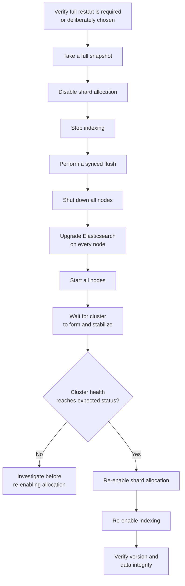

## Full Cluster Restart Upgrade

### Overview

A full cluster restart upgrade stops every node in an Elasticsearch cluster simultaneously, upgrades all of them, and brings the entire cluster back up together — as opposed to a rolling upgrade, which upgrades nodes one at a time while remaining available throughout. This approach requires cluster downtime for the duration of the upgrade, but is sometimes required rather than optional: certain version jumps or major structural changes are not supported via rolling upgrade at all, making a full cluster restart the only valid path.

### When Full Cluster Restart Is Required Rather Than Optional

**Key Points**

- Some major version upgrades explicitly do not support rolling upgrades and require a full cluster restart instead — this is determined by Elasticsearch's compatibility matrix for the specific source and target versions, not a matter of operator preference [Unverified — which specific version boundaries mandate a full restart versus permit rolling upgrade changes between releases and must be confirmed against official documentation for the exact versions involved]
- Even when a rolling upgrade is technically supported, a full cluster restart may still be deliberately chosen for non-production environments where a maintenance window is acceptable and the operational simplicity of a full restart outweighs the availability benefit of rolling upgrade
- Determining which path applies is the essential first step before planning any upgrade, since attempting a rolling upgrade across a boundary that requires a full restart can result in cluster instability or failed node joins

### High-Level Full Cluster Restart Flow



### Step-by-Step Process

**Step 1 — Take a full snapshot**

```json
PUT /_snapshot/backup_repo/pre_upgrade_snapshot
{
  "indices": "*",
  "ignore_unavailable": true,
  "include_global_state": true
}
```

This is the primary recovery mechanism if the upgrade encounters serious problems, and is non-negotiable regardless of how routine the upgrade is otherwise expected to be.

**Step 2 — Disable shard allocation**

```json
PUT /_cluster/settings
{
  "persistent": {
    "cluster.routing.allocation.enable": "none"
  }
}
```

Unlike a rolling upgrade (where `"primaries"` is often used to allow limited allocation during a brief single-node restart), a full cluster restart typically uses `"none"` entirely, since every node is going down together and there is no meaningful allocation target until the whole cluster returns.

**Step 3 — Stop indexing and perform a flush**

```json
POST /_flush
```

Halting new writes before shutdown, followed by a flush, minimizes the transaction log replay work needed across every shard when the cluster comes back — directly reducing overall recovery time once nodes restart.

**Step 4 — Shut down all nodes**

Every node in the cluster is stopped. Because shard allocation is disabled and a flush has been performed, this can be done without the cluster attempting any shard relocation mid-shutdown.

**Step 5 — Upgrade every node**

Elasticsearch is upgraded on every node in the cluster — package manager, container image, or binary replacement, consistent with the deployment method in use. Since every node is offline simultaneously, this step can be parallelized across all nodes rather than sequenced, which is one of the operational simplifications a full restart offers over a rolling upgrade.

**Step 6 — Start all nodes and wait for cluster formation**

```json
GET /_cluster/health?wait_for_status=yellow&timeout=120s
```

Nodes need to rediscover each other, elect a master, and begin shard recovery. This step typically takes longer than a single node's recovery in a rolling upgrade, since the entire cluster is forming from a cold start simultaneously rather than one node rejoining an already-stable cluster.

**Step 7 — Re-enable shard allocation**

```json
PUT /_cluster/settings
{
  "persistent": {
    "cluster.routing.allocation.enable": "all"
  }
}
```

**Step 8 — Verify cluster health and version**

```json
GET /_cluster/health
GET /_cat/nodes?v&h=name,version
```

Confirm the cluster returns to its expected steady-state health status and every node reports the new version uniformly before resuming normal write traffic.

**Step 9 — Resume indexing**

Once health and version are confirmed, application write traffic can resume.

### Full Cluster Restart vs Rolling Upgrade

| Factor | Full cluster restart | Rolling upgrade |
| --- | --- | --- |
| Downtime | Yes — cluster unavailable for the duration | No — cluster remains available |
| Required for certain major version jumps | Sometimes mandatory | Not applicable in those cases |
| Operational complexity | Simpler — no per-node sequencing | More complex — per-node health verification between steps |
| Total upgrade duration | Often shorter overall (parallelized upgrade step) | Often longer overall (sequential per-node steps) |
| Risk profile | All nodes changed together — less gradual verification | Gradual — problems on one node can be caught before affecting all nodes |

**Key Points**

- The gradual, per-node verification a rolling upgrade provides is a meaningful risk-mitigation advantage that a full cluster restart forgoes by design, since every node changes together with no opportunity to catch a problem on a single node before it's applied cluster-wide
- Conversely, a full cluster restart avoids the extended mixed-version cluster state a rolling upgrade necessarily passes through, which some teams prefer to avoid regardless of whether it's a supported and tested transitional state

### Recovery Time Considerations

**Key Points**

- Because every node starts from a stopped state simultaneously, shard recovery after a full cluster restart involves the entire cluster's data being reconciled at once, rather than a single node's shards recovering against an otherwise-stable cluster — this generally makes the recovery phase take longer in absolute terms than any single step of a rolling upgrade, even though the overall process may avoid the cumulative per-node overhead of sequencing through many nodes individually
- Indices configured with delayed allocation settings (`index.unassigned.node_left.delayed_timeout`) behave differently across this scenario than a single-node rolling restart, since the delayed allocation mechanism is designed around brief single-node absences rather than a coordinated full-cluster stop — reviewing these settings before a full restart is worthwhile [Inference — the precise interaction depends on cluster configuration and shard count, and is best verified against the specific cluster's settings rather than assumed uniformly]

### Common Pitfalls

- **Not taking a snapshot beforehand**: identical risk to rolling upgrades — without a snapshot, there is no reliable recovery path if the upgrade fails partway through
- **Not disabling shard allocation before shutdown**: without this, restarting nodes may begin relocating shards as they come online out of sync with each other, adding unnecessary recovery overhead and potential instability during cluster formation
- **Underestimating cluster formation time**: teams accustomed to rolling upgrade's per-node timing sometimes underestimate how much longer full-cluster formation and shard recovery takes when starting the entire cluster from cold simultaneously
- **Skipping the pre-shutdown flush**: increases transaction log replay work across every shard during recovery, extending the overall downtime window unnecessarily
- **Choosing full cluster restart when rolling upgrade was actually viable**: incurs avoidable downtime for teams that assumed a full restart was required without checking whether the specific version pair actually supported rolling upgrade
- **Resuming write traffic before confirming version uniformity and health**: risks writing data against a cluster that hasn't actually finished forming correctly, or that has a lingering node still on the old version due to an incomplete upgrade step

### Conclusion

A full cluster restart upgrade is required for certain major version transitions that don't support rolling upgrade, and involves stopping, upgrading, and restarting every node together rather than sequentially. It trades cluster availability during the upgrade window for a simpler, more parallelizable upgrade step and avoids the extended mixed-version state a rolling upgrade passes through — but forgoes the gradual, per-node risk verification that makes rolling upgrades the generally preferred approach whenever they are supported and downtime is not acceptable.

**Related Topics**

- Rolling upgrade process and per-node sequencing
- Snapshot and restore for pre-upgrade backup strategy
- Cluster formation and master election on cold start
- Delayed allocation settings and shard recovery timing
- Version compatibility matrices and mandatory upgrade paths
- Maintenance window planning for downtime-tolerant environments