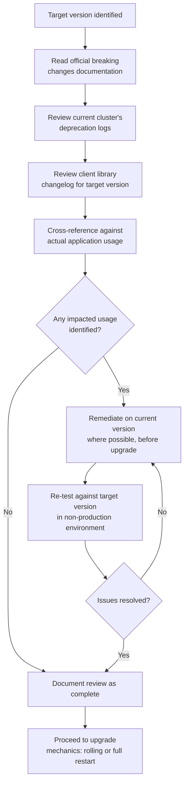

## Breaking Changes Review Process

### Overview

A breaking changes review process is the systematic evaluation of a target Elasticsearch version's documented breaking changes against an application's actual usage — mappings, queries, client library calls, deprecated settings — before committing to an upgrade. Unlike the mechanical steps of a rolling or full cluster restart upgrade, this is fundamentally an audit process: identifying what specifically in a given upgrade could break existing behavior, and addressing it deliberately rather than discovering it in production.

### Why This Is a Distinct Step From the Upgrade Mechanics

**Key Points**

- The rolling upgrade and full cluster restart processes describe *how* to move nodes to a new version safely from an infrastructure perspective; they say nothing about whether the application's queries, mappings, or client code will actually continue to function correctly once nodes are running that new version
- A cluster can complete a rolling upgrade successfully — every node healthy, version uniform — while application queries begin failing or behaving differently immediately afterward, if breaking changes were not reviewed and addressed beforehand
- This process should be completed and any necessary remediation applied *before* scheduling the actual node upgrade, not discovered reactively during or after it

### Sources of Breaking Change Information

**Key Points**

- Official release notes and dedicated "breaking changes" documentation pages for the specific target version are the authoritative source and should be reviewed directly rather than relying on general recollection of past version changes, since breaking changes are version-specific and change with every release
- Deprecation warnings logged by the *current* version, before upgrading, are a direct and practical early-warning signal — Elasticsearch typically logs deprecation warnings for functionality that will be removed or changed in a future major version, often one or more versions ahead of the actual removal
- Client library changelogs (for whichever language client the application uses) are a separate but related source, since client library breaking changes don't always align one-to-one with server-side breaking changes

### Reviewing Deprecation Logs Proactively

Before planning an upgrade, checking the current cluster's deprecation log surfaces usage patterns that are already flagged as deprecated — giving advance warning before those patterns become actual breaking changes in a future version:

```json
GET /_logging/deprecation
```

Or, depending on version and configuration, deprecation warnings may appear in dedicated deprecation log files on disk, or as response headers on individual API calls:



```
Warning: 299 Elasticsearch-8.15.0 "[types removal] Specifying types in search requests is deprecated."
```

**Key Points**

- Deprecation warnings appearing in normal application traffic today are a strong, concrete signal of what to prioritize in the breaking changes review, since they represent patterns the application is *actually using*, not merely theoretical concerns from reading documentation in isolation
- Addressing deprecated usage patterns before they become breaking changes — ideally on the current version, before the upgrade — is generally safer than attempting to fix them at the same time as the version upgrade itself, since it isolates the two changes and makes it easier to attribute any resulting issue to one or the other

### Building a Breaking Changes Checklist

A structured review typically walks through several categories of potential impact:

**Mapping and index-level changes**

- Deprecated or removed field types
- Changed default analyzer behavior
- Changed default settings (e.g., a setting's default value changing between versions)

**Query DSL changes**

- Deprecated or removed query types or parameters
- Changed default behavior of existing query types (e.g., a scoring algorithm default changing)

**API changes**

- Removed or renamed endpoints
- Changed required/optional parameters
- Changed response body structure

**Client library changes**

- Method signature changes
- Changed default client behavior (timeouts, retry logic, serialization)

**Security and cluster settings**

- Deprecated cluster settings requiring migration to new equivalents
- Changed default security posture between versions

### Breaking Changes Review Workflow



**Key Points**

- Remediating deprecated usage on the *current* version, before the upgrade, is preferable whenever a deprecated feature has a documented replacement that already works on the current version — this decouples the breaking-change fix from the version upgrade itself, simplifying rollback and troubleshooting if either step has problems
- Not every breaking change has a same-version remediation path; some genuinely require the new version's behavior and can only be addressed as part of the upgrade itself, in which case the fix and the upgrade must be tested together

### Testing Against the Target Version Before Production Upgrade

Reviewing documentation identifies *what* might break; actually testing the application against the target version confirms *whether* it does, for that application's specific usage:

```yaml
# docker-compose.yml — target version test environment
services:
  elasticsearch-target:
    image: docker.elastic.co/elasticsearch/elasticsearch:8.16.0
    environment:
      - discovery.type=single-node
      - xpack.security.enabled=false
```

Running the application's full integration test suite (see integration testing strategies) against a target-version container is the most direct way to surface breaking changes empirically, complementing the documentation-based review rather than replacing it.

**Key Points**

- Documentation review can miss subtle behavioral changes that aren't explicitly called out as "breaking" but nonetheless affect specific query patterns or edge cases the application relies on — empirical testing against the actual target version catches these in a way pure documentation review cannot
- This is precisely why version-pinned test infrastructure (as covered under Docker test environments) is valuable beyond routine testing — it makes testing against a *specific candidate upgrade version*, ahead of any production change, straightforward to set up

### Handling Third-Party Plugins and Tooling

**Key Points**

- Any installed plugins, or external tooling that integrates with the cluster (monitoring agents, backup tooling, custom ingest processors), need their own compatibility check against the target version independent of Elasticsearch's own breaking changes — a plugin built against an older version may not load or function correctly on a newer one
- This is easy to overlook when the review focuses primarily on application query/mapping compatibility, but an incompatible plugin can prevent cluster nodes from starting at all, making it a higher-severity risk than most query-level breaking changes despite being less obviously "the application's" concern

### Documenting the Review

**Key Points**

- Maintaining a written record of what was reviewed, what remediation was applied, and what test results confirmed compatibility provides value beyond the immediate upgrade — it becomes a reference for the next upgrade cycle, and a rollback justification record if issues are discovered post-upgrade
- This documentation is particularly valuable in larger teams or regulated environments, where an upgrade decision may need to be justified or audited after the fact, separate from whether the upgrade itself succeeded technically

### Common Pitfalls

- **Relying solely on infrastructure-level upgrade success as confirmation the upgrade "worked"**: a healthy, version-uniform cluster says nothing about whether application-level breaking changes have been addressed
- **Skipping deprecation log review on the current version**: this is often the single most concrete, application-specific signal available, and skipping it in favor of only reading general release notes misses issues specific to actual usage patterns
- **Fixing breaking changes at the same time as performing the version upgrade**: conflates two changes, making it harder to attribute any resulting problem to the code change versus the version change specifically
- **Overlooking plugin and third-party tooling compatibility**: an incompatible plugin can be a more severe failure mode (nodes failing to start) than most query-level breaking changes, yet is easy to omit from a review focused primarily on application query behavior
- **Treating documentation review as sufficient without empirical testing**: some behavioral changes are subtle enough not to be explicitly flagged as breaking in documentation, and only surface through actual testing against the target version
- **Not documenting the review outcome**: leaves no reference trail for future upgrades or for justifying the upgrade decision after the fact

### Conclusion

A breaking changes review process is a necessary companion to the mechanical steps of a rolling or full cluster restart upgrade, addressing a different risk entirely: whether the application's actual usage of Elasticsearch continues to function correctly on the target version, independent of whether the cluster infrastructure itself upgrades successfully. Combining documentation review, current-version deprecation log inspection, and empirical testing against the target version in a non-production environment provides the most complete picture before committing to a production upgrade.

**Related Topics**

- Rolling upgrade process and per-node upgrade mechanics
- Full cluster restart upgrade and when it's required
- Integration testing strategies for target-version validation
- Using Docker for test environments to stand up target-version test clusters
- Deprecation logging and early-warning signal monitoring
- Plugin compatibility and third-party tooling version management