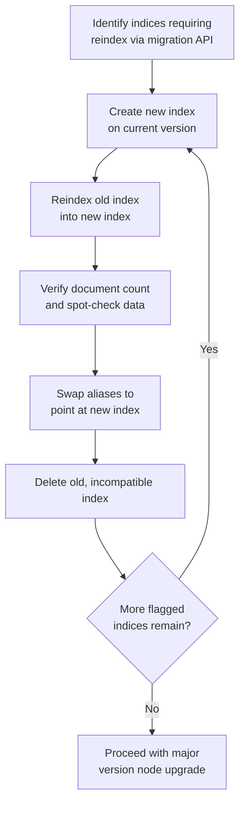

## Reindex For Major Version Migration

### Overview

Reindex for major version migration is the process of moving all data from an old-version-compatible index structure into a newly created index that conforms to a target major version's requirements, when in-place upgrade paths (rolling upgrade, full cluster restart) are insufficient because the index's underlying Lucene format or structure is not compatible across the version gap. This is distinct from routine reindexing for mapping changes — it's specifically driven by major version compatibility requirements, most notably Lucene index format compatibility limits, which typically only guarantee direct readability across a bounded number of prior major versions.

### Why Node Upgrades Alone Are Sometimes Insufficient

**Key Points**

- Rolling and full cluster restart upgrades handle moving the Elasticsearch *software* to a new version, but Lucene — the underlying search library Elasticsearch is built on — has its own index format compatibility guarantees, which are typically narrower than Elasticsearch's own supported upgrade paths [Unverified — the exact number of major versions of backward format compatibility Lucene guarantees varies by release and should be confirmed against official documentation for the specific versions involved]
- An index created on a sufficiently old major version can become entirely unreadable by a new-enough Elasticsearch/Lucene version, even though the intervening node-level upgrades themselves completed successfully — this is a data-format limitation, not a node-health or cluster-configuration issue
- This is why major version upgrade documentation often explicitly calls out a reindex requirement for indices below a certain age/version, separate from and in addition to the node upgrade process itself

### Identifying Indices That Require Reindexing

Elasticsearch typically surfaces this requirement directly via a dedicated API or upgrade assistant tooling, rather than requiring manual version archaeology across every index:

```json
GET /_migration/deprecations
```

**Key Points**

- This endpoint (or equivalent tooling depending on version, sometimes surfaced through a Kibana-based upgrade assistant) identifies indices created on old enough versions that they will not be usable once the cluster reaches the target major version, flagging them explicitly rather than leaving this to be discovered empirically
- Indices created via reindex or rollover on a more recent version, even if the *data* originated long ago, are not subject to this limitation in the same way, since the index's own Lucene format reflects when the index itself was created, not when its source data was first generated
- This distinction matters directly for rollover-pattern deployments: older backing indices in a long-lived rollover alias may need remediation even while the current write index does not, since each backing index carries its own creation-time format

### The Reindex-for-Migration Workflow



**Key Points**

- Critically, this reindexing work is typically done **before** the node-level major version upgrade, using the *current* version's Reindex API against the current version's cluster — reindexing old-format indices into new-format ones while still running the older Elasticsearch version, so that by the time nodes are actually upgraded, no incompatible indices remain
- This ordering (reindex first, then upgrade nodes) avoids ever having a fully-upgraded cluster attempt to open an index it structurally cannot read

### Executing the Reindex

```json
PUT /orders-reindexed
{
  "settings": {
    "number_of_shards": 3
  },
  "mappings": {
    "properties": {
      "order_id": { "type": "keyword" },
      "amount": { "type": "double" }
    }
  }
}
```

```json
POST /_reindex?slices=auto&wait_for_completion=false
{
  "source": { "index": "orders-legacy" },
  "dest": { "index": "orders-reindexed" }
}
```

This follows the same mechanical Reindex API pattern covered under zero-downtime reindexing, but the driving motivation here is version-format compatibility rather than a mapping or schema change — the destination mapping may be functionally identical to the source, with the reindex existing purely to regenerate the index in the current version's Lucene format.

**Key Points**

- Because the goal is often format regeneration rather than a mapping change, the destination mapping frequently mirrors the source mapping closely or exactly, unless a mapping improvement is also being bundled into the same migration for efficiency
- Combining a genuine mapping change with the mandatory format-migration reindex is a common and reasonable efficiency, since the index is already being rewritten regardless — but this should be a deliberate decision, tested accordingly, rather than incidental scope creep into what's otherwise a mechanical compatibility fix

### Handling Rollover-Pattern and Data Stream Indices Specifically

**Key Points**

- Long-lived rollover aliases or data streams can accumulate backing indices spanning many versions over their lifetime, meaning a major version migration may need to reindex a subset of older backing generations while leaving recent ones untouched
- After reindexing an old backing index, it must be re-added to the alias (or data stream's internal management) in place of the original, following the same alias-swap mechanics covered under the rollover pattern and write/read alias pattern topics, ensuring the write alias, read alias, and any generation ordering remain correct
- This is a case where understanding the alias mechanics from earlier topics directly informs how to execute the migration correctly — a version-migration reindex is not exempt from the same atomic alias-switching discipline that applies to any other reindex-and-cutover scenario

### Verifying Data Integrity Post-Reindex

```json
GET /orders-legacy/_count
GET /orders-reindexed/_count
```

Comparing document counts between source and destination is a basic first check, though not sufficient alone — spot-checking specific documents, and ideally running the application's integration test suite against the reindexed index, provides stronger confidence that the migration preserved data correctly.

**Key Points**

- Document count matching confirms no documents were silently dropped, but does not confirm field-level data integrity was preserved correctly, particularly if any script-based transformation was applied during the reindex
- Reindex operations that hit version conflicts or errors partway through should be investigated rather than assumed to have completed cleanly just because the API call itself returned without an outright failure — checking the reindex task's response for `failures` and conflict counts is a necessary verification step

### Capacity Planning for Version-Migration Reindexes

**Key Points**

- Unlike a routine mapping-change reindex affecting one index, a major version migration can require reindexing many indices at once (every old backing index in a long-lived rollover alias, for instance), which has cumulative implications for cluster resource usage, disk space (both old and new copies temporarily coexist), and total migration duration
- Running these reindex operations with throttling (`requests_per_second`) and during lower-traffic periods, spread across a planned timeline rather than attempted all at once, is generally prudent for clusters with many indices requiring this treatment
- Disk space headroom must account for both the old and new index existing simultaneously during the migration window, per index being migrated — this can be a substantial temporary storage requirement for clusters with large historical data volumes

### Common Pitfalls

- **Attempting the node-level major version upgrade before completing required reindexing**: risks the upgraded cluster being unable to open old-format indices at all, turning a planned migration into an unplanned incident
- **Not using the migration/deprecation API to identify affected indices systematically**: relying on manual version archaeology across potentially many indices is error-prone compared to using the tooling designed to surface this specific requirement
- **Assuming document count matching alone confirms successful migration**: doesn't catch field-level corruption or transformation errors, particularly when script-based reindexing is involved
- **Underestimating disk space requirements during migration**: old and new indices coexisting temporarily, multiplied across potentially many indices being migrated, can be a significant and easily underestimated storage requirement
- **Forgetting alias/data stream bookkeeping after reindexing a backing index**: a reindexed backing index that isn't correctly reintegrated into its rollover alias or data stream breaks the continuity that rollover-pattern queries depend on
- **Treating format-migration reindexing as identical in urgency to routine mapping-change reindexing**: it is a hard compatibility requirement gating the ability to upgrade at all, not an optional improvement, and should be scheduled and prioritized accordingly ahead of the actual node upgrade date

### Conclusion

Reindexing for major version migration addresses a compatibility limitation distinct from the node-level mechanics of rolling or full cluster restart upgrades: old-format indices that a target version's Lucene implementation cannot read at all, regardless of how smoothly the node software upgrade itself proceeds. This work is identified via migration/deprecation tooling, executed on the current version before node upgrades begin, and follows the same Reindex API and alias-swap mechanics used elsewhere — but carries the added weight of being a hard prerequisite for upgrade eligibility rather than an optional data-quality improvement.

**Related Topics**

- Rolling upgrade process and node-level upgrade mechanics
- Full cluster restart upgrade and when it's required
- Breaking changes review process for the surrounding upgrade context
- Zero-downtime reindexing mechanics applied here for format migration
- Index alias rollover pattern and backing index version management
- Lucene index format compatibility and version support windows