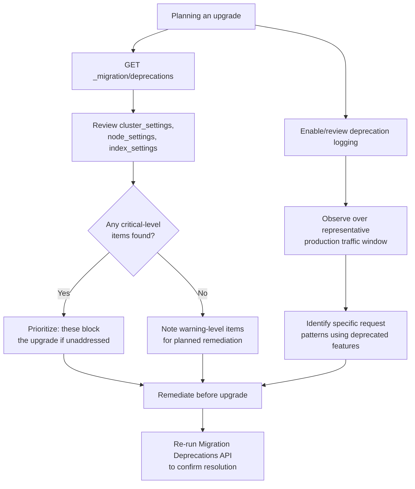

## Deprecation API And Logs

### Overview

The deprecation API and deprecation logging system surface functionality that is scheduled for removal or behavioral change in a future Elasticsearch version, while the cluster is still running its current version. These mechanisms provide the primary early-warning signal for upgrade planning — identifying what actual usage in a cluster relies on deprecated behavior, rather than requiring a manual cross-reference against documentation for every feature in use.

### The Migration Deprecations API

```json
GET /_migration/deprecations
```

**Response (excerpt)**

```json
{
  "cluster_settings": [
    {
      "level": "warning",
      "message": "Cluster setting [xpack.monitoring.enabled] is deprecated",
      "url": "https://www.elastic.co/guide/...",
      "details": "Remove this setting"
    }
  ],
  "node_settings": [],
  "index_settings": {
    "orders-legacy": [
      {
        "level": "critical",
        "message": "Index created before 7.0",
        "url": "https://www.elastic.co/guide/...",
        "details": "This index must be reindexed before upgrading to the next major version"
      }
    ]
  },
  "data_streams": {}
}
```

**Key Points**

- Results are organized by scope: `cluster_settings`, `node_settings`, `index_settings` (per-index), and `data_streams` — allowing targeted remediation rather than a single undifferentiated list
- The `level` field distinguishes severity — `critical` typically indicates something that will actively block or break the upgrade if unaddressed (such as the index-format issue covered under reindex for major version migration), while `warning` indicates deprecated but not upgrade-blocking usage
- Each entry includes a `url` pointing to relevant documentation and a `details` field describing the specific remediation needed, making this API actionable rather than merely diagnostic
- This API reflects the cluster's *current configuration state* — settings, index metadata — rather than runtime query patterns, which is a distinct and complementary signal to deprecation logging covered next

### Deprecation Logging

While the Migration Deprecations API reports on static configuration, deprecation logging captures **runtime usage** of deprecated functionality as it actually happens — specific queries, specific API calls, specific client behavior.

**Key Points**

- Deprecation log entries are written when an actual request uses deprecated functionality, distinguishing this from the Migration API's point-in-time configuration snapshot; a deprecated query type only appears in the deprecation log once something has actually issued that query
- This makes deprecation logs the more precise signal for identifying which specific application code paths need attention, since the Migration API can tell you a setting is deprecated but the deprecation log tells you a particular request pattern is actively hitting deprecated behavior right now

### Locating and Configuring Deprecation Logs

Deprecation log output location and verbosity are configurable, and behavior has evolved across versions — in many recent versions, deprecation logging is emitted as a dedicated log stream/index rather than only a flat file.

```json
PUT /_cluster/settings
{
  "persistent": {
    "logger.deprecation": "WARN"
  }
}
```

**Key Points**

- Depending on version, deprecated usage may also be surfaced as HTTP response headers on the specific API call that triggered it — useful for catching deprecation warnings directly during development or testing rather than only through log aggregation after the fact
- Deprecation logs can grow noisy in clusters with many active deprecated usage patterns; some deployments configure sampling or rate-limiting on deprecation log volume to avoid overwhelming log storage, at the cost of losing visibility into the exact frequency of each deprecated pattern
- Reviewing deprecation logs is most useful when done over a representative window of real production traffic, not just a brief sampling period, since infrequently-used code paths relying on deprecated behavior might not surface during a short observation window

### Deprecation Discovery Flow



### Combining Both Signals in a Review

The Migration Deprecations API and deprecation logs answer related but distinct questions, and a thorough breaking changes review process draws on both:

| Signal | Answers | Best for |
| --- | --- | --- |
| Migration Deprecations API | What configuration/index state is deprecated *right now* | Point-in-time audit, critical blockers |
| Deprecation logs | What runtime request patterns are *actively* using deprecated behavior | Identifying specific application code needing remediation |

**Key Points**

- The Migration API alone can miss deprecated *query patterns* that don't correspond to any persistent setting or index metadata — a deprecated query DSL parameter, for instance, may only surface through deprecation logging since it's a per-request behavior, not a stored configuration state
- Conversely, deprecation logs alone can miss deprecated *configuration* that simply hasn't been exercised by any recent request but would still block or break an upgrade — a deprecated index setting on a rarely-queried archival index, for example
- Using only one of the two signals leaves a real gap in coverage; a complete review draws on both

### Addressing `critical`-Level Findings First

**Key Points**

- `critical`-level items from the Migration Deprecations API represent genuine upgrade blockers — most commonly the index-format compatibility issue covered under reindex for major version migration — and should be treated as the highest-priority remediation work, ahead of `warning`-level items
- `warning`-level items are typically safe to defer relative to `critical` ones, but should still be tracked and addressed with reasonable lead time, since a feature deprecated as a warning in one version often becomes a breaking removal in a subsequent one

### Re-Verification After Remediation

After addressing identified issues, re-running both checks confirms the remediation actually resolved the flagged concern rather than assuming it did based on the fix being applied:

```json
GET /_migration/deprecations
```

**Key Points**

- Configuration-level fixes (updating a deprecated setting) are straightforward to re-verify via the Migration API directly
- Runtime usage fixes (updating application query construction to avoid a deprecated query pattern) are better re-verified by observing deprecation logs over a subsequent traffic window, confirming the previously-logged pattern no longer appears, rather than relying solely on code review confidence that the fix was applied correctly everywhere it needed to be

### Common Pitfalls

- **Checking only the Migration Deprecations API and skipping deprecation log review**: misses runtime query-pattern deprecations that don't correspond to persistent configuration state
- **Checking only deprecation logs and skipping the Migration API**: misses configuration-level and index-metadata-level deprecations that may not have been recently exercised by traffic but still block or affect an upgrade
- **Reviewing deprecation logs over too short a traffic window**: infrequently-triggered code paths using deprecated functionality can be missed if the observation period doesn't capture their occurrence
- **Deprioritizing `warning`-level findings entirely**: warnings often become breaking changes in a subsequent version, and treating them as fully optional rather than scheduled work can result in scrambling when they do become blocking
- **Not re-verifying remediation**: assuming a fix resolved a flagged deprecation without re-checking the relevant API or log output leaves open the possibility the fix was incomplete or applied to the wrong code path
- **Letting deprecation log volume go unmanaged**: in clusters with many active deprecated patterns, unbounded deprecation log growth can itself become an operational nuisance, though aggressive sampling/rate-limiting trades this off against losing visibility into deprecated usage frequency

### Conclusion

The Migration Deprecations API and deprecation logging together provide the concrete, cluster-specific evidence needed for a breaking changes review process — the API surfacing deprecated configuration and index-level state, and logs surfacing deprecated runtime query patterns as they actually occur. Neither alone is sufficient; a thorough pre-upgrade review draws on both signals, prioritizes `critical`-level findings first, and re-verifies that applied remediation actually resolved what was flagged.

**Related Topics**

- Breaking changes review process and how these APIs fit into it
- Reindex for major version migration, the typical fix for critical index-format findings
- Rolling upgrade process and full cluster restart upgrade mechanics
- Client library changelog review as a complementary signal
- Log aggregation and retention strategy for deprecation log volume
- Cluster settings management and deprecated setting migration