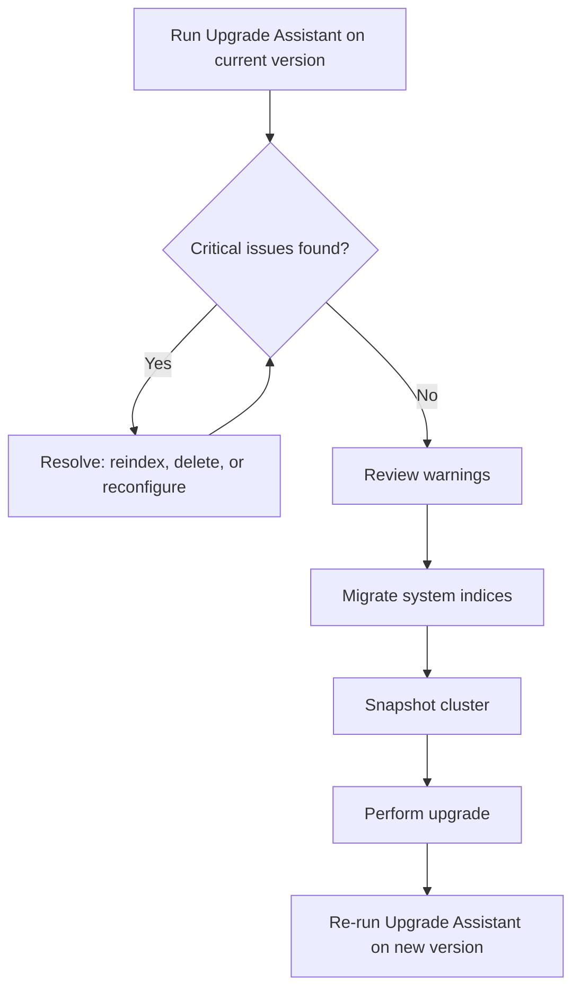

## Elasticsearch Upgrade Assistant

### Purpose and Scope

The Upgrade Assistant is a Kibana-based tool that inspects a cluster's current state and surfaces issues that would block or degrade a version upgrade before it happens. It checks cluster and index settings, mappings, deprecated API usage, and ILM/snapshot configuration against the requirements of the target version, then groups findings into actionable steps. It is the primary pre-flight tool for major version upgrades (e.g., 7.x → 8.x, 8.x → 9.x) and is also useful for minor-version deprecation checks.

It is accessed in Kibana under **Stack Management → Upgrade Assistant**.

### Why It Exists

Elasticsearch enforces stricter compatibility rules across major versions than within a major version line. Indices created on very old versions, deprecated mapping types, removed cluster settings, and deprecated security realms can all cause a cluster to fail to start or fail to fully function after an in-place upgrade. Running the Upgrade Assistant against the *current* version — ideally the last minor release before the target major — surfaces these problems while they are still fixable in a running cluster, rather than after a failed restart.

### Core Checks Performed

**Cluster Settings**

Flags deprecated or removed cluster-level settings, including some transient settings that are no longer supported in newer versions (transient cluster settings were deprecated and removed as a category in later 8.x/9.x releases in favor of persistent settings).

**Index Settings and Mappings**

Detects indices using removed or deprecated mapping constructs (e.g., very old `_type`-based multi-type indices from pre-7.x era migrations that were never reindexed), deprecated field types, and index settings that will not be honored going forward.

**Index Compatibility (Reindex Required)**

Identifies indices created on a version too old to be read directly by the target version. Elasticsearch generally supports reading indices created in the *previous* major version only; indices older than that must be reindexed or deleted before upgrading. The assistant flags these explicitly and, for many cases, offers a **Reindex** action directly in the UI.

**Deprecated API and Feature Usage**

Surfaces deprecated REST API calls, deprecated query DSL constructs, and deprecated security or ILM configuration detected from cluster logs and settings.

**System Indices**

Flags system indices (e.g., `.security`, `.kibana`, `.tasks`) that require migration to the version's expected internal format, and can trigger the system index migration process from the same screen.

**Snapshot and ILM Configuration**

Checks for ILM policies and snapshot lifecycle configurations referencing deprecated settings or actions.

### Typical Workflow



### Issue Severity Levels

**Critical**

Must be resolved before upgrading; the cluster will fail to start, fail health checks, or lose functionality if the upgrade proceeds without addressing these. Common example: indices too old to be read by the target version.

**Warning**

Deprecated but not currently breaking; functionality will continue to work in the immediate upgrade but is scheduled for removal in a future version. These should be tracked and resolved on a reasonable timeline rather than ignored indefinitely.

### Reindexing Old Indices

For indices flagged as incompatible, the assistant can trigger a reindex operation that:

- Creates a new index using a naming convention (often suffixed, e.g., `reindexed-v9-<original-name>`)
- Copies documents from the old index into the new one via the internal Reindex API
- Optionally sets up an alias so applications continue querying the original index name transparently

[Inference] The exact reindex UI workflow, naming conventions, and available automation (e.g., one-click reindex vs. guided manual steps) differ across Elastic versions and Kibana releases, so the specific screens should be verified against the documentation for the exact source and target versions involved.

Manually, the same operation can be performed via the Reindex API:

```json
POST _reindex
{
  "source": {
    "index": "old_index_v6"
  },
  "dest": {
    "index": "old_index_v6_reindexed"
  }
}
```

### System Index Migration

Newer Elasticsearch versions store internal state (security, Kibana saved objects, ML metadata, etc.) in system indices with stricter formatting requirements. The Upgrade Assistant includes a **Migrate System Indices** step that:

- Verifies system indices are in the expected format for the target version
- Triggers internal reindexing of system indices where required
- Blocks progression until migration completes successfully, since a failed system index migration can affect security configuration or Kibana state

This step should be run only when the cluster is otherwise healthy, since system index migration is itself a sensitive operation.

### Pre-Upgrade Checklist

- **Back up first.** Take a full snapshot before making any changes surfaced by the Upgrade Assistant, since reindexing and settings changes are not trivially reversible.
- **Resolve all Critical issues.** These are blocking; the upgrade should not proceed until the assistant reports none remaining.
- **Review Warnings.** Not blocking immediately, but plan remediation to avoid becoming blocking issues in a future upgrade cycle.
- **Run on the last minor of the current major.** Deprecation logging and the assistant's checks are most complete on the final minor release before the target major version.
- **Re-run after remediation.** Fixing one issue (e.g., a reindex) can occasionally reveal or resolve dependent issues; re-running confirms a clean state.
- **Check custom plugins and integrations separately.** The assistant covers Elasticsearch/Kibana-native deprecations; third-party plugins and external client library compatibility are not covered and must be checked against their own release notes.

### CLI and API Alternative

For clusters managed outside Kibana, or for automation/scripting, equivalent deprecation information can be retrieved directly via the Deprecation Info API:

```json
GET /_migration/deprecations
```

This returns the same category of findings (cluster settings, node settings, index-level issues) that back the Kibana UI, making it usable in CI/CD pre-upgrade gating scripts.

### Common Pitfalls

- **Treating Warnings as optional forever.** Deprecated features are eventually removed; deferring warning remediation across multiple major versions compounds the eventual migration effort.
- **Skipping the snapshot step.** Reindex operations triggered by the assistant consume cluster resources and disk space, and a failed or partial reindex without a snapshot can leave data in an inconsistent state.
- **Running the assistant only once.** Cluster state changes over time (new indices created, new deprecated API calls made by applications); running it only long before the actual upgrade date can miss issues introduced afterward.
- **Ignoring client-side deprecations.** The assistant reports server-side and cluster-state issues; deprecated request patterns from application code calling the REST API are not automatically caught unless they appear in deprecation logs during the assistant's log-scan window.

### Related Topics

- Reindex API (deep dive: slicing, throttling, script-based transforms during reindex)
- Snapshot and Restore workflow
- Rolling upgrade vs. full-cluster restart upgrade strategies
- Deprecation logging configuration (`logger.deprecation` levels)
- System indices architecture and access restrictions
- Index lifecycle management (ILM) policy compatibility across versions