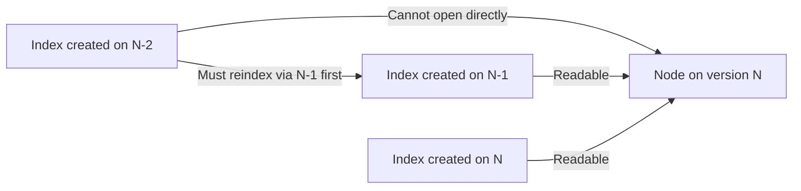

## Mapping and Index Compatibility

### Overview

Mapping and index compatibility governs whether indices created on one Elasticsearch version can be read, written to, and searched by a different (typically newer) version. Elasticsearch enforces compatibility guarantees within a major version line, and much stricter constraints across major version boundaries. Understanding these rules is essential before any upgrade, reindex planning, or cross-cluster search/replication setup.

### The Core Compatibility Rule

Elasticsearch generally guarantees that a node can read indices created in the **current major version** and the **immediately preceding major version**. Indices created two or more major versions back cannot be opened or read directly and must be reindexed (using a version that can still read them) before they can be used on a newer version.



This means a two-step upgrade path is sometimes required: an index created on a version too old for the target must first be reindexed while running on an intermediate version that can still read it, before proceeding to the final target version.

### Lucene Version Boundaries

Compatibility is ultimately tied to the underlying Lucene index format, since Elasticsearch stores data in Lucene segments. Each Elasticsearch major version bundles a specific Lucene version, and Lucene itself only guarantees backward-read-compatibility for one prior major version of its own index format. This is why the "N-1 readable, N-2 not" rule exists — it mirrors Lucene's own compatibility contract rather than being an arbitrary Elasticsearch policy.

[Inference] Exact Lucene version pairings per Elasticsearch release change with every major version, so the specific "which Lucene version ships with which Elasticsearch version" mapping should be checked against release notes for the versions in question rather than assumed.

### Mapping Type Removal (`_type`)

One of the most disruptive mapping compatibility changes in Elasticsearch's history was the removal of mapping types (the `_type` field allowing multiple document "types" per index), which were deprecated starting in 6.x and fully removed in 7.x, making every index effectively single-type going forward.

**Practical impact:**

- Indices created before 6.x that still relied on multiple types per index cannot be opened on 7.x+ without first being split into separate single-type indices and reindexed.
- Client code and application queries that referenced `_type` in search or index requests needed to be updated to omit it.
- The default type name `_doc` became the conventional placeholder in the REST API path where a type was still syntactically expected in early 7.x for backward compatibility, though this has since also been phased out.

### Deprecated and Removed Field Types

Certain field type behaviors are altered or removed across major versions. Examples of the category of change (not exhaustive, and version-specific):

- **`string` field type** — removed in favor of the `text`/`keyword` split, requiring mapping updates for any index still using the legacy `string` type.
- **Geo-shape indexing strategies** — older `geo_shape` mapping parameters (e.g., certain `tree`-based indexing strategies) were deprecated in favor of vector-based indexing strategies as default.
- **`_all` field** — the catch-all searchable field was deprecated and removed, requiring reliance on `copy_to` or multi-field search instead.

[Inference] The precise version at which any individual field type or parameter was deprecated versus fully removed should be confirmed against the specific version's breaking-changes documentation, since deprecation and removal are usually separated by one or more major versions to give migration time.

### Checking Index Compatibility

The Deprecation Info API reports index-level compatibility issues programmatically:

```json
GET /_migration/deprecations
```

Cluster state can also be inspected per-index to determine creation version:

```json
GET /my_index/_settings
```

The response includes `index.version.created`, which encodes the Elasticsearch version the index was originally created on. This value does not change even if the index has since been through mapping updates, making it the authoritative source for determining whether an index falls into the "too old to open" category ahead of an upgrade.

```json
{
  "my_index": {
    "settings": {
      "index": {
        "version": {
          "created": "7100099"
        }
      }
    }
  }
}
```

### Reindexing to Resolve Incompatibility

When an index is too old to be opened directly, the remediation path is to reindex it into a new index while running on a version that can still read the old format:

```json
POST _reindex
{
  "source": {
    "index": "legacy_index"
  },
  "dest": {
    "index": "legacy_index_reindexed"
  }
}
```

**Key considerations:**

- Reindexing must happen *before* upgrading past the version boundary that would make the source index unreadable.
- Mapping changes are often bundled into the same reindex operation (e.g., converting deprecated field types to current equivalents) since the documents are already being rewritten.
- An alias can be swapped after reindex completes so that application queries against the original index name continue working without code changes.

```json
POST _aliases
{
  "actions": [
    { "remove": { "index": "legacy_index", "alias": "current_alias" } },
    { "add": { "index": "legacy_index_reindexed", "alias": "current_alias" } }
  ]
}
```

### Mapping Compatibility Within a Major Version

Even within a single major version line, mappings are not fully mutable. Elasticsearch enforces these constraints on any existing mapping:

- **Field type cannot be changed** once documents have been indexed under a mapping — a field defined as `text` cannot later be changed to `keyword` in-place.
- **New fields can be added** to an existing mapping (either explicitly or via dynamic mapping) without conflict.
- **Multi-fields** (`fields` parameter) can be added to provide an additional indexing strategy for an existing field (e.g., adding a `.keyword` sub-field to an existing `text` field) without reindexing the base field, though the new sub-field only applies to documents indexed after the mapping change unless a reindex is also performed.

This immutability is why reindexing is the standard mechanism for any structural mapping change, not just for cross-major-version compatibility.

### Dynamic Mapping and Compatibility Drift

Dynamic mapping can introduce compatibility risk over time: if field types inferred automatically differ across ingestion batches (e.g., a field sometimes arrives as a numeric string and sometimes as an integer), mapping conflicts can occur at the shard level, and inconsistent index templates across a long-lived index pattern (daily/rolling indices) can result in indices within the same logical dataset having subtly different mappings, complicating later reindex or upgrade operations. Explicit mappings and strict index templates reduce this drift risk.

### Cross-Cluster Search and Replication Compatibility

Compatibility rules also apply between clusters, not just across time on a single cluster:

- **Cross-Cluster Search (CCS)** generally supports querying between clusters within a supported version skew (commonly the same major version, or adjacent versions depending on the specific feature and release).
- **Cross-Cluster Replication (CCR)** has its own compatibility matrix between leader and follower cluster versions.

[Inference] Exact supported version skew for CCS and CCR varies by release and should be verified against the current compatibility matrix in the official documentation before designing a multi-cluster topology spanning different versions.

### Compatibility Checklist Before Upgrading

- Identify indices by creation version using `index.version.created` across the cluster.
- Reindex any index older than the target version's supported "N-1" boundary.
- Audit mappings for deprecated field types and constructs flagged by the Deprecation Info API.
- Verify index templates and ILM policies reference only current mapping constructs, since old indices continuing to roll over under outdated templates perpetuates the compatibility problem.
- Confirm client library versions used by applications are compatible with the target Elasticsearch version's mapping and query DSL behavior.

### Related Topics

- Reindex API (scripted transforms, slicing for large reindex jobs)
- Index templates and composable template versioning
- Elasticsearch upgrade assistant
- Cross-Cluster Search and Cross-Cluster Replication version compatibility matrices
- Multi-fields and field type immutability
- Dynamic mapping strategies and strict mapping enforcement (`dynamic: strict`)