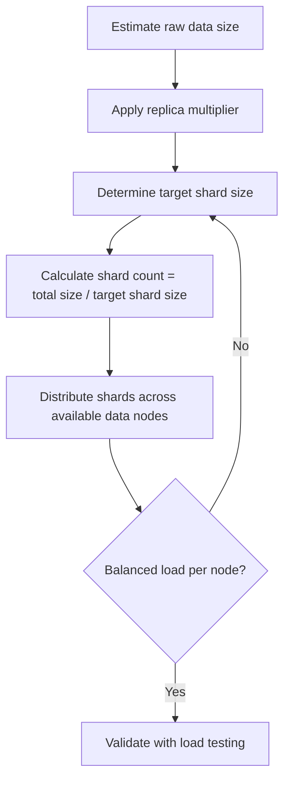
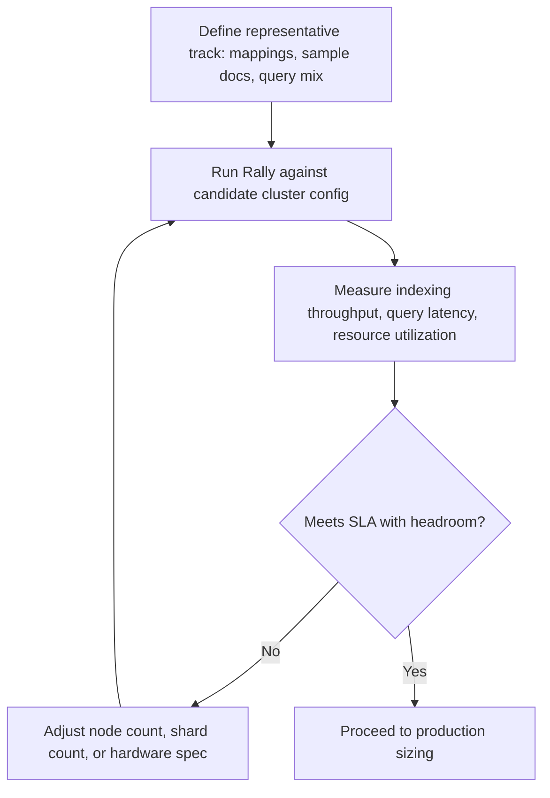

## Cluster Sizing and Capacity Planning

### Overview

Cluster sizing determines how many nodes, of what hardware specification, are needed to reliably store and serve a given dataset and query/indexing workload. It is not a one-time calculation — it is an ongoing process that balances data volume, ingestion rate, query patterns, redundancy requirements, and cost. Undersizing leads to performance degradation, cluster instability, and cascading failures under load; oversizing wastes budget. Capacity planning aims to find a defensible, monitored middle ground with room for growth.

### Core Sizing Inputs

**Data volume**

Total raw data size, projected growth rate, and retention period. This is the starting point for storage calculations.

**Indexing (ingest) rate**

Documents or bytes per second the cluster must sustain, including peak bursts, not just average throughput.

**Query rate and complexity**

Queries per second, along with their cost profile — simple term lookups are cheap; deep aggregations, large `terms` aggregations with high cardinality, and wildcard/regex queries are expensive.

**Retention and lifecycle**

How long data must remain searchable at full performance versus how long it can live in cheaper, slower storage tiers before deletion.

**Redundancy requirements**

Replica count, which multiplies both storage footprint and required indexing throughput, in exchange for availability and read scaling.

### Storage Sizing

**Estimating index size**

A common rule of thumb is that indexed data on disk (including Lucene overhead, indices for aggregation support like doc values, and index compression) tends to run larger than the original raw source data, though the exact multiplier is highly dependent on mapping choices, the number of indexed fields, and compression settings.

[Inference] Any specific storage-inflation ratio (e.g., "1.1x" or "1.5x" raw data) is workload- and mapping-dependent and should be derived empirically by indexing a representative sample dataset and measuring actual index size, rather than assumed from a generic rule of thumb.

**Replica overhead**

Each replica is a full copy of the primary shard's data. A `number_of_replicas: 1` setting doubles the storage footprint; `2` triples it, and so on.

$$\text{Total Storage} = \text{Primary Data Size} \times (1 + \text{replica\_count})$$

**Reserved disk headroom**

Elasticsearch's disk-based shard allocation watermarks (`cluster.routing.allocation.disk.watermark.low/high/flood_stage`) reserve a portion of disk before triggering allocation restrictions or read-only enforcement, so usable capacity should be planned well below 100% of raw disk size — commonly targeting no more than roughly 80–85% utilization before intervention thresholds are reached, though the exact watermark values are configurable and should be set deliberately rather than left at defaults for large clusters.

### Shard Sizing

**Target shard size**

A widely cited general guideline is to keep individual shard sizes in a range of roughly tens of gigabytes rather than either very small (many megabytes) or very large (hundreds of gigabytes+) shards, since both extremes carry costs: many tiny shards inflate cluster overhead (each shard has memory and file-handle cost regardless of size), while very large shards slow recovery, relocation, and can concentrate too much load on a single shard during query execution.

[Inference] The specific numeric target (commonly cited figures in community guidance range roughly from 10GB to 50GB per shard depending on use case) is a heuristic, not a hard Elasticsearch-enforced limit, and the right number depends on node hardware, query patterns, and how the shard count interacts with replica and node count; it should be validated against the specific workload rather than treated as a universal constant.

**Shard count vs. node count**

Total primary + replica shards should be distributed such that no node is significantly overloaded relative to others, and ideally the shard count is a multiple that distributes evenly across data nodes to avoid hotspotting.

**Avoiding oversharding**

Creating far more shards than necessary (e.g., via overly granular daily indices on a low-volume dataset) increases cluster state size, heap usage on the master/coordinating nodes, and per-shard overhead without a corresponding performance benefit. Index Lifecycle Management (ILM) rollover based on size or document count thresholds, rather than purely time-based rollover, helps avoid this.

### Memory and Heap Sizing

**JVM heap allocation**

The general guideline is to allocate no more than roughly 50% of a node's available RAM to the JVM heap, leaving the remainder for the operating system's file system cache, which Lucene relies on heavily for read performance since it memory-maps segment files.

**Heap size ceiling**

JVM heap sizes are commonly capped around 30-32GB regardless of available RAM, because exceeding this threshold disables a JVM optimization called compressed ordinary object pointers (compressed oops), which can paradoxically reduce effective usable heap efficiency above that point. [Inference] The exact compressed-oops threshold is JVM-implementation and platform dependent and has shifted slightly across JVM versions, so the precise cutover point should be confirmed against the JVM version in use rather than assumed to be a fixed universal constant.

**Off-heap memory needs**

Beyond JVM heap, Elasticsearch and Lucene rely on off-heap memory for file system cache (page cache) to keep frequently accessed segment data in RAM without JVM garbage collection overhead. Nodes with heavy read workloads benefit disproportionately from additional RAM beyond the heap allocation, since more available page cache reduces disk I/O for repeated queries.

### CPU Sizing

**Indexing CPU cost**

Indexing throughput is bound by CPU availability for analysis (tokenization, normalization), merging of Lucene segments in the background, and any pipeline processing (ingest pipelines, enrich processors) applied per document.

**Query CPU cost**

Aggregation-heavy workloads, especially high-cardinality bucket aggregations and scripted computations, are CPU-intensive and can starve indexing throughput if run on the same node pool without adequate headroom or without separating hot/warm node roles.

**Segment merging**

Background merge operations consume CPU and I/O continuously in the background on actively indexing shards; under-provisioned CPU can cause merge backlog, leading to increased segment count and degraded query performance over time even if indexing throughput appears nominally acceptable in the short term.

### Node Roles and Topology

**Dedicated node roles**

For clusters beyond a small scale, separating node roles reduces resource contention and improves stability:

- **Master-eligible nodes** — handle cluster state management; benefit from stability and low latency over raw throughput; typically do not need large heaps or fast disks.
- **Data nodes** — hold shard data; sized per the storage/shard guidance above; often further split into hot/warm/cold/frozen tiers.
- **Ingest nodes** — run ingest pipelines; CPU-bound, can be combined with data nodes in smaller clusters or dedicated in high-volume ingest scenarios.
- **Coordinating-only nodes** — handle query fan-out and result aggregation without holding data; useful as a buffer layer in large, high-QPS clusters to protect data nodes from coordination overhead.

**Hot-warm-cold-frozen architecture**

Time-series and log-style data commonly uses tiered node roles matched to ILM phases, where hot-tier nodes use fast (often local SSD/NVMe) storage sized for active indexing and recent-data queries, warm-tier nodes use larger but slower storage for less frequently queried data, and cold/frozen tiers optimize for storage cost over query latency, sometimes backed by object storage (e.g., searchable snapshots against S3-compatible storage) rather than local disk.

### Cluster Sizing Diagram (svg_diagram)

<svg xmlns="http://www.w3.org/2000/svg" viewBox="0 0 760 380">
<text x="380" y="28" text-anchor="middle" font-size="18" font-weight="bold" fill="#1a1a1a">Cluster Capacity Planning Inputs (svg_diagram)</text>
<rect x="30" y="60" width="180" height="80" rx="8" fill="#e8f0fe" stroke="#4285f4" stroke-width="2" />
<text x="120" y="90" text-anchor="middle" font-size="13" font-weight="bold" fill="#1a1a1a">Data Volume</text>
<text x="120" y="110" text-anchor="middle" font-size="11" fill="#333">Raw size + growth</text>
<text x="120" y="126" text-anchor="middle" font-size="11" fill="#333">+ retention window</text>
<rect x="290" y="60" width="180" height="80" rx="8" fill="#e6f4ea" stroke="#34a853" stroke-width="2" />
<text x="380" y="90" text-anchor="middle" font-size="13" font-weight="bold" fill="#1a1a1a">Ingest Rate</text>
<text x="380" y="110" text-anchor="middle" font-size="11" fill="#333">Docs/sec, peak burst</text>
<text x="380" y="126" text-anchor="middle" font-size="11" fill="#333">pipeline complexity</text>
<rect x="550" y="60" width="180" height="80" rx="8" fill="#fef7e0" stroke="#fbbc04" stroke-width="2" />
<text x="640" y="90" text-anchor="middle" font-size="13" font-weight="bold" fill="#1a1a1a">Query Load</text>
<text x="640" y="110" text-anchor="middle" font-size="11" fill="#333">QPS, aggregation cost</text>
<text x="640" y="126" text-anchor="middle" font-size="11" fill="#333">cardinality</text>
<line x1="120" y1="140" x2="380" y2="190" stroke="#999" stroke-width="1.5" />
<line x1="380" y1="140" x2="380" y2="190" stroke="#999" stroke-width="1.5" />
<line x1="640" y1="140" x2="380" y2="190" stroke="#999" stroke-width="1.5" />
<rect x="260" y="190" width="240" height="60" rx="8" fill="#fce8e6" stroke="#ea4335" stroke-width="2" />
<text x="380" y="215" text-anchor="middle" font-size="13" font-weight="bold" fill="#1a1a1a">Shard &amp; Replica Strategy</text>
<text x="380" y="235" text-anchor="middle" font-size="11" fill="#333">Storage × (1 + replicas)</text>
<line x1="380" y1="250" x2="380" y2="290" stroke="#999" stroke-width="1.5" />
<rect x="180" y="290" width="150" height="70" rx="8" fill="#f3e8fd" stroke="#a142f4" stroke-width="2" />
<text x="255" y="318" text-anchor="middle" font-size="12" font-weight="bold" fill="#1a1a1a">Node Count</text>
<text x="255" y="336" text-anchor="middle" font-size="11" fill="#333">and node roles</text>
<rect x="430" y="290" width="150" height="70" rx="8" fill="#f3e8fd" stroke="#a142f4" stroke-width="2" />
<text x="505" y="318" text-anchor="middle" font-size="12" font-weight="bold" fill="#1a1a1a">Hardware Spec</text>
<text x="505" y="336" text-anchor="middle" font-size="11" fill="#333">CPU / RAM / disk</text>
</svg>

### Load Testing and Validation

Sizing calculations derived from formulas and heuristics should always be validated against representative load testing before committing to production hardware, using tools such as Rally (Elasticsearch's official benchmarking tool) against realistic index mappings, document sizes, and query patterns rather than synthetic worst-case or best-case data alone.

**Rally workflow (conceptual):**

### Scaling Strategies

**Vertical scaling**

Increasing per-node resources (CPU, RAM, disk). Simpler to manage but has diminishing returns and eventually hits hardware ceilings; also increases blast radius if a single larger node fails.

**Horizontal scaling**

Adding more nodes. Improves fault tolerance and allows more granular capacity increments, but requires the shard strategy to actually be capable of spreading load across the additional nodes — an undersharded index cannot take advantage of additional nodes beyond its existing shard count.

**Reactive vs. proactive scaling**

Reactive scaling (adding capacity after hitting resource pressure) risks periods of degraded performance or instability during the scaling event itself; proactive scaling based on trend monitoring (disk usage growth rate, sustained CPU/heap pressure) avoids operating near capacity limits under load.

### Monitoring Signals for Capacity Pressure

- **Heap usage** — sustained high heap utilization (commonly watched around thresholds that trigger frequent garbage collection pauses) signals memory pressure requiring either more nodes or query/mapping optimization.
- **Disk watermark breaches** — nodes crossing the high or flood-stage watermark trigger shard relocation restrictions or read-only index enforcement, a hard signal that storage capacity planning has fallen behind actual usage.
- **Search/index thread pool rejections** — rejected requests in thread pool queues indicate the node cannot keep up with request rate at current concurrency settings and hardware.
- **Pending tasks and cluster state size** — a growing pending-tasks queue on master nodes, or an excessively large cluster state (often correlated with oversharding), signals master-node capacity or topology issues distinct from data-node capacity.

### Common Pitfalls

- **Sizing from raw data size alone** without accounting for replica multiplication, index overhead, and headroom for merges/segment churn.
- **Ignoring peak load** and sizing only for average throughput, leaving no headroom for traffic spikes or backfill/reindex operations that compete with live traffic.
- **Uniform shard sizing across unrelated indices** without considering that different data patterns (high-cardinality logs vs. small reference indices) warrant different shard strategies.
- **Underestimating master node requirements** in very large clusters, where cluster state size and pending task management become a bottleneck independent of data node capacity.
- **Not revisiting sizing after mapping changes** — adding new fields, especially high-cardinality keyword fields or additional multi-fields, increases both storage and heap footprint per document indexed.

### Related Topics

- Index Lifecycle Management (ILM) and hot-warm-cold-frozen tiering
- Elasticsearch Rally benchmarking in depth
- JVM heap sizing and garbage collection tuning
- Shard allocation awareness and disk watermark configuration
- Searchable snapshots and frozen tier architecture
- Node roles and dedicated master node configuration