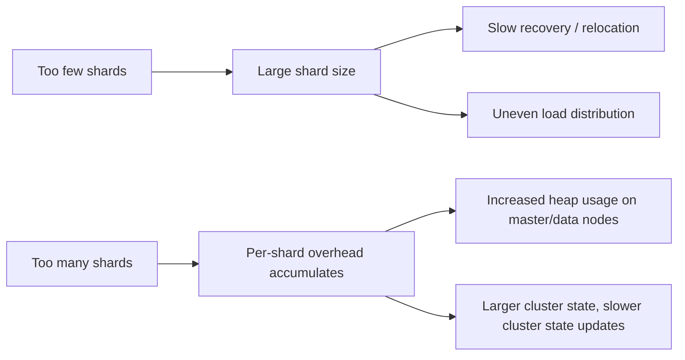
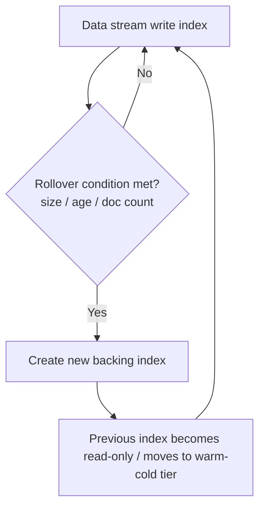
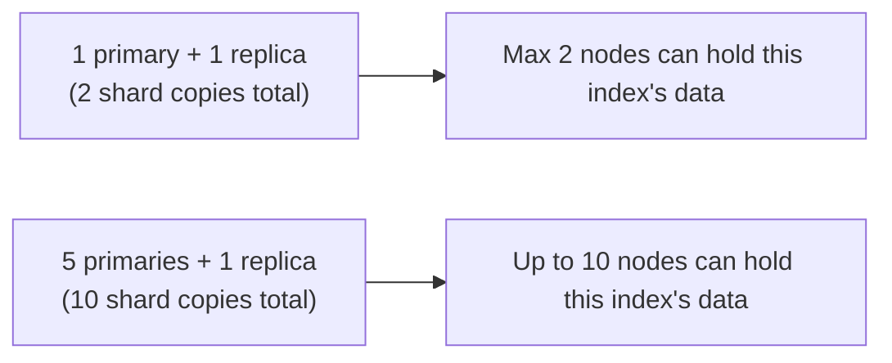

## Shard Count Recommendations

### Overview

Choosing the right number of primary and replica shards for an index is one of the most consequential — and hardest to change after the fact — decisions in Elasticsearch. Primary shard count is fixed at index creation time (short of a reindex or the Split/Shrink APIs), while replica count can be adjusted freely at any time. Getting shard count wrong in either direction has real operational costs, so recommendations exist to guide the decision rather than a single formula, since the right number depends on data volume, growth rate, query patterns, and hardware.

### Why Shard Count Matters

Each shard is a self-contained Lucene index with its own overhead: file handles, memory for caching segment metadata, thread pool resources, and cluster state entries that the master node must track. This means shard count is not a free scaling dimension — both too few and too many shards carry distinct costs.



### The Core Tension

**Undersharding**

An index with too few shards relative to its eventual data volume produces very large individual shards. Large shards are slower to relocate during rebalancing or node failure recovery, concentrate more load on fewer nodes (limiting horizontal query parallelism), and take longer to recover from a snapshot or replica promotion.

**Oversharding**

An index with far more shards than its data volume warrants creates many small shards, each carrying fixed overhead regardless of how little data it holds. This inflates heap usage cluster-wide (shard metadata must be tracked in cluster state, which every node holds a copy of), increases the number of Lucene segment merges and file handles in aggregate, and can paradoxically slow down queries that must fan out across many nearly-empty shards.

### General Sizing Guidance

**Target shard size**

A commonly cited general heuristic is to aim for individual shard sizes in the range of a few tens of gigabytes — often cited as roughly 10GB to 50GB — rather than either very small or very large shards.

[Inference] This numeric range is a widely repeated community and vendor heuristic, not an Elasticsearch-enforced limit, and the ideal figure for any specific workload depends on node hardware (especially available heap and disk I/O characteristics), query complexity, and how much headroom is needed for growth between rollovers; it should be validated with representative testing (e.g., via Rally) rather than applied as a fixed constant.

**Shards per node**

A related heuristic suggests keeping the total shard count (primaries + replicas) on any single node proportional to that node's available heap, sometimes expressed as a rough ratio (e.g., no more than roughly 20 shards per GB of heap has been cited in some Elastic guidance historically). [Inference] This specific ratio has been revised across Elastic's own published guidance over time and should be checked against current official recommendations rather than treated as a fixed rule, since default limits and best practices in this area have shifted across versions.

**Maximum shards per node (hard limit)**

Elasticsearch enforces a configurable hard cap via `cluster.max_shards_per_node`, which by default limits the total number of open shards permitted per data node cluster-wide, and exceeding it causes index creation or shard allocation to fail outright rather than merely degrade performance. This is a hard operational ceiling distinct from the soft performance-oriented sizing heuristics above.

### Calculating Initial Shard Count

A basic approach for a new index with a known projected data volume:

$$\text{primary\_shards} = \left\lceil \frac{\text{projected\_index\_size}}{\text{target\_shard\_size}} \right\rceil$$

For example, an index projected to grow to roughly 300GB, with a 30GB target shard size, suggests approximately 10 primary shards — but this should be treated as a starting estimate to validate with load testing, not a final answer, since query concurrency needs and node count also factor into whether that number is actually optimal for the workload.

### Time-Series and Rollover-Based Indices

For log-style or metrics-style time-series data, the more robust modern approach is to decouple shard count from a single fixed calculation and instead use **Index Lifecycle Management (ILM)** rollover based on size, document count, or age thresholds, so that each generation of the index (e.g., each daily or rollover-triggered index in a data stream) stays within the target shard-size range without requiring the total dataset size to be known in advance.



Example ILM rollover policy targeting shard-size discipline indirectly through index size:

```json
PUT _ilm/policy/logs_policy
{
  "policy": {
    "phases": {
      "hot": {
        "actions": {
          "rollover": {
            "max_primary_shard_size": "30gb",
            "max_age": "7d"
          }
        }
      }
    }
  }
}
```

Using `max_primary_shard_size` in the rollover condition (rather than only `max_size`, which is the total index size across all primaries) directly targets the desired per-shard size, making it a more precise lever for shard-size-driven rollover than raw index size alone.

### Replica Count Considerations

Replica count is a separate decision from primary shard count and can be changed after index creation without reindexing:

```json
PUT my_index/_settings
{
  "number_of_replicas": 2
}
```

**Trade-offs:**

- **Availability** — at least one replica is generally recommended for any production index, since a primary-only shard has no redundancy against node loss.
- **Read throughput** — replicas can serve search traffic, so additional replicas can help scale query throughput horizontally, though this benefit is bounded by available node resources, not unlimited.
- **Indexing cost** — every replica must independently index every document, so higher replica counts increase total cluster-wide indexing CPU and I/O cost proportionally, not just storage.
- **Rebalancing cost during scaling events** — more replicas means more copies that must be relocated during shard rebalancing after a topology change, increasing network and disk I/O during those events.

### Number of Primary Shards vs. Number of Nodes

A commonly overlooked interaction is that primary shard count sets a hard ceiling on how many nodes can hold copies of that index's data in parallel. An index with a single primary shard and one replica can only ever be distributed across two nodes for that index, regardless of how many nodes exist in the cluster, meaning that index cannot take advantage of a larger cluster for query parallelism or indexing throughput without a reindex to increase shard count.



### Adjusting Shard Count After the Fact

Since primary shard count is immutable post-creation, two APIs exist to change it without a full manual reindex-and-alias-swap process:

**Split API** — increases primary shard count for an index (by a factor evenly dividing into the target count), useful when an index was undersharded relative to its actual growth.

```json
POST my_index/_split/my_index_split
{
  "settings": {
    "index.number_of_shards": 4
  }
}
```

**Shrink API** — decreases primary shard count, useful when an index was oversharded (e.g., a low-volume daily index that never needed more than one shard). The index must first be made read-only and all its shards relocated to a single node before shrinking.

```json
POST my_index/_shrink/my_index_shrunk
{
  "settings": {
    "index.number_of_shards": 1
  }
}
```

Both operations create a new index rather than modifying the existing one in place, so downstream aliases and application references need to be updated (or an alias swap performed) as part of the operation, similar to a manual reindex-based migration.

### Common Pitfalls

- **Copying a default shard count without justification.** Elasticsearch's historical default of 5 primary shards (in older versions) or the current default of 1 are both starting points, not universally correct values for every dataset; they should be deliberately chosen based on projected size, not left unexamined.
- **Oversharding small indices "just in case."** Reference or lookup indices with modest, stable data volumes rarely need more than 1 primary shard; adding shards preemptively for hypothetical future growth accumulates real overhead immediately for a benefit that may never materialize.
- **Sizing shard count around current data volume without accounting for retention growth,** particularly for time-series indices where the eventual dataset will be much larger than what exists at index creation time — mitigated by rollover-based sizing rather than a single fixed calculation.
- **Ignoring the interaction between shard count and node count** when scaling the cluster horizontally — adding nodes provides no benefit to an index that is already undersharded relative to the new node count.
- **Treating replica count purely as a durability setting** without accounting for its proportional cost to indexing throughput and cluster-wide storage.

### Related Topics

- Index Lifecycle Management (ILM) and rollover conditions
- Split API and Shrink API operational details
- Cluster sizing and capacity planning
- Data streams and time-series index architecture
- `cluster.max_shards_per_node` and shard allocation limits
- Mapping and index compatibility