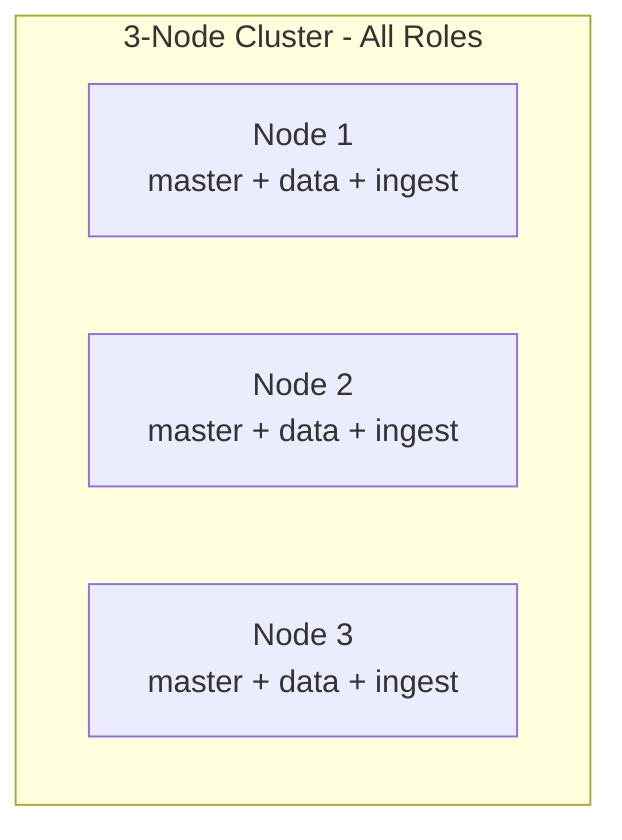
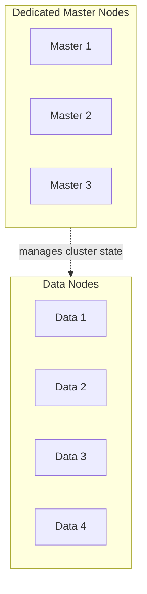
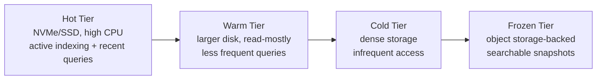
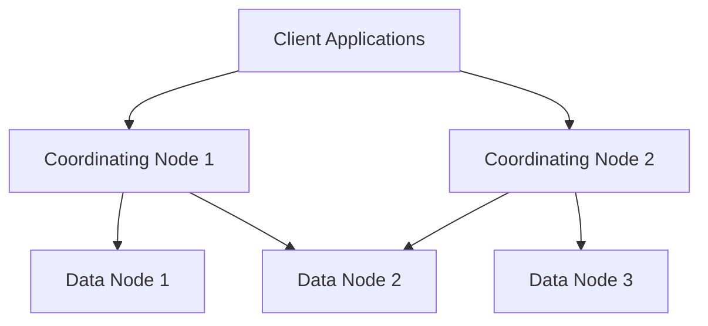
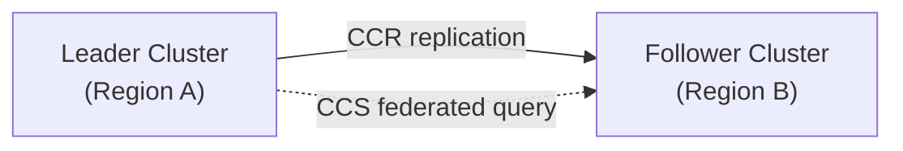
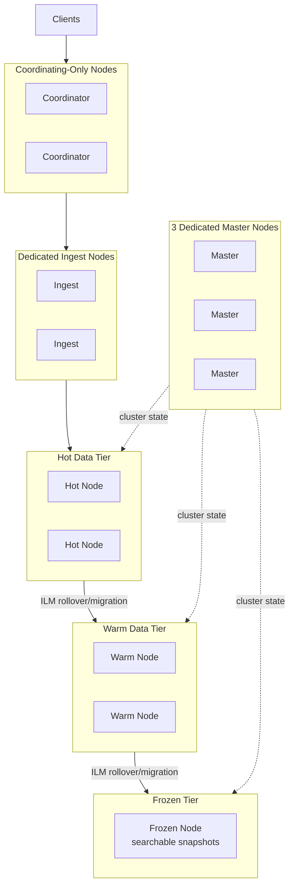

## Deployment Topology Patterns

### Overview

Deployment topology refers to how nodes are arranged, assigned roles, and physically or logically distributed across a cluster to meet requirements for availability, performance isolation, and operational manageability. There is no single correct topology — the right pattern depends on cluster scale, workload mix (indexing-heavy vs. query-heavy vs. mixed), data lifecycle needs, and fault-tolerance requirements. This topic covers the recurring patterns used across small, medium, and large-scale Elasticsearch deployments.

### Node Roles Recap

Before discussing topology patterns, it's necessary to distinguish the roles a node can hold, since topology patterns are fundamentally about how these roles are combined or separated across physical/virtual machines:

- **Master-eligible** — participates in cluster state management and master election.
- **Data** (further subdivided into `data_hot`, `data_warm`, `data_cold`, `data_frozen`, `data_content`) — stores shard data.
- **Ingest** — executes ingest pipelines on documents before indexing.
- **Coordinating** (implicit role held by any node, but can be the *only* role) — routes requests and merges results across shards.
- **Machine learning** — runs ML jobs and trained models.
- **Transform** — runs continuous or batch transform jobs.

A node can hold multiple roles simultaneously (the default for a freshly configured node), or be configured with a restricted role set for specialization.

### Pattern 1: Single-Role, All-in-One Nodes

**Description**

Every node holds every role — master-eligible, data, ingest, coordinating — with no specialization. This is the default configuration for a newly installed node and is common in small clusters or development/test environments.



**When it fits**

Small clusters (roughly up to a handful of nodes) with modest, predictable load, where operational simplicity outweighs the benefits of specialization. Also common for development and staging environments that don't need production-grade isolation.

**Limitations**

As load grows, master election stability can be affected by data/query load on the same nodes (a node under heavy GC pressure from indexing/query load is a worse candidate to reliably participate in master duties), and there is no isolation between indexing and query workloads competing for the same CPU/heap.

### Pattern 2: Dedicated Master Nodes

**Description**

A small, odd-numbered set of nodes (commonly three) are configured as master-eligible only — holding no data and serving no queries — dedicated purely to cluster state management and master election stability. Data and coordinating duties are handled entirely by separate nodes.



**Why an odd number**

Master election in Elasticsearch relies on a quorum-based mechanism, and an odd number of master-eligible nodes (commonly three) avoids split-brain scenarios and ties during election in the event of network partitions, since a majority quorum is well-defined with an odd count.

**When it fits**

Any cluster beyond small scale benefits from this pattern, since it isolates cluster stability from data/query load spikes. This is considered a baseline best practice for production clusters rather than an advanced optimization.

**Sizing note**

Dedicated master nodes do not need large heaps or fast storage relative to data nodes; their resource needs scale with cluster state size (number of indices, shards, and mappings) rather than data volume, though very large clusters with many thousands of shards do require correspondingly larger master node heaps to hold and process cluster state efficiently.

### Pattern 3: Hot-Warm-Cold-Frozen Tiered Data Nodes

**Description**

Data nodes are split into tiers matched to data age and access frequency, with each tier using hardware appropriate to its role, and Index Lifecycle Management (ILM) automatically migrating shards between tiers as data ages.



**Why it fits**

Time-series and log-style workloads have a strongly age-correlated access pattern — recent data is queried and indexed heavily, while older data is queried rarely but must remain available for compliance or occasional lookup. Tiering allows expensive, fast hardware to be reserved only for the data that actually benefits from it, with cost per GB decreasing at each successive tier.

**Frozen tier specifics**

The frozen tier typically uses searchable snapshots backed by object storage (e.g., S3-compatible storage) rather than requiring the full dataset to reside on local disk, trading some query latency for substantially reduced storage cost on rarely accessed historical data.

**When it fits**

Log analytics, observability/metrics, security event data, and any workload with a clear "recent data matters most" access pattern. Less applicable to workloads where all data is queried with roughly uniform frequency regardless of age (e.g., some reference/lookup datasets).

### Pattern 4: Coordinating-Only Nodes

**Description**

A layer of nodes holds no data and is not master-eligible, existing solely to receive client requests, fan them out to the appropriate data nodes, and merge/return results.



**Why it fits**

In large clusters with high query fan-out (queries touching many shards across many data nodes) and heavy result-merging cost (large aggregations, deep pagination), coordinating-only nodes absorb this overhead without competing with data nodes' own indexing/storage responsibilities, and provide a convenient, stateless layer to place behind a load balancer.

**When it fits**

Large-scale clusters with high query concurrency or complex aggregation workloads. Smaller clusters typically don't need this separation, since any data node can serve as an adequate coordinator for modest query volume.

### Pattern 5: Dedicated Ingest Nodes

**Description**

Nodes configured with only the `ingest` role handle ingest pipeline processing (parsing, enrichment, transformation) before documents are routed to the appropriate data node for indexing.

**When it fits**

Workloads with CPU-intensive ingest pipelines — heavy use of processors like `grok`, `script`, `enrich`, or `geoip` — where pipeline execution cost would otherwise compete directly with indexing and merge operations on data nodes. High-volume log pipelines with complex parsing are the most common use case.

**When it doesn't fit**

Simple ingest pipelines with minimal processing add negligible overhead, making a dedicated ingest tier unnecessary complexity for modest workloads; combining ingest with data or coordinating roles is common at smaller scale.

### Pattern 6: Cross-Cluster Topologies

**Cross-Cluster Search (CCS)**

Multiple independent clusters are queried from a single request without moving data between them, useful for organizational boundaries (e.g., separate teams/regions each operating their own cluster) or for querying across clusters that are kept independently for isolation/compliance reasons while still needing federated search.

**Cross-Cluster Replication (CCR)**

Data is actively replicated from a leader cluster to one or more follower clusters, commonly used for disaster recovery (a geographically separate follower cluster ready to take over), or for serving read traffic closer to users in a different region without funneling all reads through a single cluster.



**When it fits**

Multi-region deployments needing disaster recovery, geographically distributed read scaling, or organizational separation with federated search needs. Adds meaningful operational complexity, so it's typically adopted only once a genuine multi-region or multi-tenant requirement exists rather than preemptively.

### Combined Large-Scale Topology Example

A production-scale topology often combines several of the above patterns simultaneously:



### Availability Zone / Rack Awareness

**Shard allocation awareness**

Elasticsearch can be configured with allocation awareness attributes (e.g., tagging nodes with an availability zone or rack identifier) so that the cluster deliberately places primary and replica copies of a shard in different zones, ensuring a single zone failure does not take down both a primary and all its replicas simultaneously.

```json
PUT _cluster/settings
{
  "persistent": {
    "cluster.routing.allocation.awareness.attributes": "zone"
  }
}
```

Each node is tagged with its zone via node-level configuration:

```yaml
node.attr.zone: zone-a
```

**When it fits**

Any production deployment spanning multiple availability zones or physical racks should configure allocation awareness; without it, Elasticsearch has no information to deliberately avoid co-locating all copies of a shard in a single failure domain, leaving zone-level redundancy to chance rather than guarantee.

### Choosing a Topology: Decision Factors

- **Cluster scale** — small clusters favor simplicity (Pattern 1); growth introduces the need for role separation.
- **Workload shape** — indexing-heavy, query-heavy, or balanced workloads each stress different node roles differently, motivating dedicated ingest or coordinating nodes when one workload type dominates.
- **Data access pattern over time** — strongly age-correlated access (logs, metrics, events) favors hot-warm-cold-frozen tiering; uniform access patterns across a dataset's lifetime do not benefit as much.
- **Availability requirements** — multi-zone or multi-region requirements introduce allocation awareness and potentially CCR/CCS considerations.
- **Operational maturity** — more specialized topologies require more operational sophistication to monitor, tune, and troubleshoot; adopting them prematurely for a small workload adds complexity without proportional benefit.

### Common Pitfalls

- **Over-engineering topology for a small cluster.** Introducing coordinating-only nodes, dedicated ingest nodes, and four-tier ILM for a dataset that fits comfortably on three all-in-one nodes adds operational overhead without corresponding benefit.
- **Under-provisioning dedicated master nodes.** Treating master nodes as an afterthought (minimal hardware) in a large cluster with many indices/shards can make master nodes the actual bottleneck for cluster state updates, even when data nodes have ample capacity.
- **Skipping allocation awareness in multi-zone deployments.** Without explicit zone tagging, Elasticsearch has no guarantee against co-locating all copies of a shard in one zone, undermining the redundancy the multi-zone deployment was meant to provide.
- **Treating tiering as "set and forget."** ILM policies driving tier migration need to be tuned to actual query patterns; misconfigured rollover/migration thresholds can leave data in the wrong tier relative to how it's actually being accessed.

### Related Topics

- Cluster sizing and capacity planning
- Index Lifecycle Management (ILM) phases and actions
- Shard allocation awareness and disk watermark configuration
- Cross-Cluster Search and Cross-Cluster Replication
- Searchable snapshots and the frozen tier
- Master node election and quorum-based consensus