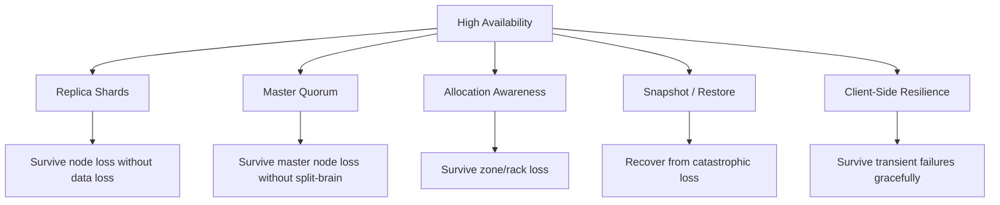
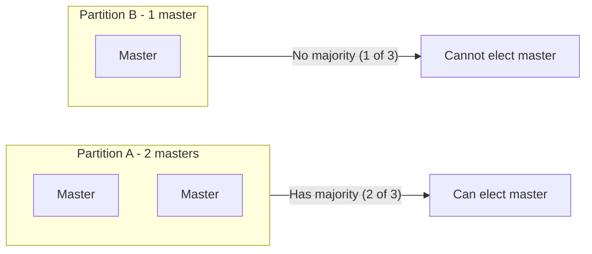
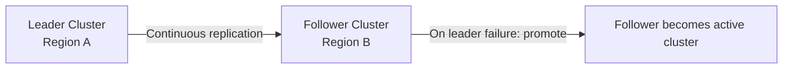
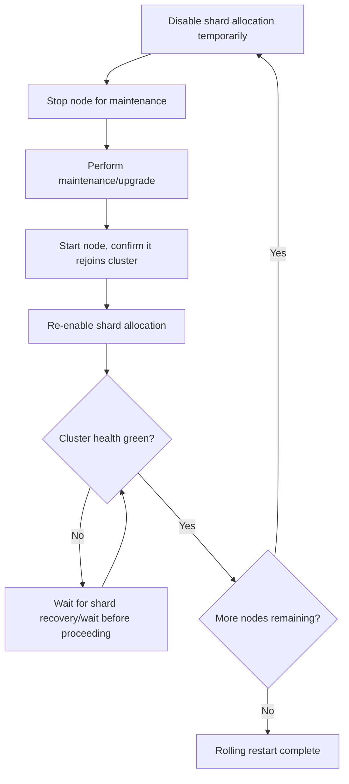

## High Availability Configuration

### Overview

High availability (HA) configuration in Elasticsearch ensures the cluster continues to serve read and write traffic despite node failures, network partitions, availability zone outages, or planned maintenance. HA is not a single setting but a combination of replica strategy, master quorum configuration, allocation awareness, snapshot/restore discipline, and client-side resilience working together. A cluster can be technically "up" while still failing HA goals if any one of these layers is misconfigured.

### The Core Building Blocks of HA



### Replica Shard Strategy

**Minimum baseline**

Every production index should have at least one replica (`number_of_replicas: 1`), since a primary-only shard has zero redundancy — losing the node holding that primary means losing the data outright (short of snapshot restore).

```json
PUT my_index/_settings
{
  "number_of_replicas": 1
}
```

**Beyond the minimum**

Higher replica counts increase both fault tolerance (more nodes can fail before data is at risk) and read throughput (more copies available to serve queries), at the cost of proportionally higher indexing CPU/I/O and storage. The right count is a balance between availability requirements and cluster resource budget, not a fixed universal number.

**Replica placement is not automatic redundancy**

Having a replica does not guarantee it is placed on a different failure domain (rack, zone, host) than its primary unless allocation awareness is explicitly configured — Elasticsearch by default only guarantees a replica is not on the *same node* as its primary, not a different zone.

### Master Quorum and Split-Brain Prevention

**Quorum-based election**

Elasticsearch uses a quorum-based consensus protocol for master election, requiring a majority of master-eligible nodes to agree before a node can be elected master or before certain cluster state changes are committed. This majority requirement is what prevents split-brain — a scenario where two disconnected partitions of a cluster each independently elect a master and diverge in cluster state.

**Odd-numbered master-eligible node counts**

Configuring an odd number of master-eligible nodes (commonly three, sometimes five in very large clusters) avoids ties during quorum calculation and ensures a clear majority is always mathematically possible in a network partition scenario, unlike an even count where a partition could split into two equal halves with no majority on either side.



**Voting configuration**

Modern Elasticsearch versions manage master voting configuration automatically as nodes join and leave, removing much of the manual `discovery.zen.minimum_master_nodes`-style configuration burden that existed in older versions, though understanding the underlying quorum requirement remains important for correctly sizing the master-eligible node count and for diagnosing partition-related unavailability.

### Allocation Awareness for Zone/Rack Resilience

**Purpose**

Without explicit configuration, Elasticsearch's shard allocator has no concept of physical or logical failure domains, and could place a primary and all its replicas in the same availability zone or rack, defeating the purpose of having replicas at all if that zone fails.

**Configuration**

Nodes are tagged with an attribute representing their failure domain, and the cluster is instructed to use that attribute for allocation decisions:

```yaml
# node configuration (elasticsearch.yml)
node.attr.zone: zone-a
```

```json
PUT _cluster/settings
{
  "persistent": {
    "cluster.routing.allocation.awareness.attributes": "zone"
  }
}
```

With this configured, Elasticsearch actively avoids placing a primary and its replica(s) in the same zone whenever the cluster topology allows it.

**Forced awareness**

An additional setting, `cluster.routing.allocation.awareness.force.zone.values`, can be used to explicitly enumerate expected zone values and prevent shard allocation from proceeding with all copies in a single zone even during a partial zone outage, trading some availability during a zone failure for a stronger redundancy guarantee — this is a deliberate trade-off that should be evaluated against the specific outage tolerance requirements of the deployment.

### Disk-Based Allocation and Watermark Configuration

**Purpose**

HA is undermined if nodes are allowed to fill their disks to capacity, since Elasticsearch enforces increasingly restrictive behavior as disk usage rises, and understanding these thresholds is necessary to avoid a self-inflicted availability incident during normal growth.

**Watermark stages**

- **Low watermark** — the cluster stops allocating new shards to a node past this threshold, but existing shards remain.
- **High watermark** — the cluster actively attempts to relocate shards away from a node past this threshold.
- **Flood-stage watermark** — the cluster enforces a read-only index block on indices with shards on the affected node, a severe availability impact requiring manual intervention to lift once triggered.

```json
PUT _cluster/settings
{
  "persistent": {
    "cluster.routing.allocation.disk.watermark.low": "85%",
    "cluster.routing.allocation.disk.watermark.high": "90%",
    "cluster.routing.allocation.disk.watermark.flood_stage": "95%"
  }
}
```

[Inference] Default watermark percentages have been adjusted across Elasticsearch versions, so current defaults should be verified against the documentation for the version in use rather than assumed; the values shown above are illustrative of typical production tuning, not necessarily the current defaults.

### Snapshot and Restore as the HA Backstop

**Why replicas alone are insufficient**

Replica shards protect against node-level failure, but do not protect against cluster-wide failures such as a botched upgrade, accidental index deletion, corrupted data replicated to all copies before detection, or a full data-center-level outage. Regular snapshots to a separate, durable repository (commonly object storage) are the layer that protects against these broader failure classes.

**Snapshot lifecycle management (SLM)**

Automating snapshot creation and retention via SLM policies removes reliance on manual snapshot discipline:

```json
PUT _slm/policy/daily-snapshots
{
  "schedule": "0 30 1 * * ?",
  "name": "<daily-snap-{now/d}>",
  "repository": "my_backup_repo",
  "config": {
    "indices": "*"
  },
  "retention": {
    "expire_after": "30d",
    "min_count": 5,
    "max_count": 50
  }
}
```

**Cross-region/cross-account repository placement**

For disaster-recovery-grade HA, the snapshot repository should reside outside the failure domain of the cluster itself (a different region or account than the primary cluster), otherwise a region-level event could take out both the live cluster and its backups simultaneously.

### Cross-Cluster Replication for Disaster Recovery

For scenarios requiring near-real-time failover to an entirely separate cluster (rather than restore-from-snapshot recovery time), Cross-Cluster Replication (CCR) maintains a continuously updated follower cluster in a separate region or data center, ready to be promoted to serve traffic if the leader cluster becomes unavailable.



[Inference] CCR replication is near-real-time, not synchronous, so a leader failure can still result in a small window of unreplicated writes being lost during failover — the acceptable data-loss window (RPO) for a given deployment should be evaluated against CCR's actual replication lag characteristics under the specific workload, rather than assumed to be zero.

### Client-Side Resilience

**Sniffing and node discovery**

Official Elasticsearch clients can be configured to discover and route around unavailable nodes automatically, though this needs to be explicitly configured and tested rather than assumed to work correctly by default in every client library and version.

**Retry and timeout configuration**

Application-level retry logic with sensible backoff, combined with reasonable request timeouts, prevents a transient node failure or brief cluster state update from manifesting as an application-visible outage.

**Load balancer / coordinating node layer**

Placing a load balancer or a pool of coordinating-only nodes in front of the cluster (rather than having application clients connect directly to arbitrary data nodes) provides a stable, health-checked entry point that can route around individual node failures transparently to the application.

### Rolling Restarts Without Downtime

**Purpose**

Planned maintenance (version upgrades, configuration changes, OS patching) should not require cluster downtime if replicas and shard allocation are configured correctly, but doing so safely requires deliberate steps rather than simply restarting nodes in sequence.

**Safe rolling restart procedure (general pattern)**



Temporarily disabling shard allocation before stopping a node (rather than allowing the cluster to immediately begin reallocating that node's shards elsewhere) avoids unnecessary data movement for a short, planned outage:

```json
PUT _cluster/settings
{
  "persistent": {
    "cluster.routing.allocation.enable": "primaries"
  }
}
```

### Common HA Anti-Patterns

- **Single replica with no allocation awareness in a multi-zone cluster.** Technically HA-configured on paper, but the replica could be co-located in the same zone as its primary, providing no actual protection against the most likely real-world failure (a zone outage).
- **Snapshot repository in the same failure domain as the cluster.** Defeats the purpose of snapshots as a disaster-recovery backstop if both the live cluster and its backups can be lost to the same event.
- **Even-numbered dedicated master node counts.** Introduces avoidable split-brain/no-quorum risk that an odd count would have prevented.
- **Assuming client libraries handle failover correctly without testing.** Sniffing/discovery behavior varies by client and configuration; untested failure paths often fail differently than expected during an actual incident.
- **No tested restore procedure.** A snapshot policy that has never been exercised via an actual restore test provides false confidence; restore procedures should be periodically validated, not assumed to work because backups are being created on schedule.
- **Ignoring watermark-triggered read-only blocks as an HA event.** Flood-stage watermark breaches are a self-inflicted availability incident distinct from external failures, and should be monitored and alerted on proactively rather than discovered when writes start failing.

### Related Topics

- Deployment topology patterns
- Cluster sizing and capacity planning
- Snapshot Lifecycle Management (SLM) in depth
- Cross-Cluster Replication (CCR) configuration and failover procedures
- Shard allocation awareness and disk watermark configuration
- Elasticsearch upgrade assistant