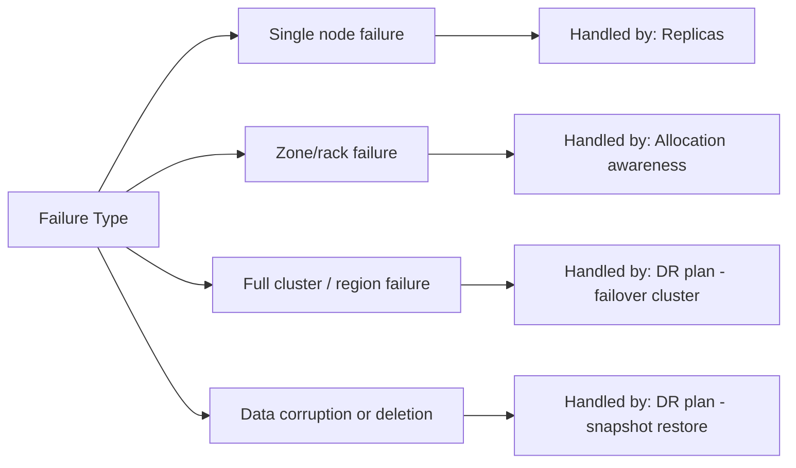
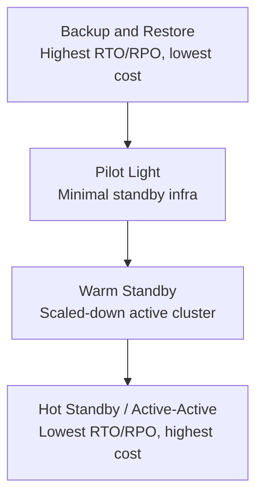

## Disaster Recovery Planning

### Overview

Disaster recovery (DR) planning addresses the class of failures that high-availability configuration alone does not solve: catastrophic, correlated failures that affect an entire cluster or region simultaneously — a full data center outage, a botched upgrade that corrupts cluster state, ransomware or accidental mass deletion, or a region-wide cloud provider incident. Where HA is about surviving individual node or zone failures without interruption, DR is about having a deliberate, tested plan to restore service and data after the primary cluster is no longer usable at all.

### HA vs. DR: A Necessary Distinction



Replicas, allocation awareness, and master quorum — the tools of high availability — do not help when the entire cluster or its hosting region becomes unavailable, or when bad data has already been replicated to every copy before the problem is noticed. DR planning exists specifically to cover these gaps.

### Key DR Metrics: RPO and RTO

**Recovery Point Objective (RPO)**

The maximum acceptable amount of data loss, measured as a time window — "we can tolerate losing up to X minutes/hours of the most recent writes." RPO is determined by how frequently data is backed up or replicated to a recovery target; a snapshot taken every 6 hours implies an RPO of up to 6 hours in the worst case.

**Recovery Time Objective (RTO)**

The maximum acceptable time to restore service after a disaster is declared — "we must be back online within X hours." RTO is determined by how quickly a recovery target can be brought online and made ready to serve traffic, which differs substantially between a cold snapshot restore and a warm standby cluster.

$$\text{RPO} \approx \text{time between backup/replication events}$$


$$\text{RTO} \approx \text{time to restore/promote} + \text{time to validate} + \text{time to redirect traffic}$$

These two metrics drive nearly every subsequent DR design decision, since tighter RPO/RTO requirements demand more expensive and operationally complex solutions.

### DR Strategy Spectrum



**Backup and restore**

The baseline DR strategy: snapshots are taken regularly and stored in a durable, geographically separate repository. Recovery involves provisioning a new cluster and restoring from the most recent snapshot. This has the highest RTO (cluster provisioning + restore time) and RPO bounded by snapshot frequency, but is the lowest-cost and operationally simplest approach.

**Pilot light**

A minimal-footprint standby cluster exists in the recovery region (e.g., master nodes and configuration in place, but few or no data nodes actively running), reducing the provisioning portion of RTO compared to starting from nothing, while keeping ongoing cost low since the standby isn't running at production scale.

**Warm standby**

A scaled-down but fully functional replica cluster runs continuously in the recovery region, kept in sync via Cross-Cluster Replication (CCR), ready to be scaled up and promoted quickly. This substantially reduces both RTO (no restore needed, just promotion and scale-up) and RPO (replication lag is typically much shorter than snapshot intervals) at meaningfully higher ongoing cost than backup-and-restore.

**Hot standby / active-active**

A fully scaled standby cluster runs continuously and may even actively serve read traffic (via Cross-Cluster Search) in normal operation, minimizing both RTO and RPO at the highest ongoing cost, since the recovery cluster is essentially a full production-capacity duplicate.

[Inference] True active-active (both clusters accepting writes independently with conflict resolution) is architecturally more complex than active-passive CCR and is not a native out-of-the-box CCR capability; whether a given DR requirement needs true active-active versus a well-tuned active-passive warm/hot standby should be evaluated against actual RPO/RTO needs rather than assumed necessary by default.

### Snapshot-Based DR in Detail

**Repository placement**

The snapshot repository must reside outside the failure domain of the primary cluster — a different region, and ideally a different cloud account or credential boundary — otherwise the same event that destroys the cluster (region outage, compromised credentials, ransomware) could also destroy or lock the backups.

**Snapshot Lifecycle Management (SLM) for automation**

```json
PUT _slm/policy/dr-snapshots
{
  "schedule": "0 0 */4 * * ?",
  "name": "<dr-snap-{now/d}>",
  "repository": "dr_repo_cross_region",
  "config": {
    "indices": "*",
    "include_global_state": true
  },
  "retention": {
    "expire_after": "14d",
    "min_count": 10,
    "max_count": 100
  }
}
```

**`include_global_state` for full cluster recovery**

Including global state in DR-oriented snapshots (as opposed to data-only snapshots) captures cluster-level configuration — index templates, ILM policies, stored scripts, and other persistent cluster settings — necessary to restore a fully functional cluster rather than just the raw index data, which matters specifically for DR scenarios where the target may be a completely new cluster rather than an existing one.

**Restore procedure**

```json
POST _snapshot/dr_repo_cross_region/dr-snap-2026.08.24/_restore
{
  "indices": "*",
  "include_global_state": true,
  "rename_pattern": "(.+)",
  "rename_replacement": "restored_$1"
}
```

Using a rename pattern during restore testing avoids collisions with any existing indices of the same name, which is particularly relevant when periodically validating restore procedures against a non-production cluster without disrupting it.

### CCR-Based DR in Detail

**Continuous replication topology**


**Failover procedure**

When a disaster is declared, follower indices in the DR cluster are promoted to standalone writable indices, and application traffic is redirected (via DNS, load balancer reconfiguration, or client endpoint change) to the now-active DR cluster.

```json
POST /follower_index/_ccr/pause_follow
```

```json
POST /follower_index/_close
```

```json
POST /follower_index/_unfollow
```

```json
POST /follower_index/_open
```

This sequence pauses replication, closes the index to allow the follow relationship to be safely removed, unfollows to convert it to a standalone index, and reopens it for normal read/write traffic.

**Replication lag monitoring**

Since CCR is near-real-time rather than synchronous, DR planning should explicitly account for and monitor replication lag, since the actual achievable RPO during a real disaster is bounded by how far behind the follower was at the moment of failure, not by the theoretical near-real-time design target.

### The DR Runbook

A DR plan is only as good as its documented, rehearsed execution procedure. A DR runbook should specify, at minimum:

- **Disaster declaration criteria** — who has authority to declare a disaster and trigger failover, and what conditions warrant it (avoiding both under-reaction to a real outage and over-reaction to a transient blip).
- **Step-by-step failover procedure** — exact commands/API calls, in order, with expected outputs at each stage, written so that someone other than the original author can execute it under pressure.
- **Traffic redirection mechanism** — how application/client traffic is actually pointed at the recovery cluster (DNS TTL considerations, load balancer reconfiguration, service discovery updates).
- **Validation steps** — how to confirm the recovered/promoted cluster is actually healthy and serving correct data before declaring the incident resolved, not just that it responds to health checks.
- **Failback procedure** — the often-overlooked reverse process of returning to the original region/cluster once it's available again, which is a distinct operation from failover and carries its own data-reconciliation considerations if the DR cluster accepted writes during the incident.
- **Communication plan** — who needs to be notified at each stage, internally and (if applicable) externally.

### Testing the DR Plan

**Why testing is non-negotiable**

A DR plan that has never been executed end-to-end carries substantial hidden risk — untested restore procedures commonly fail on details that only surface under actual execution (missing permissions, expired credentials, undocumented manual steps, version mismatches between backup and restore-target clusters).

**Testing cadence and scope**

[Inference] There is no universal mandated testing frequency for Elasticsearch DR specifically; general industry DR practice favors periodic scheduled tests (commonly ranging from quarterly to annually depending on the organization's risk tolerance and regulatory requirements) combined with mandatory re-testing after any significant change to cluster topology, version, or the DR procedure itself — the specific cadence appropriate for a given deployment should be set based on organizational risk tolerance and any applicable compliance requirements, not assumed from a generic industry figure.

**Game days / chaos exercises**

Deliberately simulating a disaster (e.g., actually cutting off network access to the primary cluster in a controlled test environment, or actually promoting a follower cluster and redirecting a portion of test traffic) surfaces gaps that a purely documentation-review-based test would miss, since real execution exposes timing issues, permission gaps, and coordination problems that a checklist review does not.

### Common DR Planning Pitfalls

- **Confusing HA with DR.** A well-configured HA cluster (replicas, allocation awareness, dedicated masters) provides no protection against a disaster affecting the entire cluster or region; DR requires a genuinely separate recovery target.
- **Snapshot repository in the same region/account as the primary cluster.** Undermines the entire premise of the backup as a disaster-recovery asset if both are lost together.
- **Never testing restores.** Backup jobs completing successfully on a schedule is not evidence that a full restore will succeed; only an actual restore test provides that evidence.
- **Undocumented or single-person-dependent failover knowledge.** If only one engineer knows the actual failover steps and they are unavailable during a real incident, the DR plan effectively does not exist in practice.
- **Ignoring failback.** Planning only for the failover direction and treating the return to normal operations as an afterthought often results in a more chaotic, ad hoc failback than the failover itself.
- **Setting RPO/RTO targets without validating they're actually achievable** with the chosen strategy — e.g., committing to a 15-minute RTO while relying on a backup-and-restore-from-cold-storage strategy that realistically takes hours to execute.
- **Not accounting for cluster state and configuration, only data.** Restoring index data without index templates, ILM policies, security role mappings, and other cluster-level configuration can leave a "restored" cluster in a broken or insecure state despite the raw data being present.

### Related Topics

- High availability configuration
- Snapshot Lifecycle Management (SLM) policy design
- Cross-Cluster Replication (CCR) configuration and failover mechanics
- Deployment topology patterns
- Cluster sizing and capacity planning
- Elasticsearch upgrade assistant