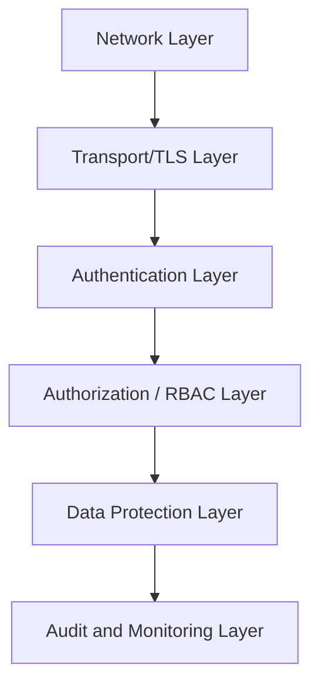

## Security Hardening Checklist

### Overview

Security hardening for Elasticsearch covers the practical configuration steps that reduce attack surface and protect against unauthorized access, data exposure, and privilege misuse. Elasticsearch ships with security features (authentication, TLS, role-based access control) enabled by default in modern versions, but default-enabled does not mean default-hardened — meaningful configuration work remains to move from a secure-by-default baseline to a genuinely hardened production posture. This checklist is organized by layer, from network boundary inward to data and audit controls.

### Security Layers at a Glance



### 1. Network-Level Hardening

- **Never expose Elasticsearch directly to the public internet.** Data and HTTP API nodes should sit behind a private network boundary, VPN, or a reverse proxy/load balancer that enforces access controls, not reachable directly from arbitrary internet addresses.
- **Bind to specific network interfaces**, not `0.0.0.0` by default in production, using `network.host` configured deliberately rather than left at a permissive default.
- **Restrict transport and HTTP ports via firewall rules** (default `9200` for HTTP API, `9300` for inter-node transport) to only the hosts/subnets that legitimately need access — application servers, Kibana, and other cluster nodes.
- **Segregate cluster network traffic** from general application network traffic where feasible, using dedicated subnets or VLANs for inter-node transport traffic.

### 2. Transport Layer Security (TLS)

- **Enable TLS for the transport layer** (inter-node communication) — this is required for any cluster running with security features enabled and should never be disabled in production, since unencrypted inter-node traffic exposes both data and cluster-management commands to network-level interception.
- **Enable TLS for the HTTP layer** (client-to-cluster communication), ensuring credentials and query/response data in transit are encrypted between applications, Kibana, and the cluster.
- **Use properly issued certificates**, not indefinitely long-lived self-signed certificates in production, and establish a certificate rotation process before expiry becomes an operational emergency.
- **Verify certificate hostnames** rather than disabling hostname verification for convenience, since disabling verification undermines TLS's protection against man-in-the-middle interception.

```yaml
xpack.security.transport.ssl.enabled: true
xpack.security.transport.ssl.verification_mode: full
xpack.security.http.ssl.enabled: true
```

### 3. Authentication Hardening

- **Disable or remove default/example accounts** not needed in production, and ensure the built-in superuser account (`elastic`) has a strong, unique password that is rotated and not shared broadly among operators.
- **Integrate with an external identity provider** (LDAP, Active Directory, SAML, OIDC) for production user authentication rather than relying solely on the native realm with manually managed users, centralizing credential lifecycle management and enabling organizational password/MFA policies.
- **Enforce strong password policies** for any native-realm accounts that do remain, and enable multi-factor authentication at the identity provider level where supported.
- **Use API keys for service-to-service and application authentication** rather than embedding user credentials in application configuration, since API keys can be scoped to minimal required privileges and revoked independently without affecting human user accounts.

```json
POST /_security/api_key
{
  "name": "app-read-only-key",
  "role_descriptors": {
    "read_only_role": {
      "cluster": ["monitor"],
      "index": [
        {
          "names": ["my_index*"],
          "privileges": ["read"]
        }
      ]
    }
  }
}
```

### 4. Authorization and Role-Based Access Control (RBAC)

- **Apply the principle of least privilege** to every role — grant only the specific cluster and index privileges actually required, avoiding broad wildcard privileges (`"privileges": ["all"]`) as a default convenience.
- **Use field-level and document-level security** where different users or applications should see only a subset of fields or documents within a shared index, rather than duplicating indices purely for access-control segmentation.

```json
POST /_security/role/restricted_role
{
  "indices": [
    {
      "names": ["customer_data"],
      "privileges": ["read"],
      "field_security": {
        "grant": ["customer_id", "region", "status"]
      },
      "query": {
        "term": { "region": "eu" }
      }
    }
  ]
}
```

- **Avoid granting the superuser role for routine operational or application access.** Reserve superuser privileges for genuine administrative needs, and audit who holds superuser access periodically.
- **Use role mapping tied to identity provider groups** where an external IdP is in use, so access changes propagate through the existing organizational identity lifecycle rather than requiring manual Elasticsearch-side role reassignment.

### 5. Data Protection

- **Enable encryption at rest** for data on disk, either via Elasticsearch's native at-rest encryption capabilities where available in the deployment (varies by deployment type — self-managed, Elastic Cloud, or a managed service offering) or via underlying disk/volume-level encryption provided by the infrastructure layer.
- **Classify and handle sensitive fields deliberately** — consider field-level security, index-level access restriction, or application-side encryption/tokenization for genuinely sensitive fields (PII, credentials, financial data) rather than relying solely on general cluster access controls.
- **Apply document- and field-level redaction consistently across all access paths**, including Kibana dashboards, direct API access, and any downstream export/reporting tooling, since a redaction policy that only covers one access path leaves the same sensitive data exposed through another.

### 6. Audit Logging

- **Enable audit logging** to capture authentication attempts, authorization decisions, and administrative actions, providing the forensic trail needed to investigate suspicious activity after the fact.

```yaml
xpack.security.audit.enabled: true
```

- **Configure audit log output to a destination independent of the cluster being audited** (a separate logging/SIEM pipeline) so that a compromised cluster cannot also be used to tamper with or delete the audit trail describing that compromise.
- **Define retention and review processes for audit logs**, since collecting audit data without a corresponding review or alerting process provides limited practical security value beyond after-the-fact forensic capability.

### 7. Snapshot and Backup Security

- **Restrict access to the snapshot repository** with the same rigor as the live cluster, since snapshots contain a full copy of cluster data and are a valid target for exfiltration if repository access controls are weak.
- **Encrypt snapshot repositories** at the storage layer, particularly for repositories backed by third-party object storage where encryption-at-rest may need to be explicitly enabled rather than assumed.
- **Apply least-privilege access to repository credentials** distinct from general cluster administrative credentials, so that compromise of one does not automatically grant access to the other.

### 8. Kibana-Specific Hardening

- **Restrict Kibana access** behind the same network controls as the underlying cluster, and avoid exposing Kibana directly to the public internet without an additional authentication/access layer in front of it.
- **Use Kibana Spaces and feature-level privileges** to limit which users can access which dashboards, saved objects, and administrative functionality, rather than granting broad Kibana access uniformly to all authenticated users.
- **Disable unused Kibana features/plugins** to reduce attack surface, particularly features like the Dev Tools console in environments where broad user access to raw Elasticsearch API calls via Kibana is not desired.

### 9. Operational and Configuration Hygiene

- **Keep Elasticsearch and Kibana updated** to a currently supported version, since security patches are released against actively maintained version lines, and running end-of-life versions forgoes future security fixes entirely.
- **Restrict access to configuration files** (`elasticsearch.yml`, keystore files) at the operating system level, since these files can contain or provide access to sensitive settings.
- **Use the Elasticsearch keystore for sensitive settings** (passwords, API keys used in configuration) rather than placing secrets in plaintext within `elasticsearch.yml`.

```bash
bin/elasticsearch-keystore add xpack.security.transport.ssl.keystore.secure_password
```

- **Review and disable unused features/APIs** where organizational policy or compliance requirements warrant a minimized feature surface, balancing operational needs against attack-surface reduction.

### Hardening Checklist Summary Table (svg_diagram)

<svg xmlns="http://www.w3.org/2000/svg" viewBox="0 0 760 460">
<text x="380" y="28" text-anchor="middle" font-size="18" font-weight="bold" fill="#1a1a1a">Security Hardening Layers (svg_diagram)</text>
<rect x="40" y="55" width="680" height="50" rx="6" fill="#e8f0fe" stroke="#4285f4" stroke-width="2" />
<text x="60" y="85" font-size="13" font-weight="bold" fill="#1a1a1a">Network</text>
<text x="220" y="85" font-size="12" fill="#333">No public exposure · Firewalled ports · Segmented VLANs</text>
<rect x="40" y="115" width="680" height="50" rx="6" fill="#e6f4ea" stroke="#34a853" stroke-width="2" />
<text x="60" y="145" font-size="13" font-weight="bold" fill="#1a1a1a">Transport/TLS</text>
<text x="220" y="145" font-size="12" fill="#333">Encrypted transport + HTTP · Valid certs · Full hostname verification</text>
<rect x="40" y="175" width="680" height="50" rx="6" fill="#fef7e0" stroke="#fbbc04" stroke-width="2" />
<text x="60" y="205" font-size="13" font-weight="bold" fill="#1a1a1a">Authentication</text>
<text x="220" y="205" font-size="12" fill="#333">External IdP · Strong elastic password · API keys for services</text>
<rect x="40" y="235" width="680" height="50" rx="6" fill="#fce8e6" stroke="#ea4335" stroke-width="2" />
<text x="60" y="265" font-size="13" font-weight="bold" fill="#1a1a1a">Authorization</text>
<text x="220" y="265" font-size="12" fill="#333">Least privilege · Field/document-level security · No default superuser use</text>
<rect x="40" y="295" width="680" height="50" rx="6" fill="#f3e8fd" stroke="#a142f4" stroke-width="2" />
<text x="60" y="325" font-size="13" font-weight="bold" fill="#1a1a1a">Data Protection</text>
<text x="220" y="325" font-size="12" fill="#333">Encryption at rest · Sensitive field classification · Consistent redaction</text>
<rect x="40" y="355" width="680" height="50" rx="6" fill="#e0f7fa" stroke="#00acc1" stroke-width="2" />
<text x="60" y="385" font-size="13" font-weight="bold" fill="#1a1a1a">Audit &amp; Backup</text>
<text x="220" y="385" font-size="12" fill="#333">Independent audit log destination · Encrypted, access-controlled snapshots</text>
<rect x="40" y="415" width="680" height="35" rx="6" fill="#eeeeee" stroke="#757575" stroke-width="2" />
<text x="60" y="438" font-size="13" font-weight="bold" fill="#1a1a1a">Operational Hygiene: patching, keystore usage, config file access control</text>
</svg>

### Common Pitfalls

- **Treating "security features enabled by default" as equivalent to "hardened."** Default-enabled TLS and authentication are a starting point, not a completed hardening exercise — role scoping, audit logging, and network boundary configuration remain necessary work.
- **Leaving the built-in `elastic` superuser as the primary operational account.** This account should be reserved for initial setup and emergency access, with day-to-day administrative and application access handled through scoped roles and API keys.
- **Granting broad index wildcards in roles for convenience** (`"names": ["*"]`) rather than scoping to the specific indices/patterns actually needed, which becomes a significant liability if that role's credentials are ever compromised.
- **Storing snapshot repository credentials with the same broad access as cluster admin credentials**, creating a single point of compromise for both live data and all historical backups.
- **Collecting audit logs without a review or alerting process**, providing only after-the-fact forensic value rather than the proactive detection capability audit logging is intended to support.
- **Deferring TLS certificate rotation until expiry causes an outage**, rather than maintaining a proactive rotation schedule tracked independently of the certificate's own expiry notification (if any).

### Related Topics

- Role-based access control (RBAC) in depth
- Field-level and document-level security configuration
- API key management and lifecycle
- Audit logging configuration and SIEM integration
- High availability configuration
- Disaster recovery planning