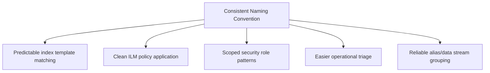
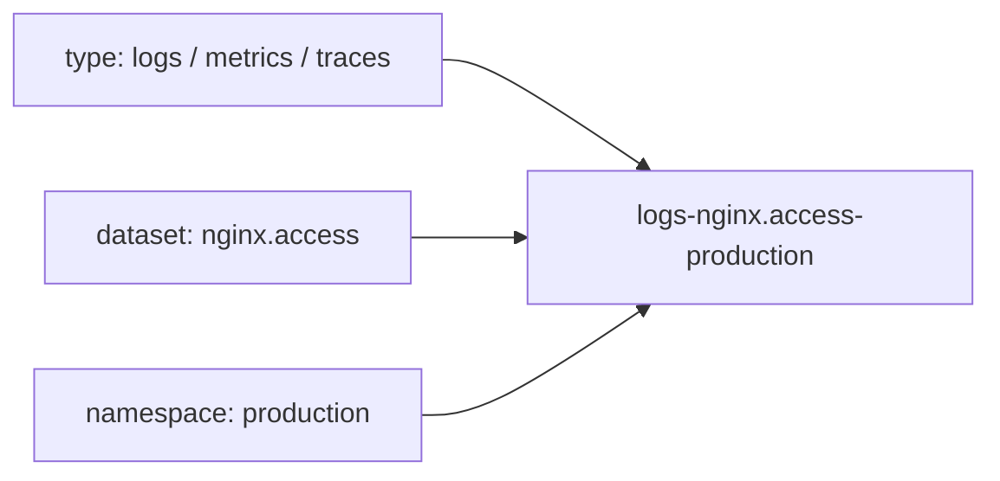
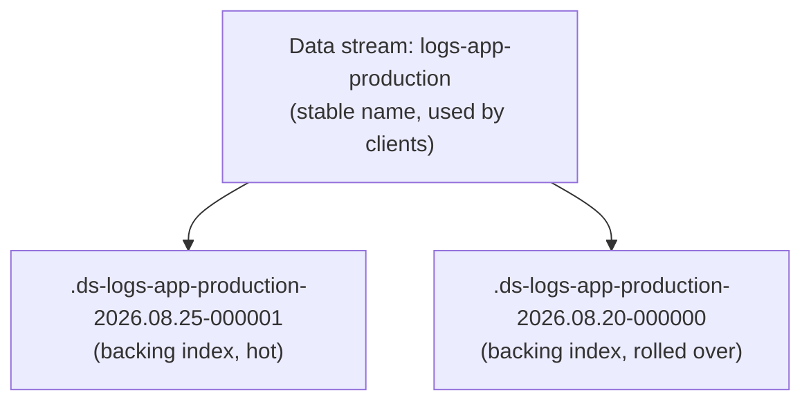

## Index Naming Conventions

### Overview

Index naming conventions establish consistent, predictable patterns for how indices are named across a cluster or organization. While Elasticsearch imposes only minimal technical constraints on index names, a disciplined naming convention has substantial practical impact on operational manageability — it affects how index templates and ILM policies are matched, how aliases and data streams are organized, how access control patterns can be scoped, and how easily an operator or new team member can understand cluster contents at a glance.

### Technical Naming Constraints

Elasticsearch enforces a small set of hard rules on index names:

- Must be **lowercase only**.
- Cannot include `\`, `/`, `*`, `?`, `"`, `<`, `>`, `|`,  (space), `,`, or `#`.
- Cannot start with `-`, `_`, or `+`.
- Cannot be `.` or `..`.
- Cannot exceed 255 bytes (note: bytes, not characters — multi-byte characters count toward this limit accordingly).
- Names starting with a period (`.`) are conventionally reserved for internal system indices (e.g., `.security`, `.kibana`) and should be avoided for user-created indices to prevent confusion or accidental collision with internal index patterns.

These constraints are floor-level requirements; a good naming convention adds structure on top of them rather than relying on the bare minimum.

### Why Naming Conventions Matter Operationally



A well-designed naming scheme allows a single index template or role definition using a wildcard pattern (e.g., `logs-app-*`) to correctly and exclusively match the intended set of indices, without accidentally matching unrelated indices or missing indices that should have been included.

### Common Naming Pattern Components

Most production naming conventions combine several structural elements into a consistent template:

```plaintext
{category}-{dataset}-{namespace}-{date/version}
```

**Category**

A high-level classification of the data type — common examples include `logs`, `metrics`, `traces`, or an application/domain-specific label.

**Dataset**

The specific source or type of data within the category — e.g., `nginx`, `application`, `firewall`.

**Namespace**

An environment, team, or tenant identifier — e.g., `prod`, `staging`, `team-billing` — useful for multi-tenant or multi-environment clusters where indices from different contexts coexist.

**Date or version suffix**

For time-series data, a date component (often at daily granularity, e.g., `2026.08.25`); for versioned reference data, a version number or reindex generation marker.

### The Elastic Common Schema (ECS) Data Stream Naming Convention

Elastic's own tooling (Beats, Elastic Agent, integrations) follows a standardized naming convention for data streams of the form:

```plaintext
{type}-{dataset}-{namespace}
```

For example: `logs-nginx.access-production` or `metrics-system.cpu-default`. Adopting this convention — or a close variant of it — for custom data even outside of Elastic's own integrations provides consistency with the broader Elastic ecosystem's tooling and documentation expectations, and makes it easier to reason about indices when Elastic Agent-managed and custom-managed data coexist in the same cluster.



### Date-Based Naming for Time-Series Indices

**Traditional pattern (pre-data-streams)**

Before data streams became the standard mechanism, time-series indices were commonly named with an explicit date suffix managed manually or via tools like Curator:

```plaintext
logs-app-2026.08.25
logs-app-2026.08.26
```

**Granularity choice**

Date granularity (daily, weekly, monthly) should be chosen based on data volume and retention needs — high-volume data typically uses daily indices to keep individual index/shard sizes manageable, while lower-volume data may use weekly or monthly indices to avoid oversharding from excessive small daily indices.

**Modern approach: data streams with automatic backing index naming**

Data streams abstract away manual date-suffix management entirely. The user-facing name is a single stable data stream name (e.g., `logs-app-production`), while Elasticsearch automatically manages internally named backing indices (following a pattern like `.ds-logs-app-production-2026.08.25-000001`) behind the scenes, with rollover triggered by ILM rather than a naming convention the operator must maintain manually.



This shifts the naming convention decision primarily to choosing the data stream name itself (following the type-dataset-namespace pattern), since backing index names are system-managed and not intended for direct human authorship.

### Alias Naming Conventions

**Write alias vs. read alias separation**

A common pattern for indices managed outside data streams uses separate aliases for writing versus reading, allowing a reindex-and-swap operation to redirect writes to a new underlying index without any application-visible downtime or index-name change:

```json
POST _aliases
{
  "actions": [
    { "add": { "index": "products_v2", "alias": "products_write" } },
    { "add": { "index": "products_v2", "alias": "products_read" } },
    { "remove": { "index": "products_v1", "alias": "products_write" } }
  ]
}
```

**Naming the alias vs. the underlying index**

A clean convention names the alias as the stable, application-facing name (`products`), while the underlying versioned index carries the version/generation suffix (`products_v1`, `products_v2`), so application code never needs to know or change the underlying index name across a reindex cycle.

### Multi-Tenant and Multi-Environment Naming

**Environment segregation**

Including an explicit environment identifier (`prod`, `staging`, `dev`) in the naming pattern — whether as the ECS-style namespace component or a custom prefix/suffix — prevents accidental cross-environment queries or index template mismatches, and enables environment-scoped security role patterns (e.g., a role granting access only to `*-prod-*` indices).

**Tenant segregation**

In multi-tenant deployments, embedding a tenant identifier in the index name enables both operational clarity and security role scoping via wildcard patterns matching only that tenant's indices, though for larger tenant counts or stronger isolation requirements, separate indices per tenant may be complemented or replaced by document-level security within shared indices — a distinct architectural decision from naming convention alone.

### Reserved and Discouraged Patterns

- **Leading dot (`.`) prefix** — reserved for system indices; user indices using this prefix risk confusion with, or accidental interaction with, internal cluster machinery.
- **Overly generic names** (`data`, `index1`, `test`) — provide no operational context and make template/ILM/security pattern matching error-prone since they don't participate meaningfully in any wildcard scheme.
- **Names encoding information that changes** (e.g., baking a specific shard count or a mutable environment detail directly into the name) — creates naming/reality drift if the underlying characteristic changes without a corresponding rename, which is often impractical for a live index.
- **Inconsistent date formats across indices of the same category** (e.g., mixing `2026-08-25` and `2026.08.25` across different pipelines feeding the same logical dataset) — breaks wildcard and date-math index pattern matching that assumes a single consistent format.

### Date Math in Index Names

Elasticsearch supports date math expressions directly in index names for certain API calls, allowing dynamic reference to date-suffixed indices without the client needing to compute the literal date string:

```plaintext
GET /<logs-app-{now/d}>/_search
```

This resolves to the current day's index at request time (e.g., `logs-app-2026.08.25`), which depends on the underlying index actually following a consistent, predictable date-suffix naming convention — reinforcing why consistency in the convention is a functional requirement, not merely a cosmetic preference, when date math or wildcard patterns are relied upon operationally.

### Naming Convention Design Checklist

- Does the pattern clearly identify category, dataset, and environment/namespace at a glance?
- Can existing or planned index templates, ILM policies, and security roles cleanly match the intended index set using wildcard patterns against this convention, without overlapping unintended indices?
- Is the date/version component's format consistent across every pipeline producing indices under this convention?
- Does the convention align with the Elastic Common Schema pattern where data streams and Elastic-native integrations are also in use, to avoid two incompatible naming philosophies coexisting in the same cluster?
- Is the convention documented somewhere durable (not just tribal knowledge), so new team members and new pipelines follow it consistently rather than each inventing a variant?

### Common Pitfalls

- **Designing a naming convention after indices already exist**, requiring a disruptive rename/reindex/alias migration to retrofit consistency onto an already-sprawling set of ad hoc index names.
- **Mixing manual date-suffix management with data streams** for the same logical dataset, creating two parallel and incompatible patterns for what should be a single continuous time series.
- **Choosing date granularity based on convenience rather than data volume**, resulting in either oversharded daily indices for low-volume data or undersized single monthly indices for high-volume data that should have been split more finely.
- **Embedding index names directly (hardcoded) in application code** rather than referencing a stable alias or data stream name, making any future naming convention migration require an application code change rather than an index-management-side operation.

### Related Topics

- Data streams architecture and backing index management
- Index templates and composable template design
- Elastic Common Schema (ECS) field and naming standards
- Shard count recommendations
- Index Lifecycle Management (ILM) rollover conditions
- Alias-based zero-downtime reindexing patterns