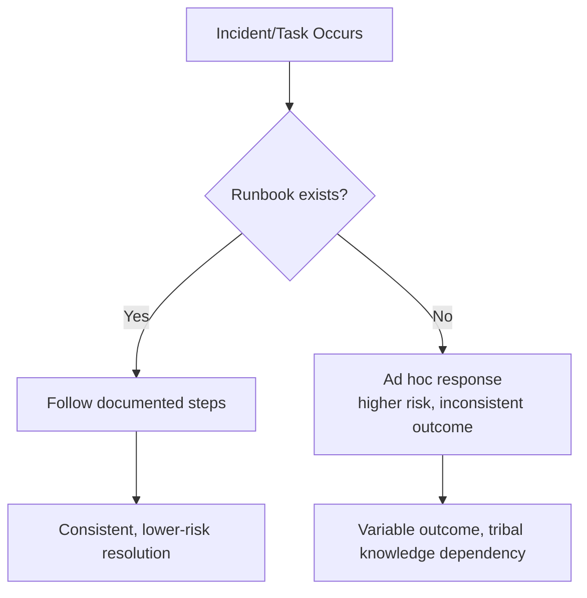
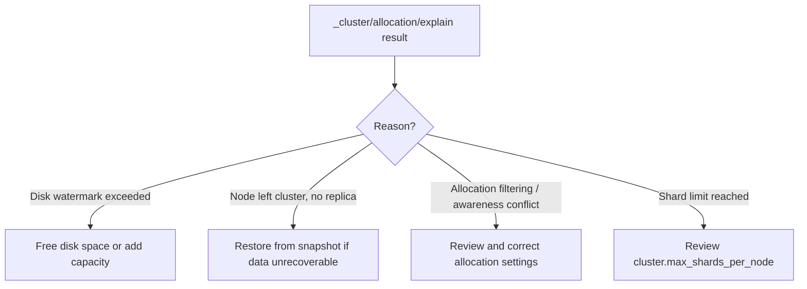
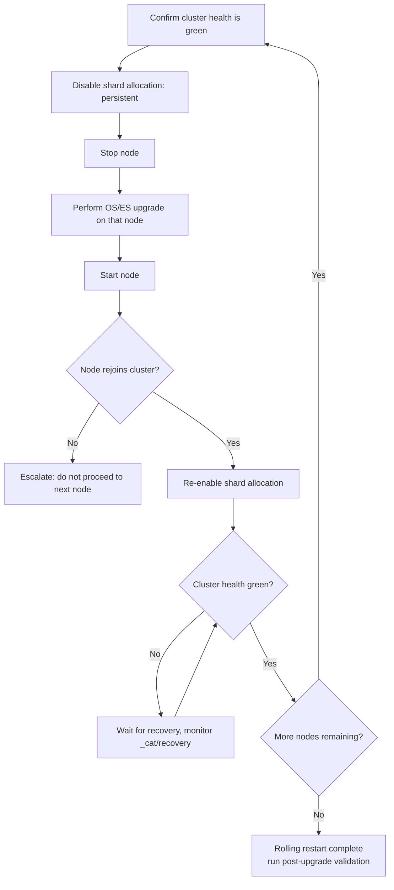

## Operational Runbooks

### Overview

An operational runbook is a documented, step-by-step procedure for handling a specific operational event — an incident, a routine maintenance task, or a recurring administrative action — written so that it can be executed correctly and consistently by any qualified operator, not just the person who originally wrote it. For Elasticsearch specifically, runbooks bridge the gap between deep platform knowledge (cluster internals, shard allocation, recovery mechanics) and reliable, repeatable execution under time pressure or by less specialized on-call staff.

### Why Runbooks Matter for Elasticsearch Specifically

Elasticsearch operational incidents often have multiple plausible response paths, some of which make the situation worse if applied incorrectly (e.g., manually forcing shard allocation, prematurely restarting nodes during a large-scale recovery, or disabling allocation at the wrong point in a rolling restart). A well-written runbook encodes the *correct* diagnostic and remediation sequence learned from platform expertise, reducing the risk of an under-informed but well-intentioned action turning a manageable incident into a severe one.



### Categories of Runbooks

**Incident response runbooks**

Triggered by an alert or observed problem — cluster status red/yellow, node unresponsive, disk watermark breach, unexpected query latency spike, indexing rejections.

**Routine maintenance runbooks**

Scheduled, planned operations — rolling restarts for upgrades, certificate rotation, snapshot repository verification, capacity review.

**Change management runbooks**

Procedures for making a deliberate configuration or topology change — adding nodes, changing shard/replica counts, migrating to a new index naming convention, enabling a new security feature.

**Disaster recovery runbooks**

Covered in depth separately, but structurally these are a specialized category of incident response runbook for the most severe failure class.

### Anatomy of a Good Runbook

A well-structured runbook consistently includes these components, regardless of the specific procedure it documents:


- **Trigger/symptom definition** — the specific alert, metric threshold, or observed behavior that indicates this runbook applies, avoiding ambiguity about when to reach for it.
- **Prerequisites and access requirements** — what credentials, tools, or access levels are needed before starting.
- **Diagnostic steps** — exact commands/API calls to confirm the actual condition, since symptoms can have multiple root causes and jumping straight to remediation risks addressing the wrong problem.
- **Decision points** — explicit branching logic ("if X, do A; if Y, do B") rather than a single linear path when the diagnostic step can reveal different underlying conditions.
- **Remediation steps** — exact commands, in order, with expected output at each step so deviation is immediately apparent.
- **Validation steps** — how to confirm the remediation actually resolved the issue, not just that the commands executed without error.
- **Rollback/escalation path** — what to do if the documented remediation doesn't resolve the issue, including when and how to escalate rather than continuing to attempt undocumented fixes.

### Example Runbook: Cluster Status Red

**Trigger**

Cluster health API reports `status: red`, indicating at least one primary shard is unassigned.

```json
GET _cluster/health
```

**Diagnostic steps**

```json
GET _cluster/allocation/explain
```

This returns the specific reason a shard is unassigned — common causes include insufficient disk space on eligible nodes, a node holding the only copy having failed, allocation filtering rules preventing placement, or a shard limit being reached.

```json
GET _cat/shards?v&h=index,shard,prirep,state,unassigned.reason
```

Provides a broader view of all unassigned shards across the cluster, useful when more than one index is affected.

**Decision point**



**Remediation (disk-related example)**

```json
PUT _cluster/settings
{
  "persistent": {
    "cluster.routing.allocation.disk.watermark.low": "85%"
  }
}
```

Followed by actual remediation of the underlying disk pressure (deleting old indices per retention policy, adding node capacity) rather than only adjusting the watermark threshold, since raising the watermark without addressing actual disk pressure defers rather than resolves the problem.

**Validation**

```json
GET _cluster/health
```

Confirm `status: green` (or `yellow` if replica-only unassignment remains expected during a scale event) and cross-check that shard count matches expectations via `_cat/shards`.

**Escalation**

If allocation remains blocked after addressing the diagnosed cause, escalate to platform engineering with the full `_cluster/allocation/explain` output and recent cluster change history rather than continuing ad hoc remediation attempts.

### Example Runbook: Rolling Restart for Version Upgrade



**Key runbook details this procedure must specify explicitly:**

- The exact `PUT _cluster/settings` payload to disable allocation before stopping a node, and the corresponding payload to re-enable it.
- The maximum acceptable wait time at each health-check gate before treating a stalled recovery as an escalation trigger rather than continuing to wait indefinitely.
- The explicit instruction not to proceed to the next node until the current node has fully rejoined and cluster health has returned to green, since restarting multiple nodes in parallel or in rapid succession risks losing quorum or causing unnecessary data unavailability.
- Post-upgrade validation steps (e.g., running the Upgrade Assistant or Deprecation Info API check, confirming plugin compatibility, spot-checking application query behavior) before considering the maintenance complete.

### Runbook Format and Storage Considerations

**Executable vs. narrative format**

Runbooks are most reliable when written as literal, copy-pasteable commands with placeholders clearly marked, rather than prose descriptions of what to do — prose is more prone to misinterpretation under time pressure than an exact command the operator can execute with minimal translation.

**Version control and change tracking**

Runbooks should live in version-controlled documentation (alongside infrastructure-as-code or in a dedicated runbook repository) so changes are tracked, reviewed, and the history of why a step was added or modified is preserved — particularly important since runbook steps are often added reactively after an incident revealed a gap.

**Accessibility during an actual incident**

A runbook that only exists inside a system that itself might be affected by the incident (e.g., stored only in a wiki hosted on infrastructure that depends on the cluster being debugged) creates a circular dependency risk; critical runbooks should be accessible independently of the systems they document procedures for.

**Linking runbooks to alerts**

Where feasible, alerting rules should directly reference or link to the corresponding runbook, reducing the time between alert firing and correct remediation action being taken, especially for less experienced on-call staff.

### Maintaining Runbook Accuracy Over Time

**Runbook drift**

As cluster topology, Elasticsearch version, or architecture evolves, previously accurate runbooks can silently become incorrect — a runbook written against an older version's API syntax, deprecated settings, or a topology that has since changed (e.g., a runbook assuming a topology without dedicated coordinating nodes, after coordinating nodes were later introduced) can actively mislead an operator if not kept current.

**Review triggers**

Runbooks should be explicitly reviewed after: any major version upgrade, any significant topology change (new node roles, new tiers, new regions), and any incident where the runbook was followed but did not produce the expected outcome, since that gap is direct evidence the documented procedure needs correction.

**Post-incident runbook updates**

Every incident retrospective should include an explicit check of whether an existing runbook needs updating, or whether a new runbook should be created for a scenario that didn't previously have one — treating the retrospective as an input to runbook maintenance, not a separate, disconnected activity.

### Runbook Testing

Similar to disaster recovery plans, runbooks that are never executed until a real incident carry hidden risk of containing outdated commands, missing steps, or incorrect assumptions about current cluster state. Where feasible, routine maintenance runbooks (rolling restarts, snapshot verification) are naturally exercised through normal scheduled use, while incident-response runbooks for rarer conditions benefit from periodic deliberate testing (e.g., a controlled game-day exercise simulating disk pressure or node failure) to confirm they remain accurate and executable.

### Common Pitfalls

- **Writing runbooks only after an incident, never proactively.** Reactive-only runbook creation means the first occurrence of any given failure mode is always handled without documented guidance, which is precisely the highest-risk scenario a runbook is meant to mitigate.
- **Vague diagnostic steps that don't distinguish between similar-looking symptoms.** A runbook that jumps straight to remediation without a clear diagnostic branch risks applying the wrong fix for a symptom that has multiple possible causes.
- **No explicit validation step**, leaving the operator to informally judge whether the issue is resolved rather than following a defined confirmation procedure.
- **Runbooks that assume access or tooling not actually available during an incident** (e.g., referencing a monitoring dashboard that itself may be down during a cluster-wide outage).
- **Allowing runbooks to go stale after topology or version changes**, without a defined review trigger to catch drift before it causes an operator to follow an outdated or incorrect procedure during a real incident.
- **Storing runbooks with a single point of failure for access** (e.g., only inside a tool that requires the very cluster being troubleshot to be healthy in order to log in).

### Related Topics

- Disaster recovery planning
- High availability configuration
- Elasticsearch upgrade assistant
- Cluster sizing and capacity planning
- Shard allocation explain API and diagnostic tooling
- Monitoring and alerting strategy for Elasticsearch clusters