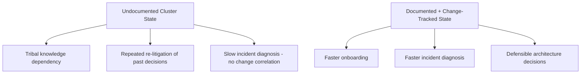
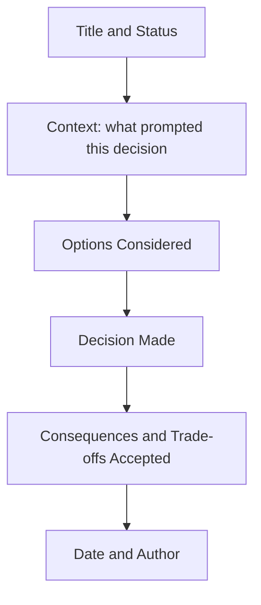
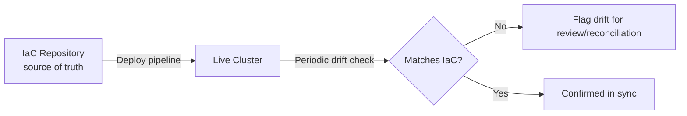
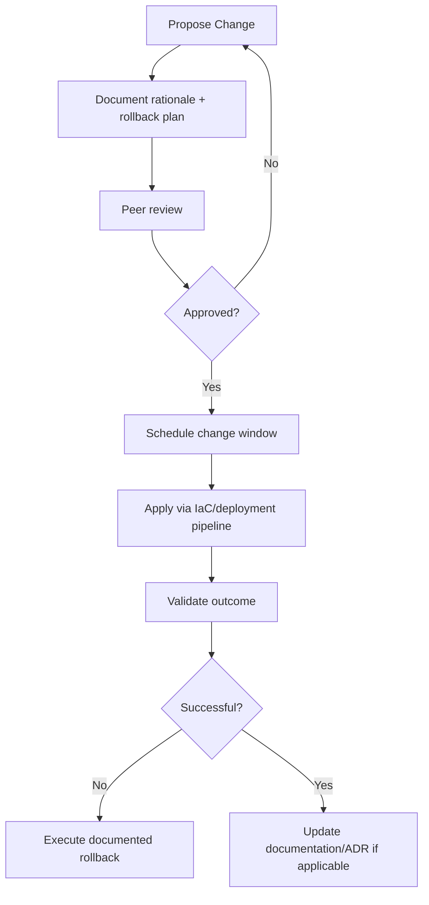

## Documentation and Change Management

### Overview

Documentation and change management covers how an Elasticsearch deployment's design decisions, configuration state, and modifications over time are recorded, reviewed, and tracked. Unlike runbooks (which document *how to respond* to specific events), this topic covers the broader discipline of knowing *what the cluster currently looks like*, *why it looks that way*, and *what changed, when, and by whom* — the foundation that makes runbooks, capacity planning, and incident response actually reliable rather than dependent on any single person's memory.

### Why This Discipline Matters Specifically for Elasticsearch

Elasticsearch clusters accumulate configuration complexity gradually — index templates, ILM policies, cluster settings, role definitions, and topology all evolve incrementally, often through a mix of Kibana UI actions, direct API calls, and infrastructure-as-code. Without deliberate documentation and change tracking, this accumulated state becomes opaque: new team members cannot safely reason about why a setting exists, incident responders cannot correlate a problem with a recent change, and capacity/architecture decisions get re-litigated repeatedly because the original reasoning was never captured.



### Categories of Documentation

**Architecture documentation**

Describes the overall topology — node roles, tiering strategy, cluster count and purpose, cross-cluster relationships (CCS/CCR), and the reasoning behind major structural decisions.

**Configuration reference**

The current state of cluster settings, index templates, ILM policies, security roles, and other persistent configuration — ideally generated or verified programmatically rather than maintained purely by hand, to avoid drift between documented and actual state.

**Decision records**

Point-in-time records of significant decisions and their rationale — why a particular shard count was chosen, why a specific node role separation was introduced, why a particular retention period was set — captured close to the time of the decision rather than reconstructed later from memory.

**Operational documentation**

Runbooks (covered separately), on-call procedures, escalation paths, and monitoring/alerting reference.

**Change history**

A record of what configuration or topology changes were made, when, by whom, and ideally why — whether through infrastructure-as-code commit history, a change management ticketing system, or a dedicated change log.

### Architecture Decision Records (ADRs)

**Purpose**

An Architecture Decision Record is a short, structured document capturing a single significant decision: the context that prompted it, the options considered, the decision made, and the consequences/trade-offs accepted. ADRs are particularly valuable for Elasticsearch deployments because many configuration choices (shard count, replica strategy, tiering boundaries, retention periods) involve genuine trade-offs rather than objectively correct answers, and the reasoning behind the chosen trade-off is easy to lose without deliberate capture.

**Typical ADR structure**



**Example ADR topics relevant to Elasticsearch deployments:**

- Choice of hot-warm-cold-frozen tiering boundaries and retention periods per tier
- Decision to adopt dedicated coordinating-only nodes at a specific cluster scale
- Choice of CCR-based warm standby versus snapshot-based backup-and-restore for DR strategy
- Shard count formula and target shard size adopted for a specific index pattern
- Decision to migrate from manually managed daily indices to data streams

**Why ADRs specifically outperform ad hoc notes**

A dedicated, consistently structured ADR is easier to search, reference, and trust than scattered notes in chat history, ticket comments, or a single engineer's memory, and the explicit "consequences accepted" section forces acknowledgment of trade-offs at decision time rather than only discovering them later when the trade-off becomes painful.

### Infrastructure as Code (IaC) for Configuration Management

**Why IaC matters for Elasticsearch configuration**

Managing index templates, ILM policies, cluster settings, and security roles through code (Terraform, Ansible, or Elasticsearch-specific tooling) rather than manual Kibana UI changes or ad hoc API calls provides an inherent audit trail via version control history, makes configuration reproducible across environments (dev/staging/prod), and prevents configuration drift where the "documented" state and actual cluster state silently diverge.

**Example: ILM policy managed as code**

```json
// ilm-policies/logs-retention.json — tracked in version control
{
  "policy": {
    "phases": {
      "hot": {
        "actions": {
          "rollover": { "max_primary_shard_size": "30gb", "max_age": "7d" }
        }
      },
      "delete": {
        "min_age": "90d",
        "actions": { "delete": {} }
      }
    }
  }
}
```

Applied via a deployment pipeline rather than manually pasted into Kibana Dev Tools, so the committed file is always the authoritative source of truth, and any manual out-of-band change becomes detectable as drift.

**Configuration drift detection**

Periodically comparing actual cluster configuration (via API) against the version-controlled source of truth surfaces any manual changes made outside the intended change process, which is important because manual "quick fixes" made directly against a live cluster are a common and easy-to-overlook source of undocumented state.



### Change Management Process

**Change request and review**

Significant changes — topology modifications, shard/replica count changes, ILM policy adjustments, security role changes — benefit from a lightweight review step before application, even in smaller teams, since a second reviewer often catches an overlooked interaction (e.g., a replica count change's storage impact, or a role change's unintended privilege scope) that the change author missed.

**Change windows and communication**

Changes with any risk of transient impact (rolling restarts, allocation setting changes, large reindex operations competing for cluster resources) should be scheduled within a known window and communicated to stakeholders in advance, rather than applied opportunistically without notice, so that any resulting behavior is correctly attributed rather than triggering an unrelated incident investigation.

**Rollback planning as part of the change itself**

Every non-trivial change should have an identified rollback path documented *before* the change is applied, not improvised after the change causes an unexpected problem — for configuration changes this is often as simple as recording the prior setting value; for structural changes (reindex, mapping change) it may require a more deliberate reversal plan.



### Change Correlation for Incident Diagnosis

**Why change history accelerates diagnosis**

A large proportion of operational incidents correlate with a recent change — a deployed mapping update, an ILM policy modification, a cluster setting adjustment, a node addition/removal. Having an easily queryable change history (via IaC commit log, ticketing system, or a dedicated change log) allows an incident responder to quickly check "what changed recently" as an early diagnostic step, rather than only reasoning from symptoms in isolation.

**Timestamped change logging**

At minimum, a lightweight, consistently maintained change log — even a simple structured log of change description, timestamp, and author — provides significant diagnostic value over having no change record at all, and is a far lower-effort starting point than a full IaC migration for teams not yet using infrastructure as code.

### Documenting Cluster Topology and Rationale

Beyond point-in-time decisions, an up-to-date architecture document should describe the *current* state holistically:

- Current node roles, counts, and hardware specification per tier
- Current shard/replica strategy per major index pattern, and the reasoning behind it
- Current ILM policies and the retention/tiering rationale
- Current security model — role structure, identity provider integration, key access patterns
- Current DR strategy and its RPO/RTO targets
- Known technical debt or deferred decisions, explicitly flagged rather than silently left undocumented

This document should be treated as a living artifact reviewed periodically (e.g., alongside major version upgrades or significant capacity reviews) rather than written once and left to become stale.

### Common Pitfalls

- **Documentation that describes an intended state that was never actually verified against the live cluster**, creating a false sense of understanding when actual configuration has drifted from what's documented.
- **Decisions made verbally or in ephemeral chat messages with no durable record**, so the reasoning is lost entirely once the conversation scrolls away or the people involved change roles.
- **Treating documentation as a one-time project rather than an ongoing discipline**, resulting in an initially thorough document that becomes progressively less trustworthy as the cluster evolves without corresponding updates.
- **No rollback plan defined before a change is applied**, leading to improvised, higher-risk reversal attempts if the change doesn't go as expected.
- **Manual out-of-band changes applied directly to a live cluster** outside the IaC/change-management process, creating silent configuration drift that undermines the reliability of the documented/versioned source of truth.
- **Change history that records *what* changed but not *why***, which limits its usefulness for future decision review even though it still helps with incident time-correlation.

### Related Topics

- Operational runbooks
- Disaster recovery planning
- High availability configuration
- Cluster sizing and capacity planning
- Elasticsearch upgrade assistant
- Index Lifecycle Management (ILM) policy design